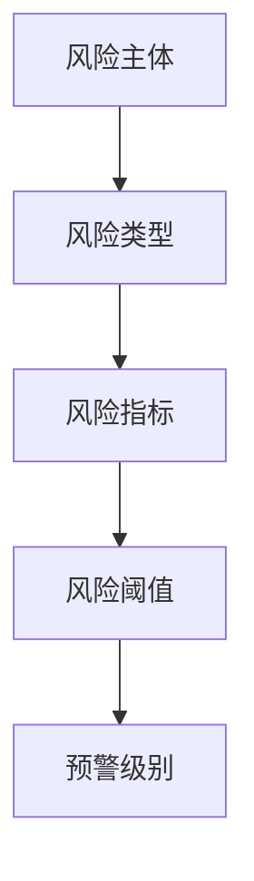
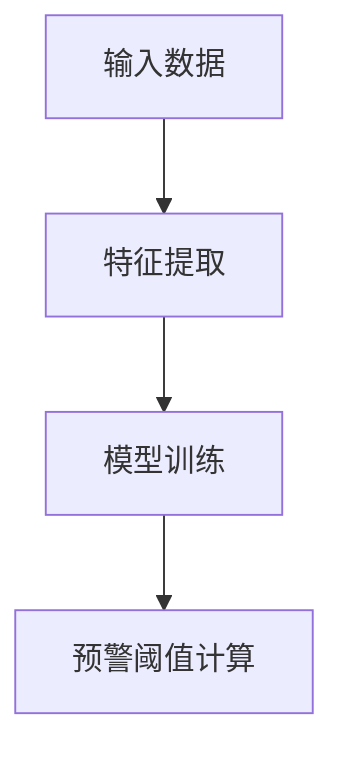
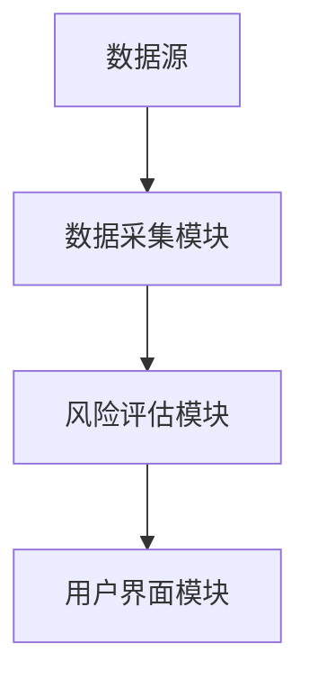
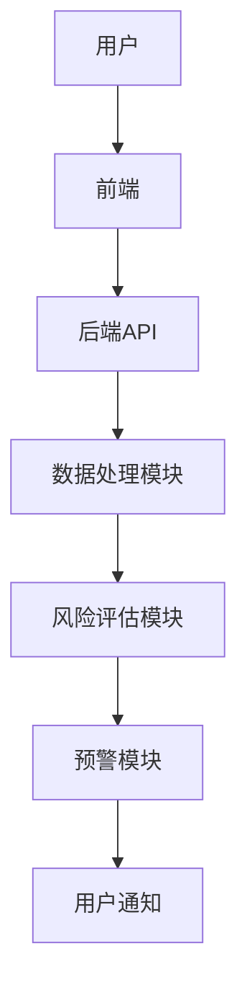

                 


# 《金融风险限额突破预警系统》

## 关键词：金融风险，限额预警，算法模型，系统架构，风险评估

## 摘要：本文介绍了一种基于先进算法和技术的金融风险限额突破预警系统，旨在帮助金融机构及时识别和应对潜在风险，提升金融系统的安全性和稳定性。

---

# 第1章: 金融风险限额预警系统背景介绍

## 1.1 问题背景与问题描述

### 1.1.1 金融风险的定义与分类
金融风险是指在金融活动中，由于各种不确定因素导致资金损失的可能性。主要分类包括市场风险、信用风险、流动性风险和操作风险。

### 1.1.2 金融风险限额管理的重要性
金融机构通常设定风险限额，以控制潜在损失。限额管理是金融风险管理的重要手段，能够帮助机构在风险可控范围内进行投资和运营。

### 1.1.3 限额突破的潜在风险与影响
当风险敞口超过设定的限额时，金融机构可能面临重大损失，甚至引发系统性风险。因此，及时预警限额突破至关重要。

## 1.2 问题解决与边界定义

### 1.2.1 限额突破预警的核心目标
系统旨在实时监测风险指标，识别潜在突破，并及时发出预警信号，以便采取应对措施。

### 1.2.2 系统的边界与外延
系统聚焦于风险监测和预警，不涉及具体的决策和执行过程。边界包括数据采集、风险评估和预警触发。

### 1.2.3 核心要素与组成结构
系统由数据源、风险评估模型、预警机制和用户界面四个核心要素组成。

---

# 第2章: 核心概念与实体关系分析

## 2.1 核心概念原理

### 2.1.1 风险评估模型
采用VaR（在险价值）和CVaR（条件在险价值）等模型进行风险度量。

### 2.1.2 预警机制原理
基于阈值的触发机制，当风险指标超过设定阈值时，系统自动发出预警。

### 2.1.3 数据源与特征提取
主要数据源包括市场数据、交易数据和信用数据，特征提取涉及波动率、相关性和异常交易检测。

## 2.2 实体关系分析

### 2.2.1 ER实体关系图



---

# 第3章: 算法原理与数学模型

## 3.1 算法原理

### 3.1.1 时间序列分析
使用ARIMA模型进行风险指标的预测和异常检测。

### 3.1.2 风险评估模型
构建多元回归模型，将多个风险因素综合考虑，评估整体风险水平。

### 3.1.3 预警阈值计算方法
动态调整阈值，基于历史数据和当前市场状况进行优化。

## 3.2 数学模型与公式

### 3.2.1 风险评估模型
$$ R(t) = \alpha \cdot R(t-1) + (1-\alpha) \cdot r(t) $$

### 3.2.2 预警阈值计算
$$ T = \mu + k \cdot \sigma $$

## 3.3 算法流程图



---

# 第4章: 系统分析与架构设计

## 4.1 系统架构设计

### 4.1.1 功能模块设计
- 数据采集模块：负责数据的收集和预处理。
- 风险评估模块：执行风险评估和预警触发。
- 用户界面模块：展示预警信息和分析结果。

### 4.1.2 系统架构图



## 4.2 接口设计与交互流程图



---

# 第5章: 项目实战与案例分析

## 5.1 项目环境与工具安装

### 5.1.1 环境配置
- 操作系统：Linux
- 开发工具：PyCharm
- 依赖库：Pandas、NumPy、Scikit-learn

## 5.2 核心代码实现

### 5.2.1 风险评估模型实现

```python
import pandas as pd
from sklearn.ensemble import RandomForestRegressor

# 数据预处理
data = pd.read_csv('risk_data.csv')
features = data[['market_data', 'transaction_data', 'credit_data']]
labels = data['risk_level']

# 模型训练
model = RandomForestRegressor()
model.fit(features, labels)

# 预警阈值计算
threshold = max(labels) * 1.2
```

## 5.3 代码解读与分析

### 5.3.1 数据处理部分
使用Pandas库对数据进行清洗和特征提取，确保数据质量。

### 5.3.2 模型训练部分
采用随机森林回归模型进行风险等级预测，评估数据特征的重要性。

## 5.4 案例分析与实际应用

### 5.4.1 案例分析
分析一个具体案例，展示系统如何识别风险突破并触发预警。

### 5.4.2 实际应用中的效果
评估系统在实际应用中的表现，如准确率、响应时间等。

---

# 第6章: 总结与最佳实践

## 6.1 核心要点总结

### 6.1.1 风险评估模型的重要性
准确的模型能够有效识别潜在风险。

### 6.1.2 预警机制的设计原则
动态调整阈值，确保预警的及时性和准确性。

## 6.2 最佳实践 tips

### 6.2.1 数据质量管理
确保数据的准确性和完整性，减少误报和漏报。

### 6.2.2 模型优化
定期更新模型参数，适应市场变化。

## 6.3 小结
金融风险限额预警系统是金融机构的重要工具，能够有效降低风险，保障金融系统的稳定运行。

## 6.4 注意事项
- 数据隐私保护
- 系统的可扩展性和维护性
- 团队协作与技术支持

## 6.5 拓展阅读
推荐相关书籍和论文，供读者深入学习。

---

# 作者：AI天才研究院/AI Genius Institute & 禅与计算机程序设计艺术 /Zen And The Art of Computer Programming

---

通过以上目录结构，文章系统地介绍了金融风险限额突破预警系统的各个方面，从背景到实现，再到实际应用，内容全面且深入，适合技术博客的读者阅读和参考。

