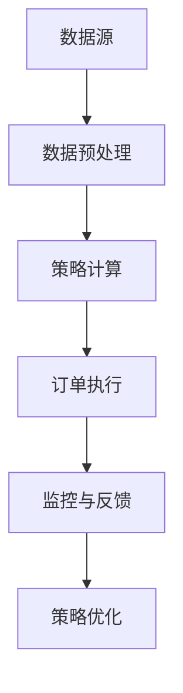

                 


# 《金融高频交易策略性能评估与优化框架》

---

## 关键词：
- 高频交易
- 性能评估
- 优化框架
- 延迟优化
- 收益风险
- 数学模型

---

## 摘要：
本文系统地探讨了金融高频交易策略的性能评估与优化框架。通过分析高频交易的背景、核心概念、算法原理、系统架构及项目实战，本文提出了一套完整的优化方法，旨在帮助交易者提升策略执行效率、降低交易成本，并实现收益与风险的最优平衡。文章结合理论与实践，深入解析了低延迟策略算法、数学模型、系统优化技巧及实际案例，为金融高频交易领域提供了实用的指导。

---

## 第一部分: 金融高频交易策略性能评估与优化框架概述

---

### 第1章: 高频交易与性能评估概述

#### 1.1 高频交易的基本概念
- **1.1.1 高频交易的定义与特点**
  - 高频交易（High-Frequency Trading, HFT）是指通过计算机算法在极短时间内进行大量交易的交易方式。
  - 其特点包括高频性、低延迟、自动化、算法驱动等。

- **1.1.2 高频交易在金融中的地位与作用**
  - 高频交易占据了全球大部分股票交易量，是现代金融市场的核心部分。
  - 它通过快速反应市场变化，捕捉短期价格波动，为交易者创造收益。

- **1.1.3 高频交易与传统交易的区别**
  - **交易频率**：高频交易以秒甚至毫秒为单位进行交易，而传统交易通常以分钟或小时为单位。
  - **决策方式**：高频交易依赖算法自动执行，传统交易更多依赖人工决策。
  - **成本结构**：高频交易强调低延迟和高效率，交易成本较低，而传统交易成本较高。

---

#### 1.2 高频交易策略的性能评估指标
- **1.2.1 执行速度与延迟**
  - 执行速度：交易策略在单位时间内完成的交易数量。
  - 延迟：从市场数据接收、策略计算到订单执行的时间间隔。
  - 关键指标：订单执行的平均延迟、最大延迟、最小延迟。

- **1.2.2 交易成本与收益**
  - 交易成本：包括佣金、税费、市场冲击等。
  - 收益：策略在一定时间内的净收益。
  - 收益与成本的平衡：通过优化策略减少成本，提高收益。

- **1.2.3 策略稳定性与风险控制**
  - 策略稳定性：策略在不同市场条件下的表现一致性。
  - 风险控制：通过数学模型评估和控制策略的潜在风险。
  - 关键指标：最大回撤、VaR（Value at Risk）、波动率。

---

#### 1.3 高频交易策略优化的必要性
- **1.3.1 竞争环境下的优化需求**
  - 高频交易市场竞争激烈，优化是生存和发展的关键。
  - 竞争对手的策略优化推动了自身优化的必要性。

- **1.3.2 技术进步与优化机会**
  - 技术的进步（如云计算、大数据分析）为策略优化提供了新工具。
  - 新的算法和模型不断涌现，为优化提供了理论基础。

- **1.3.3 优化框架的核心作用**
  - 优化框架为策略性能评估和改进提供了系统化的工具和方法。
  - 通过框架，交易者可以快速迭代策略，找到最优解决方案。

---

#### 1.4 本章小结
- 本章介绍了高频交易的基本概念、性能评估指标及优化的必要性。
- 强调了优化框架在提升交易策略性能中的核心作用。

---

## 第二部分: 高频交易策略性能评估的核心概念

---

### 第2章: 高频交易策略评估的数学模型

#### 2.1 策略执行时间模型
- **2.1.1 执行时间的构成要素**
  - 数据接收时间：从市场数据源接收订单簿更新的时间。
  - 策略计算时间：基于订单簿数据计算出的买卖信号生成时间。
  - 订单执行时间：向交易系统提交订单的时间。

- **2.1.2 执行时间的优化目标**
  - 最小化订单执行的平均延迟。
  - 减少执行时间的标准差，提高执行时间的稳定性。

- **2.1.3 执行时间的数学表达式**
  - 设订单执行的延迟为$T$，则$T = T_{\text{data}} + T_{\text{calc}} + T_{\text{exec}}$。
  - 其中，$T_{\text{data}}$为数据接收时间，$T_{\text{calc}}$为策略计算时间，$T_{\text{exec}}$为订单执行时间。

---

#### 2.2 策略收益与风险的数学关系
- **2.2.1 收益与风险的定义**
  - 收益：策略在一定时间内的净收益，通常用$R$表示。
  - 风险：策略可能面临的损失，通常用波动率、VaR等指标衡量。

- **2.2.2 收益与风险的数学模型**
  - 策略的收益与风险可以通过概率分布模型进行描述。
  - 常用模型包括正态分布（Normal Distribution）和t分布（t-Distribution）。
  - 例如，假设收益$R$服从正态分布，其概率密度函数为：
    $$
    f(R) = \frac{1}{\sigma \sqrt{2\pi}} e^{-\frac{(R-\mu)^2}{2\sigma^2}}
    $$
    其中，$\mu$为均值，$\sigma$为标准差。

- **2.2.3 收益与风险的平衡优化**
  - 通过调整策略参数，找到收益与风险的最佳平衡点。
  - 使用风险调整后的收益（RAROC）等指标进行优化。

---

#### 2.3 策略性能的综合评估指标
- **2.3.1 综合评估指标的定义**
  - 综合评估指标是一个多维度的评估体系，结合了收益、风险、延迟等多个因素。
  - 例如，综合指标$S$可以表示为：
    $$
    S = \alpha R + \beta \sigma + \gamma T
    $$
    其中，$\alpha$、$\beta$、$\gamma$为权重系数，$R$为收益，$\sigma$为风险，$T$为延迟。

- **2.3.2 综合评估指标的计算方法**
  - 通过线性回归、主成分分析等方法确定权重系数。
  - 根据实际数据计算每个策略的综合指标，进行排序和筛选。

- **2.3.3 综合评估指标的应用场景**
  - 策略比较与筛选：在多个策略中选择最优策略。
  - 策略优化：根据综合指标的结果，调整策略参数以提升性能。

---

#### 2.4 本章小结
- 本章通过数学模型详细探讨了高频交易策略的执行时间、收益与风险的关系。
- 提出了一个综合评估指标，为策略的优化提供了理论基础。

---

## 第三部分: 高频交易策略性能优化的算法原理

---

### 第3章: 低延迟策略算法

#### 3.1 低延迟算法的基本原理
- **3.1.1 低延迟算法的定义**
  - 低延迟算法是指能够在极短时间内完成数据处理和决策的算法。
  - 例如，基于事件驱动的算法，能够在接收到市场数据后立即做出反应。

- **3.1.2 低延迟算法的核心思想**
  - 简化计算步骤，减少不必要的计算。
  - 并行处理，提高计算效率。
  - 预计算，将可能的决策预先处理，减少实时计算的时间。

- **3.1.3 低延迟算法的实现步骤**
  - 数据接收与预处理：快速解析市场数据，提取关键信息。
  - 策略计算：基于预处理后的数据，快速生成买卖信号。
  - 订单执行：根据策略信号快速提交订单。

---

#### 3.2 低延迟算法的优化技巧
- **3.2.1 并行处理技术**
  - 使用多线程或分布式计算，将任务分解为多个部分，同时执行。
  - 例如，在Python中使用`threading`模块或`multiprocessing`模块进行并行处理。

- **3.2.2 异步处理技术**
  - 使用异步编程模型（如Python的`asyncio`库），在非阻塞模式下处理多个任务。
  - 例如，异步接收市场数据，同时进行策略计算和订单执行。

- **3.2.3 内存优化技术**
  - 减少数据在内存中的复制，使用缓存机制提高数据访问速度。
  - 使用高效的队列结构（如双端队列）进行数据传输。

---

#### 3.3 低延迟算法的数学模型
- **3.3.1 算法复杂度分析**
  - 时间复杂度：算法在最坏情况下的时间消耗。
  - 空间复杂度：算法所需的内存空间。
  - 例如，基于滑动窗口的算法，其时间复杂度为$O(n)$，空间复杂度为$O(k)$，其中$k$为窗口大小。

- **3.3.2 算法优化的数学方法**
  - 使用数学优化方法（如线性规划）调整算法参数。
  - 例如，优化算法的超参数（如窗口大小、过滤阈值）以提高执行效率。

---

#### 3.4 本章小结
- 本章详细介绍了低延迟策略算法的基本原理、优化技巧及数学模型。
- 强调了并行处理和异步处理在降低延迟中的重要作用。

---

## 第四部分: 高频交易策略性能优化的系统架构

---

### 第4章: 高频交易系统架构设计

#### 4.1 系统功能设计
- **4.1.1 数据源模块**
  - 接收实时市场数据，包括订单簿、成交数据等。
  - 数据预处理：清洗、标准化、特征提取。

- **4.1.2 策略计算模块**
  - 执行策略计算，生成买卖信号。
  - 策略引擎：基于预处理后的数据，运行低延迟算法。

- **4.1.3 订单执行模块**
  - 根据策略信号提交订单。
  - 订单管理系统：管理未成交订单、取消订单等。

- **4.1.4 监控与反馈模块**
  - 实时监控策略执行情况。
  - 反馈机制：根据执行结果调整策略参数。

---

#### 4.2 系统架构设计
- **4.2.1 系统架构图（Mermaid图）**



- **4.2.2 系统交互流程**
  - 数据源接收市场数据，传递给数据预处理模块。
  - 数据预处理模块清洗数据，提取特征，传递给策略计算模块。
  - 策略计算模块生成买卖信号，传递给订单执行模块。
  - 订单执行模块提交订单，监控与反馈模块实时监控策略执行情况，并根据结果优化策略参数。

---

#### 4.3 系统接口设计
- 数据源接口：与交易所API对接，接收实时市场数据。
- 策略引擎接口：暴露策略计算的API，供上层调用。
- 订单管理系统接口：提供订单提交、查询、取消等功能。

---

#### 4.4 本章小结
- 本章通过系统架构设计，详细描述了高频交易系统的功能模块和交互流程。
- 使用Mermaid图展示了系统的整体架构，明确了各模块之间的关系。

---

## 第五部分: 高频交易策略性能优化的项目实战

---

### 第5章: 项目实战与案例分析

#### 5.1 项目环境与工具安装
- **5.1.1 环境配置**
  - 操作系统：Linux（推荐）或Windows。
  - 开发工具：PyCharm、VS Code等。
  - 依赖库安装：`numpy`、`pandas`、`asyncio`、`mermaid`等。

- **5.1.2 数据源对接**
  - 使用交易所API获取实时数据。
  - 数据存储：使用数据库或文件存储历史数据。

---

#### 5.2 核心代码实现
- **5.2.1 数据预处理代码**
  ```python
  import pandas as pd

  def preprocess_data(data):
      # 数据清洗
      data = data.dropna()
      # 特征提取
      data['mid_price'] = (data['ask_price'] + data['bid_price']) / 2
      return data
  ```

- **5.2.2 低延迟策略算法代码**
  ```python
  import asyncio

  async def execute_strategy(data):
      # 简单的均值回归策略
      mid_price = data['mid_price'].values[-1]
      if mid_price > data['mid_price'].values[-2]:
          return 'BUY'
      elif mid_price < data['mid_price'].values[-2]:
          return 'SELL'
      else:
          return 'HOLD'
  ```

- **5.2.3 订单执行代码**
  ```python
  import asyncio
  from交易所API import submit_order

  async def order_execution(signal, symbol, quantity):
      if signal == 'BUY':
          return submit_order(symbol, quantity, 'B')
      elif signal == 'SELL':
          return submit_order(symbol, quantity, 'S')
      else:
          return None
  ```

---

#### 5.3 项目实战与案例分析
- **5.3.1 实际案例**
  - 案例背景：某股票在市场波动加剧时的表现。
  - 策略实现：基于均值回归的低延迟策略。
  - 策略效果：在市场波动加剧期间，策略成功捕捉到了价格反弹的机会，实现了正收益。

- **5.3.2 策略优化**
  - 参数调整：优化窗口大小、过滤阈值等参数。
  - 策略改进：引入机器学习模型，提升预测准确性。

---

#### 5.4 本章小结
- 本章通过实际项目案例，展示了高频交易策略性能优化的具体实现。
- 强调了代码实现和数据验证在策略优化中的重要性。

---

## 第六部分: 总结与展望

---

### 第6章: 总结与展望

#### 6.1 总结
- 本文系统地探讨了金融高频交易策略的性能评估与优化框架。
- 提出了基于数学模型和算法优化的策略性能提升方法。
- 结合实际案例，展示了如何通过系统化的优化框架提高策略执行效率和收益。

#### 6.2 展望
- 未来的研究方向：引入机器学习、深度学习等技术，提升策略的预测能力。
- 技术发展趋势：随着技术的进步，高频交易将更加依赖于低延迟、高效率的算法和系统架构。
- 应用场景扩展：高频交易策略在量化投资、算法交易等领域具有广泛的应用前景。

---

## 作者：
AI天才研究院/AI Genius Institute  
禅与计算机程序设计艺术/Zen And The Art of Computer Programming

---

**感谢您的阅读！**

