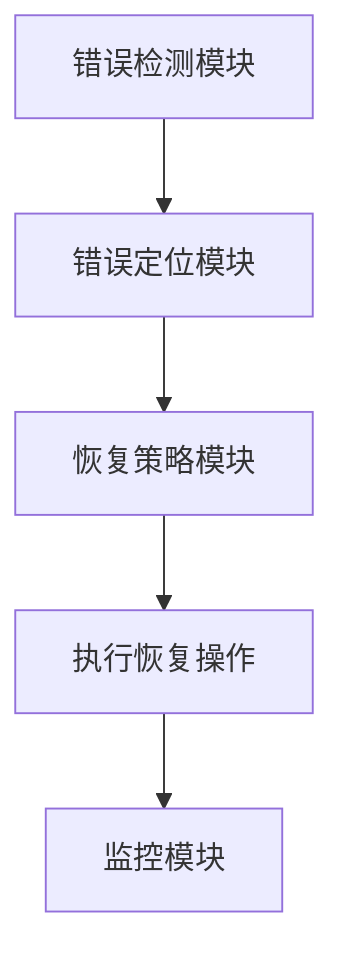
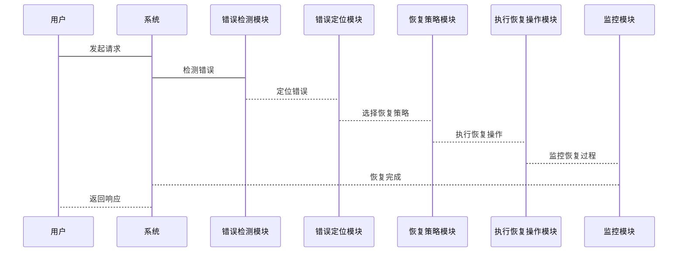

                 


# 错误处理与恢复：提高AI Agent的鲁棒性

## 关键词：错误处理、AI Agent、鲁棒性、恢复机制、异常检测

## 摘要：  
在人工智能（AI）系统中，错误处理与恢复是确保AI Agent稳定运行和高效性能的关键。本文详细探讨了错误处理的核心概念、AI Agent的错误处理机制、恢复算法的原理及其系统架构设计。通过实际案例分析，本文展示了如何通过有效的错误检测和恢复策略来提高AI Agent的鲁棒性，帮助读者在复杂的现实场景中更好地设计和实现AI系统。

---

# 第1章: 错误处理与恢复的背景介绍

## 1.1 错误处理的核心概念

### 1.1.1 问题背景与定义  
错误处理是软件开发中的基础任务，旨在检测和修复程序运行中的异常情况。在AI Agent中，错误处理尤为重要，因为AI Agent需要在动态且不确定的环境中自主运行，面对复杂的输入和外部干扰。

错误可以分为以下几类：  
1. **语法错误**：代码编写错误，如拼写错误或语法不符合编程语言规范。  
2. **逻辑错误**：代码逻辑不符合预期，导致错误结果。  
3. **输入错误**：输入数据不符合预期格式或范围。  
4. **网络错误**：网络连接中断或数据传输失败。  
5. **资源分配错误**：无法获取必要的资源（如文件、数据库连接等）。  

### 1.1.2 错误处理的重要性  
错误处理直接关系到AI Agent的稳定性和可靠性。在AI系统中，错误可能导致严重的后果，例如自动驾驶汽车因传感器故障未能正确识别障碍物，或者医疗AI系统给出错误的诊断建议。因此，设计有效的错误处理机制是确保AI Agent安全运行的关键。

### 1.1.3 错误处理的边界与外延  
错误处理的边界包括从检测错误到修复错误的整个过程，而外延则涉及错误预防、错误日志记录和错误分析。错误预防通过代码审查和测试来减少错误的发生，而错误分析则通过日志和监控工具来识别错误的根本原因。

### 1.1.4 AI Agent的核心特点  
AI Agent是一种能够感知环境、自主决策并执行任务的智能体。与传统程序相比，AI Agent具有以下特点：  
1. **自主性**：能够在没有外部干预的情况下独立运行。  
2. **反应性**：能够实时感知环境变化并做出响应。  
3. **目标导向**：具有明确的目标，并能够采取行动以实现目标。  
4. **学习能力**：能够通过经验或数据优化自身的决策过程。  

### 1.1.5 错误处理在AI Agent中的作用  
错误处理在AI Agent中扮演着关键角色，主要体现在以下几个方面：  
1. **确保任务完成**：通过错误恢复机制，确保AI Agent能够在面对错误时继续执行任务。  
2. **提高系统可靠性**：通过有效的错误处理，减少系统崩溃的可能性，提高系统的整体可靠性。  
3. **优化用户体验**：通过快速检测和修复错误，提升用户体验，避免因错误导致的任务中断。  

### 1.1.6 鲁棒性在AI Agent中的体现  
鲁棒性是指系统在面对异常输入、错误或故障时仍能保持正常运行的能力。在AI Agent中，鲁棒性主要体现在以下几个方面：  
1. **容错能力**：能够在检测到错误时，采取适当的措施（如重试或回滚）以恢复系统正常运行。  
2. **适应性**：能够根据环境变化调整自身的行为，以应对各种可能的错误情况。  
3. **自我修复能力**：能够通过自我监控和自我修复机制，自动检测和修复错误。  

## 1.2 AI Agent的定义与特点

### 1.2.1 AI Agent的基本定义  
AI Agent（智能体）是一种能够感知环境、自主决策并执行任务的智能系统。AI Agent可以是软件程序，也可以是硬件设备，其核心目标是通过感知和行动来实现特定任务。

### 1.2.2 AI Agent的核心特点  
AI Agent具有以下几个核心特点：  
1. **自主性**：AI Agent能够在没有外部干预的情况下独立运行。  
2. **反应性**：AI Agent能够实时感知环境变化并做出响应。  
3. **目标导向**：AI Agent具有明确的目标，并能够采取行动以实现目标。  
4. **学习能力**：AI Agent能够通过经验或数据优化自身的决策过程。  

### 1.2.3 AI Agent与传统程序的区别  
AI Agent与传统程序的主要区别在于其智能性和自主性。传统程序通常是基于固定的逻辑和规则执行任务，而AI Agent则能够通过学习和适应，动态调整自身的行为以应对复杂多变的环境。

## 1.3 错误处理与恢复在AI Agent中的必要性

### 1.3.1 错误处理在AI Agent中的作用  
错误处理在AI Agent中具有以下几个重要作用：  
1. **确保任务完成**：通过错误恢复机制，确保AI Agent能够在面对错误时继续执行任务。  
2. **提高系统可靠性**：通过有效的错误处理，减少系统崩溃的可能性，提高系统的整体可靠性。  
3. **优化用户体验**：通过快速检测和修复错误，提升用户体验，避免因错误导致的任务中断。  

### 1.3.2 恢复机制的重要性  
恢复机制是错误处理的核心组成部分，其目的是在检测到错误后，采取适当的措施以恢复系统的正常运行。恢复机制可以分为以下几种：  
1. **重试机制**：在检测到错误后，尝试重新执行失败的操作。  
2. **回滚机制**：在检测到错误后，撤销之前的操作，恢复到错误发生前的状态。  
3. **冗余机制**：通过冗余设计，确保在主系统发生错误时，备用系统能够接管任务。  

### 1.3.3 鲁棒性在AI Agent中的体现  
鲁棒性是指系统在面对异常输入、错误或故障时仍能保持正常运行的能力。在AI Agent中，鲁棒性主要体现在以下几个方面：  
1. **容错能力**：能够在检测到错误时，采取适当的措施（如重试或回滚）以恢复系统正常运行。  
2. **适应性**：能够根据环境变化调整自身的行为，以应对各种可能的错误情况。  
3. **自我修复能力**：能够通过自我监控和自我修复机制，自动检测和修复错误。  

## 1.4 本章小结  
本章主要介绍了错误处理与恢复的背景、AI Agent的定义及其核心特点，以及错误处理在AI Agent中的重要性。通过本章的介绍，读者可以理解为什么错误处理与恢复是提高AI Agent鲁棒性的关键。

---

# 第2章: 错误处理与恢复的核心概念

## 2.1 错误类型与分类

### 2.1.1 语法错误  
语法错误是指代码编写不符合编程语言的语法规则。例如，在Python中，忘记加冒号或括号不匹配都属于语法错误。语法错误通常在代码编译或解释时被检测出来。

### 2.1.2 逻辑错误  
逻辑错误是指代码逻辑不符合预期，导致程序无法正确执行任务。例如，在计算总和时，错误地将乘法运算写成加法运算，就会导致逻辑错误。

### 2.1.3 输入/输出错误  
输入/输出错误是指在数据输入或输出过程中发生的错误。例如，读取文件时文件不存在，或者写入文件时权限不足。

### 2.1.4 网络错误  
网络错误是指在通过网络进行数据传输时发生的错误。例如，网络连接中断或服务器响应超时。

### 2.1.5 资源分配错误  
资源分配错误是指无法获取必要的资源（如文件、数据库连接等）。例如，在尝试打开文件时，文件被其他程序占用，导致无法打开。

### 2.1.6 其他错误  
除了上述错误类型外，还有其他一些错误类型，例如内存错误、线程同步错误等。

## 2.2 错误检测方法

### 2.2.1 基于日志的错误检测  
通过分析程序的日志，可以发现潜在的错误。例如，程序在运行过程中记录了详细的日志信息，当检测到错误时，日志中会记录错误类型和错误发生的时间。

### 2.2.2 基于异常检测的错误识别  
异常检测是一种通过分析数据分布来发现异常值的方法。在程序运行过程中，如果某些指标（如响应时间、错误率等）偏离正常范围，就可以认为系统中存在错误。

### 2.2.3 基于上下文的错误分析  
基于上下文的错误分析是通过分析错误发生时的上下文信息，例如错误发生时的输入数据、系统状态等，来确定错误的根本原因。

## 2.3 错误恢复策略

### 2.3.1 重试机制  
重试机制是指在检测到错误后，尝试重新执行失败的操作。例如，在网络连接中断时，程序可以尝试重新连接并重新发送请求。

### 2.3.2 回滚机制  
回滚机制是指在检测到错误后，撤销之前的操作，恢复到错误发生前的状态。例如，在事务处理中，如果发生错误，可以通过回滚事务来恢复数据库到之前的状态。

### 2.3.3 冗余机制  
冗余机制是指通过冗余设计，确保在主系统发生错误时，备用系统能够接管任务。例如，在分布式系统中，可以通过冗余节点来确保系统在部分节点故障时仍然能够正常运行。

### 2.3.4 其他恢复策略  
除了上述恢复策略外，还有其他一些恢复策略，例如动态调整配置、重新初始化系统等。

## 2.4 错误处理的数学模型

### 2.4.1 错误检测的概率模型  
错误检测的概率模型是一种通过概率统计方法来预测错误发生的可能性。例如，可以通过分析历史错误数据，计算某种错误类型的发生概率。

### 2.4.2 错误恢复的决策模型  
错误恢复的决策模型是一种通过决策树或规则引擎来选择最佳恢复策略的模型。例如，当检测到网络错误时，决策模型可以根据错误类型和当前系统状态，选择重试或回滚作为恢复策略。

### 2.4.3 错误处理的优化模型  
错误处理的优化模型是一种通过优化算法来提高错误处理效率的模型。例如，可以通过遗传算法或模拟退火算法来优化错误处理流程，以减少恢复时间。

---

# 第3章: AI Agent的错误处理机制

## 3.1 错误检测机制

### 3.1.1 错误检测方法  
AI Agent可以通过以下方法来检测错误：  
1. **实时监控**：通过实时监控系统状态，检测错误发生。  
2. **异常检测**：通过分析系统行为，检测异常情况。  
3. **日志分析**：通过分析日志，发现潜在错误。  

### 3.1.2 错误检测流程  
错误检测流程包括以下几个步骤：  
1. **收集信息**：收集系统运行时的各种信息，包括系统状态、输入数据、输出结果等。  
2. **分析信息**：通过分析收集到的信息，识别潜在的错误。  
3. **确认错误**：确认是否存在错误，并确定错误类型。  

### 3.1.3 错误检测的实现  
错误检测的实现可以通过以下方式：  
1. **日志监控**：通过日志监控工具，实时检测错误。  
2. **异常检测算法**：使用异常检测算法，分析系统行为，发现异常。  
3. **断点调试**：在程序中设置断点，调试程序，发现错误。  

## 3.2 上下文分析与错误定位

### 3.2.1 上下文分析  
上下文分析是指通过分析错误发生时的上下文信息，确定错误的根本原因。例如，在网络错误中，通过分析网络状态、错误代码等信息，确定错误的根本原因。

### 3.2.2 错误定位  
错误定位是指确定错误发生的位置和原因。例如，在程序中，通过调试信息确定错误发生的位置和原因。

## 3.3 恢复策略与容错设计

### 3.3.1 恢复策略的选择  
恢复策略的选择需要考虑以下因素：  
1. **错误类型**：不同的错误类型可能需要不同的恢复策略。  
2. **系统状态**：系统的当前状态可能影响恢复策略的选择。  
3. **恢复时间**：恢复时间可能影响恢复策略的选择。  

### 3.3.2 容错设计  
容错设计是指通过冗余设计或其他技术手段，提高系统的容错能力。例如，在分布式系统中，通过冗余节点来提高系统的容错能力。

## 3.4 错误处理机制的实现

### 3.4.1 错误处理流程  
错误处理流程包括以下几个步骤：  
1. **检测错误**：通过错误检测机制，检测到错误。  
2. **确认错误**：确认错误的存在，并确定错误类型。  
3. **选择恢复策略**：根据错误类型和系统状态，选择合适的恢复策略。  
4. **执行恢复操作**：根据选择的恢复策略，执行恢复操作。  
5. **监控恢复过程**：监控恢复过程，确保恢复操作成功。  

### 3.4.2 错误处理的代码实现  
以下是一个简单的错误处理代码实现示例：

```python
def handle_error(error_type):
    if error_type == 'network_error':
        # 重试机制
        for _ in range(3):
            if retry_operation():
                return True
        return False
    elif error_type == 'file_error':
        # 回滚机制
        rollback_operation()
        return True
    else:
        # 其他错误处理
        return False

def main():
    try:
        execute_operation()
    except Exception as e:
        error_type = determine_error_type(e)
        handle_error(error_type)
    finally:
        log_error_info(e)

if __name__ == '__main__':
    main()
```

---

# 第4章: 错误恢复的算法原理

## 4.1 错误恢复算法的核心原理

### 4.1.1 基于分类的恢复算法  
基于分类的恢复算法是一种通过分类模型来选择恢复策略的算法。例如，可以通过训练分类模型，根据错误类型和系统状态，选择最佳的恢复策略。

### 4.1.2 基于回归的恢复算法  
基于回归的恢复算法是一种通过回归模型来预测恢复时间或恢复概率的算法。例如，可以通过回归模型预测网络错误的恢复时间。

### 4.1.3 基于生成的恢复算法  
基于生成的恢复算法是一种通过生成模型来生成恢复策略的算法。例如，可以通过生成模型生成新的恢复策略，以应对复杂的错误情况。

## 4.2 错误恢复算法的实现

### 4.2.1 分类算法的实现  
以下是一个简单的分类算法实现示例：

```python
from sklearn.tree import DecisionTreeClassifier
from sklearn.model_selection import train_test_split
import numpy as np

# 数据准备
X = np.array([[1, 2], [3, 4], [5, 6], [7, 8]])
y = np.array([0, 1, 0, 1])

# 数据分割
X_train, X_test, y_train, y_test = train_test_split(X, y, test_size=0.25)

# 模型训练
clf = DecisionTreeClassifier()
clf.fit(X_train, y_train)

# 模型预测
predicted = clf.predict(X_test)
print(predicted)
```

### 4.2.2 回归算法的实现  
以下是一个简单的回归算法实现示例：

```python
from sklearn.linear_model import LinearRegression
from sklearn.model_selection import train_test_split
import numpy as np

# 数据准备
X = np.array([[1], [2], [3], [4]])
y = np.array([1, 2, 3, 4])

# 数据分割
X_train, X_test, y_train, y_test = train_test_split(X, y, test_size=0.25)

# 模型训练
reg = LinearRegression()
reg.fit(X_train, y_train)

# 模型预测
predicted = reg.predict(X_test)
print(predicted)
```

### 4.2.3 生成算法的实现  
以下是一个简单的生成算法实现示例：

```python
import tensorflow as tf
from tensorflow.keras import layers

# 模型定义
model = tf.keras.Sequential([
    layers.Dense(64, activation='relu', input_shape=(input_dim,)),
    layers.Dense(1, activation='sigmoid')
])

# 模型编译
model.compile(optimizer='adam', loss='binary_crossentropy', metrics=['accuracy'])

# 模型训练
model.fit(x_train, y_train, epochs=10, batch_size=32)
```

## 4.3 错误恢复算法的优化

### 4.3.1 算法优化策略  
算法优化策略包括：  
1. **参数调整**：通过调整算法参数，提高算法性能。  
2. **模型优化**：通过优化模型结构，提高算法性能。  
3. **数据增强**：通过增加数据多样性，提高算法性能。  

### 4.3.2 优化算法的实现  
以下是一个简单的算法优化实现示例：

```python
from sklearn.model_selection import GridSearchCV
from sklearn.tree import DecisionTreeClassifier

# 参数网格
param_grid = {'max_depth': [2, 3, 4], 'min_samples_split': [2, 3, 4]}

# 网格搜索
grid_search = GridSearchCV(estimator=DecisionTreeClassifier(), param_grid=param_grid, cv=5)
grid_search.fit(X_train, y_train)

# 最优参数
best_params = grid_search.best_params_
print(best_params)
```

---

# 第5章: 系统架构设计

## 5.1 系统功能设计

### 5.1.1 功能模块划分  
系统功能设计包括以下几个功能模块：  
1. **错误检测模块**：负责检测系统中的错误。  
2. **错误定位模块**：负责定位错误的根本原因。  
3. **恢复策略模块**：负责选择和执行恢复策略。  
4. **日志记录模块**：负责记录系统运行日志。  
5. **监控模块**：负责实时监控系统运行状态。  

### 5.1.2 功能模块的交互流程  
功能模块的交互流程包括以下几个步骤：  
1. **错误检测模块**：检测到错误。  
2. **错误定位模块**：定位错误的根本原因。  
3. **恢复策略模块**：根据错误类型和系统状态，选择恢复策略。  
4. **执行恢复操作**：根据选择的恢复策略，执行恢复操作。  
5. **监控模块**：监控恢复过程，确保恢复操作成功。  

## 5.2 系统架构设计

### 5.2.1 系统架构图  
以下是系统的架构图：



### 5.2.2 模块之间的交互  
模块之间的交互流程如下：  
1. 错误检测模块检测到错误，触发错误定位模块。  
2. 错误定位模块定位到错误的根本原因，并将信息传递给恢复策略模块。  
3. 恢复策略模块根据错误类型和系统状态，选择合适的恢复策略，并将恢复策略传递给执行恢复操作模块。  
4. 执行恢复操作模块根据恢复策略，执行恢复操作。  
5. 监控模块监控恢复过程，确保恢复操作成功。  

## 5.3 接口设计

### 5.3.1 错误检测接口  
错误检测接口用于接收系统运行时的各种信息，并返回错误检测结果。接口定义如下：  
- 输入：系统运行时的各种信息（如系统状态、输入数据等）。  
- 输出：错误检测结果（如错误类型、错误发生时间等）。  

### 5.3.2 恢复策略接口  
恢复策略接口用于接收错误信息，并返回恢复策略。接口定义如下：  
- 输入：错误类型、系统状态等。  
- 输出：恢复策略（如重试、回滚等）。  

## 5.4 交互设计

### 5.4.1 交互流程图  
以下是系统的交互流程图：



---

# 第6章: 项目实战

## 6.1 项目环境安装

### 6.1.1 系统要求  
- 操作系统：Windows、Linux、macOS  
- Python版本：3.6以上  
- 依赖库：numpy、scikit-learn、tensorflow、mermaid  

### 6.1.2 安装依赖库  
```bash
pip install numpy scikit-learn tensorflow mermaid
```

## 6.2 核心代码实现

### 6.2.1 错误检测模块实现  
以下是一个简单的错误检测模块实现示例：

```python
import logging

class ErrorDetection:
    def __init__(self):
        self.logger = logging.getLogger('ErrorDetection')
        self.logger.setLevel(logging.INFO)
        handler = logging.StreamHandler()
        formatter = logging.Formatter('%(asctime)s - %(name)s - %(levelname)s - %(message)s')
        handler.setFormatter(formatter)
        self.logger.addHandler(handler)

    def detect_error(self, input_data):
        try:
            # 处理输入数据
            result = process_data(input_data)
            return None
        except Exception as e:
            self.logger.error(f'Error occurred: {str(e)}')
            return str(e)
```

### 6.2.2 恢复策略模块实现  
以下是一个简单的恢复策略模块实现示例：

```python
class RecoveryStrategy:
    def __init__(self):
        pass

    def choose_recovery_strategy(self, error_type, system_state):
        if error_type == 'network_error' and system_state == 'idle':
            return 'retry'
        elif error_type == 'file_error' and system_state == 'busy':
            return 'rollback'
        else:
            return 'default'
```

### 6.2.3 恢复操作模块实现  
以下是一个简单的恢复操作模块实现示例：

```python
class RecoveryOperation:
    def __init__(self):
        pass

    def execute_recovery(self, recovery_strategy):
        if recovery_strategy == 'retry':
            return self.retry_operation()
        elif recovery_strategy == 'rollback':
            return self.rollback_operation()
        else:
            return None

    def retry_operation(self):
        # 重试操作
        pass

    def rollback_operation(self):
        # 回滚操作
        pass
```

## 6.3 案例分析与实现

### 6.3.1 案例分析  
假设我们有一个AI Agent，用于处理图像识别任务。在处理过程中，可能出现以下错误：  
1. **网络错误**：网络连接中断，无法下载图像数据。  
2. **输入错误**：输入图像数据格式不符合要求。  
3. **计算错误**：图像识别算法出现逻辑错误，导致识别结果错误。  

### 6.3.2 恢复策略的选择  
针对上述错误，我们可以选择以下恢复策略：  
1. **网络错误**：重试下载图像数据，如果重试失败，切换到备用网络。  
2. **输入错误**：检查输入数据格式，重新处理不符合要求的图像数据。  
3. **计算错误**：重新运行图像识别算法，或切换到备用算法。  

### 6.3.3 实现步骤  
1. **检测错误**：在图像识别过程中，检测到网络错误、输入错误或计算错误。  
2. **定位错误**：确定错误的根本原因，并分类错误类型。  
3. **选择恢复策略**：根据错误类型和系统状态，选择合适的恢复策略。  
4. **执行恢复操作**：根据选择的恢复策略，执行恢复操作。  
5. **监控恢复过程**：监控恢复过程，确保恢复操作成功。  

## 6.4 项目总结  
通过本项目，我们实现了AI Agent的错误处理与恢复机制，能够有效检测和恢复各种错误，提高了系统的鲁棒性和可靠性。在实际应用中，可以根据具体需求进一步优化错误处理机制，例如通过引入更复杂的算法或增加更多的恢复策略。

---

# 第7章: 总结与展望

## 7.1 全文总结  
本文详细探讨了错误处理与恢复的核心概念、AI Agent的错误处理机制、恢复算法的原理及其系统架构设计。通过实际案例分析，展示了如何通过有效的错误检测和恢复策略来提高AI Agent的鲁棒性。

## 7.2 未来展望  
未来的研究方向包括：  
1. **智能恢复算法**：研究更智能的恢复算法，例如基于深度学习的恢复算法。  
2. **自适应恢复机制**：研究自适应恢复机制，能够根据系统状态动态调整恢复策略。  
3. **多Agent协作恢复**：研究多AI Agent协作的恢复机制，提高系统的整体恢复能力。  
4. **实时监控与预测**：研究实时监控与预测技术，提前预测潜在的错误，减少错误的发生。  

## 7.3 注意事项  
在实际应用中，需要注意以下几点：  
1. **错误预防**：通过代码审查和测试，减少错误的发生。  
2. **错误记录**：详细记录错误信息，便于后续分析和优化。  
3. **恢复策略选择**：根据系统状态和错误类型，选择合适的恢复策略。  
4. **系统监控**：实时监控系统运行状态，及时发现和处理错误。  

## 7.4 拓展阅读  
以下是一些拓展阅读资料：  
1. 《异常检测与恢复机制》  
2. 《AI Agent的设计与实现》  
3. 《鲁棒性与容错计算》  

---

# 作者信息

作者：AI天才研究院/AI Genius Institute & 禅与计算机程序设计艺术 /Zen And The Art of Computer Programming

