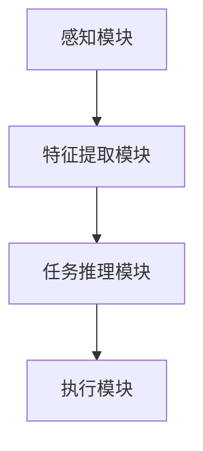

                 


# 零样本学习在AI Agent新任务适应中的应用

## 关键词：
零样本学习, AI Agent, 任务适应, 机器学习, 自然语言处理, 计算机视觉

## 摘要：
零样本学习是一种无需依赖特定任务训练数据即可直接适应新任务的机器学习方法，其在AI Agent中的应用能够显著提升其新任务适应能力。本文系统地介绍了零样本学习的核心概念、算法原理、系统架构，并通过实际案例展示了其在AI Agent中的应用。通过本文，读者能够深入了解零样本学习的技术细节及其在AI Agent中的实际应用价值。

---

## 第一章：零样本学习在AI Agent中的背景与应用

### 1.1 零样本学习的定义与特点
零样本学习是一种机器学习方法，允许模型在没有特定任务的训练数据的情况下，直接进行新任务的学习和推理。其核心特点包括：
- **零训练数据**：无需针对新任务的训练数据。
- **通用性**：能够适应多种不同任务。
- **实时性**：能够在实时环境中快速适应新任务。

### 1.2 AI Agent的基本概念
AI Agent（智能体）是指能够感知环境、自主决策并执行任务的智能系统。AI Agent的核心功能包括：
- **感知环境**：通过传感器或其他输入方式获取环境信息。
- **决策与推理**：基于感知信息进行逻辑推理和决策。
- **执行任务**：根据决策结果执行具体操作。

### 1.3 零样本学习在AI Agent中的应用背景
AI Agent在实际应用中常常需要快速适应新任务，传统依赖大量任务特定数据的方法难以满足需求。零样本学习通过利用通用的特征表示能力，使得AI Agent能够在没有任务特定训练数据的情况下快速适应新任务。

---

## 第二章：零样本学习的核心概念与原理

### 2.1 零样本学习的核心原理
零样本学习的核心在于通过学习通用的特征表示，将新任务映射到已知任务或通用特征空间中。其主要步骤包括：
1. **特征提取**：学习输入数据的通用特征表示。
2. **任务映射**：将新任务映射到特征空间中。
3. **推理与预测**：基于特征表示和任务映射进行预测。

### 2.2 零样本学习与迁移学习的对比
| 对比维度       | 零样本学习                     | 迁移学习                     |
|----------------|-------------------------------|-----------------------------|
| 数据需求       | 无需新任务数据                 | 需要部分新任务数据           |
| 任务适应性     | 能够适应完全未知的任务         | 适用于部分相关任务           |
| 应用场景       | 适用于快速适应新任务           | 适用于任务间存在部分重叠的场景 |

### 2.3 零样本学习在AI Agent中的具体应用
- **自然语言处理**：如问答系统中适应新问题类型。
- **计算机视觉**：如图像分类任务中适应新类别。
- **机器人控制**：如机器人在新环境中执行新任务。

---

## 第三章：零样本学习的算法原理与数学模型

### 3.1 零样本学习的数学模型
零样本学习的数学模型通常基于特征表示和任务映射。以下是常见的零样本学习模型：

#### 3.1.1 基于线性回归的零样本学习
目标函数：
$$ L = \sum_{i=1}^{n} (y_i - f(x_i))^2 $$
其中，$f(x_i)$ 是输入$x_i$的预测值，$y_i$ 是标签。

#### 3.1.2 基于神经网络的零样本学习
神经网络结构：
- 输入层：接收输入数据。
- 隐藏层：学习特征表示。
- 输出层：生成任务标签。

---

## 第四章：零样本学习在AI Agent中的系统架构设计

### 4.1 系统架构概述
AI Agent的系统架构包括以下模块：
1. **感知模块**：负责数据采集。
2. **特征提取模块**：进行特征提取。
3. **任务推理模块**：基于零样本学习进行任务推理。
4. **执行模块**：根据推理结果执行任务。

### 4.2 系统架构图


### 4.3 系统接口设计
- **输入接口**：接收感知数据。
- **输出接口**：输出执行指令。

---

## 第五章：零样本学习在AI Agent中的项目实战

### 5.1 环境安装
安装Python和相关库：
```bash
pip install numpy
pip install scikit-learn
pip install matplotlib
```

### 5.2 核心代码实现
以下是零样本学习的Python实现示例：
```python
import numpy as np
from sklearn.svm import SVC

# 特征提取
def extract_features(X):
    return X

# 任务推理
def zero_shot_classifier(X_train, y_train, X_test):
    clf = SVC()
    clf.fit(X_train, y_train)
    return clf.predict(X_test)
```

### 5.3 实际案例分析
案例：在问答系统中应用零样本学习。
- **训练数据**：问答对。
- **测试数据**：新问题类型。

---

## 第六章：零样本学习在AI Agent中的最佳实践

### 6.1 总结
零样本学习通过通用特征表示和任务映射，显著提升了AI Agent的新任务适应能力。

### 6.2 注意事项
- **数据质量**：特征提取的质量直接影响任务推理效果。
- **任务相关性**：任务之间应存在一定的关联性。

### 6.3 拓展阅读
- 《Zero-shot Learning: A Comprehensive Survey》
- 《Deep Learning for Zero-shot Learning》

---

## 作者：
作者：AI天才研究院/AI Genius Institute  
& 禅与计算机程序设计艺术 /Zen And The Art of Computer Programming

