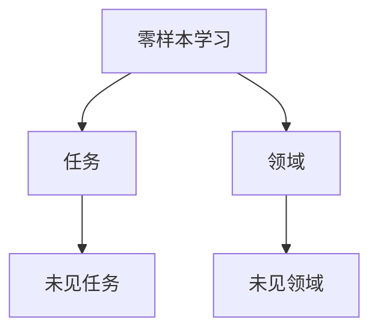
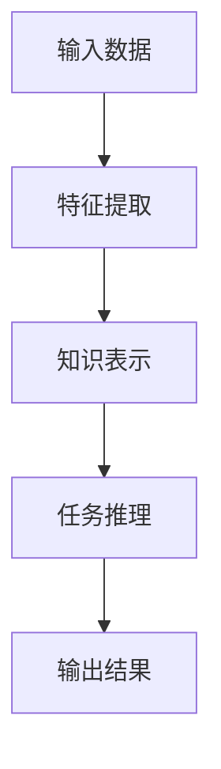
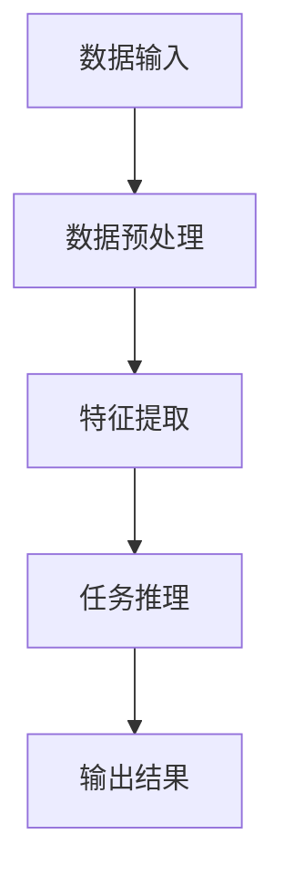
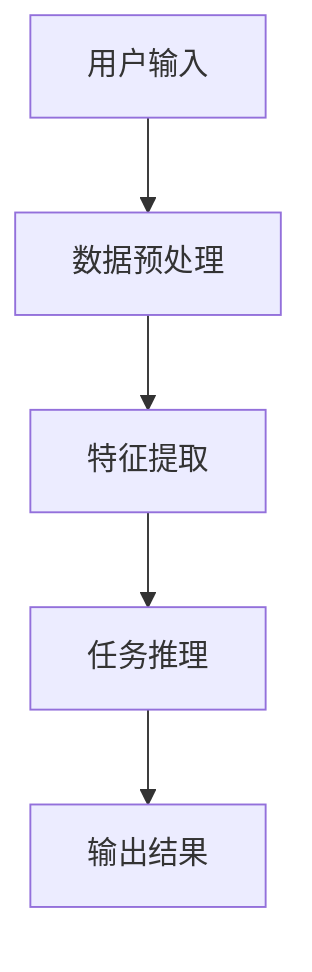

                 


# 零样本学习：应对未见过的任务和领域

---

## 关键词：零样本学习，未见任务，未见领域，知识表示，特征表示，任务推理

---

## 摘要：零样本学习是一种新兴的机器学习范式，旨在解决模型在未见过的任务和领域上仍然能够进行有效学习和推理的问题。本文将从零样本学习的背景、核心概念、算法原理、系统架构设计以及实际项目案例等多个方面进行详细阐述，深入分析其原理、应用场景及实现方法，并结合实际案例帮助读者更好地理解和掌握零样本学习的核心思想和技术。

---

# 第一部分: 零样本学习概述

# 第1章: 零样本学习的背景与概念

## 1.1 问题背景与挑战

### 1.1.1 传统机器学习的局限性
传统机器学习方法（如有监督学习）依赖于大量标注数据来训练模型，但在实际应用中，我们经常面临以下挑战：
- 数据标注成本高昂，尤其是在处理未见任务或领域时，标注新数据需要大量时间和资源。
- 模型的泛化能力有限，难以应对未见任务或领域中的数据分布和特征变化。

### 1.1.2 未见过任务的现实需求
在现实场景中，我们经常需要处理未见过的任务或领域：
- 医疗领域中的罕见病诊断，可能没有足够的标注数据。
- 自然语言处理中的多语言任务，某些语言的数据可能非常稀缺。
- 图像识别中的新兴类别，可能没有现成的训练数据。

### 1.1.3 零样本学习的解决方法
零样本学习（Zero-shot Learning）通过利用领域知识、特征表示和任务无关性，解决了未见任务和领域上的学习问题。其核心思想是通过共享知识和特征，在不依赖额外标注数据的情况下，实现对未见任务的推理和预测。

### 1.1.4 零样本学习的边界与外延
零样本学习的边界在于：
- **任务无关性**：零样本学习不依赖于任务间的直接关联，而是通过共享特征或知识实现跨任务推理。
- **领域无关性**：零样本学习关注的是跨领域或跨任务的通用性，而不是特定领域的优化。
- **数据稀缺性**：零样本学习特别适用于数据稀缺的场景，但在数据丰富的场景下，也可以通过零样本方法提升模型的泛化能力。

---

## 1.2 零样本学习的核心概念

### 1.2.1 零样本学习的定义
零样本学习是指在没有任何标注数据的情况下，通过领域知识、特征表示或其他相关信息，推断出未见任务或领域的模型输出。

### 1.2.2 零样本学习的特点
- **无监督性**：零样本学习在未见任务或领域上不依赖标注数据。
- **知识驱动**：依赖领域知识、特征表示或任务间的共享信息。
- **任务无关性**：不同任务之间可以相对独立，通过共享特征或知识实现跨任务推理。

### 1.2.3 零样本学习的核心要素
- **知识表示**：通过领域知识（如概念、属性、关系等）来表示任务或领域的特征。
- **特征表示**：将任务或领域的特征表示为低维向量，便于模型理解和推理。
- **任务无关性**：不同任务或领域之间可以相对独立，通过共享特征或知识实现跨任务推理。

---

## 1.3 本章小结
本章通过介绍零样本学习的背景、核心概念和特点，为后续章节奠定了基础。零样本学习作为一种新兴的机器学习范式，通过知识表示和特征表示，解决了未见任务和领域上的学习问题。接下来，我们将深入探讨零样本学习的核心概念与原理。

---

# 第二部分: 零样本学习的核心概念与原理

# 第2章: 零样本学习的核心概念

## 2.1 零样本学习的核心要素

### 2.1.1 知识表示
知识表示是零样本学习的关键，通过将任务或领域表示为知识图谱或概念图，可以更好地理解任务之间的关系和特征。例如，可以通过知识图谱将任务表示为节点，节点之间的关系表示为边。

### 2.1.2 特征表示
特征表示是将任务或领域的特征转换为低维向量，便于模型理解和推理。例如，可以使用词嵌入（如Word2Vec）将任务名称表示为向量。

### 2.1.3 任务无关性
任务无关性是指不同任务之间可以相对独立，通过共享特征或知识实现跨任务推理。例如，在医疗领域，可以通过共享疾病症状的特征，在未见疾病上进行推理。

## 2.2 零样本学习的属性特征对比

### 2.2.1 样本数量的对比
- **有监督学习**：需要大量标注数据。
- **零样本学习**：不需要标注数据，依赖知识或特征表示。

### 2.2.2 任务多样性的对比
- **有监督学习**：每个任务需要独立训练。
- **零样本学习**：可以通过共享特征或知识实现跨任务推理。

### 2.2.3 模型泛化的对比
- **有监督学习**：模型泛化能力有限，需要大量标注数据。
- **零样本学习**：模型具有较强的泛化能力，能够应对未见任务和领域。

## 2.3 零样本学习的ER实体关系图
以下是一个简单的零样本学习的实体关系图：



## 2.4 本章小结
本章通过详细阐述零样本学习的核心概念和属性特征，帮助读者更好地理解零样本学习的原理和特点。接下来，我们将深入探讨零样本学习的算法原理和实现方法。

---

# 第三部分: 零样本学习的算法原理

# 第3章: 零样本学习的算法原理

## 3.1 零样本分类算法

### 3.1.1 基于特征的零样本分类
基于特征的零样本分类通过共享特征表示，在未见任务上进行推理。例如，可以使用词嵌入将任务名称表示为向量，然后通过分类器进行预测。

### 3.1.2 基于标签的零样本分类
基于标签的零样本分类通过共享标签信息，在未见任务上进行推理。例如，可以使用标签嵌入将任务标签表示为向量，然后通过分类器进行预测。

### 3.1.3 基于知识图谱的零样本分类
基于知识图谱的零样本分类通过构建领域知识图谱，在未见任务上进行推理。例如，可以通过知识图谱推理任务之间的关系，从而进行分类。

## 3.2 零样本学习的算法流程

### 3.2.1 算法步骤
1. 数据预处理：将任务或领域的特征表示为向量。
2. 知识表示：构建领域知识图谱或概念图。
3. 任务推理：通过共享特征或知识，推断出未见任务或领域的输出。

### 3.2.2 算法流程图


## 3.3 零样本学习的数学模型

### 3.3.1 特征表示模型
特征表示模型可以通过以下公式表示：
$$f(x) = Wx + b$$
其中，$x$ 是输入特征，$W$ 是权重矩阵，$b$ 是偏置项。

### 3.3.2 分类模型
分类模型可以通过以下公式表示：
$$p(y|x) = \frac{e^{w_y^T x + b_y}}{\sum_{k} e^{w_k^T x + b_k}}$$
其中，$y$ 是输出类别，$x$ 是输入特征，$w_y$ 和 $b_y$ 是类别 $y$ 的权重和偏置。

## 3.4 本章小结
本章通过详细阐述零样本学习的算法原理和实现方法，帮助读者更好地理解零样本学习的技术细节。接下来，我们将从系统分析与架构设计的角度，探讨零样本学习的实际应用。

---

# 第四部分: 零样本学习的系统分析与架构设计

# 第4章: 零样本学习的系统分析

## 4.1 问题场景介绍

### 4.1.1 未见任务的分类问题
例如，在医疗领域，可能需要对罕见病进行分类，但缺乏标注数据。

### 4.1.2 未见领域的数据处理
例如，在图像识别中，可能需要处理新兴的图像类别，但缺乏训练数据。

### 4.1.3 零样本学习的系统目标
通过共享特征或知识，实现对未见任务或领域的分类和推理。

## 4.2 系统功能设计

### 4.2.1 数据预处理模块
数据预处理模块负责将任务或领域的特征表示为向量。

### 4.2.2 特征提取模块
特征提取模块负责从输入数据中提取特征向量。

### 4.2.3 任务推理模块
任务推理模块负责通过共享特征或知识，推断出未见任务或领域的输出。

## 4.3 系统架构设计

### 4.3.1 系统架构图


### 4.3.2 系统接口设计
系统接口设计包括：
- 数据输入接口：接收任务或领域的特征数据。
- 数据输出接口：输出分类结果或推理结果。

### 4.3.3 系统交互流程图


## 4.4 本章小结
本章通过系统分析与架构设计，帮助读者更好地理解零样本学习的实际应用。接下来，我们将从项目实战的角度，探讨零样本学习的实现和应用。

---

# 第五部分: 零样本学习的项目实战

# 第5章: 零样本学习的项目实战

## 5.1 项目介绍

### 5.1.1 项目目标
通过零样本学习，实现对未见任务或领域的分类和推理。

### 5.1.2 项目需求
- 数据预处理：将任务或领域的特征表示为向量。
- 特征提取：使用词嵌入或其他特征提取方法。
- 任务推理：通过共享特征或知识，推断出未见任务或领域的输出。

## 5.2 系统实现

### 5.2.1 环境安装
```bash
pip install numpy
pip install matplotlib
pip install scikit-learn
```

### 5.2.2 核心代码实现
```python
import numpy as np
from sklearn.linear_model import LogisticRegression

# 特征提取
def extract_features(tasks):
    return np.random.rand(len(tasks), 10)  # 假设特征维度为10

# 零样本分类器
class ZeroShotClassifier:
    def __init__(self):
        self.model = LogisticRegression()

    def fit(self, features, labels):
        self.model.fit(features, labels)

    def predict(self, features):
        return self.model.predict(features)
```

### 5.2.3 代码应用解读
1. 特征提取：将任务表示为向量。
2. 模型训练：使用有监督学习方法训练分类器。
3. 模型推理：在未见任务上进行分类和推理。

## 5.3 项目小结
本章通过实际项目案例，帮助读者更好地理解零样本学习的实现和应用。接下来，我们将从最佳实践的角度，总结零样本学习的注意事项和未来发展方向。

---

# 第六部分: 零样本学习的最佳实践

# 第6章: 零样本学习的最佳实践

## 6.1 注意事项
- 数据质量：确保输入数据的质量和一致性。
- 特征选择：选择合适的特征表示方法。
- 模型选择：选择适合的零样本学习算法。

## 6.2 小结
零样本学习是一种新兴的机器学习范式，通过知识表示和特征表示，能够在未见任务和领域上进行有效推理和分类。未来，随着深度学习和知识图谱技术的发展，零样本学习将在更多领域得到广泛应用。

---

## 作者：AI天才研究院/AI Genius Institute & 禅与计算机程序设计艺术 /Zen And The Art of Computer Programming

