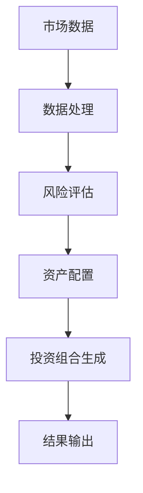

                 


# 雷·达里奥的全天候投资组合理论

## 关键词
全天候投资组合、风险平价、资产配置、雷·达里奥、桥水基金

## 摘要
雷·达里奥的全天候投资组合理论是一种通过科学的资产配置和风险平价方法，帮助投资者在不同市场环境下实现稳健收益的投资策略。本文将从理论背景、数学模型、系统架构到项目实战，全面解析这一理论的核心思想和实现方法。

---

## 第1章 全天候投资组合理论的背景与核心概念

### 1.1 投资组合理论的发展背景

#### 1.1.1 传统投资组合理论的局限性
传统的投资组合理论（如均值-方差模型）主要依赖于历史收益和波动率，但忽视了资产间的相关性变化和市场环境的多样性。这使得单一资产配置在市场波动时表现不佳。

#### 1.1.2 大类资产配置的重要性
大类资产配置通过分散投资不同类别的资产（如股票、债券、商品等）来降低风险，提高收益稳定性。雷·达里奥认为，资产配置是投资收益的主要驱动因素。

#### 1.1.3 风险平价的概念与作用
风险平价是一种资产配置方法，旨在让每种资产对组合风险的贡献相等。这种方法在市场波动时更具稳定性，因为没有单一资产能主导组合的风险。

### 1.2 雷·达里奥与全天候投资理论

#### 1.2.1 雷·达里奥的生平简介
雷·达里奥是桥水基金的创始人，被誉为“对冲基金教父”。他的投资理念强调纪律性和科学性，致力于通过系统化的方法实现超额收益。

#### 1.2.2 桥水基金的投资理念
桥水基金以量化分析和系统化交易著称，雷·达里奥提出的全天候投资理论是其核心策略之一。该理论通过分析不同经济环境下的资产表现，构建稳健的投资组合。

#### 1.2.3 《投资最重要的事情》的核心思想
这本书总结了雷·达里奥的投资哲学，强调长期视角、风险管理和资产配置的重要性。书中提出的风险平价方法是全天候投资理论的核心。

### 1.3 全天候投资组合理论的核心框架

#### 1.3.1 风险平价的定义与目标
风险平价是一种资产配置方法，旨在平衡每种资产对组合风险的贡献。其目标是使组合在不同市场环境下表现稳定。

#### 1.3.2 资产配置的多维度考量
全天候投资组合考虑多种资产类别，如股票、债券、商品等，并根据经济周期调整权重，以应对不同市场环境。

#### 1.3.3 投资组合的再平衡机制
定期对投资组合进行再平衡，确保每种资产的风险贡献相等。这有助于在市场变化时维持组合的稳定性。

---

## 第2章 风险平价与资产配置的数学模型

### 2.1 风险平价的原理与公式

#### 2.1.1 风险平价的核心公式
$$ \text{权重}_i = \frac{\text{风险贡献}_i}{\sum_{j=1}^{n} \text{风险贡献}_j} $$

其中，$\text{风险贡献}_i$ 是第$i$种资产的风险贡献，$\sum_{j=1}^{n} \text{风险贡献}_j$ 是所有资产的风险贡献总和。

#### 2.1.2 风险贡献的计算方法
风险贡献是资产的波动率与组合权重的乘积。公式为：
$$ \text{风险贡献}_i = w_i \cdot \sigma_i $$
其中，$w_i$ 是资产$i$的权重，$\sigma_i$ 是资产$i$的波动率。

### 2.2 资产配置的多因子模型

#### 2.2.1 多因子模型的构建
多因子模型通过分析多个因子（如价值、动量、成长等）来解释资产收益。模型可以表示为：
$$ R_i = \beta_{i1}F_1 + \beta_{i2}F_2 + \ldots + \beta_{ik}F_k + \epsilon_i $$
其中，$R_i$ 是资产$i$的收益，$F_j$ 是第$j$个因子，$\beta_{ij}$ 是因子暴露，$\epsilon_i$ 是残差。

#### 2.2.2 因子权重的确定
因子权重通常通过最小化组合风险来确定。优化目标为：
$$ \min \sum_{i=1}^{n} \sum_{j=1}^{n} w_i w_j \sigma_{ij} $$
其中，$\sigma_{ij}$ 是资产$i$和$j$的协方差。

#### 2.2.3 因子间的协方差矩阵
协方差矩阵描述了因子之间的相关性，是构建多因子模型的关键。矩阵可以表示为：
$$ \Sigma = \begin{bmatrix}
\sigma_1^2 & \rho_{12} \sigma_1 \sigma_2 & \ldots & \rho_{1n} \sigma_1 \sigma_n \\
\sigma_2^2 & \rho_{23} \sigma_2 \sigma_3 & \ldots & \rho_{2n} \sigma_2 \sigma_n \\
\vdots & \vdots & \ddots & \vdots \\
\sigma_n^2 & \rho_{n1} \sigma_n \sigma_1 & \ldots & \rho_{nn} \sigma_n^2
\end{bmatrix} $$

### 2.3 数学模型的实现与优化

#### 2.3.1 模型的优化目标
优化目标是在给定风险约束下最大化收益，或在给定收益下最小化风险。

#### 2.3.2 优化算法的选择
常用优化算法包括均值-方差优化、风险平价优化和指数优化。风险平价优化通过调整权重使每种资产的风险贡献相等。

#### 2.3.3 模型的验证与回测
通过历史数据回测模型的表现，验证其有效性和稳健性。

---

## 第3章 全天候投资组合的系统架构与实现

### 3.1 系统架构设计

#### 3.1.1 系统功能模块划分
系统主要分为数据采集、风险评估、资产配置和投资组合生成四个模块。

#### 3.1.2 数据流与信息交互
数据流从外部输入（如市场数据）开始，经过处理和分析，最终生成投资组合。

#### 3.1.3 系统架构的Mermaid图



### 3.2 系统功能设计

#### 3.2.1 数据采集与清洗
从多个数据源获取市场数据，并进行清洗和预处理。

#### 3.2.2 风险评估模块
计算每种资产的风险贡献，并进行风险排序。

#### 3.2.3 资产配置优化模块
根据风险平价原则，优化资产权重。

### 3.3 系统接口设计

#### 3.3.1 输入接口
接受市场数据和用户输入的参数。

#### 3.3.2 输出接口
输出优化后的投资组合和相关报告。

#### 3.3.3 内部接口
模块之间的数据交互接口。

### 3.4 本章小结

---

## 第4章 项目实战——全天候投资组合的实现

### 4.1 环境安装与配置

#### 4.1.1 安装Python环境
安装Python 3.x，确保版本兼容。

#### 4.1.2 安装必要的库（如pandas、numpy等）
使用pip安装以下库：
- pandas
- numpy
- matplotlib
- scikit-learn

### 4.2 核心代码实现

#### 4.2.1 风险平价权重计算

```python
import numpy as np

def risk_parity_weights(cov_matrix, eps=1e-8):
    """
    计算风险平价权重
    """
    n = cov_matrix.shape[0]
    weights = np.ones(n) / n
    while True:
        risk_contributions = weights * np.diag(cov_matrix.dot(weights))
        new_weights = risk_contributions / sum(risk_contributions)
        if np.max(abs(new_weights - weights)) < eps:
            break
        weights = new_weights
    return weights
```

### 4.3 项目实战案例分析

#### 4.3.1 数据准备
获取历史数据，计算每种资产的协方差矩阵。

#### 4.3.2 风险平价权重计算
使用上述函数计算风险平价权重。

#### 4.3.3 投资组合生成
根据权重生成投资组合，并进行回测。

### 4.4 本章小结

---

## 第5章 最佳实践与注意事项

### 5.1 小结
总结全文内容，强调风险平价和资产配置的重要性。

### 5.2 注意事项
- 定期再平衡组合，避免权重偏离。
- 选择合适的资产类别，覆盖不同市场环境。
- 保持长期视角，避免短期波动干扰。

### 5.3 拓展阅读
推荐相关书籍和文献，供进一步学习。

---

## 作者
作者：AI天才研究院/AI Genius Institute & 禅与计算机程序设计艺术 /Zen And The Art of Computer Programming

