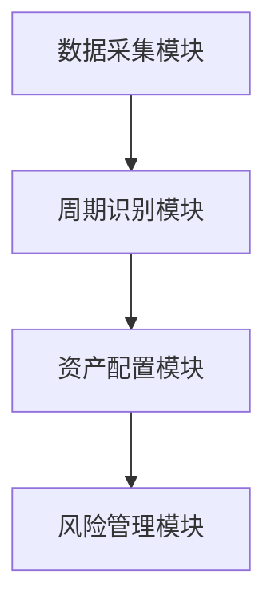

                 


# 雷·达里奥的宏观经济周期投资策略

## 关键词：宏观经济周期、投资策略、雷·达里奥、系统架构、项目实战

## 摘要：本文深入分析了雷·达里奥的宏观经济周期投资策略，探讨了宏观经济周期的定义、类型及其对投资策略的影响。通过系统架构设计和项目实战，展示了如何将宏观经济周期分析应用于投资决策，帮助投资者在不同经济周期中优化资产配置，降低风险，提高收益。

---

## 第一部分：雷·达里奥的宏观经济周期投资策略概述

### 1.1 雷·达里奥及其投资理念

#### 1.1.1 雷·达里奥的背景介绍
雷·达里奥（Ray Dalio）是全球著名投资家、对冲基金经理和桥水公司（Bridgewater Associates）的创始人。他以宏观经济研究和投资策略闻名，提出了基于宏观经济周期的投资方法。

#### 1.1.2 达里奥投资理念的核心思想
达里奥认为，经济是有周期的，周期由债务周期和通货膨胀周期共同驱动。投资者需要识别这些周期，并根据周期阶段调整投资策略。

#### 1.1.3 宏观经济周期投资策略的背景与意义
宏观经济周期投资策略帮助投资者在不同经济环境下做出更明智的投资决策，降低风险，提高收益。

### 1.2 宏观经济周期的基本概念

#### 1.2.1 宏观经济周期的定义
宏观经济周期是指经济活动的波动，包括繁荣、衰退、萧条和复苏四个阶段。

#### 1.2.2 宏观经济周期的类型
- 负债周期
- 通货膨胀周期
- 经济增长周期

#### 1.2.3 宏观经济周期的运行机制
通过分析关键经济指标（如GDP、失业率、通胀率）的变化，识别经济周期阶段。

### 1.3 投资策略与宏观经济周期的关系

#### 1.3.1 投资策略的基本概念
投资策略是根据市场情况调整资产配置以实现收益最大化的方法。

#### 1.3.2 宏观经济周期对投资策略的影响
不同经济周期阶段适合不同的资产配置，例如衰退期适合债券，复苏期适合股票。

#### 1.3.3 达里奥宏观经济周期投资策略的核心要素
- 经济周期分析
- 资产配置调整
- 风险管理

---

## 第二部分：宏观经济周期的分析与识别

### 2.1 宏观经济周期的分析框架

#### 2.1.1 宏观经济指标的分类与作用
- 主要指标：GDP、失业率、通胀率
- 次要指标：工业产出、消费者信心指数

#### 2.1.2 宏观经济周期的指标体系
通过综合分析多个指标，识别经济周期阶段。

#### 2.1.3 宏观经济周期的分析方法
- 历史数据对比
- 统计模型分析

### 2.2 宏观经济周期的识别方法

#### 2.2.1 基于历史数据的周期识别
通过历史数据识别周期模式。

#### 2.2.2 基于模型的周期识别
使用统计模型预测经济周期变化。

#### 2.2.3 达里奥周期模型的介绍
达里奥模型结合债务和通胀周期，预测经济周期阶段。

### 2.3 宏观经济周期的特征分析

#### 2.3.1 经济增长阶段的特征
- 萧条期：低增长，高失业
- 复苏期：增长回升，就业改善

#### 2.3.2 利率与货币政策的特征
- 萧条期：低利率，宽松政策
- 复苏期：高利率，紧缩政策

#### 2.3.3 通货膨胀与就业市场的特征
高通胀期适合短期债券，低通胀期适合股票。

### 2.4 本章小结

---

## 第三部分：达里奥宏观经济周期投资策略的核心原理

### 3.1 投资策略的基本原理

#### 3.1.1 投资策略的分类
- 股票策略
- 债券策略
- 组合投资

#### 3.1.2 宏观经济周期与资产配置的关系
资产配置根据经济周期阶段调整。

#### 3.1.3 达里奥投资策略的独特性
动态调整资产配置，注重风险管理。

### 3.2 宏观经济周期与资产配置的关系

#### 3.2.1 不同周期下的资产表现
- 萧条期：债券表现好
- 复苏期：股票表现好

#### 3.2.2 宏观经济周期对风险偏好影响
周期变化影响投资者风险偏好。

#### 3.2.3 资产配置的动态调整
根据经济周期变化，动态调整资产配置。

### 3.3 达里奥周期模型的数学模型

#### 3.3.1 宏观经济指标的权重分配
使用加权平均法，权重根据指标重要性确定。

#### 3.3.2 周期阶段的量化方法
将经济周期分为多个阶段，用数学模型量化每个阶段的影响。

#### 3.3.3 投资组合优化的数学公式
$$ \text{收益} = \sum (w_i \times r_i) $$
其中，\(w_i\)是资产权重，\(r_i\)是资产收益率。

### 3.4 本章小结

---

## 第四部分：达里奥投资策略的系统分析与架构设计

### 4.1 系统分析

#### 4.1.1 问题场景介绍
识别经济周期，调整投资组合。

#### 4.1.2 系统功能需求分析
- 数据采集
- 周期识别
- 资产配置
- 风险管理

#### 4.1.3 系统边界与接口设计
- 输入：经济指标数据
- 输出：投资策略建议

### 4.2 系统架构设计

#### 4.2.1 系统模块划分
- 数据采集模块
- 周期识别模块
- 资产配置模块
- 风险管理模块

#### 4.2.2 系统架构图（Mermaid）



#### 4.2.3 模块之间的交互流程（Mermaid）


### 4.3 系统接口设计

#### 4.3.1 数据输入接口
接收经济指标数据，如GDP、失业率。

#### 4.3.2 数据处理接口
对数据进行预处理，识别经济周期阶段。

#### 4.3.3 结果输出接口
输出投资策略建议。

### 4.4 本章小结

---

## 第五部分：达里奥投资策略的项目实战

### 5.1 环境安装与配置

#### 5.1.1 开发环境的选择
建议使用Python和Jupyter Notebook进行开发。

#### 5.1.2 系统功能需求分析
- 数据采集
- 周期识别
- 资产配置
- 风险管理

### 5.2 核心代码实现

#### 5.2.1 数据采集模块
```python
import pandas as pd
import requests

# 下载经济指标数据
url = 'https://example.com/economic_data.csv'
data = pd.read_csv(url)
```

#### 5.2.2 周期识别模块
```python
from sklearn.cluster import KMeans

# 使用K-means算法识别周期阶段
X = data[['GDP', '失业率']].values
kmeans = KMeans(n_clusters=4, random_state=0)
kmeans.fit(X)
clusters = kmeans.labels_
```

#### 5.2.3 资产配置模块
```python
import numpy as np

# 根据周期阶段调整资产配置权重
weights = np.array([0.3, 0.4, 0.2, 0.1])
assets = ['股票', '债券', '现金', '黄金']
config = {assets[i]: weights[i] for i in range(4)}
```

#### 5.2.4 风险管理模块
```python
import riskfolio

# 计算投资组合的风险和收益
port = riskfolio.Portfolio(data)
port.set_weights(weights)
port.optimize()
```

### 5.3 代码应用解读与分析

#### 5.3.1 数据采集与预处理
从可靠数据源获取经济指标数据，进行清洗和预处理。

#### 5.3.2 周期识别与资产配置
根据识别的周期阶段，动态调整资产配置权重。

#### 5.3.3 风险管理
使用风险管理工具，监控投资组合的风险，进行动态调整。

### 5.4 实际案例分析与详细讲解

#### 5.4.1 案例分析
假设当前经济处于衰退期，调整资产配置，增加债券权重。

#### 5.4.2 详细讲解
分析不同经济周期下的投资策略，验证模型的有效性。

### 5.5 项目小结

---

## 第六部分：达里奥投资策略的扩展与优化

### 6.1 投资策略的扩展
- 多因素模型的引入
- 多元化投资策略的优化

### 6.2 系统架构的优化
- 高可用性设计
- 高扩展性设计

### 6.3 项目总结
总结项目成果，展望未来发展方向。

---

## 作者信息

作者：AI天才研究院 & 禅与计算机程序设计艺术

---

通过以上步骤，我们详细分析了雷·达里奥的宏观经济周期投资策略，从理论到实践，为读者提供了全面的指导和应用方案。希望这篇文章能够帮助投资者更好地理解和应用宏观经济周期投资策略。

