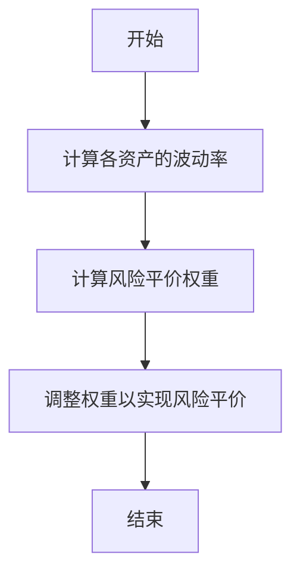
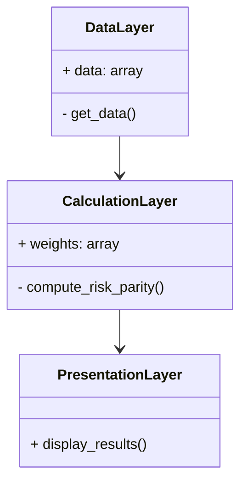
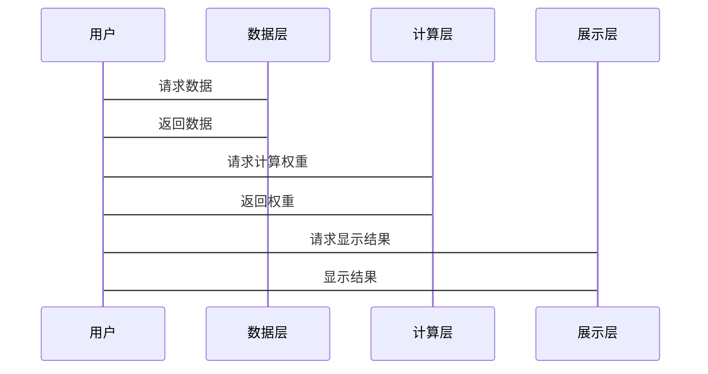

                 


---

# 雷·达里奥的风险平价投资策略

## 关键词：风险平价，投资策略，资产配置，雷·达里奥，桥水基金

## 摘要：  
本文详细探讨雷·达里奥的风险平价投资策略，分析其理论基础、算法实现、系统架构及实际应用。通过数学模型和代码示例，揭示风险平价的核心原理，并结合项目实战，指导读者实现这一策略。

---

# 第一部分：风险平价投资策略的背景与核心概念

## 第1章：风险平价投资策略的背景与意义

### 1.1 风险平价的定义与背景  
- **1.1.1 风险平价的定义**  
  风险平价是一种投资策略，旨在通过调整资产权重，使得每种资产的风险贡献相等，从而分散投资风险。  
- **1.1.2 风险平价在投资管理中的重要性**  
  风险平价通过平衡风险贡献，优化投资组合的稳定性，降低极端市场条件下的波动性。  
- **1.1.3 风险平价与传统投资策略的区别**  
  传统投资策略关注资产回报和波动性，而风险平价策略侧重于风险贡献的平衡。

### 1.2 风险平价的核心理念  
- **1.2.1 风险平价的基本原理**  
  风险平价通过计算每种资产的风险贡献，调整其权重，以实现风险的均匀分布。  
- **1.2.2 风险平价与资产配置的关系**  
  风险平价是一种动态的资产配置方法，根据市场变化调整权重，以维持风险平衡。  
- **1.2.3 风险平价在投资组合中的应用**  
  通过风险平价策略，投资者可以在不同市场条件下优化投资组合的风险收益比。

### 1.3 雷·达里奥与风险平价策略  
- **1.3.1 雷·达里奥的背景与投资理念**  
  雷·达里奥是桥水基金的创始人，主张通过系统化的方法管理投资风险。  
- **1.3.2 风险平价策略的起源与发展**  
  风险平价策略由桥水基金开发，旨在应对市场的不确定性，实现长期稳定的回报。  
- **1.3.3 风险平价策略在桥水基金中的应用**  
  桥水基金通过风险平价策略构建投资组合，显著降低了组合的波动性和潜在损失。

### 1.4 本章小结  
- **1.4.1 风险平价的核心概念回顾**  
  风险平价通过平衡风险贡献，优化投资组合的稳定性。  
- **1.4.2 雷·达里奥在风险平价策略中的贡献**  
  雷·达里奥将风险平价策略系统化，应用于大规模投资组合管理。  
- **1.4.3 本章内容总结**  
  风险平价是一种创新的投资策略，通过平衡风险贡献，优化投资组合的风险收益比。

---

## 第2章：风险平价的理论基础

### 2.1 现代投资组合理论  
- **2.1.1 现代投资组合理论的基本原理**  
  现代投资组合理论（MPT）由哈里·马科维茨提出，强调通过分散投资降低风险。  
- **2.1.2 马科维茨的有效前沿理论**  
  有效前沿展示了在给定风险下，能够实现最大收益的投资组合。  
- **2.1.3 风险与收益的权衡**  
  风险与收益的权衡是投资决策的核心，风险平价策略在此基础上进一步优化了风险分配。

### 2.2 风险平价的数学模型  
- **2.2.1 风险平价的定义公式**  
  风险贡献的计算公式：  
  $$ \text{风险贡献} = w_i \times \sigma_i $$  
  其中，\( w_i \) 是资产 \( i \) 的权重，\( \sigma_i \) 是资产 \( i \) 的波动率。  
- **2.2.2 风险平价的投资组合权重计算**  
  风险平价权重计算公式：  
  $$ w_i = \frac{1}{\sigma_i^2} $$  
  这种权重分配使得每种资产的风险贡献相等。  
- **2.2.3 风险平价与资产回报的关系**  
  风险平价策略通过调整权重，使得资产的回报在风险贡献上平衡。

### 2.3 风险平价与资产配置  
- **2.3.1 风险平价在资产配置中的应用**  
  风险平价策略通过调整资产权重，优化投资组合的风险收益比。  
- **2.3.2 风险平价与传统资产配置的区别**  
  传统资产配置基于预期回报和波动率，而风险平价策略基于风险贡献的平衡。  
- **2.3.3 风险平价在投资组合中的应用**  
  风险平价策略能够有效应对市场波动，降低组合的整体风险。

---

## 第3章：风险平价的算法实现

### 3.1 风险平价算法的步骤  
- **步骤1：计算各资产的波动率**  
  使用历史数据计算每种资产的波动率 \( \sigma_i \)。  
- **步骤2：计算风险平价权重**  
  根据公式 \( w_i = \frac{1}{\sigma_i^2} \) 计算各资产的权重。  
- **步骤3：调整权重以实现风险平价**  
  确保所有资产的风险贡献相等，即 \( w_i \times \sigma_i \) 相等。  

### 3.2 风险平价算法的流程图  


### 3.3 风险平价算法的代码实现  
```python
import numpy as np

def compute_risk_parity_weights(returns):
    # 计算波动率
    sigma = np.std(returns, axis=0)
    # 计算风险平价权重
    weights = 1 / (sigma ** 2)
    # 标准化权重
    weights = weights / np.sum(weights)
    return weights
```

### 3.4 风险平价算法的数学模型  
- **风险平价权重计算公式**：  
  $$ w_i = \frac{1}{\sigma_i^2} $$  
  其中，\( \sigma_i \) 是资产 \( i \) 的波动率。  
- **风险平价投资组合的构建**：  
  $$ w_i \times \sigma_i \text{ 对所有资产相等} $$  

---

## 第4章：风险平价投资系统的系统架构设计

### 4.1 系统架构概述  
- **系统功能设计**  
  系统包括数据获取、风险平价计算、结果展示三个主要功能模块。  
- **系统架构设计**  
  使用分层架构，包括数据层、计算层和展示层。  

### 4.2 系统架构类图  


### 4.3 系统接口设计  
- **数据接口**  
  提供数据获取接口，返回所需资产的收益数据。  
- **计算接口**  
  提供风险平价计算接口，返回各资产的权重。  
- **展示接口**  
  提供结果展示接口，显示各资产的权重和风险贡献。

### 4.4 系统交互序列图  


---

## 第5章：风险平价策略的项目实战

### 5.1 环境安装与配置  
- **安装Python环境**  
  使用Anaconda或Miniconda安装Python 3.8及以上版本。  
- **安装依赖库**  
  使用以下命令安装所需库：  
  ```bash
  pip install numpy pandas matplotlib
  ```

### 5.2 核心代码实现  
```python
import numpy as np
import matplotlib.pyplot as plt

def compute_risk_parity_weights(returns):
    sigma = np.std(returns, axis=0)
    weights = 1 / (sigma ** 2)
    weights = weights / np.sum(weights)
    return weights

def backtest_strategy(returns, weights):
    portfolio_returns = np.sum(weights * returns, axis=1)
    return portfolio_returns

# 示例数据
returns = np.random.randn(100, 5)  # 100天数据，5种资产
weights = compute_risk_parity_weights(returns)
portfolio_returns = backtest_strategy(returns, weights)

plt.plot(portfolio_returns)
plt.title('风险平价组合的收益率')
plt.xlabel('时间')
plt.ylabel('收益率')
plt.show()
```

### 5.3 代码解读与分析  
- **数据生成**  
  使用随机数生成资产收益数据。  
- **权重计算**  
  根据波动率计算风险平价权重。  
- **组合收益计算**  
  根据权重计算投资组合的收益率。  
- **结果展示**  
  绘制组合收益率的折线图，展示策略的有效性。

### 5.4 实际案例分析  
- **案例描述**  
  使用历史数据测试风险平价策略的表现。  
- **数据来源**  
  使用过去10年的股票、债券等资产的收益数据。  
- **策略效果**  
  风险平价策略在市场波动期间表现稳定，显著降低组合的波动性。

### 5.5 项目小结  
- **项目目标**  
  实现风险平价策略并测试其有效性。  
- **项目成果**  
  成功开发了风险平价策略的系统，并验证了其在实际中的应用价值。  

---

## 第6章：风险平价策略的最佳实践与注意事项

### 6.1 最佳实践  
- **定期再平衡**  
  定期调整权重以应对市场变化。  
- **风险监控**  
  监控组合的风险贡献，及时调整以应对潜在风险。  
- **数据选择**  
  使用高质量的历史数据，确保计算的准确性。

### 6.2 小结  
- **风险平价策略的核心**  
  通过平衡风险贡献，优化投资组合的稳定性。  
- **策略的局限性**  
  风险平价策略在极端市场条件下可能失效，需结合其他策略进行调整。

### 6.3 注意事项  
- **市场风险**  
  风险平价策略无法完全消除市场风险，需谨慎管理。  
- **流动性风险**  
  大规模投资可能面临流动性问题，需提前规划。

### 6.4 拓展阅读  
- **相关书籍**  
  雷·达里奥的《原则》和桥水基金的相关文献。  
- **学术论文**  
  关于风险平价策略的最新研究成果。

---

## 作者：AI天才研究院 & 禅与计算机程序设计艺术

