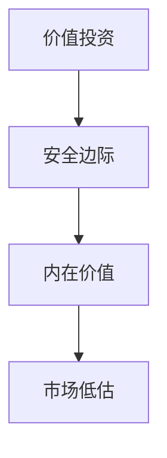
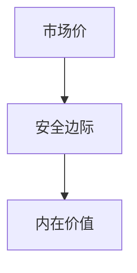
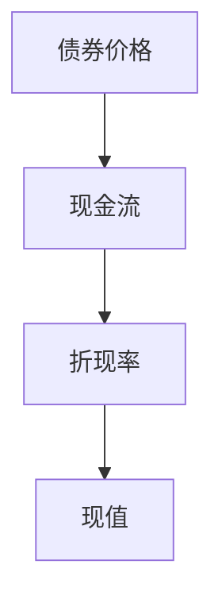
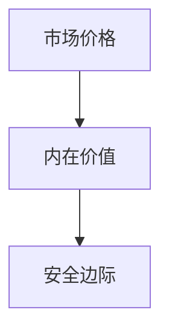
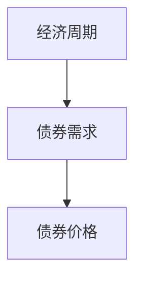

                 


# 霍华德·马克斯的债券价值投资：固定收益中的机会

## 关键词
- 霍华德·马克斯
- 债券价值投资
- 固定收益
- 安全边际
- 市场分析

## 摘要
霍华德·马克斯是全球 renowned的价值投资者，他的投资理念在固定收益领域具有深远影响。本文深入探讨马克斯的债券投资策略，分析其安全边际原则、市场分析方法以及风险管理策略。通过经典案例分析和数学模型，本文揭示了债券投资中的机会与挑战，为投资者提供实用的指导。

---

## 第1章 霍华德·马克斯的投资哲学

### 1.1 价值投资的核心理念

#### 1.1.1 背景介绍
- **核心概念**：价值投资是一种以低于内在价值的价格买入优质资产的投资策略。
- **问题背景**：传统投资往往忽视市场波动，追求短期收益，而价值投资强调长期持有的理念。
- **问题解决**：通过深入分析资产的内在价值，识别市场低估的机会。

#### 1.1.2 核心概念与联系
- **Mermaid图：价值投资的框架**



#### 1.1.3 数学模型与算法



数学公式：

$$
\text{安全边际} = \text{内在价值} - \text{市场价格}
$$

---

## 第2章 马克斯的债券投资框架

### 2.1 债券定价的数学模型

#### 2.1.1 定价原理

- **算法原理**：债券价格基于未来现金流的现值计算。



- **数学公式**：

$$
P = \frac{C}{(1 + r)^n}
$$

其中：
- \( P \) 是债券价格
- \( C \) 是每年的现金流
- \( r \) 是折现率
- \( n \) 是年数

---

## 第3章 马克斯的安全边际原则

### 3.1 安全边际的定义与计算

#### 3.1.1 安全边际的重要性

- **Mermaid图：安全边际的应用**



- **数学公式**：

$$
\text{安全边际} = \text{内在价值} - \text{市场价格}
$$

---

## 第4章 债券市场的周期性分析

### 4.1 市场周期对投资策略的影响

#### 4.1.1 经济周期的分析

- **Mermaid图：经济周期与债券市场**



- **数学公式**：

$$
\text{需求变化} = \text{经济周期} \times \text{利率变化}
$$

---

## 第5章 风险管理策略

### 5.1 利率风险的对冲

#### 5.1.1 利率风险的数学模型

- **公式**：

$$
\text{利率风险} = \text{债券价格波动} \times \text{利率变化}
$$

---

## 第6章 经典案例分析

### 6.1 马克斯的债券投资案例

#### 6.1.1 案例分析

- **环境安装**：假设2008年金融危机期间，马克斯如何识别低估债券。
- **代码实现**：计算债券的内在价值与市场价格。

```python
def calculate_intrinsic_value(face_value, coupon_rate, years, discount_rate):
    present_value = 0
    for i in range(years):
        cash_flow = face_value * coupon_rate
        present_value += cash_flow / (1 + discount_rate) ** (i + 1)
    present_value += face_value / (1 + discount_rate) ** years
    return present_value

# 示例计算
face_value = 1000
coupon_rate = 0.05
years = 10
discount_rate = 0.03

intrinsic_value = calculate_intrinsic_value(face_value, coupon_rate, years, discount_rate)
print(f"内在价值：{intrinsic_value}")
```

---

## 作者

作者：AI天才研究院 & 禅与计算机程序设计艺术

