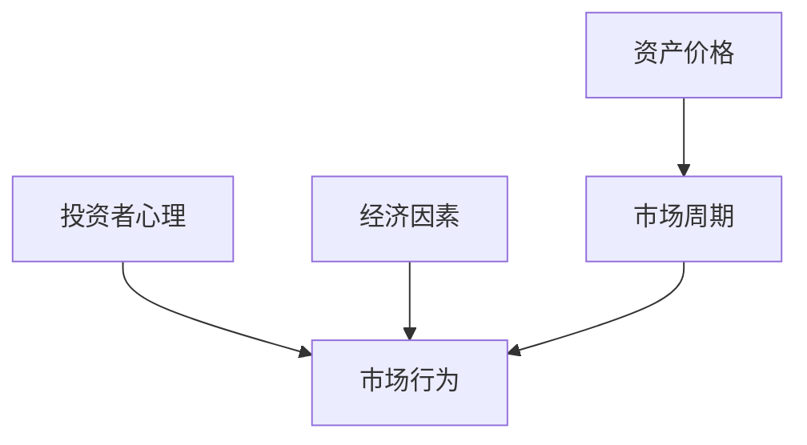
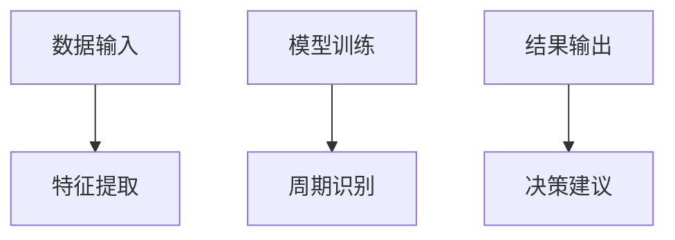
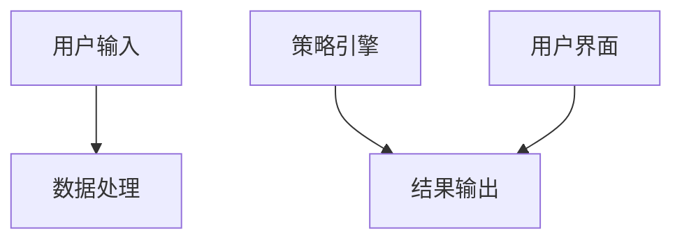

                 

<think>
好的，我将按照您的要求撰写一篇关于霍华德·马克斯的市场周期理论的技术博客文章。首先，我会先列出文章的关键词和摘要，然后按照您提供的目录结构逐步展开每一章的内容，确保每一部分都详细具体，并包含必要的技术术语和分析。

# 霍华德·马克斯的市场周期理论

## 关键词：
- 市场周期理论
- 价值投资
- 逆向思维
- 风险控制
- 市场周期阶段
- 投资策略

## 摘要：
霍华德·马克斯的市场周期理论是一种通过分析市场周期波动来指导投资决策的方法。本文将详细探讨该理论的核心概念，包括市场周期的阶段划分、投资者心理分析、价值与价格的关系，以及如何在不同市场周期阶段制定相应的投资策略。通过系统分析和实际案例，本文将揭示市场周期理论在投资实践中的应用价值。

---

## 第一部分：市场周期理论的背景与核心概念

### 第1章：市场周期理论的背景介绍

#### 1.1 问题背景与问题描述
- **投资市场的波动性与周期性**  
  投资市场本质上是一个充满不确定性和波动性的领域。资产价格的波动往往呈现出周期性特征，这些周期性变化与经济环境、投资者心理以及市场参与者的行为密切相关。

- **市场周期理论的必要性**  
  投资者在市场中常常面临“追涨杀跌”的行为偏差，容易在市场繁荣时过度乐观，在市场低迷时过于悲观。市场周期理论通过分析这些周期性变化，帮助投资者避免情绪化决策，制定更为理性的投资策略。

- **霍华德·马克斯的理论贡献**  
  霍华德·马克斯是价值投资领域的权威，他的市场周期理论强调在市场周期的转折点寻找投资机会，尤其是在市场处于“无人之地”时，即大多数投资者都忽视或放弃的时候，往往能够发现被低估的资产。

#### 1.2 问题解决与边界外延
- **市场周期理论的核心目标**  
  霍华德·马克斯的理论旨在帮助投资者识别市场周期的不同阶段，并在每个阶段采取相应的投资策略。例如，在市场繁荣阶段保持谨慎，在市场低迷阶段积极寻找低估资产。

- **理论的适用范围与边界**  
  该理论适用于长期投资策略的制定，但不适用于短期高频交易。它更多关注于资产的内在价值，而非市场的短期波动。

- **市场周期与经济周期的关系**  
  市场周期与经济周期密切相关，但并不完全一致。市场周期更多反映了投资者情绪和市场参与者的行为，而经济周期则更多受到实体经济因素的影响。

#### 1.3 市场周期理论的核心要素
- **市场参与者的心理变化**  
  投资者的心理变化是市场周期的核心驱动因素。例如，在市场繁荣阶段，投资者往往过于乐观，导致资产价格虚高；在市场低迷阶段，投资者往往过于悲观，导致资产价格被低估。

- **资产价格波动的规律**  
  资产价格的波动往往呈现出周期性特征，尤其是在市场周期的不同阶段，资产价格的变化趋势具有一定的规律性。

- **市场周期的阶段划分**  
  霍华德·马克斯将市场周期分为四个主要阶段：复苏、繁荣、衰退和萧条。

---

### 第2章：市场周期的核心概念与联系

#### 2.1 核心概念原理
- **市场周期的四个阶段**  
  1. **复苏阶段**：市场从低谷中逐渐恢复，投资者信心逐步回升，资产价格开始上涨。  
  2. **繁荣阶段**：市场参与者情绪高涨，资产价格快速上涨，但此时往往伴随着过度投机。  
  3. **衰退阶段**：市场参与者逐渐意识到资产价格的虚高，开始抛售资产，资产价格快速下跌。  
  4. **萧条阶段**：市场处于极度低迷状态，资产价格被严重低估，投资者信心降至最低点。

- **价值与价格的动态关系**  
  在市场周期的不同阶段，资产的内在价值与市场价格之间的关系会发生变化。例如，在繁荣阶段，市场价格往往高于内在价值；在萧条阶段，市场价格往往低于内在价值。

- **投资者心理与市场行为**  
  投资者的心理变化是驱动市场周期变化的核心因素。例如，贪婪和恐惧情绪在不同阶段的表现会导致市场参与者的行为发生变化。

#### 2.2 核心概念对比分析
- **不同市场周期阶段的特征对比（表格）**

| 阶段     | 投资者心理 | 资产价格 | 市场行为       |
|----------|------------|----------|----------------|
| 复苏     | 逐渐恢复   | 上涨     | 买入增加       |
| 繁荣     | 过度乐观   | 过高     | 抛售减少       |
| 衰退     | 焦虑       | 下跌     | 抛售增加       |
| 萧条     | 绝望       | 过低     | 无人问津       |

- **市场周期与经济周期的关系（表格）**

| 阶段     | 经济周期特征 | 市场周期特征         |
|----------|--------------|----------------------|
| 复苏     | 经济逐渐恢复 | 市场信心回升         |
| 繁荣     | 经济高速增长 | 市场投机活动增加     |
| 衰退     | 经济增速放缓 | 市场参与者情绪低落   |
| 萧条     | 经济衰退     | 市场信心崩溃         |

#### 2.3 实体关系架构


---

### 第3章：市场周期的分析方法与工具

#### 3.1 市场周期分析的算法原理
- **市场周期识别的算法流程**  
  1. 数据收集：收集历史资产价格数据。  
  2. 特征提取：提取资产价格的波动性、趋势性等特征。  
  3. 模型训练：使用聚类算法（如K-means）识别市场周期的不同阶段。  
  4. 周期预测：基于历史数据预测未来市场的周期阶段。

- **基于统计学的周期检测方法**  
  使用移动平均线、波动率等指标来识别市场周期的变化。

- **机器学习在周期预测中的应用**  
  通过训练机器学习模型，识别市场周期的转折点。

#### 3.2 算法流程图


#### 3.3 算法实现代码
```python
import numpy as np
from sklearn.cluster import KMeans

def detect_cycle(data):
    # 特征提取
    features = data['price'].values
    features = features.reshape(-1, 1)
    
    # 模型训练
    kmeans = KMeans(n_clusters=4, random_state=0)
    kmeans.fit(features)
    
    # 周期识别
    labels = kmeans.labels_
    return labels
```

---

### 第4章：市场周期的预测与投资策略

#### 4.1 预测市场周期转折点
- **预测方法**  
  使用技术分析和基本面分析结合的方法，识别市场周期的转折点。

#### 4.2 制定投资策略
- **在繁荣阶段**：保持谨慎，避免过度投资。  
- **在衰退阶段**：寻找被低估的资产进行投资。  
- **在萧条阶段**：积极买入，布局长期投资。  

#### 4.3 实际案例分析
- **案例1**：2008年金融危机后的市场周期分析与投资策略。  
- **案例2**：2020年新冠疫情对市场周期的影响及应对策略。

---

### 第5章：系统性风险与市场周期的关系

#### 5.1 系统性风险的识别与管理
- **系统性风险的来源**  
  包括经济衰退、政策变化、地缘政治等。

#### 5.2 市场周期中的风险管理策略
- **在繁荣阶段**：控制杠杆，分散投资。  
- **在萧条阶段**：增加防御性资产配置。

---

## 第六部分：项目实战——基于市场周期的策略交易系统

### 6.1 环境安装与数据准备
- **安装Python环境**  
  使用Anaconda或PyCharm等工具安装Python环境。  
- **数据准备**  
  下载历史资产价格数据，例如股票价格、指数价格等。

### 6.2 核心代码实现
```python
import pandas as pd
import numpy as np

def market_cycle_strategy(data, window=20):
    # 计算资产价格的移动平均线
    data['SMA'] = data['price'].rolling(window).mean()
    # 计算波动率
    data['Volatility'] = data['price'].rolling(window).std()
    # 判断市场周期阶段
    if data['price'] > data['SMA']:
        return '繁荣阶段'
    else:
        return '其他阶段'
```

### 6.3 系统架构设计


### 6.4 接口设计与交互流程


---

## 第七部分：最佳实践、小结与注意事项

### 7.1 最佳实践
- **持续学习市场周期理论**  
  市场周期理论是一个动态发展的领域，投资者需要不断学习新的理论和实践。

- **结合实际情况调整策略**  
  不同的市场环境可能需要不同的策略，投资者需要根据实际情况灵活调整。

### 7.2 小结
霍华德·马克斯的市场周期理论为投资者提供了一种系统性的分析框架，帮助投资者在不同市场周期阶段制定合理的投资策略。通过结合理论与实践，投资者可以在复杂多变的市场环境中做出更为理性的决策。

### 7.3 注意事项
- **避免过度依赖理论**  
  市场周期理论只是一个工具，投资者需要结合实际情况进行判断。  
- **保持风险意识**  
  在市场周期的不同阶段，投资者需要保持风险意识，避免盲目跟风。

---

## 作者：AI天才研究院/AI Genius Institute & 禅与计算机程序设计艺术 /Zen And The Art of Computer Programming

