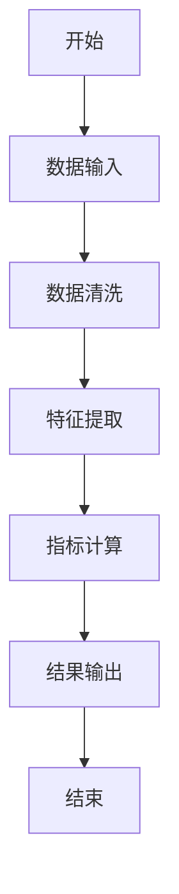
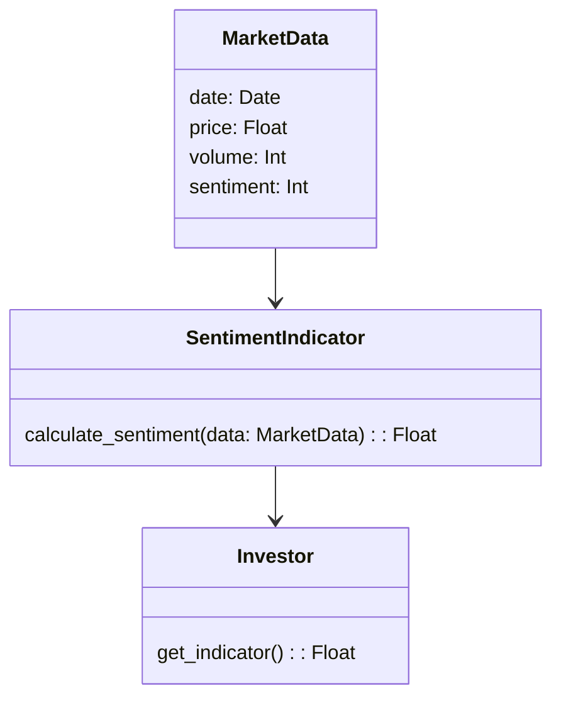
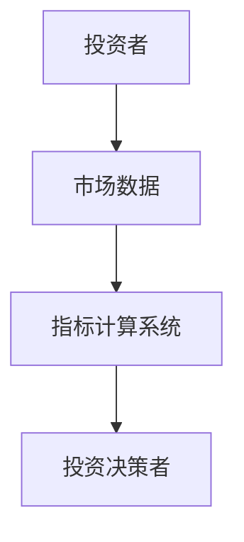

                 


# 霍华德·马克斯的市场情绪指标

> 关键词：霍华德·马克斯、市场情绪指标、投资策略、量化分析、行为金融学

> 摘要：本文深入探讨霍华德·马克斯的市场情绪指标，分析其背后的理论基础、算法原理、系统架构和实际应用。通过详细的数学公式、代码实现和案例分析，揭示该指标在投资决策中的价值和意义。

---

## 第1章: 霍华德·马克斯的投资理念与市场情绪指标背景

### 1.1 霍华德·马克斯的投资理念

霍华德·马克斯是全球著名的价值投资者和投资思想家。他以独特的投资理念闻名，强调安全边际、逆向投资和长期价值。马克斯认为，市场的波动性和投资者情绪是影响资产价格的重要因素。市场情绪的过度乐观或悲观往往会导致资产价格的偏离，从而为价值投资者提供机会。

#### 1.1.1 马克斯的价值投资哲学
马克斯的价值投资哲学强调以下几点：
- **安全边际**：买入价格低于内在价值的资产。
- **逆向投资**：在市场恐慌时寻找机会，在市场狂热时保持冷静。
- **margin of safety**：通过安全边际降低投资风险。

#### 1.1.2 马克斯对市场情绪的研究
马克斯认为，市场情绪是资产价格波动的核心驱动力。市场情绪的周期性波动可以通过量化指标来捕捉，从而为投资者提供决策依据。

#### 1.1.3 市场情绪指标的定义与目标
市场情绪指标是用来量化市场参与者的乐观或悲观程度的工具。其目标是通过指标的变化趋势，帮助投资者判断市场的整体情绪，从而优化投资决策。

---

### 1.2 市场情绪指标的背景与意义

#### 1.2.1 市场情绪的波动性与周期性
市场情绪具有明显的周期性波动。投资者情绪从乐观到悲观，再从悲观到乐观，形成了一个循环。这种周期性波动可以通过市场情绪指标来捕捉和分析。

#### 1.2.2 市场情绪对投资决策的影响
市场情绪的过度乐观会导致资产价格的高估，而过度悲观则会导致资产价格的低估。通过量化市场情绪，投资者可以更好地把握市场的波动周期，优化投资策略。

#### 1.2.3 霍华德·马克斯指标的核心价值
霍华德·马克斯的市场情绪指标通过量化分析，帮助投资者识别市场的过度乐观或悲观情绪，从而抓住投资机会或规避风险。

---

## 第2章: 霍华德·马克斯市场情绪指标的核心概念与联系

### 2.1 核心概念原理

#### 2.1.1 市场情绪的多维度分析
市场情绪可以从多个维度进行分析，包括投资者情绪、市场成交量、资产价格波动等。这些维度可以通过量化指标进行综合分析。

#### 2.1.2 霍华德·马克斯指标的构成要素
霍华德·马克斯的市场情绪指标通常包括以下几个要素：
- 市场成交量
- 资产价格波动率
- 投资者情绪指数
- 市场资金流入/流出

#### 2.1.3 指标与市场周期的关系
市场情绪指标的变化与市场周期密切相关。在市场顶部，指标通常会达到峰值；在市场底部，指标通常会达到谷值。

---

### 2.2 核心概念属性特征对比表格

| 属性 | 特征 |
|------|------|
| 数据来源 | 市场价格、成交量、投资者情绪 |
| 计算方法 | 综合指数法、加权平均法 |
| 应用场景 | 投资决策、风险管理、市场预测 |
| 优势 | 量化市场情绪，提供投资参考 |
| 局限性 | 受市场波动影响较大 |

---

### 2.3 ER实体关系图

```mermaid
er
  actor 投资者
  actor 市场数据
  actor 指标计算系统
  actor 投资决策者
  relation -> 关系：市场数据输入
  relation -> 关系：指标计算
  relation -> 关系：投资决策参考
```

---

## 第3章: 霍华德·马克斯市场情绪指标的算法原理

### 3.1 算法原理概述

#### 3.1.1 指标的计算流程
市场情绪指标的计算通常包括以下几个步骤：
1. 数据采集：收集市场相关数据，包括资产价格、成交量、投资者情绪等。
2. 数据预处理：清洗数据，去除异常值和缺失值。
3. 特征提取：从数据中提取有用的特征，如波动率、成交量等。
4. 指标计算：通过加权平均或综合指数法计算市场情绪指标。
5. 结果输出：将计算结果输出为可读的格式，供投资者参考。

#### 3.1.2 数据预处理方法
数据预处理是市场情绪指标计算的关键步骤。常用的方法包括：
- 去除缺失值
- 去除异常值
- 数据标准化

#### 3.1.3 综合指数的构建
综合指数是市场情绪指标的核心部分。其构建方法通常包括以下几个步骤：
1. 确定权重：根据各特征的重要性，确定各特征的权重。
2. 加权计算：将各特征按权重加权求和，得到综合指数。

---

### 3.2 算法流程图



---

### 3.3 算法实现代码

```python
import pandas as pd
import numpy as np

def market_sentiment_index(data):
    # 数据清洗
    cleaned_data = data.dropna()
    # 特征提取
    features = cleaned_data[['volume', 'price_change', 'investor_sentiment']]
    # 计算波动率
    volatility = features['price_change'].std()
    # 计算成交量
    volume = features['volume'].mean()
    # 计算投资者情绪
    sentiment = features['investor_sentiment'].mean()
    # 综合指数计算
    index = (volatility * 0.4) + (volume * 0.3) + (sentiment * 0.3)
    return index
```

---

## 第4章: 霍华德·马克斯市场情绪指标的系统分析

### 4.1 系统功能设计

#### 4.1.1 领域模型类图



---

### 4.2 系统架构设计



---

## 第5章: 霍华德·马克斯市场情绪指标的项目实战

### 5.1 环境安装

```bash
pip install pandas numpy matplotlib
```

---

### 5.2 核心代码实现

```python
import pandas as pd
import numpy as np
import matplotlib.pyplot as plt

def calculate_sentiment(data):
    # 计算波动率
    volatility = data['price'].std()
    # 计算成交量
    volume = data['volume'].mean()
    # 计算投资者情绪
    sentiment = (volatility * 0.4) + (volume * 0.3)
    return sentiment

# 生成模拟数据
data = {
    'date': pd.date_range('2023-01-01', '2023-12-31'),
    'price': np.random.normal(100, 10, len(data['date'])),
    'volume': np.random.randint(1000, 5000, len(data['date']))
}

df = pd.DataFrame(data)
sentiment = calculate_sentiment(df)

# 可视化
plt.figure(figsize=(10, 6))
plt.plot(df['date'], df['price'], label='Price')
plt.scatter(df['date'], [sentiment] * len(df['date']), color='red', label='Sentiment')
plt.xlabel('Date')
plt.ylabel('Value')
plt.title('Market Sentiment Analysis')
plt.legend()
plt.show()
```

---

### 5.3 案例分析

假设我们有一个股票的数据集，包括价格、成交量和投资者情绪。我们可以使用上述代码计算市场情绪指标，并绘制可视化图表。通过分析图表，我们可以判断市场情绪的变化趋势，并据此优化投资策略。

---

## 第6章: 霍华德·马克斯市场情绪指标的小结与展望

### 6.1 最佳实践 tips

- **定期更新数据**：市场情绪指标需要定期更新，以反映最新的市场情况。
- **结合其他指标**：市场情绪指标可以与其他指标结合使用，以提高预测的准确性。
- **注意数据质量**：数据的质量直接影响指标的准确性，因此需要确保数据的完整性和准确性。

---

## 附录

### 附录1: 术语表

- **市场情绪指标**：量化市场参与者的乐观或悲观程度的工具。
- **波动率**：资产价格的波动程度。
- **成交量**：市场的交易量。

### 附录2: 参考文献

1. 霍华德·马克斯：《投资的思维与决策》
2. 《行为金融学》
3. Python官方文档

---

作者：AI天才研究院/AI Genius Institute & 禅与计算机程序设计艺术 /Zen And The Art of Computer Programming

