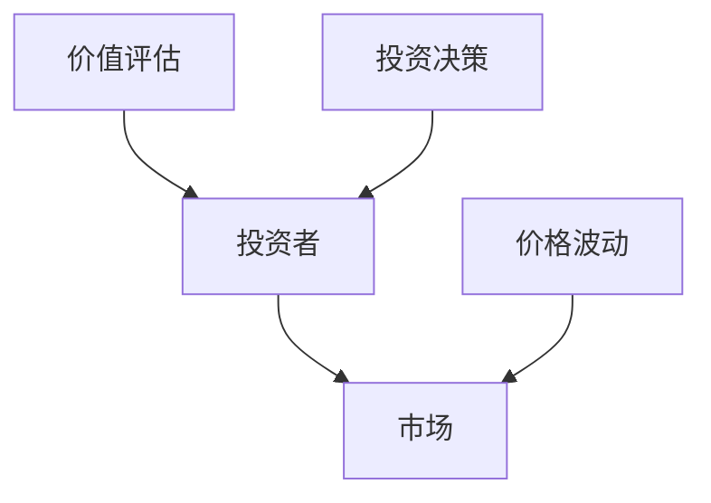
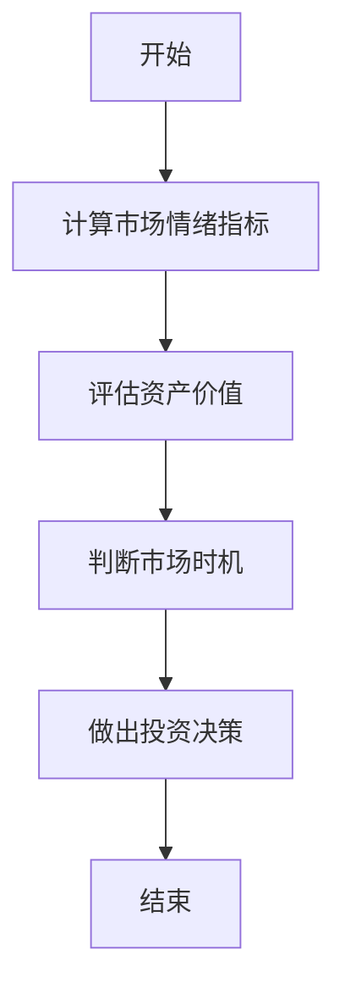
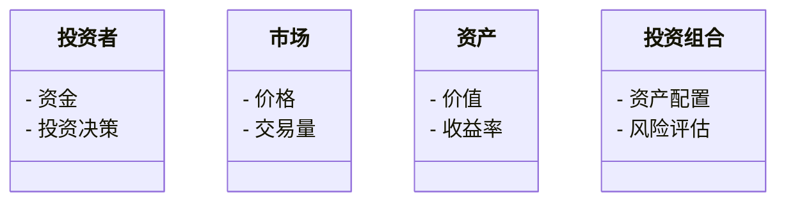
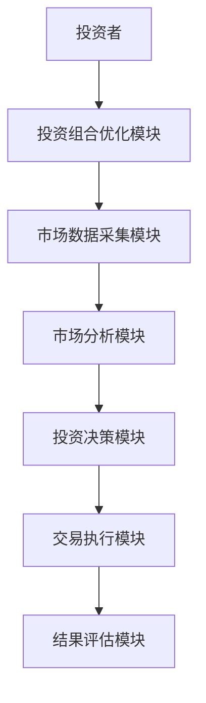
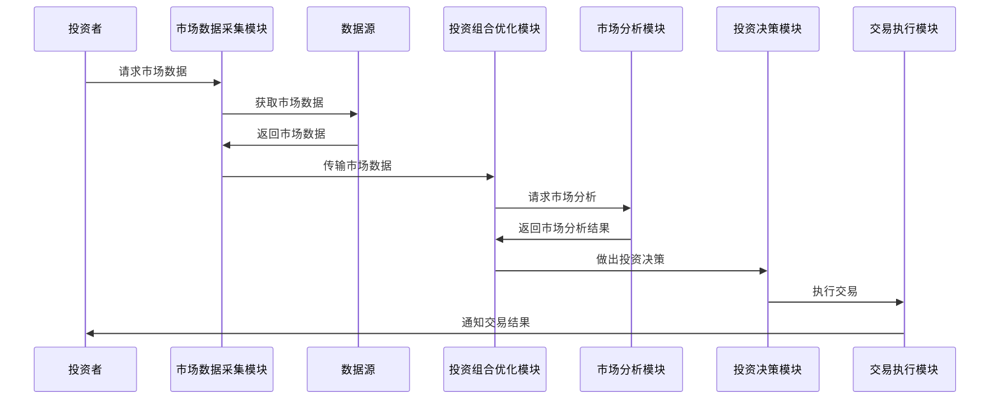

                 


# 霍华德·马克斯的逆向投资哲学

> 关键词：逆向投资，霍华德·马克斯，投资哲学，第二层思维，价值投资

> 摘要：霍华德·马克斯的逆向投资哲学是投资领域的重要理论，本文将从逆向投资的背景、核心概念、算法原理、数学模型、系统分析、项目实战以及最佳实践等方面进行详细阐述，帮助读者深入理解逆向投资的哲学与实践。

---

# 第一部分: 霍华德·马克斯的逆向投资哲学概述

## 第1章: 逆向投资的背景与核心概念

### 1.1 逆向投资的定义与背景

#### 1.1.1 投资市场的基本问题与挑战

- 投资市场的不确定性与波动性
- 投资者情绪的非理性
- 市场周期的波动规律

#### 1.1.2 逆向投资的起源与发展

- 逆向投资的起源
- 霍华德·马克斯的贡献
- 逆向投资的发展与应用

#### 1.1.3 霍华德·马克斯的影响力与贡献

- 马克斯的著作与思想
- 马克斯对投资领域的贡献
- 马克斯的逆向投资哲学的核心思想

### 1.2 霍华德·马克斯的投资哲学

#### 1.2.1 马克斯的投资理念概述

- 价值投资与逆向投资的区别与联系
- 马克斯的“第二层思维”
- 投资中的机会与风险

#### 1.2.2 逆向投资的核心思想

- 市场情绪与投资决策的关系
- 逆向投资的逻辑框架
- 逆向投资的核心原则

#### 1.2.3 马克斯的投资策略与实践

- 马克斯的三重过滤法
- 逆向投资的具体操作步骤
- 马克斯的投资案例分析

### 1.3 逆向投资的逻辑与框架

#### 1.3.1 市场情绪与投资决策的关系

- 市场情绪的波动规律
- 投资者心理与市场行为
- 市场情绪对投资决策的影响

#### 1.3.2 价值投资与逆向投资的区别与联系

- 价值投资的核心思想
- 逆向投资的独特视角
- 两者在实践中的结合

#### 1.3.3 逆向投资的逻辑框架与步骤

- 逆向投资的逻辑框架
- 投资决策的具体步骤
- 逆向投资的策略优化

---

## 第2章: 霍华德·马克斯的投资策略分析

### 2.1 马克斯的“第二层思维”

#### 2.1.1 第一层思维与第二层思维的定义

- 第一层思维的定义与特点
- 第二层思维的定义与特点
- 两者的区别与联系

#### 2.1.2 第二层思维在投资中的应用

- 第二层思维的核心思想
- 第二层思维的具体操作步骤
- 第二层思维的案例分析

#### 2.1.3 第二层思维的优缺点分析

- 第二层思维的优势
- 第二层思维的局限性
- 如何克服第二层思维的局限性

### 2.2 逆向投资的市场时机选择

#### 2.2.1 市场周期的波动规律

- 市场周期的定义与特点
- 市场周期的波动规律
- 市场周期对投资决策的影响

#### 2.2.2 估值与市场情绪的关系

- 估值的定义与计算方法
- 市场情绪的量化方法
- 估值与市场情绪的关系

#### 2.2.3 逆向投资的时机判断方法

- 逆向投资的时机选择原则
- 逆向投资的时机判断指标
- 逆向投资的时机判断案例分析

### 2.3 马克斯的“三重过滤法”

#### 2.3.1 过滤法的定义与步骤

- 过滤法的定义
- 过滤法的三个步骤
- 过滤法的具体操作方法

#### 2.3.2 过滤法在实际投资中的应用

- 过滤法的应用场景
- 过滤法的具体操作案例
- 过滤法的优缺点分析

#### 2.3.3 过滤法的优化与改进

- 如何优化过滤法
- 过滤法的改进方向
- 过滤法的未来发展趋势

---

## 第3章: 逆向投资的核心概念与联系

### 3.1 核心概念原理

#### 3.1.1 逆向投资的核心概念

- 逆向投资的定义与特点
- 逆向投资的核心思想
- 逆向投资的逻辑框架

#### 3.1.2 逆向投资的理论基础

- 逆向投资的理论基础
- 逆向投资的理论模型
- 逆向投资的理论发展

#### 3.1.3 逆向投资的实践应用

- 逆向投资的实践方法
- 逆向投资的实践案例
- 逆向投资的实践总结

### 3.2 核心概念属性对比表格

| 概念       | 逆向投资 | 价值投资 | 随机投资 |
|------------|----------|----------|----------|
| 投资理念   | 买入被低估的资产 | 买入具有内在价值的资产 | 随机选择资产 |
| 投资策略   | 逆市场趋势投资 | 以内在价值为导向投资 | 无特定策略 |
| 风险承受   | 高风险承受能力 | 中等风险承受能力 | 低风险承受能力 |

### 3.3 ER实体关系图（Mermaid流程图）



---

## 第4章: 逆向投资的算法原理与数学模型

### 4.1 算法原理

#### 4.1.1 基于均值回归的逆向投资算法

- 均值回归的定义与特点
- 逆向投资与均值回归的关系
- 均值回归算法在逆向投资中的应用

#### 4.1.2 市场情绪指标的量化方法

- 市场情绪指标的定义与特点
- 市场情绪指标的量化方法
- 市场情绪指标在逆向投资中的应用

#### 4.1.3 投资组合优化的数学模型

- 投资组合优化的定义与特点
- 投资组合优化的数学模型
- 投资组合优化在逆向投资中的应用

### 4.2 数学模型与公式

#### 4.2.1 均值回归模型

$$r_t = \alpha + \beta r_{t-1} + \epsilon_t$$

其中：
- \( r_t \) 是当前时刻的资产收益
- \( \alpha \) 是常数项
- \( \beta \) 是回归系数
- \( r_{t-1} \) 是前一时刻的资产收益
- \( \epsilon_t \) 是误差项

#### 4.2.2 投资组合优化公式

$$\min_{w} w^T \Sigma w$$

$$\text{s.t. } w^T \mu = \text{target return}$$

$$w^T 1 = 1$$

其中：
- \( w \) 是投资组合权重向量
- \( \Sigma \) 是资产收益的协方差矩阵
- \( \mu \) 是资产收益的均值向量
- \( \text{target return} \) 是目标收益率

### 4.3 算法流程图（Mermaid流程图）



---

## 第5章: 逆向投资的系统分析与架构设计

### 5.1 系统功能设计

#### 5.1.1 领域模型（Mermaid类图）



#### 5.1.2 系统架构设计（Mermaid架构图）



#### 5.1.3 系统接口设计

- 投资者接口：接收市场数据和投资组合建议
- 市场数据接口：采集市场数据并传输给系统
- 投资组合优化接口：根据市场数据优化投资组合
- 投资决策接口：根据优化结果做出投资决策

#### 5.1.4 系统交互流程图（Mermaid序列图）



---

## 第6章: 逆向投资的项目实战

### 6.1 环境安装

#### 6.1.1 系统环境要求

- 操作系统：Windows/Mac/Linux
- 开发工具：Python/Java/C++
- 数据库：MySQL/PostgreSQL
- 开发框架：Django/Flask
- 依赖库：numpy, pandas, matplotlib

#### 6.1.2 数据采集工具安装

- 数据采集工具：BeautifulSoup, requests, Selenium
- 数据存储工具：Pandas, SQLite
- 数据分析工具：NumPy, Matplotlib

#### 6.1.3 算法库安装

- Python的scikit-learn
- TensorFlow/Keras（可选）
- PyTorch（可选）

### 6.2 系统核心实现源代码

#### 6.2.1 投资组合优化算法实现

```python
import numpy as np
from sklearn.linear_model import LinearRegression

# 数据准备
X = np.array([1, 2, 3, 4, 5]).reshape(-1, 1)
y = np.array([2, 4, 6, 8, 10])

# 建立模型
model = LinearRegression()
model.fit(X, y)

# 预测
print(model.predict([[6]]))
```

#### 6.2.2 市场情绪指标量化实现

```python
import pandas as pd
import matplotlib.pyplot as plt

# 数据准备
df = pd.read_csv('market_data.csv')
df['SMA_20'] = df['Close'].rolling(20).mean()
df['SMA_50'] = df['Close'].rolling(50).mean()

# 绘制图表
plt.plot(df['Date'], df['Close'], label='Close')
plt.plot(df['Date'], df['SMA_20'], label='SMA_20')
plt.plot(df['Date'], df['SMA_50'], label='SMA_50')
plt.legend()
plt.show()
```

### 6.3 实际案例分析

#### 6.3.1 案例背景

- 案例名称：2008年金融危机期间的逆向投资
- 案例描述：投资者在市场低谷时买入被低估的资产
- 案例分析：市场情绪、资产估值、投资策略

#### 6.3.2 投资组合优化

- 投资组合构造步骤
- 投资组合优化过程
- 投资组合结果分析

#### 6.3.3 投资策略实施

- 投资策略的具体实施步骤
- 投资策略的执行结果
- 投资策略的优化与调整

### 6.4 项目小结

#### 6.4.1 项目总结

- 项目目标的实现情况
- 项目成果与不足
- 项目经验与教训

#### 6.4.2 项目优化方向

- 系统功能的优化
- 算法的改进与创新
- 项目的拓展与延伸

---

## 第7章: 逆向投资的最佳实践

### 7.1 小结

#### 7.1.1 核心思想回顾

- 逆向投资的核心思想
- 霍华德·马克斯的投资哲学
- 逆向投资的实践方法

#### 7.1.2 投资策略总结

- 逆向投资的策略总结
- 逆向投资的实践经验
- 逆向投资的未来发展趋势

### 7.2 注意事项

#### 7.2.1 投资者注意事项

- 风险控制的重要性
- 资产配置的合理性
- 投资决策的科学性

#### 7.2.2 系统设计中的注意事项

- 系统架构的合理性
- 算法模型的准确性
- 数据处理的规范性

#### 7.2.3 项目实施中的注意事项

- 项目计划的合理性
- 资源分配的科学性
- 项目管理的有效性

### 7.3 拓展阅读

#### 7.3.1 相关书籍推荐

- 《投资最重要的事》——霍华德·马克斯
- 《证券分析》——本杰明·格雷厄姆
- 《漫步华尔街》——彼得·林奇

#### 7.3.2 相关文章推荐

- 逆向投资的最新研究
- 投资哲学的最新发展
- 逆向投资的未来趋势

#### 7.3.3 相关视频推荐

- 霍华德·马克斯的演讲视频
- 逆向投资的实践案例分析
- 投资哲学的深度解读

---

## 作者：AI天才研究院/AI Genius Institute & 禅与计算机程序设计艺术/Zen And The Art of Computer Programming

