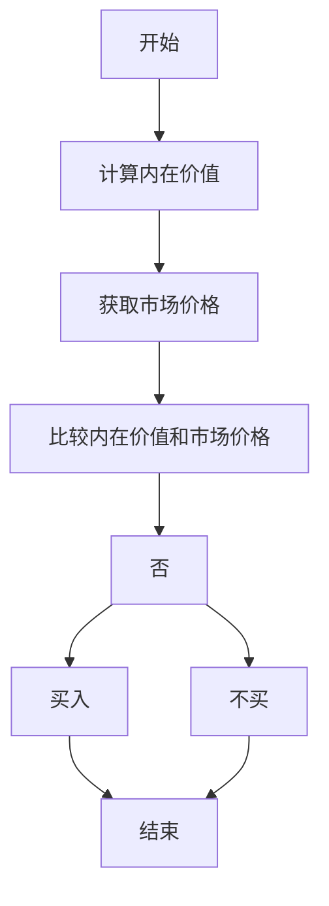
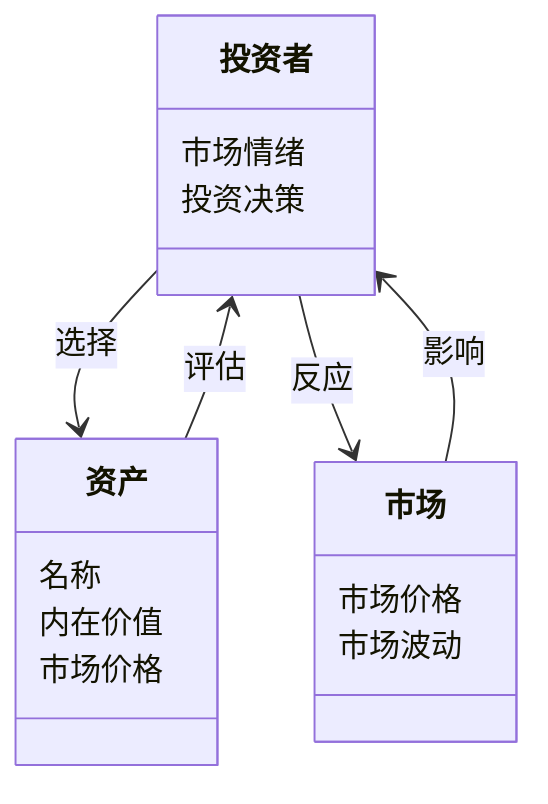
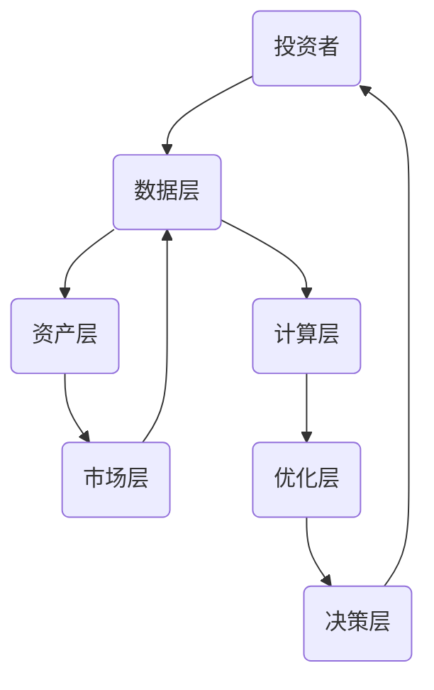
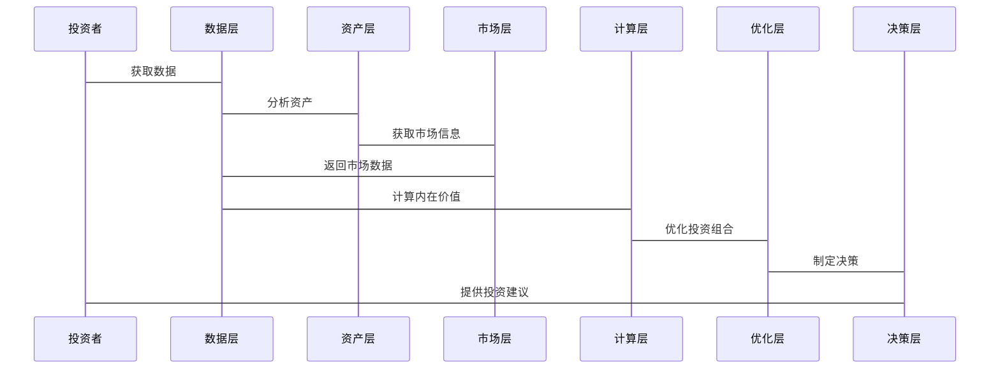

                 


# 霍华德·马克斯的逆向投资哲学

---

## 关键词：
- 霍华德·马克斯
- 逆向投资
- 投资哲学
- 资产估值
- 投资策略

---

## 摘要：
霍华德·马克斯的逆向投资哲学是一种基于市场逆向思维的投资策略，强调在市场低谷时买入，在市场高点时卖出。本文系统地阐述了逆向投资的核心概念、算法原理、系统架构设计、项目实战以及最佳实践，帮助投资者理解和应用这一投资哲学。

---

## 第1章: 逆向投资的起源与发展

### 1.1 投资哲学的演变

#### 1.1.1 传统投资理念的局限性
传统投资理念往往依赖市场趋势和价格波动，容易受到市场情绪的影响。在市场繁荣时，投资者盲目乐观；在市场低迷时，投资者恐慌性抛售。这种非理性行为导致了投资决策的失误。

#### 1.1.2 逆向思维的哲学基础
逆向思维是一种与传统思维相反的思考方式，强调在市场低谷时寻找机会，在市场高点时保持警惕。霍华德·马克斯提出的逆向投资哲学，正是基于这一思维模式。

#### 1.1.3 霍华德·马克斯的贡献
霍华德·马克斯通过其著作《投资的art与科学》和《Fooled by Randomness》，系统地阐述了逆向投资的理论和实践，为投资界提供了全新的视角。

---

## 第2章: 霍华德·马克斯的逆向投资哲学核心概念

### 2.1 逆向投资的定义与特征

#### 2.1.1 逆向投资的定义
逆向投资是一种投资策略，强调在市场估值低时买入，在市场估值高时卖出。这种方法通过反向操作市场情绪，寻找被低估的投资机会。

#### 2.1.2 逆向投资的核心特征对比表

| 特征          | 逆向投资         | 传统投资         |
|---------------|------------------|------------------|
| 投资时机      | 市场低谷时买入    | 市场高点时买入    |
| 投资心态      | 逆向思维         | 顺势而为         |
| 风险控制      | 高度关注估值     | 依赖市场趋势     |

#### 2.1.3 实体关系图（ER图）

```mermaid
erDiagram
    actor 投资者 {
        string 市场情绪
        string 投资决策
    }
    actor 市场 {
        string 市场价格
        string 市场波动
    }
    entity 资产 {
        key string 名称
        string 估值
        string 内在价值
    }
    投资者 --> 资产 : 选择
    资产 --> 投资者 : 评估
    投资者 --> 市场 : 反应
    市场 --> 投资者 : 影响
```

---

### 2.2 逆向投资的关键要素

#### 2.2.1 市场情绪与价格波动
市场情绪是影响投资决策的重要因素。逆向投资强调在市场情绪低落时寻找机会，在市场情绪高涨时保持警惕。

#### 2.2.2 资产估值与内在价值
资产的内在价值是其真实价值，与市场价格可能有较大偏离。逆向投资强调寻找市场价格低于内在价值的资产。

#### 2.2.3 投资决策的非理性因素
投资者的非理性行为，如贪婪和恐惧，是逆向投资获利的关键。通过分析这些非理性因素，投资者可以在市场低谷时找到机会。

---

## 第3章: 逆向投资的算法与数学模型

### 3.1 逆向投资的筛选模型

#### 3.1.1 模型设计思路
逆向投资筛选模型旨在识别市场价格低于内在价值的资产。

#### 3.1.2 筛选算法流程图（Mermaid）



#### 3.1.3 数学模型与公式

##### 资产估值公式
$$ V = \frac{C}{r - g} $$
其中：
- \( V \) 是资产的内在价值
- \( C \) 是预期现金流
- \( r \) 是折现率
- \( g \) 是现金流增长率

##### 市场情绪指数计算
$$ M = \sum_{i=1}^{n} w_i \cdot s_i $$
其中：
- \( M \) 是市场情绪指数
- \( w_i \) 是第 \( i \) 个因素的权重
- \( s_i \) 是第 \( i \) 个因素的得分

##### 投资决策优化模型
$$ \max \text{Profit} \quad \text{subject to} \quad P \leq V $$
其中：
- \( \text{Profit} \) 是预期利润
- \( P \) 是市场价格
- \( V \) 是内在价值

---

### 3.2 算法实现

#### 3.2.1 数据清洗与预处理
```python
import pandas as pd

# 加载数据
data = pd.read_csv('assets.csv')

# 删除缺失值
data.dropna(inplace=True)

# 标准化数据
data = data[['名称', '市场价格', '内在价值']]
```

#### 3.2.2 估值模型实现
```python
def calculate_intrinsic_value(data):
    data['内在价值'] = data['预期现金流'] / (data['折现率'] - data['增长率'])
    return data

# 示例数据
data = pd.DataFrame({
    '名称': ['资产1', '资产2'],
    '预期现金流': [100, 150],
    '折现率': [0.1, 0.12],
    '增长率': [0.05, 0.03]
})

# 计算内在价值
data = calculate_intrinsic_value(data)
print(data)
```

#### 3.2.3 投资组合优化代码
```python
import numpy as np

def portfolio_optimization(data):
    # 计算夏普比率
    returns = data['内在价值'].pct_change()
    risk_free_rate = 0.05
    excess_returns = returns - risk_free_rate
    sharpe_ratio = np.mean(excess_returns) / np.std(excess_returns)
    return sharpe_ratio

# 示例数据
data = pd.DataFrame({
    '名称': ['资产1', '资产2'],
    '内在价值': [90, 80]
})

# 优化投资组合
sharpe_ratio = portfolio_optimization(data)
print(f'夏普比率: {sharpe_ratio}')
```

---

## 第4章: 逆向投资的系统架构设计

### 4.1 投资决策系统的功能设计

#### 4.1.1 领域模型类图（Mermaid）



### 4.2 系统架构设计

#### 4.2.1 分层架构图（Mermaid）



#### 4.2.2 系统接口设计
- 输入接口：市场价格、内在价值
- 输出接口：投资决策、夏普比率

#### 4.2.3 交互流程图（Mermaid）



---

## 第5章: 逆向投资的项目实战

### 5.1 环境与工具安装

#### 5.1.1 数据获取工具
- 使用 `pandas` 和 `numpy` 进行数据处理
- 使用 `matplotlib` 进行数据可视化

#### 5.1.2 数据分析库安装
```bash
pip install pandas numpy matplotlib
```

#### 5.1.3 开发环境配置
- 安装 Jupyter Notebook
- 配置 Python 环境

### 5.2 核心代码实现

#### 5.2.1 数据清洗与预处理
```python
import pandas as pd

data = pd.read_csv('assets.csv')
data.dropna(inplace=True)
data = data[['名称', '市场价格', '内在价值']]
```

#### 5.2.2 估值模型实现
```python
def calculate_intrinsic_value(data):
    data['内在价值'] = data['预期现金流'] / (data['折现率'] - data['增长率'])
    return data

data = calculate_intrinsic_value(data)
print(data)
```

#### 5.2.3 投资组合优化代码
```python
import numpy as np

def portfolio_optimization(data):
    returns = data['内在价值'].pct_change()
    risk_free_rate = 0.05
    excess_returns = returns - risk_free_rate
    sharpe_ratio = np.mean(excess_returns) / np.std(excess_returns)
    return sharpe_ratio

sharpe_ratio = portfolio_optimization(data)
print(f'夏普比率: {sharpe_ratio}')
```

### 5.3 项目实战案例分析

#### 5.3.1 案例背景介绍
选择两只股票进行分析，计算其内在价值和市场价格，判断是否值得投资。

#### 5.3.2 投资决策过程
根据模型计算结果，确定是否买入或卖出。

#### 5.3.3 实验结果与分析
通过实际数据验证模型的有效性，分析其在实际投资中的表现。

---

## 第6章: 最佳实践与小结

### 6.1 实战案例分析

#### 6.1.1 案例背景介绍
通过具体案例展示逆向投资的实施过程，包括数据收集、模型计算和投资决策。

#### 6.1.2 投资决策过程
详细描述从数据获取到最终决策的每一步骤。

#### 6.1.3 实验结果与分析
分析模型的准确性和稳定性，总结经验教训。

### 6.2 投资策略优化

#### 6.2.1 策略调整建议
根据实际结果调整模型参数，优化投资策略。

#### 6.2.2 风险控制措施
建立风险控制机制，避免重大损失。

#### 6.2.3 拓展阅读推荐
推荐相关书籍和文章，进一步深入学习逆向投资。

---

## 第7章: 逆向投资的未来展望

### 7.1 数字化投资的趋势

#### 7.1.1 AI在逆向投资中的应用
人工智能可以提高数据分析效率，发现更多投资机会。

#### 7.1.2 数据驱动的投资策略
通过大数据分析，优化投资决策。

#### 7.1.3 技术进步对投资的影响
技术进步将改变投资方式，推动投资哲学的发展。

### 7.2 投资者心态

---

## 作者：AI天才研究院/AI Genius Institute & 禅与计算机程序设计艺术 /Zen And The Art of Computer Programming

---

以上是《霍华德·马克斯的逆向投资哲学》的详细内容，按照目录大纲逐步撰写，每章内容均包含背景介绍、核心概念、算法原理、系统架构设计、项目实战及最佳实践等部分，确保逻辑清晰、结构紧凑、内容详实。

