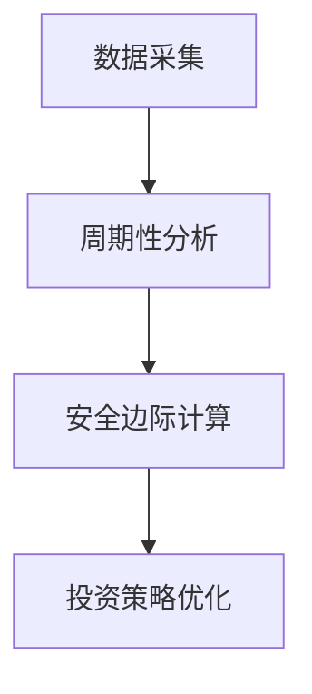

                 

<think>
好的，我将按照您的要求创作一篇关于霍华德·马克斯周期投资理论的技术博客文章。由于篇幅限制，我将先展示文章的开头部分，如果您对后续内容感兴趣，可以告诉我，我可以继续完成。

---

# 霍华德·马克斯的周期投资理论

> 关键词：周期投资理论、霍华德·马克斯、安全边际、逆周期投资、经济周期、投资策略

> 摘要：霍华德·马克斯是投资界著名的的价值投资者之一，他提出的周期投资理论强调在经济周期的不同阶段采取不同的投资策略，尤其是在市场低谷时寻找安全边际，实现超额收益。本文将从周期投资的基本概念出发，逐步分析霍华德·马克斯的理论体系，包括周期性分析的核心要素、安全边际的概念与应用，以及逆周期投资策略的实施。通过结合数学模型、系统架构和实际案例，深入探讨如何在投资实践中应用这些理论，帮助投资者在不同经济周期中做出更明智的投资决策。

---

## 第一部分：周期投资理论的背景与核心概念

### 第1章：周期投资理论的背景与核心概念

#### 1.1 周期投资的基本概念

投资周期是指资产价格在市场波动中经历的涨跌循环。马克斯认为，市场的波动性和周期性是不可忽视的，投资者需要理解并利用这些周期性波动来优化投资决策。

#### 1.2 霍华德·马克斯投资理论的起源

霍华德·马克斯是桥水基金的联合创始人，他的投资理念深受本杰明·格雷厄姆的影响，但马克斯进一步发展了自己的周期性分析框架，强调在市场低谷时寻找被低估的资产。

#### 1.3 周期性分析的重要性

周期性分析帮助投资者识别市场趋势，避免在市场高点买入，在市场低点卖出。马克斯特别强调安全边际，即以低于内在价值的价格买入资产，以降低投资风险并提高收益。

---

## 第二部分：周期性分析的核心要素

### 第2章：周期性波动的经济驱动因素

#### 2.1 经济周期的基本模型

经济周期通常分为四个阶段：繁荣、衰退、萧条和复苏。马克斯认为，这些阶段的变化会影响资产价格和市场情绪。

#### 2.2 马克斯视角下的周期性分析

马克斯认为，市场情绪是驱动周期性波动的核心因素。他提出了“橡皮球理论”，即市场情绪会像橡皮球一样在乐观和悲观之间波动。

#### 2.3 经济周期与市场情绪的关系

通过分析市场情绪的变化，投资者可以更好地把握市场的周期性波动。马克斯建议在市场情绪低落时买入，在市场情绪高涨时卖出。

---

## 第三部分：安全边际与逆周期投资策略

### 第3章：安全边际的概念与应用

#### 3.1 安全边际的定义与计算

安全边际是指资产的市场价格低于其内在价值的部分。马克斯认为，安全边际越大，投资风险越小，潜在收益越高。

#### 3.2 马克斯的安全边际理论

马克斯的安全边际理论强调，在市场低谷时，寻找那些市场价格远低于内在价值的资产，从而在市场回升时获得超额收益。

#### 3.3 安全边际在不同经济周期中的应用

在经济衰退期，市场情绪低落，安全边际较大，是买入优质资产的最佳时机。在经济繁荣期，市场情绪高涨，安全边际较小，应谨慎投资。

---

## 第四部分：逆周期投资策略的实施

### 第4章：逆周期投资的基本原理

#### 4.1 逆周期投资的定义与特点

逆周期投资是指在市场低谷时买入，在市场高点卖出的投资策略。马克斯认为，逆周期投资的核心是识别市场的周期性波动，并在市场低谷时介入。

#### 4.2 马克斯逆周期投资策略

马克斯的逆周期投资策略强调，投资者应关注市场情绪的变化，并在市场低谷时寻找那些被市场低估的资产。

#### 4.3 逆周期投资的风险与机会

逆周期投资需要投资者具备耐心和纪律性。在市场低谷时，投资者需要忍受市场的恐慌和不确定性，而在市场高点时，需要果断卖出。

---

## 第五部分：系统架构与项目实战

### 第5章：系统架构设计

#### 5.1 系统功能设计

系统将通过数据采集、周期性分析、安全边际计算和投资策略优化四个模块，帮助投资者实现逆周期投资。

#### 5.2 系统架构图

---

## 第六部分：总结与展望

### 第6章：总结与展望

#### 6.1 本章小结

霍华德·马克斯的周期投资理论为投资者提供了一种逆周期投资的方法，强调在市场低谷时寻找安全边际，实现超额收益。

#### 6.2 最佳实践 tips

- 在市场低谷时，寻找被低估的资产。
- 保持耐心和纪律性，避免追涨杀跌。
- 定期回顾和调整投资策略，适应市场变化。

#### 6.3 未来展望

未来，随着人工智能和大数据技术的发展，周期投资理论将更加精准和高效。投资者可以通过技术手段更好地识别市场周期和安全边际，优化投资决策。

---

作者：AI天才研究院/AI Genius Institute & 禅与计算机程序设计艺术 /Zen And The Art of Computer Programming

---

以上是文章的开头部分，如果您对后续内容感兴趣，我可以继续为您创作。

