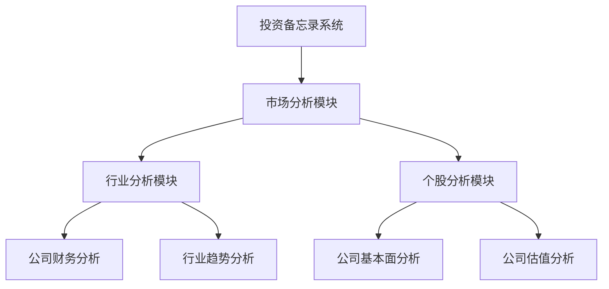
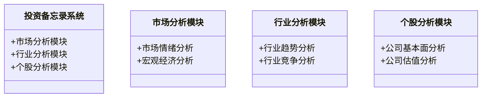
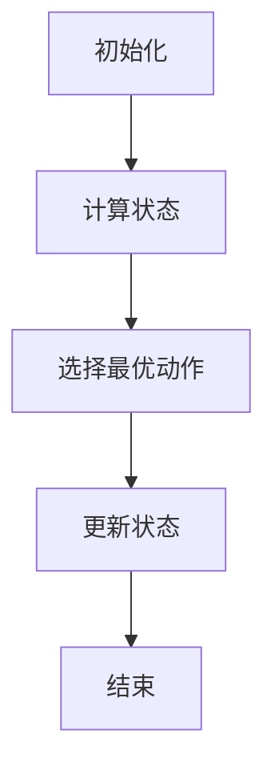

                 


# 霍华德马克斯的投资备忘录启示

## 关键词
霍华德·马克斯, 投资备忘录, 价值投资, 投资哲学, 风险管理, 投资策略, 股票分析

## 摘要
本文通过深入分析霍华德·马克斯的投资备忘录，揭示其投资哲学的核心思想、策略和方法。结合技术语言和实际案例，探讨投资备忘录的系统架构、算法原理、项目实战及现代投资环境下的启示。文章结构清晰，逻辑严谨，旨在为投资者提供有价值的参考和启示。

---

## 第一部分: 霍华德马克斯投资备忘录的背景与核心理念

### 第1章: 霍华德马克斯投资备忘录的背景介绍

#### 1.1 霍华德马克斯及其投资哲学
霍华德·马克斯是全球著名投资家，橡树资本的创始人。他的投资哲学以“逆向投资”和“价值投资”为核心，强调在市场低谷时寻找被低估的投资标的。马克斯的投资备忘录是他对投资市场的深刻洞察和实践总结，为全球投资者提供了宝贵的参考。

#### 1.2 马克斯投资哲学的核心理念
- **价值投资**：寻找市场价格低于内在价值的标的。
- **逆向思维**：在市场恐慌时寻找机会，在市场狂热时保持冷静。
- **风险管理**：将本金安全放在首位，避免永久性损失。

#### 1.3 马克斯投资备忘录的历史与影响
马克斯的投资备忘录始于1991年，至今仍在定期发布。这些备忘录不仅是橡树资本的投资指南，也成为了全球投资者学习投资哲学的重要资料。

---

### 第2章: 投资备忘录的核心概念与背景分析

#### 2.1 投资备忘录的定义与特点
- **定义**：投资备忘录是投资者记录投资思路、分析和决策的文档，通常包括市场分析、个股分析、投资策略等内容。
- **特点**：
  - 系统性：涵盖市场、行业、公司等多个维度的分析。
  - 实用性：结合实际案例，提供可操作的策略。
  - 深入性：分析不仅停留在表面，而是深入挖掘标的的核心价值。

#### 2.2 霍华德马克斯投资备忘录的背景分析
- **问题背景**：市场波动、信息不对称、投资者情绪化等问题。
- **解决思路**：通过深度分析和逆向思维，寻找投资机会。

---

## 第二部分: 投资备忘录的核心概念与系统分析

### 第3章: 投资备忘录的核心概念与联系

#### 3.1 核心概念原理
- **价值评估**：通过DCF模型、PE、PB等指标评估标的的内在价值。
- **市场情绪分析**：通过分析市场情绪，判断标的的买卖时机。
- **风险控制**：通过组合投资和止损策略，降低投资风险。

#### 3.2 核心概念属性特征对比
| 概念       | 特性             |
|------------|-----------------|
| 价值评估   | 客观性、准确性   |
| 市场情绪分析 | 主观性、动态性   |
| 风险控制   | 系统性、可操作性 |

#### 3.3 系统架构设计


---

### 第4章: 投资备忘录的系统分析与架构设计方案

#### 4.1 问题场景介绍
- **项目介绍**：基于马克斯的投资哲学，构建一个投资备忘录系统。
- **系统边界**：系统仅关注投资分析，不涉及交易执行。

#### 4.2 系统功能设计


---

## 第三部分: 投资备忘录的算法原理

### 第5章: 投资备忘录的算法原理

#### 5.1 算法原理概述
- **动态规划**：用于优化投资组合配置。
- **聚类分析**：用于市场情绪分类。

#### 5.2 算法实现


#### 5.3 数学模型
投资组合优化的数学模型：
$$\text{目标函数：最大化收益} \quad \sum_{i=1}^{n} w_i r_i$$
$$\text{约束条件：} \quad \sum_{i=1}^{n} w_i = 1, \quad w_i \geq 0$$

---

## 第四部分: 投资备忘录的项目实战

### 第6章: 投资备忘录的项目实战

#### 6.1 环境安装
- **工具**：Python、Pandas、Matplotlib。
- **数据源**：Yahoo Finance API。

#### 6.2 核心实现
```python
import pandas as pd
import matplotlib.pyplot as plt

# 示例代码：计算股票的PE值
def calculate_pe(stock_data, eps_data):
    pe_ratio = stock_data['Close'] / eps_data['EPS']
    return pe_ratio

# 数据加载
stock_data = pd.read_csv('stock.csv')
eps_data = pd.read_csv('eps.csv')

# 计算PE值
pe_ratio = calculate_pe(stock_data, eps_data)
pe_ratio.plot(kind='bar')
plt.show()
```

#### 6.3 案例分析
- **案例**：分析某公司PE、PB、ROE等指标，判断其是否被低估。

---

## 第五部分: 投资备忘录的投资哲学启示

### 第7章: 投资备忘录的投资哲学启示

#### 7.1 投资哲学总结
- **价值投资**：寻找被低估的标的。
- **逆向思维**：在市场恐慌时寻找机会。
- **风险管理**：避免永久性损失。

#### 7.2 现代投资环境的启示
- **技术进步**：大数据和人工智能为投资分析提供了新工具。
- **全球化**：投资者需要关注全球市场。

---

## 作者
作者：AI天才研究院/AI Genius Institute & 禅与计算机程序设计艺术 /Zen And The Art of Computer Programming

