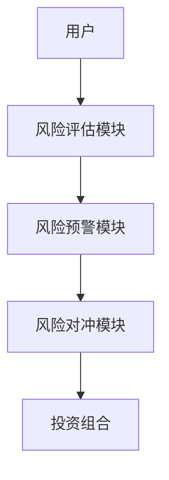

                 


# 霍华德马克斯的风险控制策略

## 关键词：
- 风险控制
- 投资策略
- 霍华德·马克斯
- 安全边际
- 风险管理

## 摘要：
霍华德·马克斯是全球著名的价值投资者和风险控制大师，他的投资理念和风险控制策略对全球投资界产生了深远影响。本文将深入探讨霍华德·马克斯的风险控制策略，从理论基础、数学模型、算法实现到实际应用，全面解析其风险控制方法，并结合具体案例进行详细分析。文章还提供了系统架构设计、代码实现和最佳实践建议，帮助读者全面理解和掌握霍华德·马克斯的风险控制策略。

---

# 第一部分: 霍华德·马克斯风险控制策略的背景与核心概念

## 第1章: 风险控制的基本概念

### 1.1 风险的定义与特征

#### 1.1.1 风险的定义
风险是指在投资活动中，由于不确定因素的存在，导致投资收益与预期收益之间产生偏差的可能性。简单来说，风险是未来收益的不确定性。

#### 1.1.2 风险的分类与特征
风险可以分为系统性风险和非系统性风险：
- **系统性风险**：影响整个市场的风险，如经济衰退、战争、政策变化等。
- **非系统性风险**：影响单个资产或小部分资产的风险，如公司特定事件、管理问题等。

风险的特征包括：
1. **可测量性**：可以通过统计方法量化。
2. **可分散性**：通过分散投资可以降低非系统性风险。
3. **可预测性**：部分风险可以通过历史数据和模型进行预测。

#### 1.1.3 风险与收益的关系
风险与收益之间存在正相关关系。通常情况下，高风险资产可能带来高收益，但也可能带来更大的损失。投资者需要在风险和收益之间找到平衡点。

---

### 1.2 霍华德·马克斯的背景与投资理念

#### 1.2.1 霍华德·马克斯的生平简介
霍华德·马克斯（Howard Marks）是美国著名投资家，橡树资本（Oaktree Capital）的联合创始人和董事长。他以价值投资和风险控制著称，被誉为“债券之王”。

#### 1.2.2 马克斯的价值投资理念
马克斯的投资理念基于以下几点：
1. **寻找被低估的资产**：通过深入分析，寻找市场价格低于内在价值的资产。
2. **注重安全边际**：在投资决策中，强调安全边际的重要性，即市场价格与内在价值之间的差距。
3. **长期投资**：避免短期波动的干扰，注重长期价值的实现。

#### 1.2.3 马克斯的风险控制思想
马克斯认为，风险控制是投资成功的关键。他强调：
1. **分散投资**：通过分散投资降低非系统性风险。
2. **严格的风险评估**：在投资前，对风险进行充分评估，确保投资的安全性。
3. **动态调整**：根据市场变化和资产状况，动态调整投资组合。

---

### 1.3 风险控制的核心要素

#### 1.3.1 风险控制的目标与原则
- **目标**：确保投资组合的稳健性，避免重大损失。
- **原则**：分散风险、严格评估、动态调整。

#### 1.3.2 风险控制的工具与方法
- **工具**：风险评估模型、对冲工具（如期货、期权）。
- **方法**：定量分析与定性分析相结合，定期审查和调整。

---

# 第二部分: 风险控制的数学模型与算法原理

## 第4章: 风险评估的数学模型

### 4.1 风险评估的基本模型

#### 4.1.1 风险-收益模型
风险-收益模型通过分析资产的期望收益和标准差（即风险）来评估其风险收益比。公式如下：

$$ E(r) = \mu $$
$$ \sigma = \sqrt{E[(r - \mu)^2]} $$

其中：
- $E(r)$ 是期望收益。
- $\mu$ 是资产的平均收益。
- $\sigma$ 是收益的标准差，表示收益的波动性。

#### 4.1.2 马科维茨的有效组合模型
马科维茨的有效组合模型通过优化投资组合的收益和风险，找到最优风险-收益平衡点。公式如下：

$$ \text{Minimize } \sigma^2 \text{ subject to } E(r) \geq \text{目标收益} $$

#### 4.1.3 CAPM模型
CAPM（资本资产定价模型）用于评估资产的期望收益：

$$ E(r_i) = r_f + \beta_i (E(r_m) - r_f) $$

其中：
- $r_f$ 是无风险利率。
- $\beta_i$ 是资产的贝塔系数（衡量系统性风险）。
- $E(r_m) - r_f$ 是市场风险溢价。

---

### 4.2 马克斯风格的风险评估方法

#### 4.2.1 安全边际的定义
安全边际是指市场价格与内在价值之间的差距。公式如下：

$$ \text{安全边际} = \text{内在价值} - \text{市场价格} $$

#### 4.2.2 安全边际的计算方法
假设某资产的内在价值为$V$，市场价格为$P$，则安全边际为$V - P$。安全边际越大，投资的安全性越高。

#### 4.2.3 安全边际的应用场景
- 在市场低迷时，寻找安全边际大的资产。
- 在市场繁荣时，避免安全边际过低的资产。

---

## 第5章: 风险控制的算法实现

### 5.1 风险评估算法

#### 5.1.1 基于马科维茨模型的组合优化算法
以下是一个简单的Python代码示例，用于实现马科维茨模型：

```python
import numpy as np

def markowitz_optimization(returns, cov_matrix, target_return):
    n = len(returns)
    # 定义目标函数
    objective = {'type': 'max', 'fun': lambda x: -sum(returns * x)}
    # 约束条件：投资组合的收益等于目标收益
    constraints = [
        {'type': 'eq', 'fun': lambda x: sum(returns * x) - target_return}
    ]
    # 初始猜测
    init_guess = np.ones(n) / n
    # 解决优化问题
    result = optimize.minimize(objective['fun'], init_guess, method='SLSQP', constraints=constraints)
    return result.x
```

#### 5.1.2 基于CAPM的单资产风险评估算法
CAPM模型的Python实现：

```python
def capm_expected_return(risk_free_rate, beta, market_return):
    return risk_free_rate + beta * (market_return - risk_free_rate)
```

#### 5.1.3 基于安全边际的资产筛选算法
以下代码用于筛选具有较高安全边际的资产：

```python
def select_assets(value_vector, price_vector, threshold=0.2):
    margin_of_safety = value_vector - price_vector
    selected_assets = margin_of_safety[margin_of_safety >= threshold]
    return selected_assets
```

---

### 5.2 风险对冲算法

#### 5.2.1 基于期货的对冲策略
使用期货对冲非系统性风险的步骤如下：
1. 计算投资组合的Beta系数。
2. 计算需要对冲的期货头寸。
3. 执行对冲操作。

---

## 第6章: 风险控制的系统架构设计

### 6.1 系统功能设计

#### 6.1.1 风险评估模块
- 输入：资产价格数据、财务数据。
- 输出：风险评估结果、安全边际。

#### 6.1.2 风险预警模块
- 输入：实时市场数据。
- 输出：风险预警信号。

#### 6.1.3 风险对冲模块
- 输入：风险评估结果。
- 输出：对冲策略。

---

### 6.2 系统架构图


---

## 第7章: 项目实战

### 7.1 环境安装
- 安装必要的Python库：numpy、pandas、scipy、matplotlib。

### 7.2 系统核心实现源代码

#### 7.2.1 风险评估模块代码
```python
import numpy as np

def calculate_variance(cov_matrix):
    return np.mean(np.diag(cov_matrix))
```

#### 7.2.2 风险预警模块代码
```python
def generate预警信号(returns, threshold):
    if returns < threshold:
        return "红色预警"
    else:
        return "绿色信号"
```

### 7.3 案例分析
假设我们有一个包含3种资产的投资组合，它们的期望收益和标准差如下：
- 资产A：期望收益5%，标准差10%
- 资产B：期望收益7%，标准差15%
- 资产C：期望收益6%，标准差12%

通过马科维茨模型优化后的投资组合，可以实现更优的风险-收益比。

---

## 第8章: 最佳实践与总结

### 8.1 小结
霍华德·马克斯的风险控制策略强调安全边际和分散投资，通过严格的评估和动态调整，实现长期稳健的投资收益。

### 8.2 注意事项
- 风险控制需要结合市场环境进行动态调整。
- 安全边际是投资决策的重要参考，但不是唯一标准。
- 需要结合定性和定量分析，避免片面性。

### 8.3 拓展阅读
- 霍华德·马克斯的《投资最重要的事》。
- 马科维茨的有效组合理论。

---

# 作者：AI天才研究院 & 禅与计算机程序设计艺术

