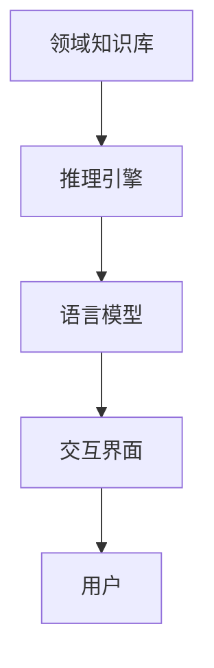
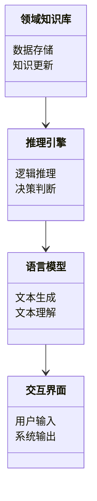

                 

# 领域特定AI Agent：LLM在垂直行业的深度应用

---

## 关键词：

- 领域特定AI Agent
- LLM
- 垂直行业
- 人工智能
- 大语言模型

---

## 摘要：

本文深入探讨了领域特定AI Agent在垂直行业中的应用，结合大语言模型（LLM）的技术优势，分析了其在不同行业中的应用场景和实现方法。通过系统架构设计、算法原理和项目实战的详细讲解，本文为读者提供了从理论到实践的全面指导，帮助读者理解如何在特定领域中高效应用AI技术。

---

## 正文：

---

### 第一部分：领域特定AI Agent概述

#### 第1章：领域特定AI Agent的背景与概念

##### 1.1 人工智能与AI Agent的基本概念

AI Agent（智能体）是指能够感知环境、做出决策并采取行动以实现目标的智能系统。与传统AI不同，AI Agent强调与环境的动态交互，能够实时响应变化并调整行为。

领域特定AI Agent专注于特定领域，如金融、医疗、法律等，利用该领域的知识库和规则，提供更精准的服务。

##### 1.2 大语言模型（LLM）的概述

大语言模型（LLM）是基于深度学习的自然语言处理模型，具有强大的文本生成和理解能力。LLM通过大量数据训练，能够理解上下文并生成自然的文本输出。

##### 1.3 领域特定AI Agent的应用背景

随着 industries的智能化需求增加，领域特定AI Agent在垂直行业的应用越来越广泛。LLM的强大能力使其成为构建领域特定AI Agent的理想工具。

---

#### 本章小结：

本章介绍了AI Agent的基本概念、领域特定AI Agent的定义及其在垂直行业的应用背景，为后续内容奠定了基础。

---

### 第二部分：领域特定AI Agent的核心概念与技术原理

#### 第2章：领域特定AI Agent的核心概念

##### 2.1 领域特定AI Agent的组成与属性

领域特定AI Agent由以下核心部分组成：

1. **知识库**：领域相关的知识库，包括数据、规则和上下文。
2. **推理引擎**：用于逻辑推理和决策。
3. **语言模型**：负责理解和生成自然语言。
4. **交互界面**：与用户或系统进行交互。

##### 2.2 领域特定AI Agent与传统AI Agent的区别

| 特性            | 领域特定AI Agent                   | 传统AI Agent                     |
|-----------------|------------------------------------|-----------------------------------|
| 知识库          | 领域特定的知识库                   | 通用知识库                       |
| 交互能力        | 高度领域化，精准理解                | 适用于多种场景                    |
| 任务目标        | 针对特定领域的任务目标             | 多任务处理                      |

##### 2.3 领域特定AI Agent的系统架构

---

#### 本章小结：

本章详细讲解了领域特定AI Agent的核心概念及其与传统AI Agent的区别，并通过系统架构图展示了其组成部分。

---

### 第三部分：大语言模型（LLM）的算法原理与数学模型

#### 第3章：LLM的算法原理

##### 3.1 LLM的核心算法

LLM基于Transformer架构，其核心算法包括编码器和解码器。

##### 3.2 LLM的训练过程

训练过程包括以下几个步骤：

1. **输入数据预处理**：对输入数据进行分词和编码。
2. **损失函数计算**：使用交叉熵损失函数。
3. **参数优化**：通过Adam优化器更新模型参数。

##### 3.3 LLM的推理机制

推理过程包括：

1. **编码器输入**：将输入文本编码为向量。
2. **解码器生成输出**：根据编码结果生成输出文本。

---

#### 本章小结：

本章详细讲解了LLM的算法原理和数学模型，帮助读者理解其技术细节。

---

### 第四部分：领域特定AI Agent的系统架构与设计

#### 第4章：系统架构设计

##### 4.1 系统功能模块设计

##### 4.2 系统架构实现

系统架构包括以下几个部分：

1. **领域知识库**：存储领域相关数据。
2. **推理引擎**：负责逻辑推理和决策。
3. **语言模型**：负责自然语言处理。
4. **交互界面**：与用户进行交互。

##### 4.3 系统实现与优化

优化措施包括：

1. **数据预处理**：提高模型效率。
2. **模型调优**：优化模型性能。

---

#### 本章小结：

本章详细讲解了领域特定AI Agent的系统架构设计和实现过程。

---

### 第五部分：领域特定AI Agent的项目实战

#### 第5章：垂直行业应用案例

##### 5.1 项目背景与需求分析

以金融行业为例，设计一个智能投资顾问系统。

##### 5.2 项目实现过程

1. **环境安装与配置**：安装必要的依赖包。
2. **系统设计与实现**：根据需求设计系统架构。
3. **代码实现与测试**：编写代码并进行功能测试。

##### 5.3 案例分析与经验总结

通过实际案例分析，总结经验教训，提出改进建议。

---

#### 本章小结：

本章通过实际案例展示了领域特定AI Agent在垂直行业中的应用，并总结了相关经验。

---

### 第六部分：总结与展望

#### 6.1 总结

本文详细探讨了领域特定AI Agent在垂直行业的应用，结合LLM的技术优势，分析了其在不同行业中的应用场景和实现方法。

#### 6.2 未来展望

随着技术的发展，领域特定AI Agent将在更多垂直行业得到应用，推动行业智能化转型。

---

## 作者：

作者：AI天才研究院/AI Genius Institute & 禅与计算机程序设计艺术 /Zen And The Art of Computer Programming

---

## 结语：

本文通过系统化的分析和实践，为读者提供了从理论到实践的全面指导，帮助读者理解如何在特定领域中高效应用AI技术。

