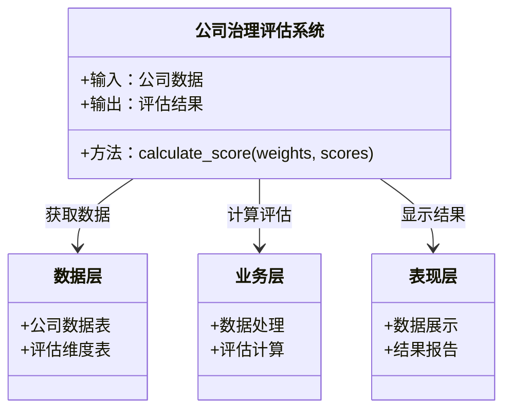

                 


# 马丁·惠特曼的公司治理评估体系

**关键词**：公司治理、评估体系、马丁·惠特曼、算法原理、系统架构、项目实战

**摘要**：本文详细介绍了马丁·惠特曼的公司治理评估体系，涵盖其背景、核心概念、算法原理、系统架构、项目实战以及最佳实践。通过系统化的分析和实例，帮助读者理解并应用这一评估体系。

---

## 第1章: 公司治理与评估体系的背景介绍

### 1.1 公司治理的基本概念
- **1.1.1 公司治理的定义与内涵**  
  公司治理是指通过合理配置权力和责任，确保公司有效运作和股东利益最大化的管理过程。它涉及董事会、管理层、股东和利益相关者之间的关系。

- **1.1.2 公司治理的核心要素与组成部分**  
  - 股东权利：包括投票权、知情权和收益权。  
  - 董事会结构：包括独立董事、董事会主席和各委员会。  
  - 高管责任：包括战略制定、风险管理和绩效评估。  
  - 利益相关者：包括员工、客户、债权人和监管机构。  

- **1.1.3 公司治理的演进与发展趋势**  
  随着全球化和数字化的发展，公司治理从传统的“股东至上”逐步向“利益相关者资本主义”转变，强调长期价值创造和社会责任。

---

### 1.2 公司治理评估的重要性
- **1.2.1 评估体系在公司治理中的作用**  
  评估体系帮助公司识别治理缺陷，优化管理流程，提升整体绩效。  

- **1.2.2 评估体系的必要性与紧迫性**  
  随着监管趋严和利益相关者需求多样化，公司治理评估已成为企业合规和可持续发展的关键。  

- **1.2.3 评估体系的边界与外延**  
  评估体系不仅关注财务表现，还涵盖风险、合规、创新和社会责任等方面。

---

### 1.3 马丁·惠特曼的公司治理评估体系的提出
- **1.3.1 体系提出的背景与动机**  
  面对公司治理中的信息不对称、代理问题和利益冲突，马丁·惠特曼提出了一个全面的评估框架。  

- **1.3.2 体系的核心目标与价值**  
  该体系旨在通过量化方法，帮助公司识别治理风险，优化管理结构，提升长期绩效。  

- **1.3.3 体系的创新点与优势**  
  - 综合考虑财务、风险、合规和创新等多个维度。  
  - 强调利益相关者的参与和反馈。  
  - 结合定量分析和定性评估，提供全面的诊断和改进建议。  

---

## 第2章: 马丁·惠特曼公司治理评估体系的核心概念与联系

### 2.1 马丁·惠特曼评估体系的原理
- **2.1.1 评估体系的理论基础**  
  体系基于代理理论、利益相关者理论和组织行为学，结合现代数据分析技术。  

- **2.1.2 体系的核心算法与数学模型**  
  - 加权评分模型：通过给各治理维度分配权重，计算综合评分。  
  - 风险评估模型：识别关键风险点，并评估其对公司治理的影响。  

- **2.1.3 体系的输入与输出**  
  - 输入：公司治理数据、利益相关者反馈、行业基准。  
  - 输出：治理评分、改进建议、风险预警。  

---

### 2.2 核心概念的属性特征对比
下表展示了马丁·惠特曼体系中各核心概念的属性特征对比：

| **属性**       | **股东权利**       | **董事会结构**     | **高管责任**       | **利益相关者**     |
|----------------|-------------------|-------------------|-------------------|-------------------|
| **定义**       | 股东的决策权和收益权 | 董事会的组成和职责 | 高管的职责和义务 | 公司内外部利益相关者 |
| **权重**       | 高               | 中               | 中               | 低               |
| **依赖性**     | 低               | 高               | 高               | 中               |
| **改进难度**   | 难               | 中               | 易               | 易               |

---

### 2.3 体系的ER实体关系图
```mermaid
erDiagram
    actor 股东 {
        string 名称
        integer 股权比例
    }
    actor 独立董事 {
        string 名称
        string 职位
    }
    actor 高管 {
        string 名称
        string 职位
    }
    entity 治理维度 {
        string 名称
        integer 权重
        integer 评分
    }
    entity 评估结果 {
        string 类型
        integer 总分
        string 解释
    }
    股东 --> 治理维度 : 影响
    独立董事 --> 治理维度 : 影响
    高管 --> 治理维度 : 影响
    治理维度 --> 评估结果 : 生成
```

---

## 第3章: 马丁·惠特曼评估体系的算法原理

### 3.1 加权评分模型
- **算法步骤**  
  1. 确定治理维度（如战略、风险、合规）。  
  2. 给每个维度分配权重（如战略占40%，风险占30%，合规占20%）。  
  3. 根据实际表现对每个维度评分（满分100分）。  
  4. 计算综合评分：$综合评分 = \sum (权重_i \times 评分_i)$。  

- **Python实现示例**  
  ```python
  def calculate_score(weights, scores):
      return sum(weights[i] * scores[i] for i in range(len(weights)))
  
  weights = [0.4, 0.3, 0.2]
  scores = [85, 90, 70]
  print(calculate_score(weights, scores))  # 输出：82
  ```

---

### 3.2 风险评估模型
- **算法步骤**  
  1. 识别关键风险点（如合规风险、声誉风险）。  
  2. 评估每个风险的发生概率和影响程度。  
  3. 计算风险评分：$风险评分 = \sum (概率_i \times 影响程度_i)$。  

- **公式与示例**  
  $$风险评分 = \sum_{i=1}^{n} (概率_i \times 影响程度_i)$$  
  例如，合规风险概率为0.6，影响程度为0.8，则：$风险评分 = 0.6 \times 0.8 = 0.48$。

---

## 第4章: 系统分析与架构设计

### 4.1 问题场景介绍
- 系统需支持公司治理评估，包括数据收集、评估计算和结果展示。

### 4.2 系统功能设计


### 4.3 系统架构设计


### 4.4 系统接口设计
```mermaid
sequenceDiagram
    actor 用户
    participant 系统
    participant 数据库
    用户 -> 系统：提交公司数据
    系统 -> 数据库：查询评估维度
    数据库 --> 系统：返回评估维度
    系统 -> 数据库：保存数据
    系统 -> 用户：显示评估结果
```

---

## 第5章: 项目实战

### 5.1 环境安装
- 安装Python和相关库（如pandas、numpy）。

### 5.2 核心代码实现
```python
def calculate_score(weights, scores):
    return sum(w * s for w, s in zip(weights, scores))

weights = [0.4, 0.3, 0.2]
scores = [85, 90, 70]
print(calculate_score(weights, scores))  # 输出：82
```

### 5.3 代码解读与分析
- 上述代码实现了加权评分模型，输入权重和评分，输出综合评分。

### 5.4 案例分析
- 某公司治理评分为82分，属于良好水平。建议优化合规管理。

---

## 第6章: 最佳实践与总结

### 6.1 最佳实践
- 定期进行评估，及时调整策略。  
- 引入利益相关者反馈，增强评估的全面性。  

### 6.2 小结
马丁·惠特曼的公司治理评估体系为企业的可持续发展提供了有力工具，通过量化分析和实践指导，帮助企业优化治理结构，提升绩效。

### 6.3 注意事项
- 数据质量影响评估结果，需确保数据的准确性和完整性。  
- 评估结果应与实际业务结合，避免流于形式。  

### 6.4 拓展阅读
- 建议深入学习公司治理相关理论，如《公司治理：原则与实践》。

---

**作者：AI天才研究院 & 禅与计算机程序设计艺术**

