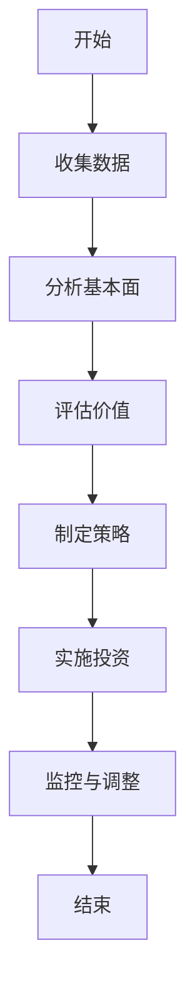

                 


# 马丁·惠特曼的积极价值投资：推动公司改革创造价值

> 关键词：积极价值投资，马丁·惠特曼，公司治理，价值创造，投资策略，基本面分析，风险管理

> 摘要：本文深入探讨了马丁·惠特曼的积极价值投资理念，分析了其核心概念、算法原理、系统架构及实际案例，展示了如何通过积极干预和优化公司治理来创造价值。文章结构清晰，内容详实，适合投资专业人士和企业管理者阅读。

---

## 第1章：积极价值投资的背景与核心概念

### 1.1 积极价值投资的定义与背景

#### 1.1.1 积极价值投资的定义
积极价值投资是一种投资策略，强调通过深入分析公司的基本面，识别其潜在价值，并通过积极的股东参与推动公司改革，以实现长期价值创造。与传统被动投资不同，积极价值投资注重主动干预，通过改善公司治理、优化管理等手段，提升企业的内在价值。

#### 1.1.2 积极价值投资的背景
随着全球经济的波动和市场的不确定性，传统的被动投资方式难以满足投资者对稳定收益的需求。积极价值投资作为一种主动型投资策略，逐渐受到关注。其核心在于通过深入分析企业的内在价值，选择具有改革潜力的公司，通过积极的股东参与，推动企业价值最大化。

#### 1.1.3 积极价值投资与传统投资的区别
传统投资通常依赖市场趋势和技术分析，而积极价值投资则注重企业的基本面分析和长期价值创造。传统投资更倾向于被动跟随市场，而积极价值投资强调主动干预和优化。

### 1.2 积极价值投资的理论基础

#### 1.2.1 价值投资的基本原理
价值投资的核心在于识别市场低估的公司，通过长期持有实现价值回归。积极价值投资在此基础上进一步强调通过股东参与推动公司改革，实现价值的超预期增长。

#### 1.2.2 积极价值投资的独特性
积极价值投资的独特性在于其不仅关注企业的财务表现，还关注企业的治理结构、管理团队和改革潜力。通过主动参与公司治理，投资者能够推动企业实现价值创造。

#### 1.2.3 积极价值投资的适用场景
积极价值投资适用于那些具有改革潜力但目前市场估值较低的企业。这种策略特别适合那些通过优化管理、改善治理结构能够显著提升企业价值的公司。

### 1.3 积极价值投资的边界与外延

#### 1.3.1 投资的边界条件
积极价值投资需要考虑市场环境、企业基本面、股东参与的可能性等因素。在市场环境不佳或企业治理结构复杂的情况下，积极价值投资的难度会增加。

#### 1.3.2 投资的外延领域
积极价值投资不仅限于传统的企业投资，还可以扩展到私募股权、风险投资等领域。通过不同的投资方式，投资者可以更灵活地推动企业的改革与价值创造。

#### 1.3.3 投资的限制与挑战
积极价值投资面临的主要挑战包括企业治理的复杂性、股东参与的难度以及市场的不确定性。此外，投资者需要具备较强的专业能力和资源，才能有效推动企业的改革。

---

## 第2章：积极价值投资的核心概念与联系

### 2.1 核心概念原理

#### 2.1.1 投资的三要素：价值、价格与时间
- **价值**：企业的内在价值，包括资产、盈利能力、成长潜力等。
- **价格**：市场上的股票价格，通常低于企业的内在价值。
- **时间**：通过长期持有，等待价值的实现。

#### 2.1.2 公司基本面分析的核心要素
- **财务状况**：包括资产负债表、利润表、现金流等。
- **管理团队**：管理团队的能力和战略。
- **行业地位**：公司在行业中的竞争地位。
- **成长潜力**：未来增长的可能性。

#### 2.1.3 价值创造的驱动因素
- **效率提升**：通过优化管理和技术升级降低成本。
- **市场份额扩展**：通过市场拓展和产品创新扩大收入。
- **治理优化**：通过改善公司治理结构提升企业价值。

### 2.2 核心概念属性对比表格

| 属性       | 传统投资         | 积极价值投资       |
|------------|------------------|-------------------|
| 投资目标     | 资本增值         | 创造可持续价值     |
| 投资策略     | 跟随市场         | 主动干预与优化     |
| 投资对象     | 任何资产         | 具有改革潜力的公司 |

### 2.3 ER实体关系图

```mermaid
graph TD
I[投资者] --> C[公司] : 投资行为
C --> F[财务数据] : 提供数据
C --> G[治理结构] : 影响公司治理
C --> V[价值创造] : 实现价值
```

---

## 第3章：积极价值投资的算法原理

### 3.1 算法原理概述

#### 3.1.1 基于基本面分析的数学模型
积极价值投资的核心在于基本面分析，通过量化分析企业的内在价值。常用的模型包括：

- **市盈率模型**：EV/EBITDA、P/E等。
- **现金流折现模型**：DCF模型。

#### 3.1.2 价值评估的公式推导
企业内在价值的计算公式：

$$ V = \frac{FCF}{(1 + r)^n} $$

其中，FCF为自由现金流，r为折现率，n为现金流期限。

#### 3.1.3 投资决策的逻辑流程
1. **识别低估企业**：通过基本面分析筛选出市场估值低于内在价值的企业。
2. **评估改革潜力**：分析企业的治理结构、管理团队和成长潜力。
3. **制定投资策略**：通过股东参与推动企业改革，提升企业价值。
4. **监控与调整**：定期评估企业的进展，调整投资策略。

### 3.2 算法流程图



---

## 第4章：积极价值投资的系统分析

### 4.1 系统分析与架构设计方案

#### 4.1.1 问题场景介绍
积极价值投资需要构建一个完整的系统，包括数据收集、分析、决策和监控等环节。

#### 4.1.2 系统功能设计
- 数据收集模块：收集企业的财务数据、市场数据等。
- 分析模块：进行基本面分析和价值评估。
- 决策模块：制定投资策略。
- 监控模块：实时监控企业的进展。

#### 4.1.3 系统架构设计

```mermaid
graph TD
S[系统架构] --> D[数据层] : 数据存储
D --> A[分析层] : 数据分析
A --> C[控制层] : 投资决策
C --> U[用户层] : 交互界面
```

---

## 第5章：积极价值投资的项目实战

### 5.1 环境安装与代码实现

#### 5.1.1 环境安装
安装必要的Python库，如Pandas、NumPy、Matplotlib等。

#### 5.1.2 核心代码实现

```python
import pandas as pd
import numpy as np

# 示例代码：计算市盈率
def calculate_pe_ratio(price, earnings):
    return price / earnings

# 示例代码：计算市净率
def calculate_pb_ratio(price, book_value):
    return price / book_value
```

---

## 第6章：积极价值投资的最佳实践

### 6.1 最佳实践 tips

- **长期持有**：积极价值投资需要长期持有，等待价值的实现。
- **深入分析**：进行详细的财务分析和行业研究。
- **股东参与**：积极参与公司治理，推动企业改革。

### 6.2 小结

马丁·惠特曼的积极价值投资是一种通过深入分析企业基本面，并通过主动参与公司治理来创造价值的投资策略。其核心在于识别低估企业，并通过改革实现价值的超预期增长。

### 6.3 注意事项

- 投资者需要具备较强的专业能力。
- 股东参与需要考虑法律和实际操作的可行性。

### 6.4 拓展阅读

建议阅读以下书籍和文章：
- 《价值投资实战》
- “积极价值投资与企业治理”

---

作者：AI天才研究院/AI Genius Institute & 禅与计算机程序设计艺术/Zen And The Art of Computer Programming

