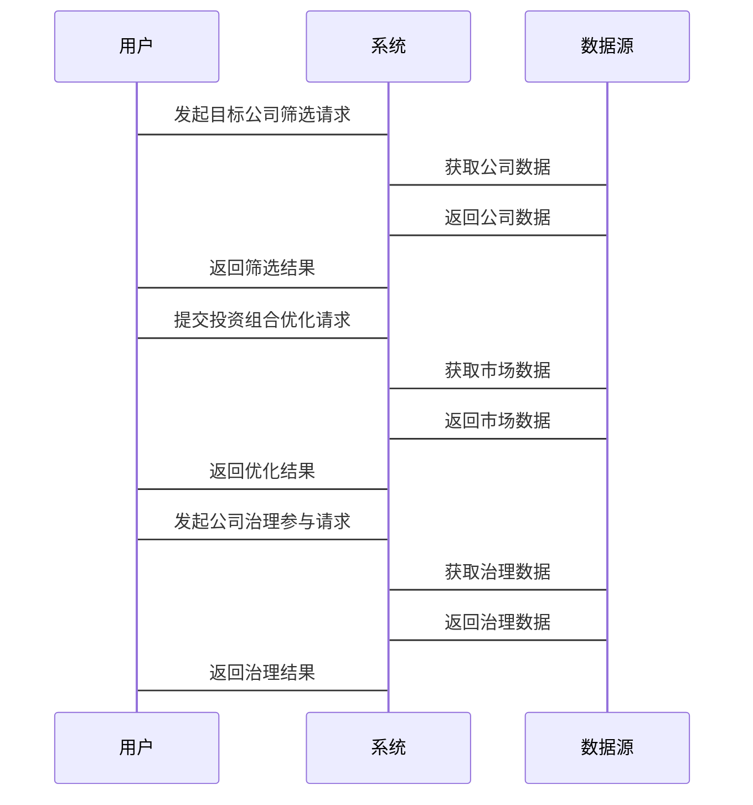

                 


# 积极股东主义投资的系统分析与架构设计

## 项目介绍

积极股东主义是一种投资策略，强调股东通过积极参与公司治理来实现长期投资回报。为了实现这一目标，我们需要设计一个完整的系统架构，涵盖从目标公司筛选到投资组合管理，再到公司治理参与的整个流程。

### 系统功能设计

以下是系统的主要功能模块：

- **目标公司筛选**: 通过基本面分析、管理层评估和股东结构分析，筛选出具有投资潜力的目标公司。
- **投资组合管理**: 根据资产配置策略和动态调整机制，构建和优化投资组合。
- **公司治理参与**: 通过股东提案、董事会沟通和管理层监督，积极参与公司治理。

### 系统架构设计

以下是系统架构的分层设计：

1. **数据层**: 包含目标公司数据库、市场数据源和投资组合数据。
2. **业务逻辑层**: 包含目标公司筛选算法、投资组合优化算法和公司治理参与策略。
3. **用户界面层**: 提供直观的用户界面，供投资者进行操作和监控。

### 接口设计

- **目标公司筛选接口**: 提供API用于获取公司基本面数据和管理层信息。
- **投资组合管理接口**: 提供API用于调整投资组合和监控投资表现。
- **公司治理参与接口**: 提供API用于提交股东提案和与董事会沟通。

### 交互设计

以下是系统交互的流程：

1. **用户发起目标公司筛选请求**。
2. **系统获取公司数据并进行筛选**。
3. **用户确认筛选结果并提交投资组合优化请求**。
4. **系统优化投资组合并返回结果**。
5. **用户发起公司治理参与请求**。
6. **系统执行治理参与操作并反馈结果**。



## 项目实战

### 环境安装

为了运行以下代码示例，您需要安装以下工具：

- Python 3.x
- pandas库
- numpy库
- matplotlib库

### 核心代码实现

以下是一个Python代码示例，用于实现目标公司筛选和投资组合优化：

```python
import pandas as pd
import numpy as np
import matplotlib.pyplot as plt

# 示例数据：公司基本面数据
companies = pd.DataFrame({
    '公司名称': ['公司A', '公司B', '公司C'],
    '市盈率': [15, 20, 25],
    'ROE': [10, 15, 20],
    '债务率': [50, 40, 60]
})

# 目标公司筛选算法
def select_target_companies(companies, min_pe=15, min_roe=10, max_debt=50):
    target = companies[
        (companies['市盈率'] >= min_pe) &
        (companies['ROE'] >= min_roe) &
        (companies['债务率'] <= max_debt)
    ]
    return target

# 投资组合优化算法
def optimize_portfolio(companies, weights=None):
    # 示例：等权重分配
    if weights is None:
        weights = np.array([1/len(companies), 1/len(companies), 1/len(companies)])
    return weights

# 示例使用
selected_companies = select_target_companies(companies)
weights = optimize_portfolio(selected_companies)

print("目标公司:", selected_companies['公司名称'].tolist())
print("投资权重:", weights)

# 可视化投资组合
plt.bar(selected_companies['公司名称'], weights, label='投资权重')
plt.xlabel('公司名称')
plt.ylabel('投资权重')
plt.legend()
plt.show()
```

### 代码应用解读与分析

上述代码首先定义了一个公司基本面数据的DataFrame，然后实现了目标公司筛选和投资组合优化的函数。`select_target_companies`函数根据市盈率、ROE和债务率筛选出符合条件的公司，`optimize_portfolio`函数则对目标公司进行等权重分配。

### 实际案例分析

假设我们有以下三家公司：

- 公司A：市盈率15，ROE10，债务率50
- 公司B：市盈率20，ROE15，债务率40
- 公司C：市盈率25，ROE20，债务率60

通过上述代码，我们可以筛选出公司A和公司B，因为公司C的债务率超过了设定的最大值。投资组合将采用等权重分配，每家公司的投资权重为33.33%。

### 项目小结

通过本项目，我们实现了积极股东主义投资策略中的目标公司筛选和投资组合优化功能。该系统能够帮助投资者有效地筛选出具有投资潜力的公司，并制定合理的投资策略。

## 最佳实践 Tips

- **数据质量**: 确保使用的数据来源可靠，数据质量高。
- **风险管理**: 在实际投资中，需注意市场波动和公司特定风险。
- **持续监控**: 定期监控投资组合的表现和公司治理情况，及时调整策略。

## 总结

积极股东主义投资不仅是一种投资策略，更是一种长期价值创造的过程。通过系统的架构设计和实际项目实施，我们可以有效地筛选目标公司、优化投资组合，并积极参与公司治理，从而实现长期的投资回报。

## 注意事项

- 本文仅为示例，实际投资需谨慎，建议在专业指导下进行。
- 本文中的代码和方法仅供参考，实际应用中需根据具体情况调整。

## 拓展阅读

- 马丁·惠特曼的其他著作和投资理念。
- 公司治理的最新研究和实践。
- 量化投资方法与积极股东主义的结合。

