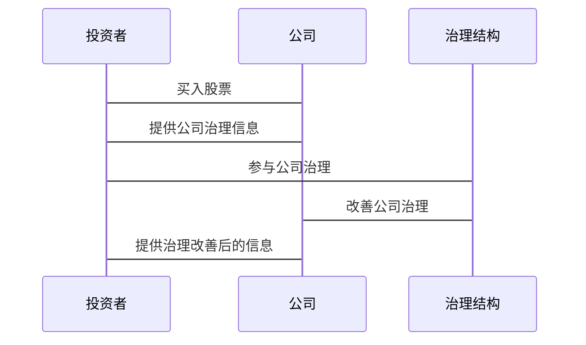

                 


# 马丁·惠特曼的行动主义价值投资：推动公司变革

## 关键词：行动主义投资、价值投资、公司治理、股东权利、投资策略

## 摘要：  
本文深入探讨了马丁·惠特曼的行动主义价值投资策略，分析其如何通过积极参与公司治理来实现投资目标。文章从行动主义投资的背景、核心概念、策略方法、系统分析、项目实战等多方面展开，结合实际案例和数学模型，全面解析其在推动公司变革中的作用。本文还提供了详细的系统架构图和算法流程图，帮助读者更好地理解和应用这些投资理念。

---

## 第1章: 行动主义价值投资的背景与定义

### 1.1 传统价值投资的局限性

#### 1.1.1 传统价值投资的核心理念
传统价值投资的核心理念是寻找市场低估的股票，通过长期持有实现收益。其核心思想是“买入便宜的东西”，关注市盈率、市净率等估值指标。

#### 1.1.2 传统价值投资的局限性
- **局限性1**：传统价值投资忽视了公司治理的重要性，只关注价格和估值，而忽视了公司内部管理问题。
- **局限性2**：在市场波动较大的情况下，传统价值投资难以应对公司治理问题带来的风险。
- **局限性3**：传统价值投资无法直接推动公司变革，投资者只能被动等待市场重新发现公司价值。

#### 1.1.3 行动主义投资的兴起背景
行动主义投资的兴起源于投资者对公司治理问题的关注增加。随着全球范围内企业治理问题的频发（如管理层滥用职权、股东权益受损等），投资者开始意识到，仅仅关注估值是不够的，还需要通过积极参与公司治理来保护自身利益并推动公司价值提升。

---

### 1.2 行动主义价值投资的定义

#### 1.2.1 行动主义投资的定义与特征
行动主义投资是一种结合了价值投资和股东 activism 的投资策略。其核心在于通过买入低估的股票后，积极参与公司治理，推动公司改善，从而实现投资收益。其主要特征包括：
- **积极参与**：投资者不仅仅是财务投资者，而是主动参与公司治理，推动公司变革。
- **长期视角**：行动主义投资强调长期价值创造，而非短期套利。
- **风险可控**：通过改善公司治理，降低投资风险，同时提高公司价值。

#### 1.2.2 行动主义投资与传统价值投资的区别
| 区别维度 | 传统价值投资 | 行动主义投资 |
|----------|---------------|---------------|
| 投资目标 | 追求市场低估的股票 | 追求低估且具有改善潜力的股票 |
| 投资方式 | 被动持有，等待市场发现价值 | 主动参与，推动公司改善 |
| 风险管理 | 仅关注市场波动 | 关注公司治理风险和市场风险 |

#### 1.2.3 行动主义投资的目标与意义
行动主义投资的目标是通过改善公司治理，推动公司价值最大化，同时实现投资收益。其意义在于：
- 提高公司治理透明度和效率。
- 保护中小投资者权益。
- 为投资者创造长期价值。

---

## 第2章: 行动主义价值投资的核心概念与理论基础

### 2.1 投资者权利与义务

#### 2.1.1 股东权利的法律框架
股东权利是行动主义投资的核心基础。根据公司法，股东享有以下权利：
- **知情权**：了解公司财务状况、重大决策等信息。
- **投票权**：参与股东大会，投票选举董事会成员。
- **收益权**：获得股息和其他收益分配。
- **监督权**：监督公司管理层的经营行为。

#### 2.1.2 股东义务与责任
股东不仅享有权利，还承担相应的义务：
- **遵守公司章程**：不得滥用股东权利损害公司利益。
- **履行投票义务**：积极参与股东大会，行使投票权。
- **维护公司利益**：不得从事损害公司利益的行为。

#### 2.1.3 股东 activism 的核心原则
- **合法合规**：股东 activism 必须在法律框架内进行，避免滥用权利。
- **透明公开**：股东行动必须透明，不得隐瞒信息。
- **合作共赢**：股东应与公司管理层保持沟通，寻求双方利益的平衡点。

---

### 2.2 公司治理与企业价值

#### 2.2.1 公司治理的定义与重要性
公司治理是指公司董事会、管理层和股东之间的关系和规则。良好的公司治理能够提高公司透明度和决策效率，降低经营风险，从而提升企业价值。

#### 2.2.2 良好的公司治理对企业价值的影响
- 提高公司信用评级，降低融资成本。
- 提高投资者信心，吸引更多资金流入。
- 优化管理层激励机制，提高管理效率。

#### 2.2.3 不良公司治理的识别与应对
- **识别**：通过分析公司治理结构、董事会构成、管理层薪酬等指标，识别公司治理问题。
- **应对**：通过股东 activism，推动公司改善治理结构，更换不称职的管理层。

---

### 2.3 价值投资的理论基础

#### 2.3.1 价值投资的基本原理
价值投资的核心是寻找市场价格低于内在价值的股票。其基本原理是市场短期波动，但长期会回归基本面。

#### 2.3.2 行动主义投资的理论基础
行动主义投资的理论基础包括：
- **代理理论**：代理理论认为，公司治理的核心问题是解决委托-代理问题，即股东与管理层之间的利益冲突。
- **利益相关者理论**：利益相关者理论认为，公司治理应考虑所有利益相关者的利益，而不仅仅是股东。
- **行为金融学**：行为金融学研究表明，市场参与者的情绪和认知偏差会影响市场价格，行动主义投资通过改善公司治理，可以纠正这些偏差。

#### 2.3.3 行动主义投资的数学模型与公式
行动主义投资可以通过以下数学模型进行评估：

$$
\text{公司价值} = \text{内在价值} + \text{治理改善带来的增量价值}
$$

其中，治理改善带来的增量价值可以通过以下步骤计算：
1. 评估公司当前治理结构的缺陷。
2. 估算治理改善后对公司价值的提升。
3. 将提升的价值折现，计算净现值。

---

## 第3章: 行动主义价值投资的核心策略与方法

### 3.1 行动主义投资的策略框架

#### 3.1.1 确定投资目标与标准
行动主义投资者需要明确以下目标和标准：
- **投资目标**：寻找具有改善潜力的低估股票。
- **投资标准**：公司治理存在明显缺陷，但公司基本面良好。

#### 3.1.2 识别具有潜力的公司
识别具有潜力的公司需要：
- **行业分析**：选择行业前景良好，但公司治理存在问题的公司。
- **公司分析**：分析公司财务状况、管理层素质、公司治理结构等。

#### 3.1.3 制定长期投资计划
制定长期投资计划需要：
- **投资组合管理**：将行动主义投资与传统价值投资相结合，分散风险。
- **时间规划**：设定投资时间表，长期持有，等待公司治理改善带来的价值提升。

---

### 3.2 行动主义投资的具体方法

#### 3.2.1 股东 activism 的具体步骤
行动主义投资者可以通过以下步骤进行股东 activism：
1. **买入股票**：买入目标公司股票，成为重要股东。
2. **参与股东大会**：提出改进公司治理的议案，争取获得董事会席位。
3. **与管理层沟通**：通过沟通推动公司改善治理结构。
4. **公开披露**：通过公开披露信息，推动公司透明化，吸引更多的投资者。

#### 3.2.2 与公司管理层沟通的技巧
- **建立信任**：通过长期持有和积极参与，建立与管理层的信任关系。
- **明确目标**：在沟通中明确目标，避免模糊不清。
- **灵活应对**：根据沟通结果，灵活调整投资策略。

#### 3.2.3 参与公司治理的具体实践
- **董事会席位**：争取获得董事会席位，直接参与公司治理。
- **监督机制**：建立监督机制，确保公司治理改善。
- **激励机制**：通过激励机制，提高管理层积极性。

---

### 3.3 行动主义投资的风险与挑战

#### 3.3.1 投资失败的常见原因
- **公司治理问题难以解决**：公司管理层拒绝改善，导致投资失败。
- **市场波动**：市场波动较大，导致股价下跌，投资失败。
- **法律风险**：行动主义投资可能面临法律风险，如被起诉或罚款。

#### 3.3.2 行动主义投资的主要风险
- **流动性风险**：行动主义投资需要长期持有，可能导致流动性不足。
- **道德风险**：行动主义投资可能面临道德风险，如滥用股东权利。

#### 3.3.3 应对挑战的策略与方法
- **风险分散**：通过多样化投资，降低风险。
- **法律合规**：确保行动主义投资在法律框架内进行。
- **信息透明**：保持信息透明，避免道德风险。

---

## 第4章: 行动主义投资的系统分析与架构设计

### 4.1 问题场景介绍

#### 4.1.1 行动主义投资的目标与挑战
行动主义投资的目标是通过改善公司治理，推动公司价值最大化。其主要挑战包括：
- 公司治理问题复杂，难以解决。
- 市场波动较大，影响投资收益。
- 行动主义投资需要大量资源，成本较高。

#### 4.1.2 系统分析的必要性
系统分析是行动主义投资的重要工具，通过系统分析可以明确问题、制定解决方案、优化投资策略。

#### 4.1.3 系统分析的方法与工具
- **系统分析方法**：包括需求分析、功能设计、架构设计等。
- **系统分析工具**：包括 mermaid 类图、mermaid 架构图等。

---

### 4.2 系统功能设计

#### 4.2.1 领域模型 mermaid 类图


#### 4.2.2 系统架构设计 mermaid 架构图


---

## 第5章: 项目实战与系统实现

### 5.1 项目实战

#### 5.1.1 环境安装与配置
为了进行行动主义投资的系统分析，需要安装以下工具：
- **mermaid**：用于绘制类图和架构图。
- **Python**：用于编写分析脚本。

#### 5.1.2 系统核心实现源代码
以下是一个简单的 Python 脚本，用于分析公司治理结构：

```python
def analyze_governance(company_data):
    # 分析公司治理结构
    governance_score = 0
    for metric in company_data:
        if metric == "board_independence":
            governance_score += 0.3
        elif metric == "executive_compensation":
            governance_score += 0.2
        elif metric == "transparency":
            governance_score += 0.1
    return governance_score

# 示例数据
company_data = {
    "board_independence": True,
    "executive_compensation": True,
    "transparency": True
}

governance_score = analyze_governance(company_data)
print(f"治理结构得分：{governance_score}")
```

---

### 5.2 系统交互与流程设计

#### 5.2.1 系统交互 mermaid 序列图


---

## 第6章: 总结与展望

### 6.1 总结
行动主义价值投资是一种结合了价值投资和股东 activism 的投资策略。通过积极参与公司治理，行动主义投资者能够推动公司变革，实现投资收益。本文从背景、核心概念、策略方法、系统分析、项目实战等多方面进行了详细探讨。

### 6.2 未来展望
未来，行动主义投资将更加重要。随着全球范围内企业治理问题的增多，投资者需要更加关注公司治理，积极参与公司治理，推动公司价值最大化。同时，随着技术的发展，行动主义投资将更加依赖于数据分析和系统工具，投资者需要掌握更多的技术手段，才能在竞争中立于不败之地。

---

## 附录

### 附录 A: mermaid 类图与架构图

#### A.1 领域模型 mermaid 类图


#### A.2 系统架构 mermaid 架构图


---

## 作者：AI天才研究院/AI Genius Institute & 禅与计算机程序设计艺术 /Zen And The Art of Computer Programming

