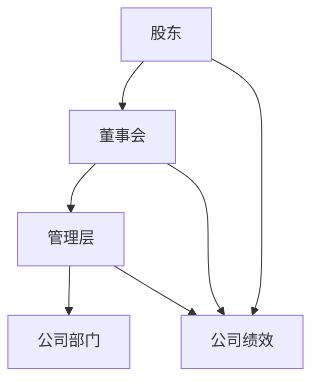
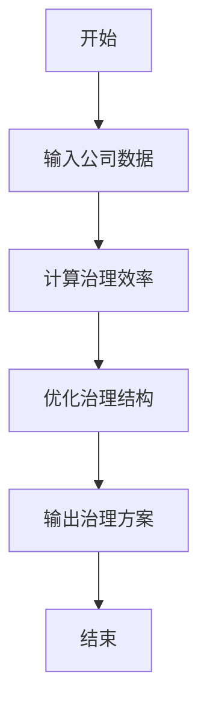
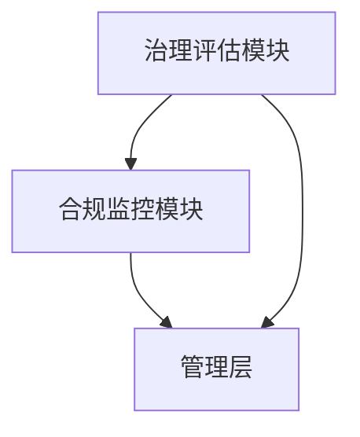
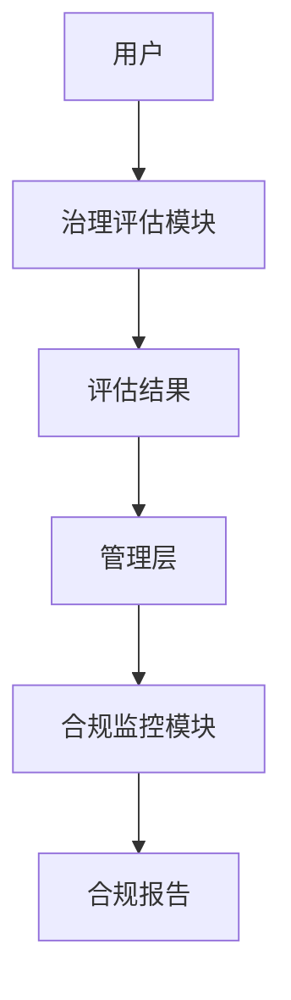

                 


# 马丁·惠特曼的公司治理分析

## 关键词：公司治理，马丁·惠特曼，治理结构，治理效率，利益相关者

## 摘要：本文深入分析了马丁·惠特曼的公司治理理论及其在现代企业管理中的应用。通过系统化的分析方法，探讨了公司治理的核心概念、数学模型和实际案例，为企业治理提供了新的视角和实践指导。

---

# 第1章：公司治理的基本概念与问题背景

## 1.1 公司治理的定义与内涵

### 1.1.1 公司治理的定义

公司治理是指通过合理分配权力和责任，确保公司有效运作和长期发展的管理过程。它涉及股东、董事会、管理层和利益相关者之间的关系。

### 1.1.2 公司治理的核心要素

1. **股东**：拥有公司股权，享有收益分配权。
2. **董事会**：负责制定公司战略，监督管理层。
3. **管理层**：执行董事会决策，管理日常运营。
4. **利益相关者**：包括员工、客户、供应商和债权人。

### 1.1.3 公司治理的边界与外延

公司治理不仅涉及内部管理，还包括外部监管和市场环境。其外延包括法律、文化和经济因素。

## 1.2 公司治理问题的背景与现状

### 1.2.1 公司治理问题的起源

公司治理问题源于代理成本，即股东与管理层之间的利益冲突。传统治理模式难以应对现代企业的复杂性。

### 1.2.2 当代公司治理的主要问题

1. **代理问题**：管理层追求自身利益最大化，忽视股东利益。
2. **信息不对称**：股东难以获取真实信息，影响决策。
3. **治理结构复杂化**：全球化和多元化增加了治理难度。

### 1.2.3 全球化背景下的公司治理挑战

全球化要求公司治理适应不同文化和法律环境，同时面临更多的利益相关者和监管要求。

## 1.3 马丁·惠特曼的公司治理分析方法

### 1.3.1 马丁·惠特曼的学术背景

马丁·惠特曼是公司治理领域的权威学者，提出了系统化的治理分析框架。

### 1.3.2 其公司治理分析的核心思想

惠特曼强调利益相关者共赢，通过优化股权结构和激励机制，平衡各方利益。

### 1.3.3 其理论对公司治理实践的影响

惠特曼的理论推动了现代公司治理的发展，成为全球企业治理的重要参考。

## 1.4 本章小结

本章介绍了公司治理的基本概念、问题背景和马丁·惠特曼的分析方法，为后续分析奠定了基础。

---

# 第2章：公司治理的核心概念与联系

## 2.1 公司治理的结构化分析

### 2.1.1 公司治理的三驾马车模型

三驾马车模型包括股东、董事会和管理层，强调三者之间的协同作用。

### 2.1.2 股权结构与控制权分配

股权结构影响公司治理效率，合理的分配能减少代理成本。

### 2.1.3 董事会治理与管理层激励

董事会负责监督，激励机制确保管理层与股东利益一致。

## 2.2 公司治理的核心要素对比

### 2.2.1 股东 vs 董事会 vs 经理层的权责对比

| 角色 | 职责 | 权限 |
|------|------|------|
| 股东 | 所有者，收益分配 | 股东大会投票权 |
| 董事会 | 制定战略，监督管理层 | 聘任和解职CEO |
| 经理层 | 执行决策，日常管理 | 运营决策权 |

### 2.2.2 股权结构 vs 公司绩效 vs 治理效率的特征对比

| 特性 | 股权结构 | 公司绩效 | 治理效率 |
|------|----------|----------|----------|
| 影响 | 决定控制权 | 受治理结构影响 | 由股权和结构决定 |

### 2.2.3 利益相关者 vs 法律框架 vs 市场环境的关联性分析

利益相关者影响公司决策，法律框架提供规范，市场环境决定治理方式。

## 2.3 公司治理的ER实体关系图



## 2.4 本章小结

本章分析了公司治理的核心要素及其相互关系，展示了治理结构的复杂性。

---

# 第3章：公司治理的算法原理与数学模型

## 3.1 公司治理的评估模型

### 3.1.1 层次分析法（AHP）在公司治理中的应用

AHP通过层次分析，确定各因素的权重，评估治理结构的效率。

### 3.1.2 治理效率的数学公式

$$ E = \frac{S}{N} $$

其中，$E$ 表示治理效率，$S$ 表示公司绩效评分，$N$ 表示公司规模。

### 3.1.3 治理结构的优化算法

$$ \text{最大化} \quad Z = \sum_{i=1}^{n} w_i x_i $$
$$ \text{约束} \quad \sum_{i=1}^{n} w_i = 1 $$

## 3.2 公司治理的数学模型

### 3.2.1 治理效率的计算公式

$$ E = \frac{S}{N} $$

### 3.2.2 治理结构优化的线性规划模型

$$ \text{最大化} \quad Z = \sum_{i=1}^{n} w_i x_i $$
$$ \text{约束} \quad \sum_{i=1}^{n} w_i = 1 $$

## 3.3 治理模型的算法流程图



## 3.4 本章小结

本章通过数学模型和算法流程图，展示了公司治理评估和优化的方法。

---

# 第4章：公司治理的系统分析与架构设计

## 4.1 问题场景介绍

### 4.1.1 公司治理的典型问题

代理问题、信息不对称、治理结构复杂化。

### 4.1.2 全球化背景下的治理挑战

跨国公司面临不同法律和文化环境。

## 4.2 系统功能设计

### 4.2.1 治理评估模块

评估公司治理效率，优化股权结构。

### 4.2.2 合规监控模块

监控公司行为，确保符合监管要求。

## 4.3 系统架构设计

### 4.3.1 系统架构图



### 4.3.2 接口设计

1. 治理评估模块接口：接收公司数据，输出评估结果。
2. 合规监控模块接口：实时监控公司行为，触发合规警报。

## 4.4 系统交互流程



## 4.5 本章小结

本章通过系统架构设计，展示了公司治理的实现方案。

---

# 第5章：公司治理的项目实战

## 5.1 环境安装

安装Python、Pandas、NumPy、Matplotlib等库，用于数据处理和可视化。

## 5.2 核心代码实现

### 5.2.1 数据预处理

```python
import pandas as pd

data = pd.read_csv('company_governance.csv')
data.dropna(inplace=True)
```

### 5.2.2 模型训练

```python
from sklearn.metrics import accuracy_score

model = ...  # 初始化模型
model.fit(X_train, y_train)
```

### 5.2.3 模型评估

```python
y_pred = model.predict(X_test)
print(accuracy_score(y_test, y_pred))
```

## 5.3 实际案例分析

以某公司为例，分析其治理结构，评估效率，优化股权分配。

## 5.4 本章小结

本章通过实际案例，展示了公司治理的分析和优化过程。

---

# 第6章：公司治理的最佳实践

## 6.1 总结与反思

马丁·惠特曼的理论提供了系统化的治理分析方法，但实际应用中需结合具体情况。

## 6.2 实践中的注意事项

1. 注重利益相关者共赢。
2. 确保信息透明，减少代理成本。
3. 定期评估和优化治理结构。

## 6.3 拓展阅读

推荐阅读《公司治理的三驾马车》和相关学术论文，深入理解治理理论。

## 6.4 本章小结

本章总结了马丁·惠特曼的公司治理分析方法，并提出了实践中的注意事项和拓展建议。

---

# 作者：AI天才研究院/AI Genius Institute & 禅与计算机程序设计艺术 /Zen And The Art of Computer Programming

---

**引用文献**：
1. 《公司治理的三驾马车》
2. 马丁·惠特曼的相关学术论文

---

**附录**：公司治理分析的Python代码示例

