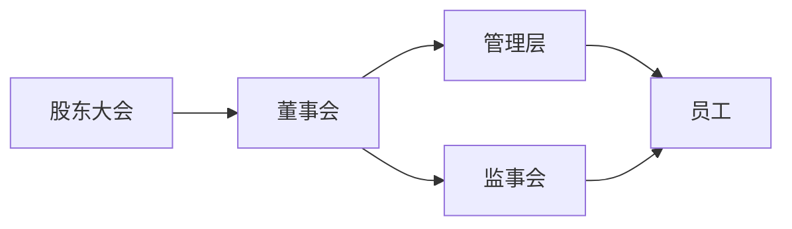
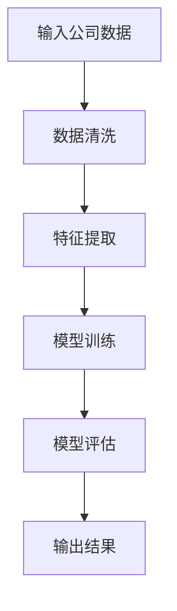
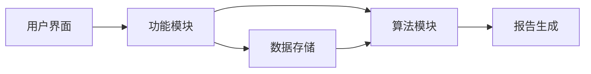

                 


# 马克·莫比乌斯的公司治理改善投资

> 关键词：公司治理，治理改善，投资策略，治理模型，评估算法，系统架构

> 摘要：本文深入探讨了马克·莫比乌斯提出的公司治理改善投资策略，从理论到实践，结合算法和系统架构，分析如何通过治理改善提升企业投资价值。文章首先介绍公司治理的核心概念和问题背景，随后详细阐述治理改善的理论基础和数学模型，最后通过系统架构和项目实战展示如何将治理改善投资落到实处。

---

## 第一部分: 公司治理改善投资的背景与核心概念

### 第1章: 公司治理的基本概念与问题背景

#### 1.1 公司治理的核心概念
- **公司治理的定义与内涵**  
  公司治理是指通过合理的制度安排，确保公司各利益相关方（股东、董事会、管理层、员工等）的权益得到保护，并实现公司长期价值最大化的过程。  

- **公司治理的关键要素与结构**  
  公司治理的核心要素包括：股权结构、董事会结构、管理层激励机制、监督机制（如审计委员会、监事会）、信息披露机制等。  

- **公司治理的边界与外延**  
  公司治理的边界主要体现在公司内部与外部的关系上。内部治理关注股东与管理层之间的关系，外部治理则涉及监管机构、债权人、利益相关者等外部因素。  

#### 1.2 问题背景与现状分析
- **当前公司治理的主要问题**  
  当前公司治理面临的主要问题包括：  
  - 股东与管理层的利益冲突；  
  - 代理成本过高；  
  - 信息披露不透明；  
  - 监管框架不完善等。  

- **全球公司治理的现状对比**  
  不同国家和地区的公司治理模式存在差异，例如美国注重股东权益，欧洲强调利益相关者保护，而亚洲国家则在家族企业治理方面面临更多挑战。  

- **公司治理改善的必要性与目标**  
  公司治理改善的目的是为了实现公司价值最大化，同时保护股东、债权人和利益相关者的权益。通过改善公司治理，可以降低代理成本，提高公司透明度和信任度，从而吸引更多的投资。  

---

### 第2章: 马克·莫比乌斯的公司治理改善理论

#### 2.1 马克·莫比乌斯的理论基础
- **投资哲学与公司治理的关系**  
  马克·莫比乌斯的投资哲学强调长期价值创造，他认为公司治理是实现股东价值最大化的核心要素之一。  

- **股东价值最大化的核心理念**  
  股东价值最大化不仅是公司治理的目标，也是公司战略制定的核心原则。通过优化公司治理结构，可以确保管理层的行为与股东利益一致。  

- **风险管理与公司治理的结合**  
  公司治理不仅是关于权力分配的问题，更是关于风险控制和利益平衡的艺术。通过优化治理结构，可以有效降低公司经营风险，提升抗风险能力。  

#### 2.2 改善公司治理的具体问题
- **股东与管理层的利益冲突**  
  股东与管理层之间的利益冲突是公司治理的核心问题之一。管理层可能追求短期业绩，而忽视股东的长期利益。  

- **公司治理中的代理成本问题**  
  代理成本是指管理层为自身利益而产生的额外成本，包括道德风险和逆向选择问题。通过优化激励机制和监督机制，可以有效降低代理成本。  

- **信息披露与透明度的挑战**  
  信息披露不充分或不透明是公司治理中的另一个关键问题。通过建立完善的披露机制和加强监管，可以提高公司的透明度，增强投资者信心。  

---

### 第3章: 公司治理改善投资的核心问题

#### 3.1 投资视角下的公司治理改善
- **投资者如何影响公司治理**  
  投资者可以通过参与股东大会、提名独立董事、提出治理建议等方式，对公司治理施加影响。  

- **公司治理改善对投资回报的影响**  
  公司治理改善可以提升公司价值，降低经营风险，从而提高投资回报率。  

- **从投资角度分析公司治理的关键点**  
  投资者在选择投资标的时，应重点关注公司的治理结构、管理层激励机制、信息披露质量、董事会构成等因素。  

#### 3.2 公司治理改善的具体问题与解决方案
- **股权结构优化的问题与方法**  
  股权结构优化是公司治理改善的重要手段。例如，通过引入战略投资者或优化控股股东的股权比例，可以减少代理成本。  

- **治理机制改进的策略**  
  改进治理机制的关键在于建立科学的决策机制和监督机制。例如，建立独立董事制度、加强内部审计等。  

- **监管框架与政策支持的作用**  
  监管机构应通过制定和完善相关法律法规，为公司治理改善提供政策支持。例如，推动企业上市前的治理结构优化，加强退市制度的执行力度等。  

---

## 第二部分: 公司治理改善投资的核心概念与联系

### 第4章: 公司治理模型与架构分析

#### 4.1 公司治理的多维模型
- **股东治理模型**  
  股东治理模型强调股东在公司治理中的核心地位，主要通过股东大会、董事会和监事会实现对公司管理层的监督。  

- **股权激励模型**  
  股权激励模型通过将管理层的收益与公司股价挂钩，激励管理层为股东创造长期价值。  

- **监管与自律机制**  
  监管与自律机制是公司治理的外部保障，通过监管机构的监督和行业自律组织的规范，确保公司治理的合规性。  

#### 4.2 治理结构的实体关系图


#### 4.3 治理架构的层级分析
- **股东大会的权力结构**  
  股东大会是公司治理的最高权力机构，负责制定公司战略、审议重大事项、选举董事会成员等。  

- **董事会的决策机制**  
  董事会是股东大会的执行机构，负责公司日常经营决策，监督管理层的执行情况。  

- **监管机构的外部监督**  
  监管机构通过审查公司年报、现场检查等方式，确保公司治理的合规性。  

---

### 第5章: 公司治理改善的算法与模型

#### 5.1 公司治理评估模型
- **模型的构建与输入变量**  
  公司治理评估模型的输入变量包括：公司股权结构、董事会构成、管理层激励机制、信息披露质量、财务状况等。  

- **模型的输出与评估标准**  
  模型输出包括公司治理评分、治理风险等级等，评估标准基于行业平均水平和最佳实践。  

#### 5.2 算法流程图


#### 5.3 算法原理与数学模型
- **加权评分公式**  
  公司治理评分公式如下：  
  $$ \text{治理评分} = \sum_{i=1}^{n} w_i \cdot x_i $$  
  其中，$w_i$ 是第 $i$ 个指标的权重，$x_i$ 是第 $i$ 个指标的评分。  

- **权重分配的优化算法**  
  为了确保评分的公平性，可以使用线性回归或聚类分析等方法优化权重分配。  

---

## 第三部分: 系统分析与架构设计方案

### 第6章: 系统功能设计与架构

#### 6.1 项目场景介绍
- **项目目标**  
  本项目旨在通过构建公司治理评估系统，帮助投资者快速识别公司治理风险，优化投资决策。  

- **系统功能设计**  
  系统功能包括：数据采集、治理评估、风险预警、报告生成等。  

#### 6.2 系统架构设计


#### 6.3 系统接口设计
- **输入接口**  
  输入接口包括公司基本信息、财务数据、治理数据等。  

- **输出接口**  
  输出接口包括治理评分、风险预警、改进建议等。  

---

### 第7章: 项目实战与案例分析

#### 7.1 项目实战
- **环境安装**  
  需要安装Python、Mermaid、TensorFlow等工具。  

- **系统核心实现源代码**  
  ```python
  def governance_score(company_data):
      weights = [0.4, 0.3, 0.2, 0.1]
      scores = [company_data['股权结构'], company_data['董事会构成'], company_data['信息披露'], company_data['财务状况']]
      return sum(w * s for w, s in zip(weights, scores))
  ```

- **代码应用解读与分析**  
  该代码通过加权评分的方式，评估公司的治理水平。权重的分配可以根据具体需求进行调整。  

#### 7.2 案例分析
- **案例背景**  
  某上市公司股权结构分散，董事会构成不合理，信息披露不及时。  

- **分析与改进**  
  通过优化股权结构、调整董事会构成、加强信息披露，该公司的治理评分显著提高。  

---

## 第四部分: 最佳实践与小结

### 第8章: 最佳实践与小结

#### 8.1 小结
- **核心内容回顾**  
  本文从理论到实践，系统地分析了公司治理改善投资的各个方面，包括理论基础、算法模型、系统架构和项目实战。  

#### 8.2 注意事项
- **数据质量的重要性**  
  数据质量直接影响评估结果，应确保输入数据的准确性和完整性。  

- **模型的可解释性**  
  模型的可解释性是投资者信任的重要因素，应避免过度依赖黑箱算法。  

#### 8.3 拓展阅读
- **推荐书籍**  
  - 《公司治理：理论与实践》  
  - 《投资学原理》  

---

作者：AI天才研究院/AI Genius Institute & 禅与计算机程序设计艺术 /Zen And The Art of Computer Programming

