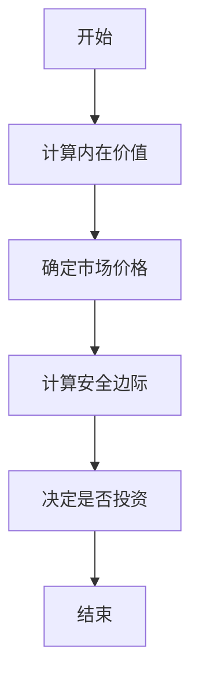
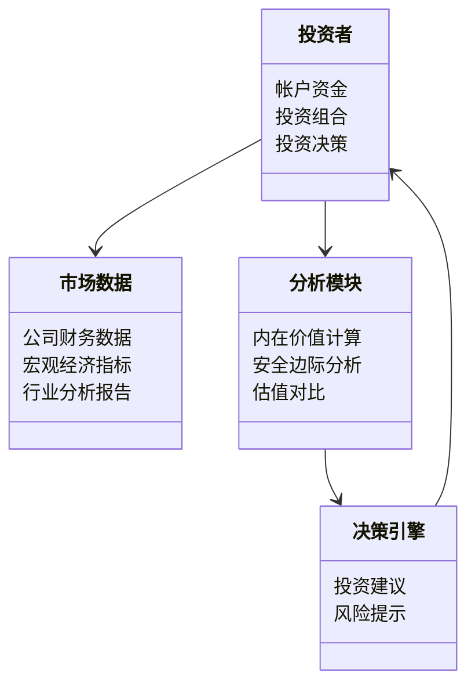
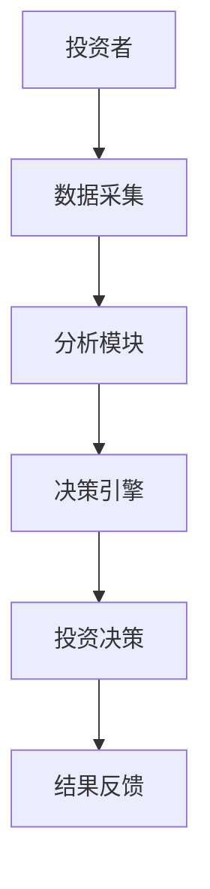

                 


# 马克·莫比乌斯的新兴市场价值投资策略

> **关键词**：马克·莫比乌斯、价值投资、新兴市场、安全边际、DCF模型、投资策略  
> **摘要**：本文系统地分析了马克·莫比乌斯在新兴市场中的价值投资策略，从背景介绍、核心概念、算法原理、系统分析、项目实战到最佳实践，详细解读了莫比乌斯的投资哲学、选股标准、风险控制方法，以及如何在新兴市场中应用价值投资策略。文章结合数学模型、流程图和实际案例，为读者提供了一个全面而深入的视角，帮助读者理解如何在新兴市场中实现稳健的投资回报。

---

## 第一部分: 背景介绍与核心概念

### 第1章: 价值投资的起源与马克·莫比乌斯的贡献

#### 1.1 价值投资的起源
- **1.1.1 价值投资的定义与核心理念**
  - 价值投资是一种以基本面分析为基础的投资方法，强调以低于内在价值的价格买入优质资产。
  - 核心理念：市场先生、安全边际、长期复利效应。

- **1.1.2 马克·莫比乌斯的生平与投资理念**
  - 莫比乌斯是新兴市场投资领域的权威，以其独特的价值投资方法闻名。
  - 投资理念：追求安全边际，注重基本面分析，长期持有优质资产。

- **1.1.3 新兴市场的定义与特点**
  - 新兴市场：指经济快速发展、资本市场逐步开放的国家或地区。
  - 特点：高增长潜力、波动性大、信息不透明。

---

### 第2章: 新兴市场价值投资的核心概念

#### 2.1 价值投资的基本原理
- **2.1.1 安全边际的概念与计算**
  - 安全边际 = 市场价格 - 内在价值。
  - 通过安全边际降低投资风险，确保买入价格低于内在价值。

- **2.1.2 市场先生与投资者心理**
  - 市场先生：象征市场情绪，投资者应理性应对市场的波动。
  - 投资者心理：贪婪与恐惧交替影响市场，新兴市场波动尤为明显。

- **2.1.3 内在价值与市场价值的关系**
  - 内在价值：基于基本面分析的未来现金流折现值。
  - 市场价值：受市场情绪和短期因素影响的价格。

#### 2.2 新兴市场的特殊性
- **2.2.1 新兴市场的风险与机会**
  - 风险：政策风险、流动性风险、汇率风险。
  - 机会：高增长潜力、估值洼地。

- **2.2.2 新兴市场的估值方法**
  - 相对估值：市盈率、市净率。
  - 绝对估值：现金流折现模型（DCF）。

- **2.2.3 新兴市场的行业分析**
  - 行业龙头：具有竞争优势的公司。
  - 市场地位：行业集中度与竞争格局。

---

## 第二部分: 核心概念与联系

### 第3章: 马克·莫比乌斯的投资策略

#### 3.1 莫比乌斯的投资哲学
- **3.1.1 长期投资与复利效应**
  - 长期投资：避免短期波动干扰，捕捉长期增长。
  - 复利效应：时间是价值投资的朋友。

- **3.1.2 遵循纪律的投资策略**
  - 遵守投资纪律，避免情绪化决策。
  - 严格筛选投资标的，注重基本面分析。

- **3.1.3 风险管理与组合构建**
  - 风险管理：分散投资、控制仓位。
  - 组合构建：平衡不同行业的资产，降低整体风险。

#### 3.2 莫比乌斯的选股标准
- **3.2.1 低市盈率与低市净率**
  - 低市盈率：低于行业平均水平，反映低估。
  - 低市净率：资产价值被市场低估。

- **3.2.2 高股息率与稳健的财务状况**
  - 高股息率：稳定分红，反映公司盈利能力强。
  - 稳健财务：低负债率、高现金流。

- **3.2.3 行业龙头与竞争优势**
  - 行业龙头：市场份额大、品牌影响力强。
  - 竞争优势：低成本、技术壁垒、市场垄断。

---

### 第4章: 新兴市场的价值投资实践

#### 4.1 新兴市场的投资框架
- **4.1.1 宏观经济分析**
  - 经济增长：GDP增速、通胀率。
  - 政策环境：财政政策、货币政策。

- **4.1.2 行业分析与公司分析**
  - 行业分析：行业生命周期、竞争格局。
  - 公司分析：财务报表、管理层素质。

- **4.1.3 技术分析与市场情绪**
  - 技术分析：K线图、均线、成交量。
  - 市场情绪：市场参与度、资金流向。

#### 4.2 莫比乌斯投资策略的实际案例
- **4.2.1 某新兴市场的成功投资案例**
  - 案例分析：某公司为何被选中，投资后的表现如何。
  - 数据支持：市盈率、市净率、现金流等指标的变化。

- **4.2.2 投资决策中的关键因素**
  - 价格与价值的匹配。
  - 行业前景与公司竞争优势。
  - 宏观经济环境的稳定性。

- **4.2.3 案例分析的启示**
  - 成功经验：基本面分析的重要性。
  - 教训：避免盲目跟风，注重长期价值。

---

## 第三部分: 核心概念的数学模型与公式

### 第5章: 核心概念的数学模型与公式

#### 5.1 安全边际的计算公式
- **5.1.1 安全边际的定义**
  - 安全边际是买入价格与内在价值之间的差额。

- **5.1.2 安全边际的计算公式**
  $$ \text{安全边际} = \text{市场价格} - \text{内在价值} $$

#### 5.2 内在价值的评估模型
- **5.2.1 现金流折现模型（DCF）**
  - DCF模型用于估算公司的内在价值，假设未来现金流可以折现为现值。

  $$ \text{DCF} = \frac{\text{CF}}{r - g} $$

  - 其中，CF为未来现金流，r为折现率，g为增长率。

- **5.2.2 市盈率与市净率的对比**
  - 市盈率（P/E）：
    $$ \text{市盈率} = \frac{\text{股价}}{\text{每股收益}} $$
  - 市净率（P/B）：
    $$ \text{市净率} = \frac{\text{股价}}{\text{每股净资产}} $$

---

### 第6章: 算法原理与流程图

#### 6.1 价值投资算法的流程图


---

## 第四部分: 系统分析与架构设计方案

### 第7章: 系统分析与架构设计方案

#### 7.1 系统功能设计
- **7.1.1 领域模型（mermaid类图）**


#### 7.2 系统架构设计


---

## 第五部分: 项目实战

### 第8章: 项目实战与代码实现

#### 8.1 环境安装
- Python 3.8+
- pandas、numpy、scipy库安装：
  ```bash
  pip install pandas numpy scipy
  ```

#### 8.2 核心实现源代码
- 计算内在价值的Python代码：
  ```python
  import numpy as np
  def calculate_intrinsic_value(cash_flows, discount_rate, growth_rate):
      return cash_flows / (discount_rate - growth_rate)
  ```

- 安全边际计算：
  ```python
  def calculate_margin_of_safety(market_price, intrinsic_value):
      return market_price - intrinsic_value
  ```

#### 8.3 代码应用解读与分析
- 计算内在价值的步骤：
  1. 收集未来现金流数据。
  2. 确定合理的折现率和增长率。
  3. 使用DCF公式计算内在价值。
  4. 对比市场价格，计算安全边际。

#### 8.4 实际案例分析
- 案例：某新兴市场公司的DCF分析。
  - 现金流：$100万。
  - 折现率：8%。
  - 增长率：5%。
  - 内在价值：
    $$ \frac{100}{0.08 - 0.05} = 3333.33 $$

---

## 第六部分: 最佳实践与总结

### 第9章: 最佳实践与总结

#### 9.1 小结
- 价值投资的核心是寻找价格低于内在价值的资产。
- 新兴市场的特殊性要求投资者更加注重基本面分析和风险管理。

#### 9.2 注意事项
- 避免情绪化决策，遵循纪律。
- 定期复盘，调整投资组合。
- 关注宏观经济和政策变化。

#### 9.3 拓展阅读
- 格雷厄姆的《证券分析》。
- 巴菲特的《巴菲特致股东的信》。
- 莫比乌斯的《投资新兴市场》。

---

## 作者

**作者：AI天才研究院/AI Genius Institute & 禅与计算机程序设计艺术 /Zen And The Art of Computer Programming**

---

通过以上结构，文章从背景、概念、算法、系统、实战到总结，全面解读了马克·莫比乌斯的新兴市场价值投资策略，帮助读者系统地理解和应用这一投资方法。

