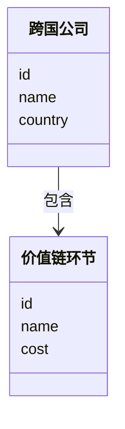

                 


# 马克·莫比乌斯的跨国公司价值链分析

## 关键词：跨国公司，价值链分析，数据分析，人工智能优化，系统架构设计

## 摘要：  
本文详细分析了马克·莫比乌斯的跨国公司价值链分析方法，探讨了如何通过优化价值链提升企业竞争力。文章从背景介绍、核心概念、数据分析与算法、系统架构设计、项目实战到最佳实践，全面解析了跨国公司价值链优化的策略和方法，为企业的全球化发展提供了有价值的参考。

---

## 第一部分：跨国公司与价值链概述

### 第1章：跨国公司的定义与发展

#### 1.1 跨国公司的定义与发展

跨国公司（Transnational Corporations, TNCs）是指在多个国家拥有业务运营和控制权的企业。随着全球化的发展，跨国公司已成为全球经济的重要组成部分。它们通过在全球范围内配置资源，利用不同国家的成本优势和市场机会，实现更高的效率和利润。

马克·莫比乌斯的分析方法强调，跨国公司的核心竞争力在于其价值链的优化。价值链是指企业从原材料采购、生产、分销到最终交付给消费者的整个过程。通过优化价值链中的各个环节，企业可以降低成本、提高效率，并增强市场竞争力。

---

## 第二部分：价值链分析的核心概念与联系

### 第2章：价值链分析的理论基础

#### 2.1 跨国公司价值链分析的核心概念

价值链分析的核心在于识别企业内部和外部的关键活动，并优化这些活动以实现更高的价值。根据迈克尔·波特的价值链模型，企业活动可以分为基本活动和辅助活动。对于跨国公司而言，这些活动往往分布在不同的国家和地区，因此需要考虑地理、文化和法律环境的差异。

马克·莫比乌斯提出，跨国公司应将价值链分为核心环节和非核心环节。核心环节是直接影响企业竞争力的部分，如研发、生产和服务；而非核心环节则可以外包或委托给第三方，以降低运营成本。

#### 2.2 跨国公司价值链分析的理论对比

为了更好地理解跨国公司价值链分析的理论基础，我们需要将波特的通用模型与适用于跨国公司的特定模型进行对比。以下是一个对比表格：

| **对比维度** | **波特的通用模型** | **跨国公司特定模型** |
|--------------|---------------------|-----------------------|
| **适用范围** | 适用于所有企业     | 适用于跨国公司       |
| **核心关注点** | 优化内部流程         | 全球化资源配置与协调   |
| **关键活动** | 采购、生产、销售     | 全球供应链管理、本地化 |
| **复杂性**   | 较低                 | 较高                   |

此外，我们可以通过ER图进一步分析跨国公司的价值链结构。以下是一个简单的ER图示例：

```mermaid
erDiagram
    customer[顾客] {
        id
        name
        location
    }
    supplier[供应商] {
        id
        name
        location
    }
    product[产品] {
        id
        name
        price
    }
    order[订单] {
        id
        date
        status
    }
    <<关联关系>> {
        customer_order : customer -> order
        supplier_product : supplier -> product
        product_order : product -> order
    }
```

---

## 第三部分：数据分析与优化算法

### 第3章：数据分析与优化算法

#### 3.1 数据分析在价值链优化中的应用

数据分析是优化跨国公司价值链的核心工具。通过收集和分析来自全球各地的数据，企业可以识别效率低下的环节，并制定相应的优化策略。以下是数据分析的主要应用场景：

1. **成本分析**：通过分析采购、生产、运输等环节的成本数据，识别成本超支的原因。
2. **销售预测**：利用历史销售数据和市场趋势，预测未来的销售情况，优化库存管理。
3. **供应链优化**：分析供应链中的瓶颈，优化物流和运输路线，降低运输成本。

#### 3.2 基于数据流的优化算法

为了优化跨国公司的价值链，我们可以设计一个基于数据流的优化算法。以下是一个数据流图示例：


以下是一个Python代码示例，用于分析跨国公司的成本数据：

```python
import pandas as pd

# 加载数据
data = pd.read_csv('cost_data.csv')

# 计算总成本
total_cost = data['cost'].sum()

# 找出成本最高的部门
max_cost_department = data[data['cost'] == data['cost'].max()]['department'].values[0]

print(f"总成本：{total_cost}")
print(f"成本最高的部门：{max_cost_department}")
```

---

## 第四部分：数学模型与公式

### 第4章：数学模型与公式

#### 4.1 成本函数

成本函数用于计算跨国公司在全球不同地区的生产成本。假设一家公司在多个国家生产同一产品，其总成本可以表示为：

$$ \text{总成本} = \sum_{i=1}^{n} (\text{单位成本}_i \times \text{产量}_i) $$

其中，$n$ 是国家的数量，$\text{单位成本}_i$ 是第 $i$ 个国家的单位生产成本，$\text{产量}_i$ 是第 $i$ 个国家的产量。

#### 4.2 收益预测模型

收益预测模型用于预测跨国公司在不同市场的收益情况。可以使用线性回归模型：

$$ \text{收益} = \beta_0 + \beta_1 \times \text{价格} + \beta_2 \times \text{广告支出} + \epsilon $$

其中，$\beta_0$ 是截距，$\beta_1$ 和 $\beta_2$ 是回归系数，$\epsilon$ 是误差项。

---

## 第五部分：系统架构设计

### 第5章：系统架构设计

#### 5.1 领域模型设计

以下是跨国公司价值链分析的领域模型：



#### 5.2 系统架构设计

以下是支持跨国公司价值链分析的系统架构图：


---

## 第六部分：项目实战

### 第6章：项目实战

#### 6.1 环境安装

为了进行数据分析，我们需要安装以下工具：

1. **Python**：用于数据分析和编程。
2. **Pandas**：用于数据处理。
3. **Matplotlib/Seaborn**：用于数据可视化。
4. **Jupyter Notebook**：用于数据分析和建模。

安装命令：

```bash
pip install pandas matplotlib seaborn
```

#### 6.2 核心代码实现

以下是优化跨国公司价值链的核心代码示例：

```python
import pandas as pd
import matplotlib.pyplot as plt

# 加载数据
data = pd.read_csv('value_chain.csv')

# 可视化成本分布
data['cost'].hist(bins=10)
plt.title('成本分布')
plt.show()

# 识别高成本环节
high_cost = data[data['cost'] > data['cost'].mean()]
print("高成本环节：", high_cost['环节'])
```

#### 6.3 案例分析

假设我们有一个跨国公司，其价值链中的运输环节成本较高。通过数据分析，我们发现运输成本占总成本的30%。为了优化，我们可以考虑以下策略：

1. **优化运输路线**：使用更短的运输路线或选择成本更低的运输商。
2. **批量采购**：与多个供应商合作，提高议价能力。
3. **技术优化**：引入自动化仓储系统，减少人工成本。

---

## 第七部分：最佳实践与总结

### 第7章：最佳实践

#### 7.1 实践总结

通过本文的分析，我们得出以下结论：

1. 跨国公司的核心竞争力在于优化其价值链。
2. 数据分析和人工智能技术是优化价值链的重要工具。
3. 全球化管理和本地化运营的结合是实现价值链优化的关键。

#### 7.2 注意事项

在实际操作中，需要注意以下几点：

1. **数据隐私**：跨国公司需要遵守不同国家的数据隐私法规。
2. **文化差异**：在不同国家运营时，需要考虑文化差异对业务的影响。
3. **风险管理**：制定有效的风险管理策略，以应对全球经济的不确定性。

#### 7.3 拓展阅读

建议进一步阅读以下内容：

1. 迈克尔·波特的《竞争优势》。
2. 《供应链管理：战略与案例分析》。
3. 《数据分析与商业智能》。

---

## 作者：AI天才研究院 & 禅与计算机程序设计艺术

---

通过以上结构，我们详细分析了马克·莫比乌斯的跨国公司价值链分析方法，并展示了如何通过数据分析和系统优化来提升企业的竞争力。希望本文能够为跨国公司的管理者和技术人员提供有价值的参考和启发。

