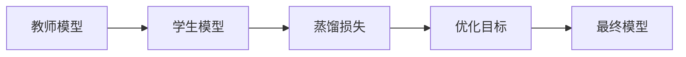
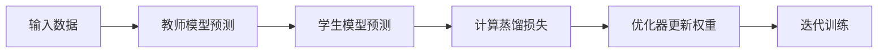
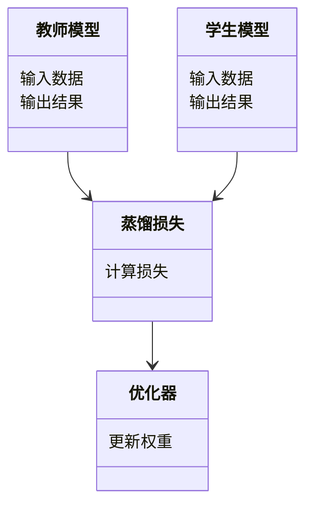
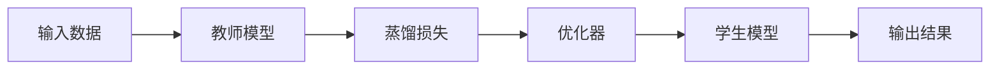

                 


# AI Agent 的知识蒸馏：从大型 LLM 到轻量级模型

> 关键词：AI Agent, 知识蒸馏, 大型语言模型, 轻量级模型, 模型压缩

> 摘要：本文深入探讨了AI Agent中知识蒸馏的核心原理与应用，从大型语言模型（LLM）到轻量级模型的转换过程，通过数学模型、算法实现和系统设计的详细分析，展示了如何高效地将知识从复杂模型迁移到轻量级模型，同时保持性能和准确性的平衡。文章结合理论与实践，为读者提供了从原理理解到实际应用的完整指南。

---

## 第1章 AI Agent 与知识蒸馏概述

### 1.1 AI Agent 的基本概念

#### 1.1.1 AI Agent 的定义与分类
AI Agent（人工智能代理）是指能够感知环境、自主决策并执行任务的智能实体。根据功能和应用场景，AI Agent可以分为以下几类：
- **简单反射型 Agent**：基于预定义规则进行简单响应。
- **基于模型的反射型 Agent**：利用内部模型进行状态更新和决策。
- **目标驱动型 Agent**：基于明确的目标进行复杂推理和规划。
- **效用驱动型 Agent**：通过最大化效用函数来优化决策。

#### 1.1.2 大型语言模型（LLM）的特性
大型语言模型（如GPT-3、GPT-4）具有以下显著特点：
- **参数规模大**：通常包含 billions 量级的参数。
- **上下文理解能力强**：能够处理长文本，捕捉上下文关系。
- **多任务通用性**：通过提示工程技术，可以执行多种任务（文本生成、问答、翻译等）。

#### 1.1.3 轻量级模型的优势与应用场景
轻量级模型在资源受限的场景中具有明显优势：
- **计算资源消耗低**：适合边缘设备（IoT、移动设备）部署。
- **响应速度快**：延迟低，适合实时任务。
- **易于集成**：便于与其他系统或API接口结合。

---

### 1.2 知识蒸馏的核心目标

知识蒸馏的目标是将大型模型的知识迁移到轻量级模型中，同时保持或接近原模型的性能。具体目标包括：
- **减少模型体积**：通过蒸馏技术降低模型参数数量。
- **提高推理效率**：在资源受限的环境中实现快速响应。
- **保持模型性能**：确保轻量级模型在关键指标（如准确率、生成质量）上接近原模型。

---

### 1.3 知识蒸馏的背景与意义

#### 1.3.1 大型模型的局限性
尽管大型语言模型在性能上表现出色，但其资源消耗高、部署复杂，难以在边缘设备或实时系统中广泛应用。

#### 1.3.2 轻量级模型的需求
随着AI技术的普及，对轻量级模型的需求日益增长，尤其是在移动应用、物联网设备和实时交互场景中。

#### 1.3.3 知识蒸馏在 AI Agent 中的作用
知识蒸馏是实现从复杂模型到轻量级模型知识转移的关键技术，能够帮助AI Agent在资源受限的环境中仍能保持高性能。

---

## 第2章 知识蒸馏的核心概念与联系

### 2.1 教师模型与学生模型的关系

#### 2.1.1 教师模型的选择标准
教师模型通常选择性能优秀但参数量大的模型，如GPT-3或BERT。选择标准包括：
- **性能**：在基准测试中表现优异。
- **参数规模**：通常在 billions 量级。
- **可训练性**：易于调整和微调。

#### 2.1.2 学生模型的设计原则
学生模型通常是轻量级模型，如较小的Transformer或LSTM结构。设计原则包括：
- **参数少**：通过减少层数或隐藏层维度降低复杂度。
- **速度快**：优化计算效率，减少内存占用。
- **易于训练**：采用合适的学习率和训练策略。

#### 2.1.3 教师与学生模型的交互机制
知识蒸馏通过以下步骤实现知识转移：
1. 教师模型生成高质量的中间表示或软标签。
2. 学生模型通过模仿学习，优化自身参数以匹配教师模型的输出。

---

### 2.2 知识蒸馏的关键属性对比

#### 2.2.1 不同蒸馏方法的对比分析
常见的蒸馏方法包括：
- **软标签蒸馏**：基于概率分布的KL散度损失。
- **硬标签蒸馏**：直接迁移类别标签。
- **特征蒸馏**：提取中间层特征进行迁移。

| 蒸馏方法 | 核心思想 | 优缺点 |
|----------|----------|--------|
| 软标签蒸馏 | 基于概率分布的损失函数 | 精度高，但计算复杂度高 |
| 硬标签蒸馏 | 迁移类别标签 | 计算简单，但可能损失概率信息 |
| 特征蒸馏 | 提取中间层特征 | 适合特定任务，灵活性高 |

#### 2.2.2 模型压缩与蒸馏的异同
- **模型压缩**：通过剪枝、量化等技术减少模型大小。
- **蒸馏**：通过知识转移降低模型复杂度。
- **共同点**：都旨在减少模型体积。
- **区别**：蒸馏依赖于教师模型的知识，而模型压缩通常不依赖外部模型。

#### 2.2.3 蒸馏过程中的损失函数选择
常用的损失函数包括：
- **KL散度**：衡量两个概率分布的差异。
- **交叉熵损失**：常用于分类任务的蒸馏。

---

### 2.3 知识蒸馏的ER实体关系图



---

## 第3章 知识蒸馏的算法原理

### 3.1 蒸馏过程的数学模型

#### 3.1.1 蒸馏损失函数的定义
KL散度损失函数用于衡量学生模型预测结果与教师模型预测结果的差异：
$$L_{distill} = -\sum_{i} p_i \log q_i$$
其中，\(p_i\) 是教师模型的预测概率，\(q_i\) 是学生模型的预测概率。

#### 3.1.2 蒸馏损失函数的优化
优化目标是最小化蒸馏损失函数：
$$\min_{\theta} L_{distill}$$
通过反向传播和优化器（如Adam）更新学生模型的参数。

---

### 3.2 蒸馏算法的流程图



---

### 3.3 蒸馏算法的Python实现

#### 3.3.1 环境安装与依赖管理
```bash
pip install numpy torch
```

#### 3.3.2 教师模型与学生模型的定义
```python
import torch
import torch.nn as nn

# 教师模型：简单实现（仅为示例）
class TeacherModel(nn.Module):
    def __init__(self):
        super().__init__()
        self.fc = nn.Linear(10, 5)

    def forward(self, x):
        return torch.softmax(self.fc(x), dim=1)

# 学生模型：轻量级模型
class StudentModel(nn.Module):
    def __init__(self):
        super().__init__()
        self.fc = nn.Linear(10, 5)

    def forward(self, x):
        return torch.softmax(self.fc(x), dim=1)
```

#### 3.3.3 蒸馏损失函数的实现
```python
def distillation_loss(student_output, teacher_output, temperature=2):
    # 调整温度以软化概率分布
    teacher_output = teacher_output.pow(1.0 / temperature)
    student_output = student_output.pow(1.0 / temperature)
    
    # 计算KL散度
    loss = torch.nn.KLDivLoss(reduction='batchmean')(torch.log(teacher_output), student_output)
    return loss
```

#### 3.3.4 训练循环的代码示例
```python
def train(student_model, teacher_model, optimizer, criterion, epochs=100):
    for epoch in range(epochs):
        for batch_input, batch_label in dataloader:
            # 前向传播
            with torch.no_grad():
                teacher_output = teacher_model(batch_input)
            student_output = student_model(batch_input)
            
            # 计算蒸馏损失
            loss = criterion(student_output, teacher_output)
            
            # 反向传播与优化
            optimizer.zero_grad()
            loss.backward()
            optimizer.step()
```

---

## 第4章 知识蒸馏的数学模型与公式

### 4.1 蒸馏过程的数学公式

#### 4.1.1 蒸馏损失函数的公式推导
$$L_{distill} = -\sum_{i} p_i \log q_i$$
其中，\(p_i\) 是教师模型的输出概率，\(q_i\) 是学生模型的输出概率。

#### 4.1.2 蒸馏损失函数的优化目标
$$\min_{\theta} L_{distill}$$
通过优化器（如Adam）更新学生模型的参数，使其预测结果尽可能接近教师模型。

---

### 4.2 模型压缩的数学分析

#### 4.2.1 矩阵分解的数学表达
假设原模型的参数矩阵为 \(A\)，矩阵分解的目标是将其分解为低秩矩阵的乘积：
$$A = U \Sigma V^T$$
其中，\(U\) 和 \(V\) 是分解后的矩阵，\(\Sigma\) 是对角矩阵。

#### 4.2.2 矩阵低秩近似的方法
通过截断奇异值，实现矩阵的低秩近似：
$$A_{compressed} = U_k \Sigma_k V_k^T$$
其中，\(k\) 是选择的秩，通常远小于原矩阵的秩。

---

## 第5章 系统分析与架构设计方案

### 5.1 系统分析

#### 5.1.1 系统目标与范围
系统目标：将大型语言模型的知识迁移到轻量级模型中，实现高效的知识蒸馏。

系统范围：涵盖从数据准备、模型训练到模型部署的完整流程。

---

### 5.2 系统功能设计

#### 5.2.1 领域模型（ER类图）


---

### 5.3 系统架构设计

#### 5.3.1 系统架构图


---

## 第6章 项目实战

### 6.1 环境安装与代码实现

#### 6.1.1 环境安装
```bash
pip install numpy torch
```

#### 6.1.2 代码实现
```python
import torch
import torch.nn as nn
from torch.utils.data import DataLoader

# 数据集准备（示例）
class CustomDataset(torch.utils.data.Dataset):
    def __init__(self, data, labels):
        self.data = data
        self.labels = labels
        
    def __len__(self):
        return len(self.data)
        
    def __getitem__(self, idx):
        return self.data[idx], self.labels[idx]

# 数据加载器
dataloader = DataLoader(CustomDataset(...), batch_size=32, shuffle=True)

# 模型定义
class TeacherModel(nn.Module):
    def __init__(self):
        super().__init__()
        self.fc = nn.Linear(10, 5)

    def forward(self, x):
        return torch.softmax(self.fc(x), dim=1)

class StudentModel(nn.Module):
    def __init__(self):
        super().__init__()
        self.fc = nn.Linear(10, 5)

    def forward(self, x):
        return torch.softmax(self.fc(x), dim=1)

# 训练函数
def train(student_model, teacher_model, optimizer, criterion, dataloader, epochs=100):
    for epoch in range(epochs):
        for batch_input, batch_label in dataloader:
            # 前向传播
            with torch.no_grad():
                teacher_output = teacher_model(batch_input)
            student_output = student_model(batch_input)
            
            # 计算蒸馏损失
            loss = criterion(student_output, teacher_output)
            
            # 反向传播与优化
            optimizer.zero_grad()
            loss.backward()
            optimizer.step()

# 初始化与训练
teacher_model = TeacherModel()
student_model = StudentModel()
optimizer = torch.optim.Adam(student_model.parameters(), lr=0.001)
criterion = nn.KLDivLoss(reduction='batchmean')

train(student_model, teacher_model, optimizer, criterion, dataloader, epochs=100)
```

---

## 第7章 总结与展望

### 7.1 总结
知识蒸馏是实现从大型语言模型到轻量级模型知识转移的关键技术。通过教师模型和学生模型的交互，能够在保持性能的同时显著降低模型复杂度，满足实际应用中的资源限制需求。

---

### 7.2 最佳实践 tips

1. **选择合适的蒸馏方法**：根据任务需求选择软标签蒸馏或硬标签蒸馏。
2. **调整温度参数**：适当调整温度参数可以软化概率分布，提高蒸馏效果。
3. **结合模型压缩技术**：在蒸馏过程中结合剪枝或量化技术，进一步优化模型体积。

---

### 7.3 未来展望

随着AI技术的不断发展，知识蒸馏将在以下方面进一步发展：
- **多模态蒸馏**：结合视觉、听觉等多种模态信息，提升蒸馏效果。
- **自适应蒸馏**：根据任务动态调整蒸馏策略，实现自适应知识转移。
- **分布式蒸馏**：在分布式系统中实现大规模模型的并行蒸馏，提升效率。

---

## 作者

**作者：AI天才研究院/AI Genius Institute & 禅与计算机程序设计艺术 /Zen And The Art of Computer Programming**

---

感谢您的阅读！希望这篇文章能为您提供有价值的知识和启发！

