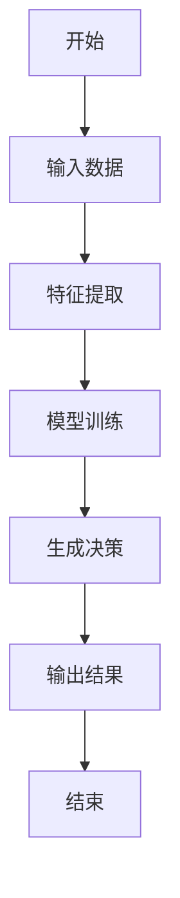
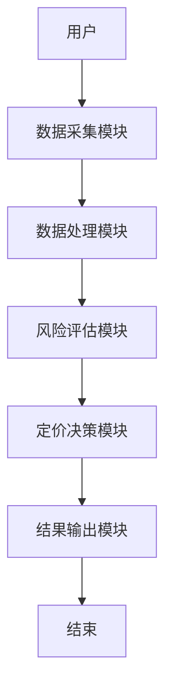

                 


# AI Agent在智能风险定价中的应用

> 关键词：AI Agent, 智能风险定价, 人工智能, 金融风险, 定价模型

> 摘要：本文探讨AI Agent在智能风险定价中的应用，分析其在金融领域的优势，结合具体案例和算法，阐述如何利用AI Agent提升风险定价的效率和准确性。

---

# 第1章: AI Agent与智能风险定价概述

## 1.1 AI Agent的基本概念

### 1.1.1 AI Agent的定义与特点

AI Agent（人工智能代理）是指能够感知环境、自主决策并采取行动的智能实体。与传统软件不同，AI Agent具备以下特点：

- **自主性**：能够在没有外部干预的情况下自主运行。
- **反应性**：能够实时感知环境变化并做出反应。
- **学习能力**：通过数据和经验不断优化自身的决策能力。

### 1.1.2 AI Agent的核心原理

AI Agent的核心原理基于人工智能技术，主要包括以下三个步骤：

1. **感知环境**：通过传感器或数据输入接口获取环境信息。
2. **决策制定**：利用算法对获取的信息进行分析，制定最优决策。
3. **执行行动**：根据决策结果执行相应的操作。

### 1.1.3 AI Agent在金融领域的应用潜力

AI Agent在金融领域的应用潜力巨大，尤其是在风险定价方面。传统风险定价方法依赖于人工经验，存在效率低、准确性差的问题。AI Agent可以通过大数据分析和机器学习算法，快速、准确地评估风险，优化定价策略。

---

## 1.2 智能风险定价的背景与意义

### 1.2.1 风险定价的基本概念

风险定价是指在金融交易中，根据风险的大小确定相应的价格或利率。合理的风险定价能够确保金融市场的稳定运行，同时为投资者提供公平的回报。

### 1.2.2 传统风险定价的局限性

传统风险定价方法主要依赖于历史数据和专家经验，存在以下问题：

- **数据维度有限**：传统方法通常只能利用有限的数据维度进行分析，无法捕捉复杂的风险因素。
- **主观性较强**：定价结果受到人为因素的影响，可能导致偏差。
- **效率低下**：面对海量数据时，人工定价效率难以满足市场需求。

### 1.2.3 AI技术在风险定价中的优势

AI技术的引入为风险定价带来了显著优势：

- **数据处理能力**：AI能够处理海量数据，提取更多维度的信息。
- **自动化决策**：通过机器学习算法，AI能够快速生成定价决策。
- **动态调整**：AI能够实时跟踪市场变化，动态优化定价策略。

---

## 1.3 AI Agent在智能风险定价中的作用

### 1.3.1 AI Agent如何提升风险定价效率

AI Agent通过自动化数据处理和决策制定，显著提升了风险定价的效率。例如，AI Agent可以在几秒钟内完成对客户信用风险的评估，而传统方法可能需要数天时间。

### 1.3.2 AI Agent在风险评估中的应用

AI Agent可以利用自然语言处理（NLP）技术分析非结构化数据，如新闻报道、社交媒体信息，从而更全面地评估风险。

### 1.3.3 AI Agent对金融决策的支持作用

AI Agent不仅能够生成定价决策，还可以为金融决策者提供实时的市场洞察和风险预警，帮助他们做出更明智的决策。

---

## 1.4 本章小结

本章介绍了AI Agent的基本概念和核心原理，并分析了其在智能风险定价中的潜力。AI Agent通过自动化、智能化的方式，显著提升了风险定价的效率和准确性，为金融行业带来了新的机遇。

---

# 第2章: AI Agent的核心概念与联系

## 2.1 AI Agent的核心原理

### 2.1.1 AI Agent的感知与决策机制

AI Agent的感知机制通过多种传感器或数据源获取信息，例如：

- **传感器数据**：如温度、湿度等环境数据。
- **文本数据**：如新闻、社交媒体信息。
- **结构化数据**：如数据库中的交易记录。

决策机制则基于感知到的信息，利用算法生成最优决策。例如，AI Agent可以通过强化学习算法，在股票交易中选择最佳的买卖时机。

### 2.1.2 AI Agent的学习与推理能力

AI Agent的学习能力使其能够通过历史数据不断优化自身的决策模型。推理能力则使其能够基于现有信息进行逻辑推理，解决复杂问题。

### 2.1.3 AI Agent的自适应能力

AI Agent的自适应能力使其能够根据环境变化自动调整自身的行为策略。例如，在金融市场中，AI Agent可以根据市场波动自动调整投资组合。

---

## 2.2 AI Agent与智能风险定价的核心要素

### 2.2.1 数据驱动的定价模型

数据驱动的定价模型利用大数据技术，从海量数据中提取有用信息，构建风险定价模型。例如，利用客户的历史信用记录和消费行为数据，预测客户的违约风险。

### 2.2.2 AI Agent的决策逻辑

AI Agent的决策逻辑基于机器学习模型，例如支持向量机（SVM）和随机森林（Random Forest）。这些模型能够从数据中学习，生成个性化的定价策略。

### 2.2.3 风险定价的动态调整机制

动态调整机制使得AI Agent能够实时跟踪市场变化，不断优化风险定价策略。例如，当市场利率发生变化时，AI Agent可以快速调整贷款定价。

---

## 2.3 AI Agent与智能风险定价的ER实体关系图

```mermaid
er
actor: 用户
agent: AI Agent
model: 风险定价模型
data: 数据源
action: 行为决策
```

---

## 2.4 本章小结

本章详细介绍了AI Agent的核心原理和其在智能风险定价中的应用。通过数据驱动的定价模型和动态调整机制，AI Agent能够高效地进行风险评估和定价决策。

---

# 第3章: AI Agent的算法原理

## 3.1 AI Agent的核心算法

### 3.1.1 基于强化学习的AI Agent

强化学习是一种通过试错机制优化决策的算法。例如，AI Agent可以通过强化学习在股票交易中选择最佳的买卖时机。

### 3.1.2 基于监督学习的AI Agent

监督学习是一种通过标记数据训练模型的算法。例如，AI Agent可以通过监督学习识别欺诈交易。

### 3.1.3 基于无监督学习的AI Agent

无监督学习是一种通过发现数据中的模式进行分类的算法。例如，AI Agent可以通过无监督学习识别客户群体的潜在风险特征。

---

## 3.2 AI Agent的数学模型

### 3.2.1 强化学习的数学模型

强化学习的核心是Q-learning算法，其数学模型如下：

$$ Q(s, a) = Q(s, a) + \alpha [r(s, a) + \gamma \max Q(s', a') - Q(s, a)] $$

其中：
- \( Q(s, a) \) 表示状态 \( s \) 下动作 \( a \) 的价值。
- \( \alpha \) 表示学习率。
- \( \gamma \) 表示折扣因子。
- \( r(s, a) \) 表示奖励函数。

### 3.2.2 监督学习的数学模型

监督学习的核心是线性回归模型，其数学模型如下：

$$ y = \theta x + \beta $$

其中：
- \( y \) 表示目标变量。
- \( \theta \) 表示回归系数。
- \( x \) 表示自变量。
- \( \beta \) 表示截距。

### 3.2.3 聚类分析的数学模型

聚类分析是一种无监督学习技术，其数学模型如下：

$$ \text{目标函数} = \sum_{i=1}^{n} \sum_{j=1}^{k} w_{ij} \cdot I(c_i = c_j) $$

其中：
- \( w_{ij} \) 表示样本 \( i \) 和 \( j \) 之间的相似性权重。
- \( c_i \) 表示样本 \( i \) 的聚类标签。
- \( I(c_i = c_j) \) 表示指示函数，当 \( c_i = c_j \) 时为1，否则为0。

---

## 3.3 AI Agent的算法流程图



---

## 3.4 本章小结

本章详细介绍了AI Agent的核心算法及其数学模型。通过强化学习、监督学习和无监督学习，AI Agent能够高效地进行风险评估和定价决策。

---

# 第4章: 智能风险定价系统架构

## 4.1 系统功能设计

### 4.1.1 数据采集模块

数据采集模块负责从多种数据源获取数据，例如：

- **数据库**：如客户信息、交易记录。
- **API接口**：如第三方数据服务。
- **文件导入**：如CSV、Excel文件。

### 4.1.2 风险评估模块

风险评估模块利用机器学习模型对客户进行风险评估。例如，使用随机森林模型预测客户的违约概率。

### 4.1.3 定价决策模块

定价决策模块根据风险评估结果生成定价策略。例如，根据客户的信用评分，自动调整贷款利率。

### 4.1.4 结果输出模块

结果输出模块将定价结果输出给用户，例如通过网页界面显示定价结果。

---

## 4.2 系统架构设计



---

## 4.3 本章小结

本章详细介绍了智能风险定价系统的功能设计和系统架构。通过模块化设计，系统能够高效地进行数据处理、风险评估和定价决策。

---

# 作者：AI天才研究院/AI Genius Institute & 禅与计算机程序设计艺术 /Zen And The Art of Computer Programming

---

以上是《AI Agent在智能风险定价中的应用》的技术博客文章的详细内容，涵盖AI Agent的核心概念、算法原理和系统架构设计。希望对您有所帮助！

