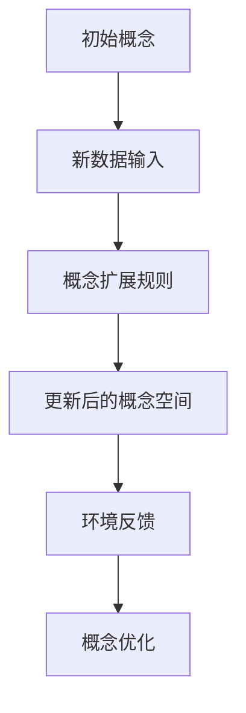
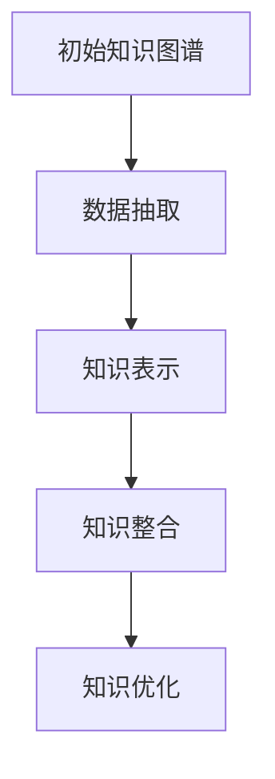
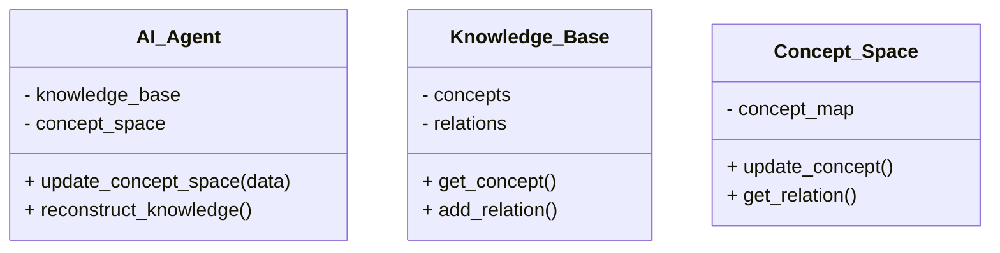
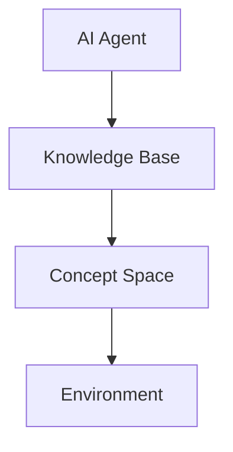
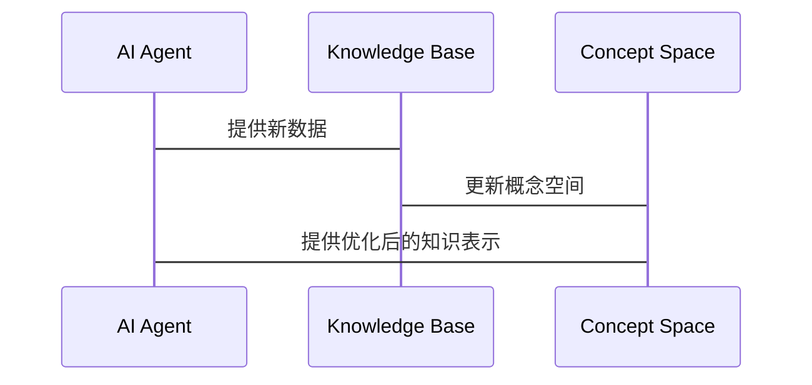

                 


# AI Agent的增量式概念形成与知识重构

**关键词：** AI Agent, 增量式概念形成, 知识重构, 概念空间, 知识图谱, 机器学习, 自适应系统

**摘要：** 本文深入探讨AI Agent如何通过增量式概念形成与知识重构技术，实现对复杂问题的自适应理解和动态调整。文章首先介绍AI Agent的基本概念，接着分析增量式概念形成的核心原理，包括概念空间的动态扩展和概念间关系的重构。然后，详细阐述知识重构的方法论，包括基于知识图谱的语义分析和基于机器学习的特征提取。通过实际案例分析，展示如何将增量式概念形成与知识重构技术应用于实际场景，最后总结该技术在AI Agent系统中的应用价值和发展前景。

---

## 第一章：AI Agent的基本概念

### 1.1 AI Agent的定义与特点
AI Agent（人工智能代理）是指在计算机系统中能够感知环境、自主决策并执行任务的智能实体。它具备以下核心特点：
1. **自主性**：能够在没有外部干预的情况下独立运作。
2. **反应性**：能够实时感知环境并做出响应。
3. **目标导向**：具备明确的目标，所有行为都围绕目标展开。
4. **学习能力**：能够通过经验或数据优化自身的决策过程。

### 1.2 增量式概念形成的问题背景
增量式概念形成是指在AI Agent与环境交互的过程中，逐步构建和更新概念空间的过程。其核心问题在于如何在有限的初始知识基础上，通过与环境的交互动态扩展和优化概念空间。这种技术能够使AI Agent在面对新信息时，灵活调整自身的认知结构。

### 1.3 知识重构的重要性
知识重构是指通过对现有知识的重新组织和整合，形成更高效、更准确的知识表示。在AI Agent中，知识重构是实现增量式概念形成的关键技术，它能够帮助AI Agent更好地理解和处理复杂信息，提升决策的准确性和效率。

---

## 第二章：增量式概念形成的核心原理

### 2.1 增量式概念形成的定义与特点
增量式概念形成是一种动态构建概念空间的方法，其特点包括：
1. **动态性**：概念空间随着新信息的输入而不断更新。
2. **渐进性**：概念的形成是一个逐步深化的过程。
3. **自适应性**：能够根据环境反馈调整概念的表示方式。

### 2.2 增量式概念形成的核心要素
为了实现增量式概念形成，需要以下核心要素：
1. **初始概念集**：AI Agent在初始阶段已有的基本概念。
2. **概念扩展规则**：用于指导概念的扩展和细化。
3. **环境反馈机制**：通过与环境交互获取新信息以调整概念。

### 2.3 增量式概念形成的对比分析
下表展示了增量式概念形成与其他概念形成方法的对比：

| 对比维度         | 增量式概念形成       | 批量式概念形成       |
|------------------|---------------------|---------------------|
| 输入方式         | 逐步输入新数据       | 一次性输入所有数据   |
| 处理速度         | 较慢，逐步优化       | 较快，一次性处理     |
| 灵活性           | 高，适应新数据       | 低，不适应新数据     |

### 2.4 实体关系图：增量式概念形成中的实体关系
以下是增量式概念形成中的实体关系图：



---

## 第三章：知识重构的方法论

### 3.1 知识重构的定义与特点
知识重构是指通过对现有知识的重新组织和整合，形成更高效、更准确的知识表示。其特点包括：
1. **高效性**：能够快速提取和整合关键信息。
2. **准确性**：通过优化知识表示，减少冗余和冲突。
3. **可扩展性**：能够适应新知识的不断输入。

### 3.2 知识重构的核心步骤
知识重构通常包括以下步骤：
1. **知识抽取**：从原始数据中提取关键信息。
2. **知识表示**：将抽取的信息转化为结构化的知识表示。
3. **知识整合**：将多个来源的知识整合到统一的知识图谱中。
4. **知识优化**：通过优化算法进一步精简和优化知识表示。

### 3.3 知识重构的算法实现
以下是基于知识图谱的重构算法：



### 3.4 知识重构的数学模型
知识重构的数学模型通常基于图论和概率论。以下是一个简化的知识重构模型：

$$
P(c_i | d_j) = \frac{P(d_j | c_i) \cdot P(c_i)}{P(d_j)}
$$

其中：
- $c_i$ 表示第i个概念。
- $d_j$ 表示第j个数据点。
- $P(c_i | d_j)$ 表示在数据点 $d_j$ 下，概念 $c_i$ 的概率。

---

## 第四章：系统分析与架构设计方案

### 4.1 应用场景介绍
增量式概念形成与知识重构技术广泛应用于智能推荐系统、自然语言处理、自动驾驶等领域。例如，在智能推荐系统中，AI Agent可以通过增量式概念形成动态调整推荐策略。

### 4.2 系统功能设计
以下是系统功能设计的类图：



### 4.3 系统架构设计
以下是系统的架构图：



### 4.4 接口与交互设计
以下是系统的交互图：



---

## 第五章：项目实战

### 5.1 环境安装
要实现增量式概念形成与知识重构，首先需要安装以下环境：
- Python 3.8+
- Jupyter Notebook
- TensorFlow 2.0+

### 5.2 核心代码实现
以下是Python代码示例：

```python
class AIAgent:
    def __init__(self, initial_concepts):
        self.concept_space = initial_concepts

    def update_concept_space(self, new_data):
        # 使用增量式概念形成算法更新概念空间
        pass

    def reconstruct_knowledge(self):
        # 使用知识重构算法优化知识表示
        pass

# 示例用法
initial_concepts = ["概念1", "概念2"]
agent = AIAgent(initial_concepts)
agent.update_concept_space(new_data)
agent.reconstruct_knowledge()
```

### 5.3 案例分析
以智能推荐系统为例，以下是案例分析步骤：
1. **数据输入**：用户输入新的数据点。
2. **概念更新**：AI Agent根据新数据更新概念空间。
3. **知识重构**：优化知识表示，提升推荐准确性。

### 5.4 项目小结
通过项目实战，我们可以看到增量式概念形成与知识重构技术在实际应用中的巨大潜力。然而，该技术仍面临一些挑战，例如如何处理复杂概念之间的关系以及如何提高重构算法的效率。

---

## 第六章：最佳实践与总结

### 6.1 最佳实践
在实现增量式概念形成与知识重构时，建议遵循以下最佳实践：
1. **逐步优化**：在概念形成过程中，逐步优化概念表示，避免一次性处理过多数据。
2. **实时反馈**：通过环境反馈不断调整概念空间，提升系统的适应性。
3. **选择合适的算法**：根据具体场景选择合适的算法，如基于图论的重构算法。

### 6.2 小结
本文详细探讨了AI Agent的增量式概念形成与知识重构技术，从理论到实践，全面分析了该技术的核心原理和实现方法。通过实际案例分析，展示了该技术在实际应用中的巨大潜力。

### 6.3 注意事项
在实际应用中，需要注意以下几点：
1. **数据质量**：输入数据的质量直接影响概念形成的准确性。
2. **计算效率**：增量式概念形成需要较高的计算效率。
3. **系统稳定性**：确保系统的稳定性，避免概念空间的过度优化。

### 6.4 拓展阅读
以下是一些拓展阅读资料：
- 增量式学习算法的研究进展
- 知识图谱的构建与应用
- 机器学习中的概念形成技术

---

**作者：AI天才研究院/Zen And The Art of Computer Programming**

