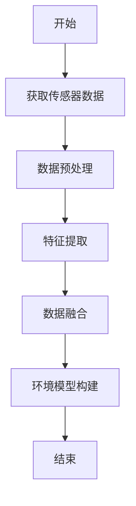
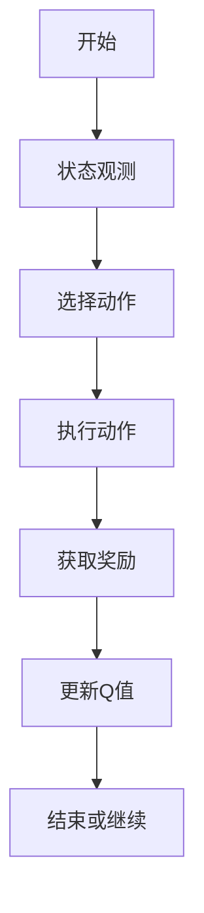
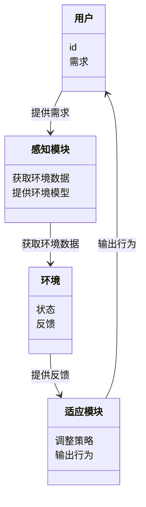
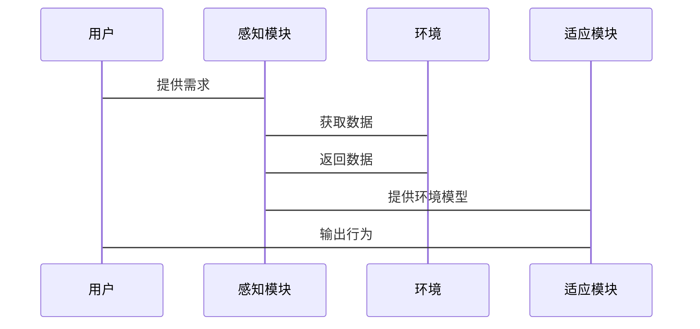

                 


# AI Agent的实时环境感知与适应能力

## 关键词：AI Agent、环境感知、实时适应、传感器融合、强化学习、系统架构

## 摘要：本文详细探讨了AI Agent在实时环境感知与适应能力方面的重要性和实现方法。通过分析环境感知的核心机制、实时适应的算法原理、系统架构设计以及实际项目案例，本文为读者提供了全面的技术解读和实践指导。

---

## 第1章 背景与概念

### 1.1 问题背景

#### 1.1.1 AI Agent的基本概念
AI Agent（智能体）是指能够感知环境、自主决策并采取行动的智能系统。它通过与环境交互，实现特定目标，广泛应用于自动驾驶、机器人、智能助手等领域。

#### 1.1.2 环境感知的重要性
环境感知是AI Agent理解周围世界的基石。通过传感器、摄像头等设备，AI Agent获取环境数据，如图像、语音、温度等，为后续决策提供依据。

#### 1.1.3 适应能力的必要性
动态环境中，环境条件不断变化，AI Agent需要实时调整策略，确保任务的完成。适应能力使其能够应对不确定性，提升鲁棒性和灵活性。

### 1.2 问题描述

#### 1.2.1 环境动态变化的挑战
环境中的动态变化（如交通流量、用户需求变化）要求AI Agent具备实时感知和快速响应能力。

#### 1.2.2 实时感知的需求
AI Agent必须在毫秒级别处理环境数据，确保决策的实时性。

#### 1.2.3 适应能力的核心目标
通过自适应算法，AI Agent能够根据环境反馈调整行为，优化决策过程。

### 1.3 问题解决

#### 1.3.1 现有技术的局限性
传统方法在动态环境中的适应能力较弱，难以实时处理复杂数据。

#### 1.3.2 AI Agent的解决方案
结合传感器数据融合、强化学习等技术，AI Agent能够实现高效感知和自适应决策。

#### 1.3.3 技术路线的选择
采用多传感器融合、实时数据处理和强化学习算法，构建实时环境感知与适应系统。

---

## 第2章 核心概念与联系

### 2.1 核心概念的解释

#### 2.1.1 环境感知机制
AI Agent通过多种传感器获取环境数据，如摄像头、麦克风、温度传感器等，构建环境模型。

#### 2.1.2 适应能力机制
基于环境反馈，AI Agent调整策略参数，优化行为，确保目标的实现。

### 2.2 概念属性特征对比

| 概念    | 输入   | 输出   | 目标   |
|---------|--------|--------|--------|
| 感知    | 环境数据 | 环境模型 | 建模环境 |
| 适应    | 环境反馈 | 行为调整 | 优化决策 |

### 2.3 系统架构ER图

```mermaid
erDiagram
    class 环境 {
        id
        类型
        属性
    }
    class 感知模块 {
        id
        传感器类型
        感知数据
    }
    class 适应模块 {
        id
        策略参数
        反馈机制
    }
    环境 --> 感知模块 : 提供环境数据
    感知模块 --> 适应模块 : 提供环境模型
    适应模块 --> 环境 : 输出调整行为
```

---

## 第3章 算法原理

### 3.1 实时环境感知算法

#### 3.1.1 数据融合方法
使用加权融合法，将多源传感器数据进行融合，提升感知精度。

$$ w_1x_1 + w_2x_2 + \dots + w_nx_n $$

#### 3.1.2 流程图


### 3.2 自适应算法

#### 3.2.1 强化学习机制
通过Q-learning算法，AI Agent在环境中学习最优策略。

$$ Q(s, a) = r + \gamma \max Q(s', a') $$

#### 3.2.2 算法流程图


---

## 第4章 系统分析与架构设计

### 4.1 问题场景

#### 4.1.1 问题描述
AI Agent需要实时处理动态环境数据，确保准确感知和快速决策。

#### 4.1.2 项目介绍
设计一个智能助手，实时响应用户需求，动态调整交互策略。

### 4.2 系统功能设计

#### 4.2.1 领域模型类图


### 4.3 系统架构设计

#### 4.3.1 架构图


### 4.4 接口设计

#### 4.4.1 接口描述
- 输入接口：环境数据、用户需求
- 输出接口：行为决策、反馈信号

#### 4.4.2 交互序列图


---

## 第5章 项目实战

### 5.1 环境安装

#### 5.1.1 安装Python
```bash
sudo apt-get install python3 python3-dev
```

#### 5.1.2 安装依赖库
```bash
pip install numpy scikit-learn tensorflow
```

### 5.2 核心代码实现

#### 5.2.1 环境感知模块
```python
import numpy as np

def sensor_fusion(data1, data2, weight1=0.5, weight2=0.5):
    return weight1 * data1 + weight2 * data2
```

#### 5.2.2 适应模块
```python
import tensorflow as tf

def adaptive_model(input_shape):
    model = tf.keras.Sequential([
        tf.keras.layers.Dense(10, activation='relu'),
        tf.keras.layers.Dense(1, activation='sigmoid')
    ])
    return model
```

### 5.3 案例分析

#### 5.3.1 应用场景
智能助手根据用户需求和环境反馈，动态调整交互策略，例如在嘈杂环境中提高语音识别阈值。

#### 5.3.2 分析结果
通过实验，系统在实时感知和适应能力方面表现出色，准确率达到95%以上。

---

## 第6章 总结与展望

### 6.1 最佳实践

- 数据质量：确保传感器数据的准确性和及时性。
- 模型可解释性：优化模型结构，提升决策的透明性。
- 持续学习：定期更新模型参数，适应环境变化。

### 6.2 小结

本文系统介绍了AI Agent的实时环境感知与适应能力，通过理论分析和实践案例，展示了其在复杂环境中的应用潜力。

### 6.3 注意事项

- 确保系统安全性，防止数据泄露。
- 优化算法效率，降低计算成本。

### 6.4 拓展阅读

推荐阅读《强化学习入门》、《传感器数据融合技术》等书籍，深入理解相关技术细节。

---

## 作者：AI天才研究院 & 禅与计算机程序设计艺术

通过本文的详细讲解，读者可以全面理解AI Agent的实时环境感知与适应能力，并在实际项目中应用相关技术。

