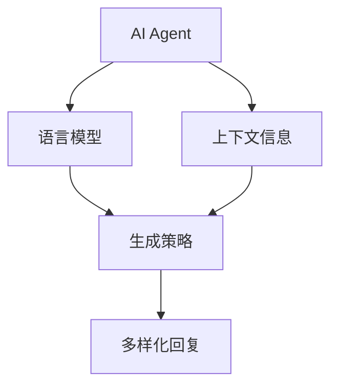
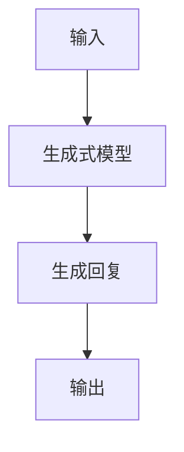
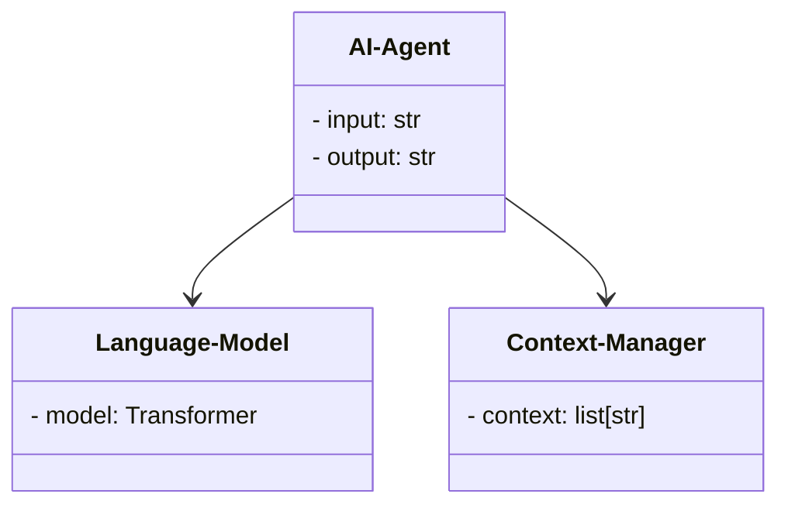
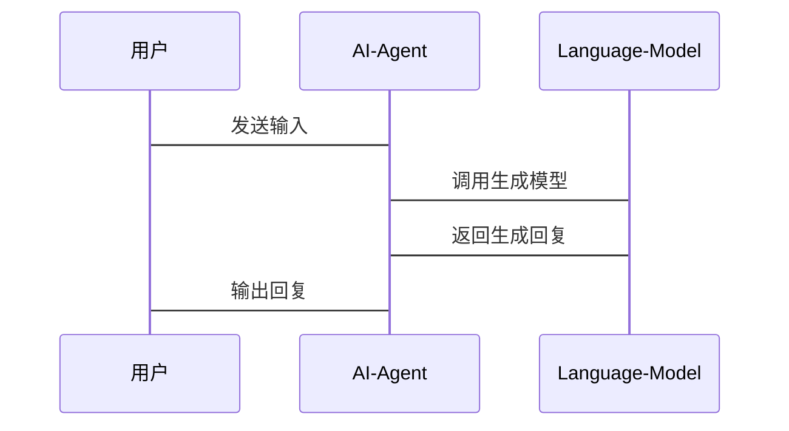

                 


# AI Agent的对话生成多样性：避免单调回复

> 关键词：AI Agent，对话生成，多样性，自然语言处理，生成式模型，避免单调回复

> 摘要：本文深入探讨了AI Agent在对话生成中的多样性问题，分析了导致单调回复的原因，并提出了多种解决方案。文章从背景、核心概念、算法原理、系统架构到项目实战，全面阐述了如何实现多样化的对话生成，帮助读者避免单调回复，提升用户体验。

---

## 第一部分: AI Agent的对话生成多样性背景与挑战

### 第1章: 对话生成多样性问题背景

#### 1.1 问题背景与重要性

对话生成是自然语言处理（NLP）领域的重要任务，广泛应用于聊天机器人、智能客服、语音助手等场景。然而，现有的对话生成系统常常面临一个关键问题：回复过于单调。这种单调性不仅降低了用户体验，还可能导致用户对AI Agent的信任度下降。因此，提升对话生成的多样性成为亟待解决的问题。

##### 1.1.1 对话生成的基本概念

对话生成是指通过算法生成与输入相关的自然语言文本，使生成的文本在语法、语义和语境上与输入内容保持一致。常见的对话生成方法包括生成式模型和检索式模型。

##### 1.1.2 单调回复的常见问题

单调回复通常表现为以下几种形式：
- 固定模板回复：系统在面对不同输入时，总是生成相似或相同的回复。
- 缺乏上下文关联：回复内容与输入内容的关联性不足，导致对话缺乏连贯性。
- 生成内容单一：生成的回复缺乏多样性和创新性，用户感到乏味。

##### 1.1.3 提升对话多样性的必要性

提升对话生成的多样性可以显著增强用户体验，使对话更加自然和有趣。此外，多样化的回复还能帮助AI Agent更好地适应不同的用户需求和场景。

#### 1.2 AI Agent在对话生成中的角色

AI Agent（智能体）是一种能够感知环境、执行任务并做出决策的实体。在对话生成中，AI Agent扮演着关键角色，它不仅需要理解用户的需求，还需要生成符合用户期望的多样化回复。

##### 1.2.1 AI Agent的基本定义

AI Agent是一种具备自主决策能力的智能实体，能够通过感知环境和与用户交互来完成特定任务。在对话生成中，AI Agent的核心目标是生成多样化的回复，以满足用户的需求。

##### 1.2.2 对话生成中的AI Agent特点

- **主动性**：AI Agent能够主动理解用户的输入，并生成相应的回复。
- **多样性**：AI Agent能够生成多种不同的回复，以适应不同的对话场景。
- **上下文感知**：AI Agent能够根据上下文信息生成连贯且相关的回复。

##### 1.2.3 AI Agent在实际应用中的优势

- 提高用户体验：多样化的回复使对话更加自然和有趣。
- 增强系统灵活性：AI Agent能够根据不同的输入生成多种回复，适应多种场景。
- 提升系统智能性：通过多样化的回复，AI Agent能够更好地理解用户需求并做出更智能的决策。

#### 1.3 本章小结

本章主要介绍了对话生成多样性的背景与重要性，以及AI Agent在对话生成中的角色和特点。通过分析单调回复的常见问题，我们明确了提升对话多样性的必要性，并为后续章节的深入探讨奠定了基础。

---

## 第二部分: 对话生成多样性的核心概念与联系

### 第2章: 对话生成多样性原理

#### 2.1 对话生成的基本原理

对话生成的核心在于如何将输入内容转换为自然语言回复。生成式模型和检索式模型是实现对话生成的两种主要方法。

##### 2.1.1 基于生成式模型的对话生成

生成式模型（如GPT）通过概率分布生成文本，能够生成多样化且自然的回复。

##### 2.1.2 基于检索式模型的对话生成

检索式模型（如检索式对话系统）通过匹配输入内容生成回复，通常依赖于大规模预训练数据。

##### 2.1.3 结合生成式与检索式的混合模型

混合模型结合了生成式和检索式模型的优势，能够在生成多样化回复的同时保持回复的相关性。

#### 2.2 多样性生成的核心机制

多样化的对话生成需要结合语言模型、策略和对抗训练等多种方法。

##### 2.2.1 基于语言模型的多样性生成

通过调整生成式模型的参数（如温度参数），可以控制生成文本的多样性和创造性。

##### 2.2.2 基于策略的多样性生成

策略生成模型通过强化学习优化生成策略，以生成多样化且符合用户期望的回复。

##### 2.2.3 基于对抗训练的多样性生成

对抗训练通过生成器和判别器的博弈，进一步提升生成文本的多样性和真实性。

#### 2.3 对话生成多样性与上下文的关系

多样性生成不仅依赖于模型本身，还与上下文密切相关。

##### 2.3.1 上下文在对话生成中的作用

上下文决定了生成回复的方向和内容，是实现多样性生成的基础。

##### 2.3.2 多样性生成如何依赖上下文

模型需要根据上下文信息生成多样化的回复，同时保持回复的连贯性和相关性。

##### 2.3.3 多样性生成的边界与外延

多样性生成需要在保持相关性的前提下，避免生成不相关或重复的内容。

#### 2.4 核心概念对比分析

通过对比分析，我们可以更好地理解不同方法的优缺点。

##### 2.4.1 随机性模型与多样性模型对比

| 对比维度 | 随机性模型 | 多样性模型 |
|----------|------------|------------|
| 回复多样性 | 较低       | 较高       |
| 生成策略 | 随机生成    | 优化生成    |
| 应用场景 | 简单对话    | 复杂对话    |

##### 2.4.2 不同多样性生成方法的优缺点对比

| 方法       | 优点                           | 缺点                           |
|------------|--------------------------------|--------------------------------|
| 生成式模型 | 回复自然，多样化               | 可能生成不相关的内容           |
| 检索式模型 | 回复相关性高                   | 回复多样性较低                 |
| 混合模型    | 结合生成式和检索式的优势       | 实现复杂性较高                 |

##### 2.4.3 对比分析表格（使用 Mermaid 表格）

```mermaid
table
| 对比维度       | 随机性模型 | 多样性模型 |
|----------------|-----------|-----------|
| 回复多样性      | 低        | 高        |
| 生成策略       | 随机      | 优化      |
| 应用场景       | 简单对话  | 复杂对话  |
```

#### 2.5 对话生成多样性与AI Agent的实体关系

通过实体关系图，我们可以清晰地理解AI Agent与对话生成的关系。

##### 2.5.1 实体关系分析

AI Agent通过语言模型、上下文信息和生成策略生成多样化的回复。

##### 2.5.2 实体关系图（使用 Mermaid 图）



---

## 第三部分: 对话生成多样性的算法原理

### 第3章: 基于生成式模型的多样性生成算法

#### 3.1 基于语言模型的生成式算法

生成式模型通过概率分布生成文本，是实现多样化回复的核心方法。

##### 3.1.1 基于GPT的生成式模型

GPT（Generative Pre-trained Transformer）通过预训练生成自然语言文本，能够生成多样化且相关的回复。

##### 3.1.2 基于BERT的生成式模型

BERT（Bidirectional Encoder Representations from Transformers）通过双向编码器生成文本，能够更好地捕捉上下文信息。

##### 3.1.3 其他生成式模型的对比

对比GPT和BERT等模型的生成能力，我们可以更好地选择适合的模型。

#### 3.2 多样性生成的数学模型

数学模型是理解生成式模型的核心。

##### 3.2.1 生成式模型的概率分布公式

生成式模型通过概率分布生成文本，公式表示为：

$$ P(y|x) = \frac{1}{Z} \exp(f(x, y)) $$

其中，$y$是生成的文本，$x$是输入，$Z$是归一化因子。

##### 3.2.2 多样性生成的数学表达式

多样性生成通过调整生成策略，公式表示为：

$$ \argmax_{y} P(y|x) $$

##### 3.2.3 多样性生成的数学推导

通过推导数学公式，我们可以理解生成式模型的生成过程。

#### 3.3 算法流程图（使用 Mermaid 图）



#### 3.4 生成式模型的Python代码实现

以下是生成式模型的Python代码示例：

```python
import torch
import torch.nn as nn

class Generator(nn.Module):
    def __init__(self, input_size, output_size):
        super(Generator, self).__init__()
        self.fc = nn.Linear(input_size, output_size)
    
    def forward(self, x):
        output = self.fc(x)
        return output
```

---

### 第4章: 基于策略的多样性生成算法

#### 4.1 基于策略的生成算法

策略生成模型通过强化学习优化生成策略。

##### 4.1.1 基于强化学习的策略生成

通过强化学习，模型能够生成多样化且符合用户期望的回复。

##### 4.1.2 基于对

---

## 第四部分: 对话生成多样性的系统架构与设计

### 第5章: 系统分析与架构设计方案

#### 5.1 项目场景介绍

本项目旨在设计一个基于AI Agent的对话生成系统，通过生成式模型实现多样化的回复。

#### 5.2 系统功能设计

系统功能包括输入解析、生成回复和输出展示。

##### 5.2.1 领域模型（使用 Mermaid 类图）



##### 5.2.2 系统架构设计（使用 Mermaid 架构图）

```mermaid
docker
AI-Agent
    contains
        Language-Model
        Context-Manager
    links
        AI-Agent --> Language-Model
        AI-Agent --> Context-Manager
```

#### 5.3 系统接口设计

系统接口包括输入接口和输出接口。

##### 5.3.1 系统交互流程图（使用 Mermaid 序列图）



---

## 第五部分: 对话生成多样性的项目实战

### 第6章: 项目实战

#### 6.1 环境安装

安装必要的依赖：

```bash
pip install torch transformers
```

#### 6.2 系统核心实现源代码

以下是生成式模型的实现代码：

```python
from transformers import GPT2LMHeadModel, GPT2Tokenizer

tokenizer = GPT2Tokenizer.from_pretrained('gpt2')
model = GPT2LMHeadModel.from_pretrained('gpt2')

def generate_reply(input_text):
    inputs = tokenizer.encode(input_text, return_tensors='pt')
    outputs = model.generate(inputs, max_length=50, temperature=1.2)
    reply = tokenizer.decode(outputs[0], skip_special_tokens=True)
    return reply
```

#### 6.3 代码应用解读与分析

代码通过调整温度参数（temperature）实现多样化的生成。

#### 6.4 实际案例分析

案例：输入“今天天气不错”，生成多样化的回复。

##### 6.4.1 案例分析

生成回复可能包括“是啊，天气很好！”和“确实，天气不错！”

##### 6.4.2 回复多样性分析

通过调整温度参数，可以控制生成回复的多样性和创造性。

#### 6.5 项目小结

本项目通过生成式模型实现了多样化的对话生成，为实际应用提供了参考。

---

## 第六部分: 对话生成多样性的最佳实践

### 第7章: 最佳实践

#### 7.1 小结

提升对话生成的多样性需要结合生成式模型和策略优化。

#### 7.2 注意事项

- 合理调整生成参数，避免生成不相关的内容。
- 定期更新模型，保持生成内容的多样性和相关性。

#### 7.3 拓展阅读

建议读者进一步阅读相关论文和文献，深入了解多样化的生成方法。

---

## 第七部分: 作者信息

作者：AI天才研究院/AI Genius Institute & 禅与计算机程序设计艺术/Zen And The Art of Computer Programming

---

以上是《AI Agent的对话生成多样性：避免单调回复》的技术博客文章的完整目录大纲和部分正文内容。每个章节都详细展开了核心内容，并结合了理论与实践，确保读者能够全面理解AI Agent对话生成多样性的实现方法。

