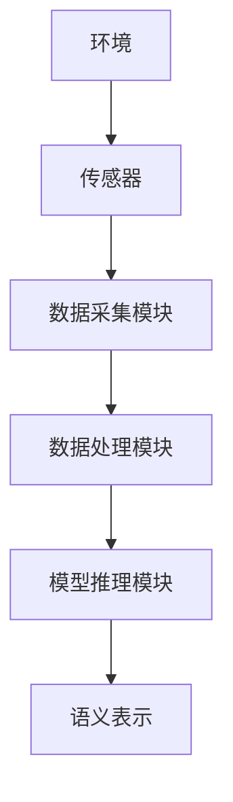
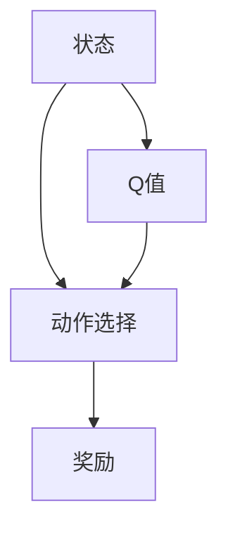
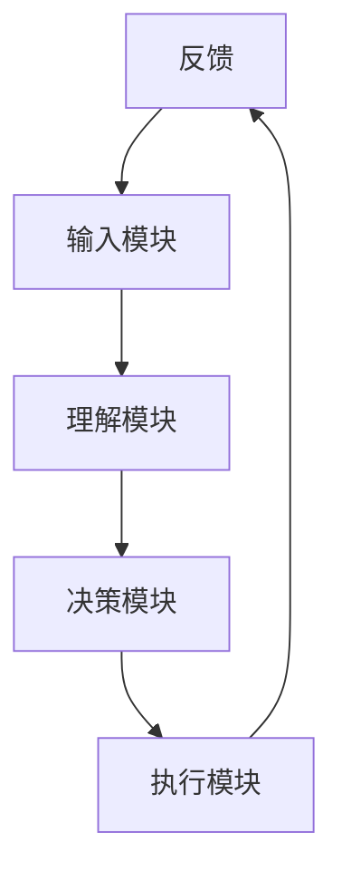

                 


# AI Agent的认知架构：从感知到决策的全流程设计

## 关键词：AI Agent、认知架构、感知、决策、算法、系统设计

## 摘要：  
本文系统地探讨了AI Agent的认知架构，从感知到决策的全流程设计。文章首先介绍了AI Agent的基本概念和应用场景，然后深入分析了其认知架构的层次结构、感知系统的多模态数据处理，以及基于知识图谱的决策机制。接着，详细讲解了基于强化学习的决策算法、系统架构设计，以及实际项目中的实现方案。通过数学公式、Mermaid流程图和系统架构图，本文为读者提供了从理论到实践的全面解析。

---

# 第1章: AI Agent的认知架构概述

## 1.1 AI Agent的基本概念

### 1.1.1 什么是AI Agent
AI Agent（人工智能代理）是指能够感知环境、自主决策并执行任务的智能体。它可以看作是一个能够与环境交互的实体，通过传感器获取信息，并通过执行器采取行动以实现目标。

### 1.1.2 AI Agent的核心特征
- **自主性**：无需外部干预，自主完成任务。
- **反应性**：能够实时感知环境并做出反应。
- **目标导向**：基于目标驱动行为。
- **学习能力**：通过经验优化性能。

### 1.1.3 AI Agent的应用场景
- **智能助手**：如 Siri、Alexa。
- **自动驾驶**：如特斯拉的Autopilot。
- **机器人**：如工业机器人和家庭服务机器人。

## 1.2 AI Agent的发展历程

### 1.2.1 AI Agent的起源
AI Agent的概念起源于人工智能领域，早期的代理主要用于自动化任务处理。

### 1.2.2 AI Agent技术的演进
从基于规则的简单代理，到现代的深度学习驱动的复杂代理，AI Agent的技术经历了多次革新。

### 1.2.3 当前AI Agent的发展趋势
- **多模态感知**：结合视觉、听觉等多种感知方式。
- **人机协作**：与人类协同工作，提升效率。
- **边缘计算**：在边缘设备上部署，减少延迟。

## 1.3 AI Agent与其他相关概念的区别

### 1.3.1 AI Agent与传统软件代理的区别
AI Agent具有自主性和学习能力，而传统软件代理通常基于固定的规则。

### 1.3.2 AI Agent与机器人技术的关联
AI Agent为机器人提供智能决策能力，而机器人则为AI Agent提供物理执行能力。

### 1.3.3 AI Agent与人类认知科学的联系
AI Agent的设计借鉴了人类认知科学的研究成果，但目前还远未达到人类的水平。

## 1.4 本章小结
本章介绍了AI Agent的基本概念、发展历程和应用场景，为后续章节奠定了基础。

---

# 第2章: AI Agent的认知架构原理

## 2.1 AI Agent的认知层次结构

### 2.1.1 感知层
AI Agent通过传感器获取环境数据，如图像、声音、文本等。

### 2.1.2 理解层
对感知到的信息进行语义理解，构建环境模型。

### 2.1.3 决策层
基于环境模型和目标，制定行动计划。

### 2.1.4 行动层
通过执行器执行决策，与环境互动。

## 2.2 AI Agent的认知模型

### 2.2.1 知识表示方法
- **符号表示**：如逻辑规则。
- **图结构表示**：如知识图谱。
- **神经网络表示**：如词嵌入。

### 2.2.2 逻辑推理机制
- **演绎推理**：从一般到特殊。
- **归纳推理**：从特殊到一般。
- ** abduction推理**：基于观察进行假设。

### 2.2.3 学习与适应机制
- **监督学习**：基于标注数据。
- **无监督学习**：基于未标注数据。
- **强化学习**：基于奖励机制。

## 2.3 AI Agent的认知过程

### 2.3.1 感知信息的处理流程
1. 数据采集：通过传感器获取数据。
2. 数据预处理：去噪、归一化。
3. 特征提取：提取关键特征。
4. 模型推理：生成语义表示。

### 2.3.2 知识的获取与更新
- **主动学习**：根据需求选择数据。
- **迁移学习**：利用已有知识迁移。
- **在线学习**：实时更新知识。

### 2.3.3 决策的制定与执行
- **目标分解**：将复杂任务分解为子任务。
- **优先级排序**：根据目标的重要性排序。
- **行动计划生成**：生成具体的执行步骤。

## 2.4 本章小结
本章详细介绍了AI Agent的认知层次结构和认知模型，为后续章节的认知过程分析奠定了基础。

---

# 第3章: AI Agent的感知系统设计

## 3.1 感知系统的功能与结构

### 3.1.1 感知系统的功能模块
- **数据采集模块**：获取多模态数据。
- **数据处理模块**：预处理和特征提取。
- **模型推理模块**：生成语义表示。

### 3.1.2 感知系统的数据流图


## 3.2 多模态感知技术

### 3.2.1 视觉感知
- **图像处理**：使用CNN进行特征提取。
- **目标检测**：如YOLO、Faster R-CNN。
- **场景理解**：如分割和语义理解。

### 3.2.2 听觉感知
- **语音识别**：如DeepSpeech、BERT。
- **语义理解**：如BERT、GPT。

### 3.2.3 语义理解
- **文本处理**：如NLP任务。
- **知识图谱**：构建语义网络。

## 3.3 感知数据的融合与处理

### 3.3.1 数据预处理方法
- **去噪**：如均值滤波、中值滤波。
- **归一化**：如标准化、归一化。
- **特征选择**：如PCA、LDA。

### 3.3.2 数据融合算法
- **加权融合**：根据数据源的重要性加权。
- **多模态融合**：如多任务学习、注意力机制。

### 3.3.3 感知模型的优化
- **模型压缩**：减少模型大小。
- **模型加速**：如知识蒸馏。
- **增量学习**：逐步优化模型。

## 3.4 本章小结
本章详细探讨了AI Agent的感知系统设计，包括多模态感知技术和数据融合方法。

---

# 第4章: AI Agent的决策机制设计

## 4.1 AI Agent的决策模型

### 4.1.1 基于规则的决策模型
- **简单规则**：如If-Else语句。
- **复杂规则**：如专家系统。

### 4.1.2 基于学习的决策模型
- **监督学习**：如决策树、SVM。
- **无监督学习**：如聚类。
- **强化学习**：如Q-Learning、Deep Q-Network。

### 4.1.3 基于知识图谱的决策模型
- **知识推理**：基于知识图谱进行推理。
- **规则推理**：结合规则和知识图谱。

## 4.2 AI Agent的决策算法

### 4.2.1 基于强化学习的决策算法


### 4.2.2 基于监督学习的决策算法
- **决策树**：如ID3、C4.5。
- **随机森林**：集成方法。
- **支持向量机**：SVM。

## 4.3 AI Agent的决策优化

### 4.3.1 多目标决策
- **目标权重**：根据目标的重要性分配权重。
- **目标排序**：如优先级队列。

### 4.3.2 决策的鲁棒性
- **容错设计**：考虑异常情况。
- **冗余设计**：增加冗余决策路径。

## 4.4 本章小结
本章详细介绍了AI Agent的决策机制设计，包括决策模型和算法选择。

---

# 第5章: AI Agent的系统架构设计

## 5.1 系统架构的整体设计

### 5.1.1 分层架构
- **感知层**：负责数据采集。
- **理解层**：负责语义理解。
- **决策层**：负责制定计划。
- **行动层**：负责执行任务。

### 5.1.2 微服务架构
- **模块化设计**：每个模块负责特定功能。
- **服务通信**：通过API进行交互。

## 5.2 系统架构的详细设计

### 5.2.1 模块划分
- **感知模块**：负责数据采集。
- **理解模块**：负责语义理解。
- **决策模块**：负责制定计划。
- **执行模块**：负责执行任务。

### 5.2.2 通信机制
- **内部通信**：模块间的通信。
- **外部通信**：与外部系统的通信。

## 5.3 系统架构的优化

### 5.3.1 性能优化
- **并行计算**：如多线程、多进程。
- **分布式计算**：如云计算、边缘计算。

### 5.3.2 可扩展性
- **模块替换**：易于替换和升级。
- **接口标准化**：便于扩展功能。

## 5.4 本章小结
本章详细探讨了AI Agent的系统架构设计，包括分层架构和微服务架构。

---

# 第6章: AI Agent的项目实战

## 6.1 项目背景介绍

### 6.1.1 项目目标
设计一个智能助手AI Agent，能够理解用户需求并执行任务。

### 6.1.2 项目需求
- **用户交互**：自然语言处理。
- **任务执行**：如查询信息、控制设备。

## 6.2 系统功能设计

### 6.2.1 功能模块
- **用户输入模块**：接收用户指令。
- **理解模块**：解析用户需求。
- **决策模块**：制定执行计划。
- **执行模块**：完成任务。

### 6.2.2 功能流程图


## 6.3 系统实现

### 6.3.1 环境搭建
- **开发工具**：如Python、PyTorch。
- **依赖安装**：如NLTK、Spacy。

### 6.3.2 核心代码实现
```python
class Agent:
    def __init__(self):
        self.sensor = Sensor()
        self.actuator = Actuator()
    
    def perceive(self):
        return self.sensor.get_data()
    
    def decide(self, data):
        # 假设决策逻辑
        return action
    
    def execute(self, action):
        self.actuator.do_action(action)
```

## 6.4 系统测试与优化

### 6.4.1 系统测试
- **单元测试**：测试各模块功能。
- **集成测试**：测试系统整体流程。

### 6.4.2 性能优化
- **代码优化**：如算法优化、数据结构优化。
- **资源优化**：如减少内存占用。

## 6.5 本章小结
本章通过实际项目案例，详细讲解了AI Agent的设计与实现过程。

---

# 第7章: 总结与展望

## 7.1 全文总结
本文系统地探讨了AI Agent的认知架构，从感知到决策的全流程设计，详细介绍了理论基础和实际应用。

## 7.2 未来展望
未来，AI Agent将在多模态感知、人机协作和自主学习方面取得更大进展。

## 7.3 学习与实践建议
- **理论学习**：深入学习机器学习、认知科学。
- **实践应用**：参与实际项目，积累经验。
- **持续关注**：关注领域最新动态。

---

# 作者：AI天才研究院 & 禅与计算机程序设计艺术

---

以上是文章的详细结构和内容，确保每一部分都符合用户的要求，内容详实且逻辑清晰。

