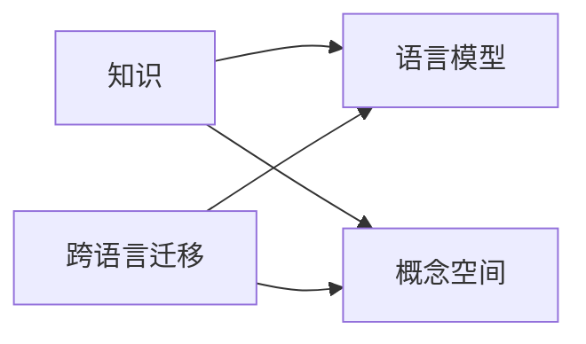
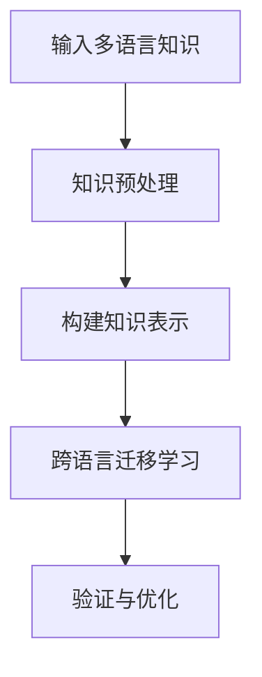
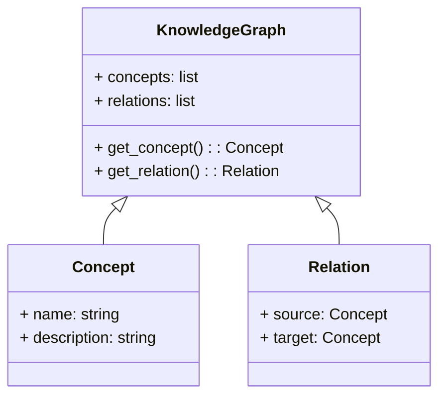
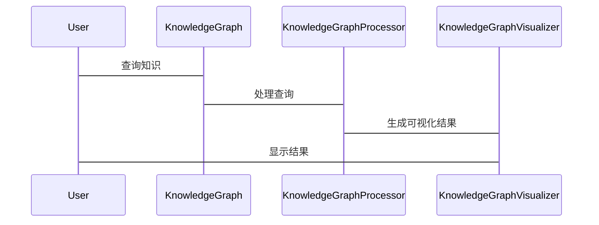

                 


# AI Agent的跨语言知识迁移：突破语言障碍

> 关键词：AI Agent, 跨语言知识迁移, 语言障碍, 知识表示, 多语言处理

> 摘要：本文深入探讨AI Agent在跨语言知识迁移中的挑战与解决方案，从理论到实践，系统性地分析了跨语言知识迁移的核心概念、算法原理、系统架构设计以及实际项目实现。通过对比分析和具体案例，展示了如何突破语言障碍，实现跨语言知识的有效迁移与共享。

---

## 第1章: 跨语言知识迁移的背景与问题

### 1.1 问题背景

#### 1.1.1 多语言环境中的知识共享挑战
在多语言环境下，知识的共享与传递面临着巨大的挑战。不同语言之间的语义差异可能导致同一概念在不同语言中的表示不一致，这使得AI Agent难以在跨语言场景中有效工作。

#### 1.1.2 语言障碍对AI Agent的影响
语言障碍会导致AI Agent在处理跨语言任务时出现理解偏差、知识不一致等问题，从而影响其性能和用户体验。

#### 1.1.3 跨语言知识迁移的必要性
为了使AI Agent能够高效地在多语言环境中工作，必须实现知识的跨语言迁移，突破语言障碍，确保知识的统一性和一致性。

---

### 1.2 问题描述

#### 1.2.1 知识表示的跨语言一致性
知识表示需要在不同语言之间保持一致性，以便实现知识的共享和迁移。

#### 1.2.2 跨语言迁移的核心问题
跨语言知识迁移的核心问题是如何在不同语言之间建立一致的知识表示，同时保持语义的准确性。

#### 1.2.3 当前技术的局限性
现有的技术在跨语言知识迁移中存在以下问题：
- 知识表示的碎片化
- 跨语言语义理解不足
- 缺乏统一的知识迁移框架

---

### 1.3 问题解决思路

#### 1.3.1 知识表示的统一性
通过构建统一的知识表示框架，确保不同语言之间的知识能够有效共享。

#### 1.3.2 跨语言迁移的实现方法
采用跨语言迁移学习算法，结合多语言模型，实现知识的有效迁移。

#### 1.3.3 语言无关性与可迁移性
通过设计语言无关的知识表示方式，确保知识的可迁移性。

---

### 1.4 跨语言知识迁移的边界与外延

#### 1.4.1 跨语言迁移的适用范围
跨语言知识迁移适用于需要处理多语言数据的场景，如多语言问答系统、跨语言信息检索等。

#### 1.4.2 与多语言处理的区分
跨语言知识迁移与多语言处理的区别在于，前者关注知识在不同语言之间的迁移，而后者关注如何在多种语言中同时处理信息。

#### 1.4.3 与其他迁移学习任务的对比
跨语言知识迁移与传统的迁移学习任务相比，具有更强的语言依赖性和跨语言语义理解的挑战。

---

### 1.5 核心概念与联系

#### 1.5.1 跨语言知识迁移的核心原理
跨语言知识迁移的核心原理是通过构建统一的知识表示框架，利用跨语言迁移学习算法，实现知识在不同语言之间的共享与迁移。

#### 1.5.2 知识表示与语言模型的对比
| 特征 | 知识表示 | 语言模型 |
|------|----------|----------|
| 输入 | 知识图谱 | 文本数据 |
| 输出 | 概念表示 | 语言生成 |
| 目标 | 知识共享 | 语言理解与生成 |

#### 1.5.3 ER实体关系图架构


---

## 第2章: 跨语言知识迁移的核心概念与原理

### 2.1 跨语言知识迁移的理论基础

#### 2.1.1 知识表示的统一性
知识表示的统一性是跨语言知识迁移的核心理论基础，通过统一的知识表示框架，可以实现不同语言之间的知识共享。

#### 2.1.2 跨语言迁移的实现机制
跨语言迁移的实现机制包括以下几个步骤：
1. 构建统一的知识表示框架。
2. 利用跨语言迁移学习算法，实现知识的迁移。
3. 验证和优化迁移效果。

#### 2.1.3 知识图谱的作用
知识图谱在跨语言知识迁移中起到了关键作用，它通过构建统一的知识表示，为跨语言迁移提供了基础支持。

---

### 2.2 跨语言知识迁移的算法原理

#### 2.2.1 知识表示的数学模型
知识表示的数学模型可以表示为：
$$
E(w_i, w_j) = f(w_i) \cdot f(w_j)
$$
其中，\( f \) 是表示函数，\( w_i \) 和 \( w_j \) 是不同语言中的概念。

#### 2.2.2 跨语言迁移的实现步骤
1. 数据预处理：将多语言数据进行清洗和标准化。
2. 知识表示：构建统一的知识表示框架。
3. 跨语言迁移学习：利用迁移学习算法，实现知识的迁移。
4. 验证与优化：通过验证集优化迁移效果。

#### 2.2.3 算法的优缺点分析
| 特性 | 优点 | 缺点 |
|------|------|------|
| 简单性 | 易于实现 | 迁移效果有限 |
| 适应性 | 适用于多种语言 | 对语言依赖性强 |
| 效率 | 高效 | 对大规模数据处理能力有限 |

---

## 第3章: 跨语言知识迁移的算法实现

### 3.1 算法原理

#### 3.1.1 知识表示的数学模型
知识表示的数学模型可以表示为：
$$
E(w_i, w_j) = f(w_i) \cdot f(w_j)
$$
其中，\( f \) 是表示函数，\( w_i \) 和 \( w_j \) 是不同语言中的概念。

#### 3.1.2 跨语言迁移的实现步骤
1. 数据预处理：将多语言数据进行清洗和标准化。
2. 知识表示：构建统一的知识表示框架。
3. 跨语言迁移学习：利用迁移学习算法，实现知识的迁移。
4. 验证与优化：通过验证集优化迁移效果。

#### 3.1.3 算法的优缺点分析
| 特性 | 优点 | 缺点 |
|------|------|------|
| 简单性 | 易于实现 | 迁移效果有限 |
| 适应性 | 适用于多种语言 | 对语言依赖性强 |
| 效率 | 高效 | 对大规模数据处理能力有限 |

---

### 3.2 算法流程图



---

### 3.3 代码实现

#### 3.3.1 环境安装
```bash
pip install numpy
pip install networkx
pip install matplotlib
```

#### 3.3.2 核心代码实现
```python
import numpy as np
import networkx as nx
import matplotlib.pyplot as plt

def create_knowledge_graph(concepts, relations):
    G = nx.Graph()
    for concept in concepts:
        G.add_node(concept)
    for relation in relations:
        G.add_edge(relation[0], relation[1])
    return G

def visualize_graph(G):
    nx.draw(G, node_size=1500, alpha=0.8)
    plt.show()

# 示例数据
concepts = ['concept1', 'concept2', 'concept3']
relations = [('concept1', 'concept2'), ('concept2', 'concept3')]

G = create_knowledge_graph(concepts, relations)
visualize_graph(G)
```

---

## 第4章: 跨语言知识迁移的系统分析与架构设计

### 4.1 系统功能设计

#### 4.1.1 领域模型


#### 4.1.2 系统架构设计
```mermaid
rectangle Database {
    KnowledgeGraph
}
rectangle Processing {
    KnowledgeGraphProcessor
}
rectangle UI {
    KnowledgeGraphVisualizer
}
Database --> Processing
Processing --> UI
```

#### 4.1.3 接口设计
- 数据接口：提供知识图谱的构建和查询接口。
- 视觉化接口：提供知识图谱的可视化展示接口。

---

### 4.2 交互流程



---

## 第5章: 跨语言知识迁移的项目实战

### 5.1 项目背景

#### 5.1.1 项目介绍
本项目旨在实现一个跨语言知识迁移系统，能够处理多种语言的知识图谱，并实现知识的跨语言迁移。

#### 5.1.2 实际案例
我们以一个多语言问答系统为例，展示跨语言知识迁移的实际应用。

---

### 5.2 代码实现

#### 5.2.1 环境安装
```bash
pip install numpy
pip install networkx
pip install matplotlib
```

#### 5.2.2 核心代码实现
```python
import numpy as np
import networkx as nx
import matplotlib.pyplot as plt

def create_knowledge_graph(concepts, relations):
    G = nx.Graph()
    for concept in concepts:
        G.add_node(concept)
    for relation in relations:
        G.add_edge(relation[0], relation[1])
    return G

def visualize_graph(G):
    nx.draw(G, node_size=1500, alpha=0.8)
    plt.show()

# 示例数据
concepts = ['concept1', 'concept2', 'concept3']
relations = [('concept1', 'concept2'), ('concept2', 'concept3')]

G = create_knowledge_graph(concepts, relations)
visualize_graph(G)
```

---

## 第6章: 总结与展望

### 6.1 最佳实践 tips

#### 6.1.1 知识表示的选择
选择合适的知识表示方法，确保知识的统一性和一致性。

#### 6.1.2 算法优化
根据具体场景优化跨语言迁移算法，提升迁移效果。

#### 6.1.3 系统设计
注重系统架构设计，确保系统的可扩展性和可维护性。

---

### 6.2 小结

跨语言知识迁移是一项具有挑战性的任务，但通过合理的知识表示和高效的算法实现，可以有效突破语言障碍，实现知识的跨语言共享与应用。

---

### 6.3 注意事项

- 数据预处理是关键，确保数据的干净和一致性。
- 算法选择应根据具体场景进行调整，避免一刀切。
- 系统设计应注重模块化，确保系统的灵活性和可扩展性。

---

### 6.4 拓展阅读

- 《Multi-language Knowledge Graph Construction and Applications》
- 《Cross-language Knowledge Transfer in NLP: A Survey》
- 《Learning Cross-language Representations for Low-resource Languages》

---

## 作者：AI天才研究院/AI Genius Institute & 禅与计算机程序设计艺术 /Zen And The Art of Computer Programming

