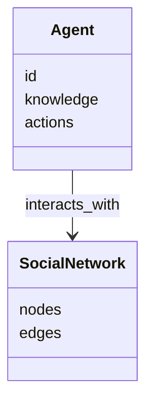

                 


```markdown
# AI agents协作分析社交网络：评估公司的社会影响力

> 关键词：AI代理，社交网络分析，社会影响力，企业级分析，协作机制

> 摘要：本文系统地探讨了AI代理在社交网络中的协作分析方法，重点介绍了如何利用AI代理评估公司的社会影响力。文章从AI代理的基本概念、社交网络分析的基础理论出发，深入分析了AI代理协作的理论框架、算法原理和系统架构，并通过实际案例展示了如何将这些理论应用于实践。最后，本文总结了研究成果，并展望了未来的发展方向。

---

# 第1章 引言

## 1.1 问题背景

### 1.1.1 社交网络的兴起与重要性
社交网络已成为现代信息传播的核心平台，企业和个人在社交网络上的影响力直接影响其品牌价值和市场竞争力。社交网络的兴起使得企业能够实时与用户互动，但也带来了如何量化和评估这种影响力的新挑战。

### 1.1.2 公司社会影响力的概念
公司社会影响力是指企业在社交网络中的声誉、影响力和用户参与度的综合指标。它反映了企业在用户心中的地位和市场中的竞争力。

### 1.1.3 AI代理在社交网络分析中的作用
AI代理能够实时监控和分析社交网络中的海量数据，帮助企业快速识别关键意见领袖（KOL）和用户情感倾向，从而提供精准的社会影响力评估。

## 1.2 研究意义
### 1.2.1 企业级社交网络分析的必要性
随着市场竞争的加剧，企业需要通过社交网络分析来优化品牌形象和用户关系管理。

### 1.2.2 AI代理协作的优势
AI代理能够通过协作机制高效地处理复杂任务，显著提升社交网络分析的准确性和效率。

### 1.2.3 对企业决策的支持
基于AI代理的分析结果，企业可以制定更科学的市场策略，提升品牌影响力和市场竞争力。

## 1.3 本书结构
### 1.3.1 各章内容概述
- 第1章：引言，介绍研究背景和意义。
- 第2章：AI代理的基础知识。
- 第3章：社交网络分析基础。
- 第4章：AI代理协作分析社交网络的理论框架。
- 第5章：算法原理。
- 第6章：系统架构设计。
- 第7章：项目实战。
- 第8章：结论与展望。

### 1.3.2 学习目标
通过本书，读者将掌握AI代理协作分析社交网络的核心理论和实践技能，能够独立完成社会影响力评估任务。

### 1.3.3 预备知识
读者需要具备基本的编程能力和对AI技术的初步了解。

---

# 第2章 AI代理的基础知识

## 2.1 AI代理的基本概念
### 2.1.1 代理的定义与分类
代理（Agent）是指能够感知环境并采取行动以实现目标的实体。AI代理是具有人工智能的代理，能够执行复杂任务。

### 2.1.2 AI代理的核心特征
- 智能性：能够理解和推理信息。
- 反应性：能够实时响应环境变化。
- 目的性：具有明确的目标导向。

### 2.1.3 代理与智能体的区别
智能体（Agent）是更广泛的概念，代理是智能体的一种特殊形式，强调自主性和智能性。

## 2.2 社交网络中的AI代理
### 2.2.1 社交网络代理的定义
社交网络代理是指在社交网络中运行的AI代理，用于数据收集、分析和决策。

### 2.2.2 代理在社交网络中的功能
- 数据采集：抓取社交网络中的文本、图片和视频。
- 情感分析：识别用户情感倾向。
- 关键词提取：提取关键信息。

### 2.2.3 代理协作的必要性
社交网络数据复杂多样，单个代理难以完成全部任务，协作能够提高效率和准确性。

## 2.3 AI代理的协作机制
### 2.3.1 协作的基本概念
协作是指多个代理共同完成任务的过程。

### 2.3.2 协作的类型与特点
- 并行协作：多个代理同时执行不同任务。
- 串行协作：代理按顺序执行任务。

### 2.3.3 协作的实现方式
- 基于消息传递：代理通过消息传递信息。
- 基于共享知识库：代理共享知识库中的数据。

---

# 第3章 社交网络分析基础

## 3.1 社交网络的基本概念
### 3.1.1 社交网络的定义与特征
社交网络是由节点和边组成的图结构，节点代表用户，边代表用户之间的关系。

### 3.1.2 社交网络的结构分析
- 中心性分析：识别关键节点。
- 社区检测：划分用户群体。

## 3.2 社会影响力的概念
### 3.2.1 社会影响力定义
社会影响力是指个体或组织在社交网络中对他人行为或观点的影响力。

### 3.2.2 社会影响力的影响因素
- 用户特征：如影响力、活跃度。
- 内容特征：如内容质量、情感倾向。

## 3.3 公司社会影响力评估的方法
### 3.3.1 基于社交网络的评估方法
- 基于中心性指标：如度中心性和中间中心性。
- 基于社区检测：识别公司所在社区的影响力。

### 3.3.2 基于语义分析的评估方法
- 情感分析：评估用户对公司的看法。
- 主题分析：识别用户关注的主要话题。

### 3.3.3 综合评估模型的构建
综合考虑社交网络结构和用户行为数据，构建综合评估模型。

---

# 第4章 AI代理协作分析社交网络的理论框架

## 4.1 社交网络分析的理论基础
### 4.1.1 社交网络分析的数学模型
- 图论模型：用于描述社交网络的结构。
- 网络流模型：用于分析信息传播路径。

## 4.2 社会影响力传播模型
### 4.2.1 模型的基本假设
- 用户之间通过边传播影响力。
- 用户的影响力与其特征相关。

### 4.2.2 模型的构建
$$ I(u) = \sum_{v \in N(u)} \frac{I(v)}{d(v)} $$
其中，$I(u)$表示用户$u$的影响力，$N(u)$表示$u$的邻居，$d(v)$表示$v$的度。

## 4.3 多智能体协作机制
### 4.3.1 协作的基本原理
多个AI代理协作完成复杂任务。

### 4.3.2 协作机制的设计
- 分层协作：根据任务复杂度分层。
- 并行协作：多个代理同时处理不同任务。

---

# 第5章 算法原理

## 5.1 社会影响力传播算法
### 5.1.1 算法流程
1. 初始化影响力值。
2. 迭代更新影响力值。
3. 收敛后输出结果。

### 5.1.2 算法实现
```python
def compute_influence(network, max_iterations=100):
    n = len(network.nodes)
    influence = {node: 1 for node in network.nodes}
    for _ in range(max_iterations):
        new_influence = {}
        for node in network.nodes:
            total = 0
            for neighbor in network.get_neighbors(node):
                total += influence[neighbor] / network.get_degree(neighbor)
            new_influence[node] = total
        influence = new_influence
    return influence
```

## 5.2 多智能体协作算法
### 5.2.1 算法流程
1. 初始化多个代理。
2. 代理协作完成任务。
3. 输出结果。

### 5.2.2 算法实现
```python
def multi_agent_collaboration(agents, task):
    for agent in agents:
        agent.receive_task(task)
    results = [agent.execute_task() for agent in agents]
    return results
```

---

# 第6章 系统架构设计

## 6.1 系统功能设计
### 6.1.1 领域模型


### 6.1.2 系统架构


---

# 第7章 项目实战

## 7.1 环境安装
安装必要的库，如NetworkX和Python中的AI框架。

## 7.2 核心代码实现
### 7.2.1 数据采集
```python
import networkx as nx

def collect_data():
    # 示例代码
    G = nx.Graph()
    G.add_nodes_from(["A", "B", "C"])
    G.add_edges_from([("A", "B"), ("B", "C")])
    return G
```

### 7.2.2 情感分析
```python
from textblob import TextBlob

def sentiment_analysis(text):
    return TextBlob(text).polarity
```

## 7.3 案例分析
通过实际案例展示如何评估公司的社会影响力。

## 7.4 项目总结
总结项目的实现过程和成果。

---

# 第8章 结论与展望

## 8.1 研究总结
本文系统地探讨了AI代理协作分析社交网络的方法。

## 8.2 未来展望
未来研究可以进一步优化算法，提高分析效率和准确性。

## 8.3 最佳实践Tips
- 确保数据质量。
- 选择合适的算法。
- 定期更新模型。

---

作者：AI天才研究院/AI Genius Institute & 禅与计算机程序设计艺术 /Zen And The Art of Computer Programming
```

