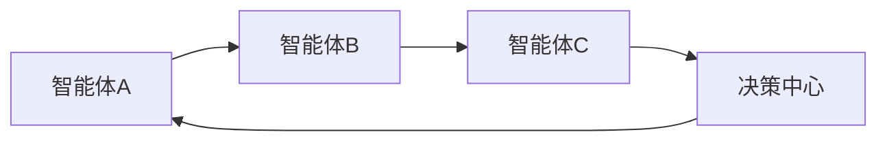
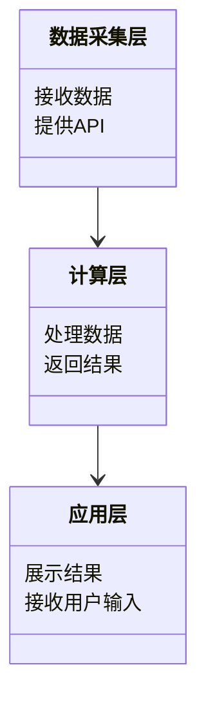

                 


# AI agents协作进行全球经济周期分析：把握大趋势

> **关键词**：AI agents，经济周期分析，协作算法，全球经济预测，多智能体系统

> **摘要**：本文探讨AI agents在经济周期分析中的协作机制与应用，通过详细分析AI agents的核心概念、算法原理、系统架构及实际案例，揭示如何利用AI技术捕捉全球经济趋势，为经济预测和决策提供新思路。

---

## 引言

### 1.1 经济周期分析的重要性
经济周期分析是理解全球经济波动的关键，它帮助企业、政府和投资者做出更明智的决策。传统方法依赖于历史数据和统计模型，但面对复杂多变的经济环境，这些方法往往显得力不从心。

### 1.2 AI agents的概念与特点
AI agents是具有自主决策能力的智能体，能够在复杂环境中协作完成任务。其特点包括自主性、反应性、协作性和学习能力，使其在经济分析中具有独特优势。

### 1.3 本书的结构与目标
本文将从AI agents的协作机制入手，结合经济周期分析的理论与实践，系统性地探讨如何利用AI技术捕捉全球经济趋势。

---

## 第二部分：全球经济周期分析的背景与方法

### 2.1 经济周期的基本理论
经济周期通常分为衰退、复苏、增长和繁荣四个阶段。传统分析依赖于GDP、失业率等指标，但难以捕捉复杂经济动态。

### 2.2 AI技术在经济周期分析中的应用背景
AI技术的兴起为经济预测提供了新工具。通过机器学习模型，AI能够处理海量数据，发现传统方法难以察觉的模式。

### 2.3 AI agents协作的必要性
多智能体协作能够整合不同数据源，提供更全面的经济分析。AI agents通过分工合作，提高了预测的准确性和实时性。

---

## 第三部分：AI agents协作的核心概念与原理

### 3.1 AI agents的核心概念
AI agents通过感知环境、制定策略并采取行动，实现特定目标。其决策机制基于实时数据和历史经验。

### 3.2 多 agents协作的原理
多 agents协作需要统一的通信机制和协调策略。通过任务分配和信息共享，多个智能体能够协同完成复杂任务。

### 3.3 AI agents在经济周期分析中的协作框架
AI agents协作框架包括数据采集、特征提取、模型训练和预测生成四个阶段。每个阶段由不同智能体负责，共同完成经济预测任务。

---

## 第四部分：算法原理与系统架构

### 4.1 AI agents协作算法
基于强化学习的协作算法，通过奖励机制激励智能体之间的合作。算法流程如下：



### 4.2 系统架构设计
系统架构包括数据采集层、计算层和应用层。各层通过API接口进行通信，确保数据流的高效传输。



### 4.3 项目实战
#### 4.3.1 环境安装
安装Python和必要的库，如TensorFlow和Keras。

#### 4.3.2 核心实现
实现一个简单的AI代理协作模型，用于分析经济数据。

```python
import numpy as np
import tensorflow as tf

class AI-Agent:
    def __init__(self):
        self.model = self.build_model()

    def build_model(self):
        model = tf.keras.Sequential([
            tf.keras.layers.Dense(64, activation='relu'),
            tf.keras.layers.Dense(1, activation='sigmoid')
        ])
        model.compile(optimizer='adam', loss='binary_crossentropy')
        return model

    def predict(self, data):
        return self.model.predict(data)
```

#### 4.3.3 案例分析
通过分析历史经济数据，验证模型的预测能力。

---

## 第五部分：总结与展望

### 5.1 总结
AI agents协作在经济周期分析中具有显著优势，能够提高预测的准确性和实时性。

### 5.2 展望
未来，AI agents将在全球经济预测中发挥更重要的作用，推动经济分析进入新时代。

---

**作者：AI天才研究院/AI Genius Institute & 禅与计算机程序设计艺术 /Zen And The Art of Computer Programming**

