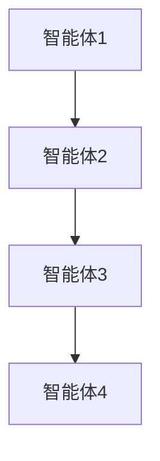
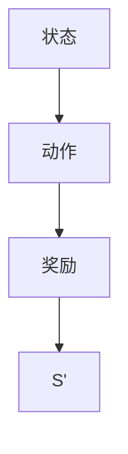
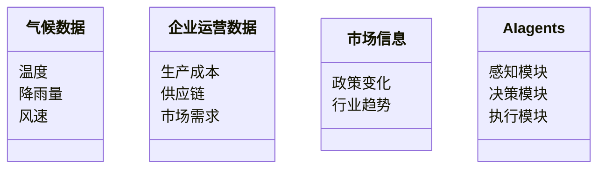
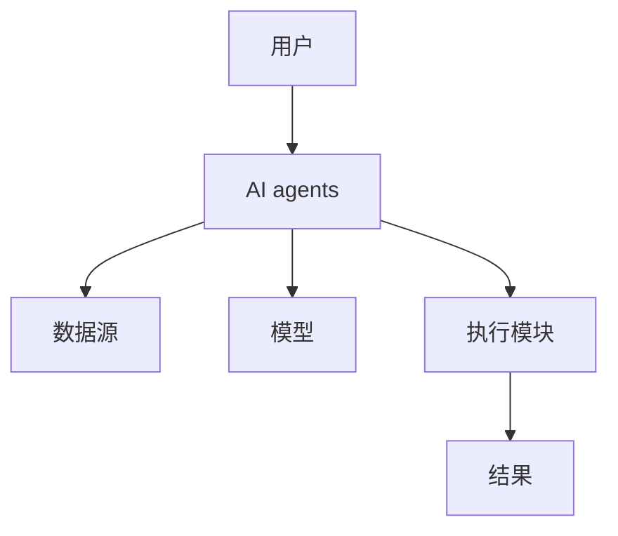

                 


# AI agents在公司气候变化适应能力评估中的应用

> 关键词：AI agents, 气候变化适应能力, 企业风险管理, 智能决策系统, 数学建模

> 摘要：随着全球气候变化的加剧，企业面临的环境风险也在不断增加。AI agents作为一种新兴的人工智能技术，能够在企业气候变化适应能力评估中发挥重要作用。本文从AI agents的核心原理出发，结合实际应用场景，详细阐述了其在气候变化适应能力评估中的应用方法，并通过案例分析展示了其在企业风险管理中的潜力。

---

# 第一部分: 背景与概念

# 第1章: 气候变化适应能力评估的背景与问题

## 1.1 气候变化对企业的影响

### 1.1.1 气候变化对企业运营的潜在风险
气候变化可能导致极端天气事件频发，对企业供应链、生产成本和市场环境造成重大影响。例如，洪水、干旱和台风可能破坏企业设施，影响生产效率。此外，气候变化还可能导致政策变化，增加企业的合规成本。

### 1.1.2 企业适应气候变化的重要性
企业必须具备应对气候变化的能力，以确保其业务的可持续性。这不仅有助于减少经济损失，还能提升企业的社会责任形象。适应气候变化的能力已成为企业竞争力的重要组成部分。

### 1.1.3 当前企业应对气候变化的挑战
传统的方法依赖于人工评估和经验判断，存在效率低、覆盖面窄、实时性差等问题。企业需要一种更高效、更智能的工具来评估其适应能力。

## 1.2 AI agents的核心概念与作用

### 1.2.1 AI agents的基本定义
AI agents（智能代理）是指能够感知环境、自主决策并执行任务的智能体。它们可以是软件程序或物理设备，通过传感器和数据源获取信息，并通过算法进行分析和决策。

### 1.2.2 AI agents在企业决策中的优势
AI agents能够实时处理大量数据，快速生成决策建议，显著提高了企业的决策效率和准确性。它们还能够根据环境变化动态调整策略，帮助企业更好地应对不确定性。

### 1.2.3 AI agents在气候变化适应能力评估中的应用潜力
AI agents可以通过分析气候数据、企业运营数据和市场信息，评估企业在不同气候变化情景下的适应能力，并提出优化建议。

## 1.3 问题背景与问题描述

### 1.3.1 气候变化适应能力评估的定义
气候变化适应能力评估是指对企业在不同气候变化情景下，能否维持正常运营或快速恢复的能力进行量化评估。

### 1.3.2 传统评估方法的局限性
传统评估方法依赖人工分析，耗时长、成本高，且难以覆盖所有可能的气候变化情景。此外，传统方法难以实时更新，无法满足企业对动态适应的需求。

### 1.3.3 引入AI agents的必要性
AI agents能够实时处理海量数据，快速生成评估结果，并动态调整评估策略。它们的引入可以显著提高评估的效率和准确性。

## 1.4 问题解决与边界外延

### 1.4.1 AI agents如何解决气候变化适应能力评估问题
AI agents可以通过分析气候数据、企业运营数据和市场信息，评估企业在不同气候变化情景下的适应能力，并提出优化建议。

### 1.4.2 问题的边界与适用范围
AI agents适用于需要实时数据处理和动态决策的企业场景。它们的边界包括数据源的限制、模型的适用性和企业的实际需求。

### 1.4.3 概念结构与核心要素的组成
气候变化适应能力评估的核心要素包括气候数据、企业运营数据、市场信息和AI agents的分析模型。这些要素共同构成了评估系统的基础。

---

# 第二部分: 核心概念与联系

# 第2章: AI agents的核心原理与特征

## 2.1 AI agents的感知机制

### 2.1.1 数据采集与处理
AI agents通过传感器和数据源获取气候数据、企业运营数据和市场信息，并进行预处理和特征提取。

### 2.1.2 信息分析与特征提取
通过机器学习算法对数据进行分析，提取关键特征，为后续的决策提供支持。

### 2.1.3 实时反馈与动态调整
AI agents能够根据实时数据反馈，动态调整分析策略，确保评估的准确性和及时性。

## 2.2 AI agents的决策机制

### 2.2.1 多目标优化算法
AI agents通过多目标优化算法，在多个目标之间找到平衡点，制定最优决策。

### 2.2.2 风险评估与决策树模型
通过风险评估和决策树模型，AI agents能够评估不同决策方案的风险，并选择最优方案。

### 2.2.3 强化学习在决策中的应用
强化学习通过不断试错和奖励机制，优化AI agents的决策能力，提高评估的准确性。

## 2.3 AI agents的执行机制

### 2.3.1 动作规划与策略执行
AI agents根据决策结果制定行动计划，并通过执行模块实现策略的落地。

---

# 第三部分: 算法原理讲解

# 第3章: AI agents的算法实现与数学模型

## 3.1 多智能体协作算法

### 3.1.1 多智能体协作的基本原理
多智能体协作算法通过多个智能体之间的协作，实现复杂任务的分解与协调。

### 3.1.2 多智能体协作的数学模型
$$ \text{协作目标} = \sum_{i=1}^{n} w_i x_i $$
其中，\( w_i \) 为权重，\( x_i \) 为各智能体的目标。

### 3.1.3 多智能体协作的流程图


## 3.2 强化学习算法

### 3.2.1 强化学习的基本原理
强化学习通过智能体与环境的交互，学习最优策略。

### 3.2.2 强化学习的数学模型
$$ Q(s, a) = r + \gamma \max_{a'} Q(s', a') $$
其中，\( Q(s, a) \) 为状态-动作值函数，\( r \) 为奖励，\( \gamma \) 为折扣因子。

### 3.2.3 强化学习的流程图


---

# 第四部分: 系统分析与架构设计

# 第4章: 气候变化适应能力评估系统架构

## 4.1 问题场景介绍

### 4.1.1 气候变化适应能力评估的系统目标
系统目标是通过AI agents实时分析气候数据、企业运营数据和市场信息，评估企业在不同气候变化情景下的适应能力。

### 4.1.2 系统功能需求
系统功能需求包括数据采集、分析评估、优化建议和动态调整。

## 4.2 系统功能设计

### 4.2.1 领域模型设计


### 4.2.2 系统架构设计


---

# 第五部分: 项目实战

# 第5章: AI agents在气候变化适应能力评估中的应用案例

## 5.1 环境安装

### 5.1.1 安装Python和相关库
安装Python和以下库：
- `numpy`
- `pandas`
- `scikit-learn`
- `tensorflow`

## 5.2 核心代码实现

### 5.2.1 数据预处理
```python
import pandas as pd
import numpy as np

data = pd.read_csv('climate.csv')
data = data.dropna()
```

### 5.2.2 模型训练
```python
from sklearn.model

