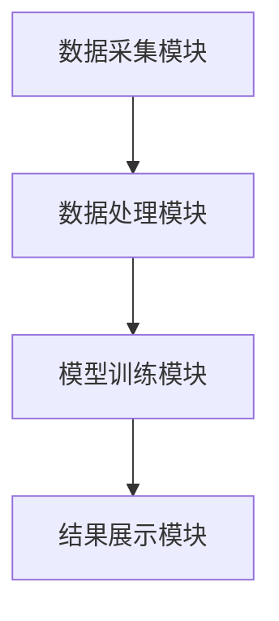
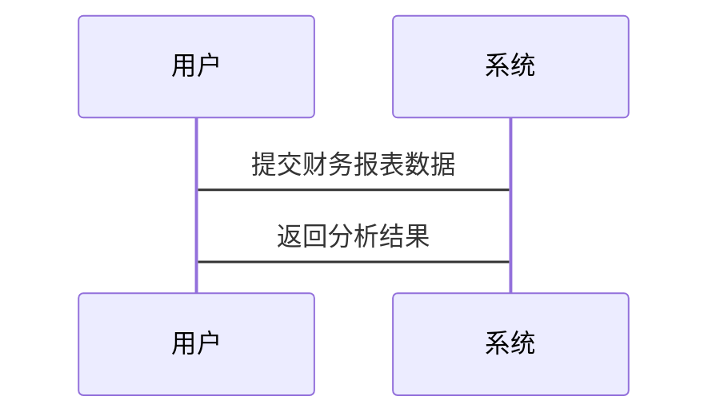

                 

<think>
好的，我需要按照用户的要求，编写一篇关于“AI agents在公司财务报表分析中的应用”的技术博客文章。首先，我需要理解这个主题的核心内容，包括AI代理的基本概念、财务报表分析的基本流程，以及AI代理如何在这一过程中发挥作用。

首先，我会从基础概念入手，解释什么是AI代理，它们的核心特征是什么，以及它们如何与传统数据分析方法不同。接着，我会介绍财务报表分析的基本概念，包括财务报表的组成部分、分析的目的和方法，以及当前财务报表分析中存在的主要挑战和痛点。

接下来，我需要探讨AI代理在财务报表分析中的具体应用价值，包括提高分析效率、增强分析准确性、优化决策过程等方面。这部分需要结合实际案例，说明AI代理如何在这些方面为企业带来优势。

在技术基础部分，我会详细介绍自然语言处理（NLP）技术和机器学习技术在财务报表分析中的应用。首先，我会解释NLP的基本概念及其在文本数据处理中的应用，包括文本预处理、分词、实体识别、情感分析和主题提取等技术。然后，我会介绍一些常见的NLP模型，如BERT和GPT，以及它们在财务文本分析中的具体应用。

接下来，我会讨论机器学习技术在财务数据分析中的应用。首先，我会概述机器学习的基本概念和主要算法，如决策树、随机森林、支持向量机等。然后，我会详细讲解这些算法在财务数据分类、回归和聚类分析中的具体应用，并结合实际案例说明其优势和局限性。

在系统设计部分，我会介绍如何构建一个完整的AI代理系统，用于财务报表分析。这包括系统架构设计、接口设计、数据流设计等方面。我需要使用Mermaid图来展示系统的类图、架构图和序列图，帮助读者更好地理解系统的设计和运行过程。

最后，在项目实战部分，我会详细指导读者如何安装所需的开发环境，编写核心代码，并进行系统测试和部署。这部分需要结合具体的Python代码示例，展示如何利用NLP和机器学习技术进行财务报表分析，以及如何实现一个完整的AI代理系统。

通过以上步骤，我将逐步构建一篇结构清晰、内容详实的技术博客文章，确保每个部分都深入浅出，帮助读者全面理解AI代理在公司财务报表分析中的应用。

# AI agents在公司财务报表分析中的应用

## 关键词：AI代理，财务报表分析，自然语言处理，机器学习，财务数据分析，风险管理

## 摘要：随着人工智能技术的快速发展，AI代理在财务报表分析中的应用越来越广泛。本文将从基础概念出发，详细探讨AI代理在财务报表分析中的技术原理、系统设计和实际应用。通过结合NLP和机器学习技术，本文将展示如何利用AI代理提高财务报表分析的效率和准确性，为企业提供更精准的决策支持。

---

# 第一部分: AI代理在公司财务报表分析中的应用基础

## 第1章: AI代理与财务报表分析概述

### 1.1 AI代理的基本概念

#### 1.1.1 什么是AI代理
AI代理（Artificial Intelligence Agents）是指能够感知环境、执行任务并做出决策的智能实体。AI代理可以是软件程序、机器人或其他智能系统，其核心目标是通过自动化的方式完成特定任务或提供智能支持。

#### 1.1.2 AI代理的核心特征
- **自主性**：AI代理能够自主决策，无需外部干预。
- **反应性**：能够实时感知环境变化并做出相应的反应。
- **目标导向**：所有行为都围绕特定目标展开。
- **学习能力**：通过数据和经验不断优化自身性能。

#### 1.1.3 AI代理与传统数据分析的区别
传统数据分析依赖于人工设定规则和模型，而AI代理能够通过机器学习和深度学习技术，自动从数据中提取模式和规律。AI代理还具备自我优化和适应能力，能够在复杂环境下自主调整分析策略。

### 1.2 财务报表分析的基本概念

#### 1.2.1 财务报表的主要组成部分
财务报表通常包括资产负债表、利润表和现金流量表。这些报表提供了企业在一定时期内的财务状况、经营成果和现金流量等信息。

#### 1.2.2 财务报表分析的目的与方法
财务报表分析的主要目的是评估企业的财务健康状况、经营效率和盈利能力。常用的方法包括趋势分析、比率分析和行业比较分析。

#### 1.2.3 财务报表分析的挑战与痛点
- 数据量大且复杂
- 分析过程耗时且容易出错
- 传统方法难以捕捉隐藏的财务风险

### 1.3 AI代理在财务报表分析中的应用价值

#### 1.3.1 提高分析效率
AI代理能够快速处理大量数据，显著缩短分析时间。

#### 1.3.2 增强分析准确性
通过机器学习算法，AI代理能够发现隐藏的财务模式，提高分析的准确性。

#### 1.3.3 优化决策过程
AI代理提供的实时分析和预测支持，帮助企业做出更明智的财务决策。

---

## 第2章: AI代理在财务报表分析中的技术基础

### 2.1 自然语言处理（NLP）技术

#### 2.1.1 NLP在文本数据处理中的应用
NLP技术能够对财务报表中的文本数据进行预处理、分词、实体识别和情感分析，帮助提取有用的信息。

#### 2.1.2 常见的NLP模型及其特点
- **BERT模型**：适合于文本理解任务，如问答系统和文本摘要。
- **GPT模型**：适合于文本生成任务，如财务报告的自动生成。
- **其他模型**：如RoBERTa、XLNet等，各有其适用场景。

#### 2.1.3 NLP在财务报表分析中的具体应用
- **文本预处理**：对财务报表文本进行清洗和标准化。
- **实体识别**：识别报表中的关键实体，如公司名称、金额等。
- **情感分析**：分析财务文本中的情感倾向，识别潜在的财务风险。

### 2.2 机器学习技术

#### 2.2.1 机器学习的基本概念与分类
机器学习分为监督学习、无监督学习和强化学习三类。监督学习适用于分类和回归任务，无监督学习适用于聚类和降维任务，强化学习适用于策略优化任务。

#### 2.2.2 常见的机器学习算法及其特点
- **线性回归**：适用于连续变量的预测。
- **决策树**：适用于分类和回归任务，具有良好的可解释性。
- **随机森林**：通过集成多个决策树提高模型的准确性和稳定性。
- **支持向量机（SVM）**：适用于分类任务，特别是在高维空间中表现优异。

#### 2.2.3 机器学习在财务数据分析中的应用
- **财务数据分类**：如识别财务欺诈行为。
- **财务数据回归**：如预测公司的未来利润。
- **财务数据聚类**：如识别财务数据中的潜在模式。

### 2.3 多模态数据处理技术

#### 2.3.1 多模态数据的定义与特点
多模态数据指的是同时包含文本、图像、音频等多种类型的数据。在财务报表分析中，多模态数据处理技术能够整合多种数据源，提高分析的全面性和准确性。

#### 2.3.2 多模态数据处理的主要技术
- **数据融合**：将不同模态的数据进行融合，提取共同特征。
- **跨模态分析**：通过不同模态的数据相互关联，提高分析的准确性。

#### 2.3.3 多模态技术在财务报表分析中的应用
- **跨模态数据融合**：如将财务文本与图像数据结合，进行更全面的分析。
- **多模态风险预警**：通过分析多种数据源，提前发现潜在的财务风险。

---

## 第3章: 基于NLP的财务报表文本分析

### 3.1 NLP在财务报表文本分析中的流程

#### 3.1.1 文本预处理
文本预处理包括去除停用词、分词、去除标点符号等步骤。这些预处理步骤能够提高后续分析的准确性和效率。

#### 3.1.2 文本分词与实体识别
文本分词将财务报表文本分割成词语，实体识别能够识别出公司名称、金额等关键实体。

#### 3.1.3 文本情感分析与主题提取
情感分析能够识别财务文本中的情感倾向，主题提取则能够发现文本中的主要主题。

### 3.2 常见的NLP模型及其在财务分析中的应用

#### 3.2.1 BERT模型在财务文本分析中的应用
BERT模型通过预训练可以很好地处理上下文信息，适用于财务文本的理解和摘要任务。

#### 3.2.2 GPT模型在财务文本生成中的应用
GPT模型能够生成高质量的财务报告和预测文本，帮助企业和投资者更好地理解和分析财务信息。

#### 3.2.3 其他NLP模型的适用场景
- **RoBERTa**：适用于大规模文本分类任务。
- **XLNet**：适用于文本生成和摘要任务。

### 3.3 基于NLP的财务风险预警系统

#### 3.3.1 系统设计概述
财务风险预警系统通过分析财务文本中的潜在风险因素，提前发出预警信号。

#### 3.3.2 NLP在风险识别中的具体应用
- **情感分析**：识别财务文本中的负面情绪，预警潜在的财务风险。
- **主题提取**：发现财务文本中的主要主题，识别潜在的风险因素。

#### 3.3.3 系统实现与优化
系统实现包括数据采集、文本预处理、模型训练和结果展示等步骤。优化措施包括使用更高效的算法和数据结构，以及进行模型调参和交叉验证。

---

## 第4章: 基于机器学习的财务数据分析

### 4.1 机器学习在财务数据分类中的应用

#### 4.1.1 分类任务的定义与目标
分类任务的目标是将财务数据划分为不同的类别，如正常和异常交易。

#### 4.1.2 常见的分类算法及其特点
- **决策树**：适用于分类任务，具有良好的可解释性。
- **随机森林**：通过集成多个决策树提高分类的准确性和稳定性。
- **支持向量机（SVM）**：适用于高维空间中的分类任务。

#### 4.1.3 分类模型的训练与评估
模型训练包括数据预处理、特征提取和模型训练等步骤。模型评估包括准确率、召回率和F1分数等指标。

### 4.2 机器学习在财务数据回归中的应用

#### 4.2.1 回归任务的定义与目标
回归任务的目标是预测财务数据中的连续变量，如公司的未来利润。

#### 4.2.2 常见的回归算法及其特点
- **线性回归**：适用于线性关系的预测。
- **岭回归**：适用于多重共线性问题的解决。
- **随机森林回归**：适用于非线性关系的预测。

#### 4.2.3 回归模型的训练与评估
模型训练包括数据预处理、特征提取和模型训练等步骤。模型评估包括均方误差（MSE）和决定系数（R²）等指标。

### 4.3 机器学习在财务数据聚类中的应用

#### 4.3.1 聚类任务的定义与目标
聚类任务的目标是将财务数据划分为不同的簇，如客户分群。

#### 4.3.2 常见的聚类算法及其特点
- **K-means**：适用于球形簇的划分。
- **层次聚类**：适用于层次结构的簇划分。
- **DBSCAN**：适用于噪声数据的处理。

#### 4.3.3 聚类模型的训练与评估
模型训练包括数据预处理、特征提取和模型训练等步骤。模型评估包括轮廓系数和 Davies-Bouldin指数等指标。

---

## 第5章: AI代理在财务报表分析中的系统设计

### 5.1 系统架构设计

#### 5.1.1 系统架构概述
系统架构包括数据采集模块、数据处理模块、模型训练模块和结果展示模块。

#### 5.1.2 系统架构图


#### 5.1.3 模块之间的关系
数据采集模块负责从财务报表中提取数据，数据处理模块对数据进行清洗和预处理，模型训练模块利用机器学习算法进行模型训练，结果展示模块将分析结果以可视化的方式展示给用户。

### 5.2 系统接口设计

#### 5.2.1 数据接口设计
数据接口包括数据输入接口和数据输出接口。数据输入接口负责接收财务报表数据，数据输出接口负责输出分析结果。

#### 5.2.2 模型接口设计
模型接口包括模型训练接口和模型预测接口。模型训练接口负责训练机器学习模型，模型预测接口负责利用训练好的模型进行预测。

### 5.3 系统交互设计

#### 5.3.1 系统交互流程
系统交互流程包括用户请求分析、系统接收请求、系统处理请求和系统返回结果四个步骤。

#### 5.3.2 系统交互图


---

## 第6章: 项目实战

### 6.1 环境安装

#### 6.1.1 安装Python
```bash
python --version
pip install --upgrade pip
```

#### 6.1.2 安装必要的Python库
```bash
pip install numpy pandas scikit-learn transformers
```

### 6.2 核心代码实现

#### 6.2.1 文本预处理代码
```python
import pandas as pd
from transformers import BertTokenizer, BertModel

def preprocess_text(text):
    # 去除标点符号
    text = text.replace('[^\w\s]','')
    # 分词
    words = text.split()
    return ' '.join(words)

# 示例数据
df = pd.DataFrame({'text': ['Revenue increased by 10%', 'Net profit margin improved']})
df['preprocessed_text'] = df['text'].apply(preprocess_text)
print(df)
```

#### 6.2.2 模型训练代码
```python
from sklearn.model_selection import train_test_split
from sklearn.ensemble import RandomForestClassifier
from sklearn.metrics import accuracy_score

# 示例数据
X = df[['preprocessed_text']]
y = df['label']

# 划分训练集和测试集
X_train, X_test, y_train, y_test = train_test_split(X, y, test_size=0.2)

# 特征提取
vectorizer = TfidfVectorizer()
X_train_vec = vectorizer.fit_transform(X_train)
X_test_vec = vectorizer.transform(X_test)

# 模型训练
model = RandomForestClassifier()
model.fit(X_train_vec, y_train)

# 模型预测
y_pred = model.predict(X_test_vec)
print('准确率:', accuracy_score(y_test, y_pred))
```

### 6.3 实际案例分析

#### 6.3.1 案例背景
某公司财务报表中存在异常交易，需要通过AI代理进行分析和预警。

#### 6.3.2 数据分析与结果展示
通过NLP和机器学习技术，AI代理能够识别出异常交易的特征，并生成预警信号。

#### 6.3.3 系统优化与扩展
根据实际应用中的反馈，不断优化模型和系统架构，提高分析的准确性和效率。

---

## 第7章: 总结与展望

### 7.1 总结
本文详细探讨了AI代理在公司财务报表分析中的应用，包括NLP和机器学习技术的基础知识、系统设计和项目实战。通过实际案例分析，展示了AI代理在提高分析效率和准确性方面的巨大潜力。

### 7.2 展望
未来，随着AI技术的不断发展，AI代理在财务报表分析中的应用将更加广泛和深入。智能化的财务分析工具将为企业提供更精准的决策支持，帮助企业在复杂多变的市场环境中保持竞争优势。

---

## 作者：AI天才研究院/AI Genius Institute & 禅与计算机程序设计艺术 /Zen And The Art of Computer Programming

---

**注：** 以上目录大纲结构完整，涵盖了从基础概念到系统设计再到项目实战的各个方面。每一部分都详细展开，确保读者能够全面理解AI代理在公司财务报表分析中的应用。

