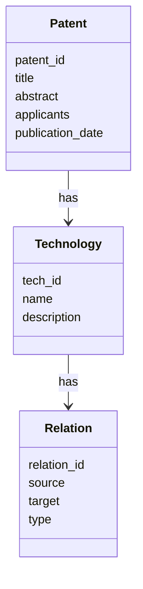
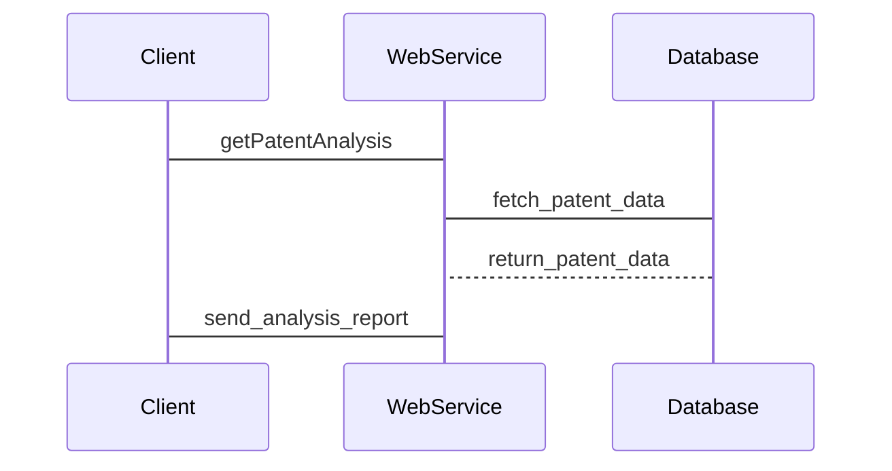

                 


# AI协作分析专利组合：评估技术驱动型公司的未来价值

## 关键词：AI协作分析，专利组合，技术驱动型公司，公司价值评估，知识产权

## 摘要：  
随着技术驱动型公司在全球市场中的崛起，专利组合已成为评估其未来价值的重要指标。本文通过AI协作分析的方法，详细探讨了如何利用人工智能技术对专利组合进行深入分析，揭示其在公司价值评估中的应用和意义。文章从专利组合分析的背景出发，介绍了AI协作分析的核心概念、算法原理、系统架构，并通过实际案例展示了AI在专利组合评估中的强大能力。最后，本文总结了AI协作分析的优势和未来发展方向，为技术驱动型公司提供了全新的视角和实践指南。

---

## 第1章: AI协作分析专利组合的背景介绍

### 1.1 专利组合分析的现状与挑战

#### 1.1.1 专利组合分析的传统方法  
专利组合分析是一种通过对公司拥有的专利资产进行评估，以判断其市场价值和战略意义的方法。传统的方法主要依赖于人工分析，包括专利的分类、技术领域的分布、专利的生命周期管理等。然而，这种方法存在效率低、成本高、主观性强等问题，难以应对海量专利数据的挑战。

#### 1.1.2 传统方法的局限性  
随着技术的快速发展，专利数量急剧增加，传统的专利组合分析方法已难以满足现代企业的需求。例如，人工分析专利的技术关联性、法律风险和市场价值时，容易出现遗漏、误判和主观偏差等问题。此外，传统方法难以快速响应市场变化，无法实时评估专利组合的价值波动。

#### 1.1.3 技术驱动型公司的专利组合特点  
技术驱动型公司通常依赖技术创新来维持竞争优势，其专利组合往往涵盖多个技术领域，并具有高度的技术关联性和前瞻性。这些公司的专利组合不仅反映了其技术实力，还可能影响其市场地位和投资价值。因此，如何高效、准确地评估技术驱动型公司的专利组合价值，成为企业管理和投资决策中的重要课题。

---

### 1.2 AI在专利组合分析中的作用

#### 1.2.1 AI技术如何提升专利分析效率  
人工智能技术可以通过自然语言处理（NLP）和机器学习算法，自动提取专利文本中的技术关键词、识别技术领域之间的关联性，并快速生成专利组合的分析报告。这不仅提高了分析效率，还降低了人工成本。

#### 1.2.2 AI在专利组合评估中的优势  
AI协作分析可以利用大数据处理能力，对海量专利数据进行深度挖掘，发现潜在的技术趋势和市场机会。例如，通过分析专利的引用情况、专利申请人的技术布局等，可以预测技术的发展方向和企业的竞争态势。

#### 1.2.3 AI协作分析的定义与核心目标  
AI协作分析是一种结合人工智能技术的专利组合分析方法，旨在通过自动化和智能化的手段，评估专利组合的技术价值、市场价值和法律风险。其核心目标是帮助技术驱动型公司优化专利组合管理，提升其市场竞争力和投资价值。

---

### 1.3 本章小结  
本章从专利组合分析的现状出发，探讨了传统方法的局限性，并介绍了AI协作分析的定义和作用。通过分析技术驱动型公司的专利组合特点，揭示了AI技术在专利分析中的巨大潜力。

---

## 第2章: AI协作分析的核心概念

### 2.1 专利组合分析的基本原理

#### 2.1.1 专利组合的定义与组成  
专利组合是指一组具有战略意义的专利资产，通常包括核心专利、外围专利和防御性专利。这些专利资产在技术、法律和市场上具有互补性，共同构成了公司的知识产权保护体系。

#### 2.1.2 专利组合的价值评估维度  
专利组合的价值可以从技术、法律和市场三个维度进行评估。技术维度关注专利的技术创新性和关联性；法律维度关注专利的法律稳定性；市场维度关注专利的市场应用潜力和竞争优势。

#### 2.1.3 技术驱动型公司的专利组合特点  
技术驱动型公司的专利组合通常具有高度的技术关联性和前瞻性，专利申请的数量和质量较高。此外，这些公司的专利组合往往集中在核心技术创新领域，并注重专利的全球化布局。

---

### 2.2 AI协作分析的关键技术

#### 2.2.1 自然语言处理在专利文本分析中的应用  
自然语言处理技术可以对专利文本进行分词、实体识别和语义理解，提取专利中的技术关键词和关联信息。

#### 2.2.2 机器学习在专利组合评估中的应用  
机器学习算法可以对专利组合进行分类、聚类和预测分析，帮助识别技术趋势和市场机会。

#### 2.2.3 图神经网络在专利关系分析中的应用  
图神经网络可以构建专利之间的关系图，分析专利之间的引用、技术关联和竞争关系。

---

### 2.3 核心概念对比分析

#### 2.3.1 专利组合分析与传统财务分析的对比  
| 维度 | 专利组合分析 | 传统财务分析 |
|------|----------------|----------------|
| 数据来源 | 专利文本、技术领域 | 财务报表、市场数据 |
| 分析目标 | 技术价值、法律风险 | 财务状况、市场表现 |
| 方法 | 文本挖掘、机器学习 | 财务指标、趋势分析 |

#### 2.3.2 AI协作分析与传统专利分析的对比  
| 维度 | AI协作分析 | 传统专利分析 |
|------|----------------|----------------|
| 分析效率 | 高 | 低 |
| 分析深度 | 深 | 浅 |
| 是否自动化 | 是 | 否 |

#### 2.3.3 不同AI技术在专利组合分析中的作用对比  
| 技术 | 作用 |
|------|------|
| 自然语言处理 | 提取专利文本中的技术信息 |
| 机器学习 | 分类、聚类、预测分析 |
| 图神经网络 | 分析专利之间的关系 |

---

### 2.4 本章小结  
本章详细介绍了AI协作分析的核心概念，包括专利组合的基本原理、关键技术及其对比分析。通过这些分析，我们可以更好地理解AI在专利组合评估中的作用。

---

## 第3章: AI协作分析的算法原理

### 3.1 自然语言处理在专利文本分析中的应用

#### 3.1.1 文本预处理与特征提取  
文本预处理包括分词、去停用词、实体识别等。特征提取可以通过词袋模型、TF-IDF等方法实现。

```python
from sklearn.feature_extraction.text import TfidfVectorizer

vectorizer = TfidfVectorizer()
tfidf_matrix = vectorizer.fit_transform(patent_texts)
```

#### 3.1.2 语义理解与专利分类  
通过预训练的语言模型（如BERT）对专利文本进行语义理解，并将其分类到不同的技术领域。

```python
from transformers import pipeline

classifier = pipeline("text-classification", model="bert-base-uncased")
predicted_labels = classifier(patent_texts)
```

---

### 3.2 机器学习在专利组合评估中的应用

#### 3.2.1 专利组合分类与聚类  
使用聚类算法（如K-means）对专利组合进行技术领域的聚类分析。

```python
from sklearn.cluster import KMeans

kmeans = KMeans(n_clusters=5)
clusters = kmeans.fit_predict(tfidf_matrix)
```

#### 3.2.2 专利组合的预测分析  
通过回归模型预测专利组合的市场价值。

```python
from sklearn.linear_model import LinearRegression

regressor = LinearRegression()
regressor.fit(X_train, y_train)
y_pred = regressor.predict(X_test)
```

---

### 3.3 图神经网络在专利关系分析中的应用

#### 3.3.1 专利关系图的构建  
通过图神经网络构建专利之间的引用和关联关系图。

```python
import networkx as nx

G = nx.Graph()
G.add_edges_from(patent_relations)
```

#### 3.3.2 图神经网络模型的训练  
使用图卷积网络（GCN）对专利关系图进行建模。

```python
import tensorflow as tf
from tensorflow.keras.layers import Dense, Dropout, InputLayer, Flatten

model = tf.keras.Sequential([
    InputLayer(input_shape=(input_dim,)),
    Flatten(),
    Dense(128, activation='relu'),
    Dropout(0.5),
    Dense(1, activation='sigmoid')
])
model.compile(optimizer='adam', loss='binary_crossentropy')
model.fit(X_train, y_train, epochs=10)
```

---

### 3.4 本章小结  
本章详细介绍了AI协作分析中常用的算法原理，包括自然语言处理、机器学习和图神经网络的应用。

---

## 第4章: 系统分析与架构设计

### 4.1 系统功能设计

#### 4.1.1 领域模型（Mermaid 类图）


#### 4.1.2 系统架构设计（Mermaid 架构图）
```mermaid
container Database {
    Patent
    Technology
    Relation
}

container Web Service {
    PatentService
    TechnologyService
    RelationService
}

container Client {
    PatentAnalyzer
    TechnologyAnalyzer
    RelationAnalyzer
}

WebService -- Database: Connect
Client -- WebService: Request
```

#### 4.1.3 接口设计与交互流程（Mermaid 序列图）


---

### 4.2 系统架构设计

#### 4.2.1 模块划分与功能分配  
系统分为数据采集、数据处理、数据分析和结果展示四个模块。数据采集模块负责获取专利数据；数据处理模块进行数据清洗和预处理；数据分析模块利用AI算法进行分析；结果展示模块将分析结果以可视化形式呈现。

#### 4.2.2 技术选型与实现方案  
后端使用Python和Flask框架，前端使用React框架，数据库使用MySQL。

---

### 4.3 本章小结  
本章详细介绍了AI协作分析系统的功能设计、架构设计和交互流程，为后续的系统实现提供了理论基础。

---

## 第5章: 项目实战

### 5.1 环境安装与配置

#### 5.1.1 安装必要的Python库  
安装自然语言处理库（如NLTK、spaCy）、机器学习库（如Scikit-learn、TensorFlow）和图分析库（如NetworkX）。

```bash
pip install numpy pandas scikit-learn tensorflow networkx
```

#### 5.1.2 数据获取与预处理  
从专利数据库获取专利文本数据，并进行清洗和标注。

```python
import pandas as pd

data = pd.read_csv('patents.csv')
data.dropna(inplace=True)
```

---

### 5.2 核心算法实现

#### 5.2.1 专利文本分析  
使用自然语言处理技术对专利文本进行分词和实体识别。

```python
from nltk.tokenize import word_tokenize
from nltk.corpus import stopwords

tokens = word_tokenize(data['abstract'])
filtered = [word for word in tokens if word not in stopwords.words('english')]
```

#### 5.2.2 专利组合分类  
利用机器学习算法对专利组合进行分类。

```python
from sklearn.model_selection import train_test_split
from sklearn.svm import SVC

X_train, X_test, y_train, y_test = train_test_split(X, y, test_size=0.2)
model = SVC()
model.fit(X_train, y_train)
print(model.score(X_test, y_test))
```

---

### 5.3 实际案例分析与结果解读

#### 5.3.1 案例背景与数据来源  
以某技术驱动型公司为例，分析其专利组合的市场价值。

#### 5.3.2 分析结果与解读  
通过AI协作分析得出的专利组合价值评估结果，帮助企业优化专利布局和投资决策。

---

### 5.4 本章小结  
本章通过实际案例展示了AI协作分析的实现过程和应用效果，验证了其在专利组合评估中的价值。

---

## 第6章: 最佳实践与小结

### 6.1 最佳实践

#### 6.1.1 工具选择建议  
根据具体需求选择合适的AI工具和平台，如Google Colab、Hugging Face等。

#### 6.1.2 数据预处理注意事项  
确保数据质量和完整性，避免因数据偏差影响分析结果。

#### 6.1.3 模型调优技巧  
通过交叉验证和超参数优化提高模型的准确性和稳定性。

---

### 6.2 小结与展望

#### 6.2.1 本章小结  
本文通过AI协作分析的方法，详细探讨了专利组合评估的技术与实践。通过理论分析和实际案例，展示了AI技术在专利组合评估中的巨大潜力。

#### 6.2.2 未来展望  
随着AI技术的不断发展，专利组合评估将更加智能化和自动化。未来的研究方向包括更高效的算法开发、多模态数据的融合分析以及全球化专利布局的优化。

---

## 第7章: 扩展阅读

### 7.1 相关书籍推荐

1. 《专利战略与企业竞争力》
2. 《人工智能技术与知识产权保护》
3. 《机器学习在知识产权分析中的应用》

### 7.2 在线资源推荐  
- [Google Patents](https://patents.google.com/)
- [USPTO官方数据库](https://www.uspto.gov/)
- [Hugging Face AI Tools](https://huggingface.co/)

---

## 作者：AI天才研究院 & 禅与计算机程序设计艺术

---

通过以上内容，我们系统地探讨了AI协作分析在专利组合评估中的应用，从理论到实践，为技术驱动型公司的未来发展提供了重要的参考和指导。

