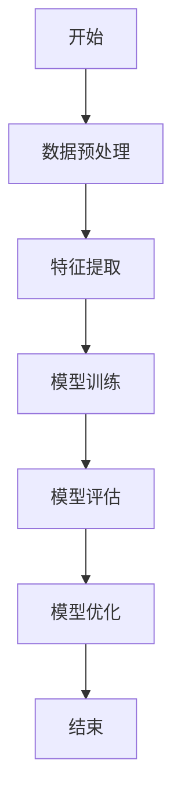
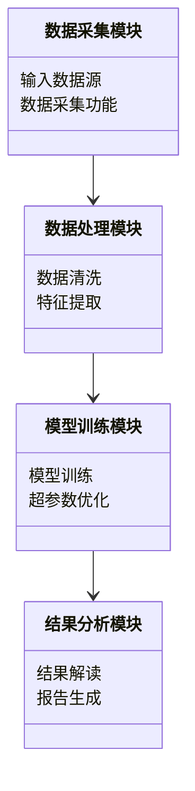
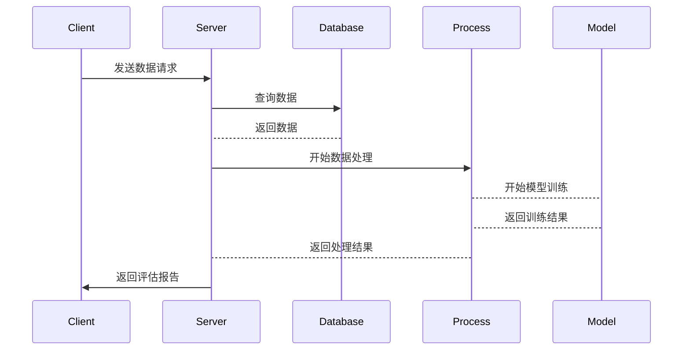

                 


# AI协作分析公司社会责任实践：全面评估企业价值

> 关键词：AI协作分析、公司社会责任、企业价值评估、算法原理、系统架构设计、项目实战、案例分析

> 摘要：本文从AI协作分析的视角，系统性地探讨了公司在社会责任实践中的评估与优化方法。通过理论分析、算法实现、系统设计和实际案例的结合，全面解析了企业如何利用AI技术提升社会责任实践的效率和效果，为企业价值的全面评估提供了新的思路和方法。

---

# 第一部分: AI协作分析与公司社会责任实践概述

## 第1章: AI协作分析与公司社会责任的背景

### 1.1 AI协作分析的基本概念

#### 1.1.1 什么是AI协作分析
AI协作分析是一种基于人工智能技术的协作分析方法，旨在通过算法和数据分析，帮助企业识别、评估和优化其在社会责任实践中的表现。它结合了自然语言处理（NLP）、机器学习（ML）和大数据分析等技术，能够从海量数据中提取有价值的信息，为企业社会责任的管理提供科学依据。

#### 1.1.2 AI协作分析的核心要素
- 数据采集：从企业内部数据和外部公开数据中获取与社会责任相关的信息。
- 数据处理：对数据进行清洗、转换和标注，为后续分析做准备。
- 模型构建：基于机器学习算法，构建用于社会责任评估的数学模型。
- 结果分析：通过模型输出结果，帮助企业识别社会责任实践中的优势与不足。

#### 1.1.3 公司社会责任的定义与内涵
公司社会责任（Corporate Social Responsibility, CSR）是指企业在追求经济利益的同时，还需要承担对社会、环境和利益相关者的责任。具体包括环境保护、员工福利、公平交易、社会公益等方面。

### 1.2 问题背景与问题描述

#### 1.2.1 当前企业社会责任面临的挑战
- 数据分散：企业社会责任相关的数据来源广泛，难以整合和分析。
- 模型复杂：社会责任评估涉及多维度的指标，传统方法难以量化。
- 实时性要求高：企业需要实时监控社会责任表现，以快速响应问题。

#### 1.2.2 AI技术在社会责任实践中的应用潜力
- 自动化数据处理：AI能够快速处理大量数据，提取关键信息。
- 智能评估：基于机器学习的模型可以量化社会责任的表现。
- 预测与优化：AI可以预测未来趋势，为企业提供优化建议。

#### 1.2.3 企业价值评估的复杂性与AI协作分析的必要性
企业价值评估不仅是财务指标的考量，还需要综合社会责任表现。AI协作分析能够帮助企业将社会责任表现转化为可量化的指标，从而更全面地评估企业价值。

### 1.3 问题解决与边界外延

#### 1.3.1 AI协作分析如何解决企业社会责任问题
- 提供数据支持：通过AI协作分析，企业可以获取社会责任实践的详细数据。
- 优化决策：基于AI模型的分析结果，企业可以制定更科学的社会责任策略。
- 实时监控：AI协作分析能够实时跟踪社会责任表现，帮助企业快速响应。

#### 1.3.2 问题解决的边界与限制
- 数据质量：AI协作分析依赖于高质量的数据，数据不足或不准确可能影响结果。
- 模型局限性：当前的AI模型在处理复杂的社会责任问题时可能存在局限性。
- 成本问题：AI协作分析需要较高的技术和资源投入，可能限制中小企业的应用。

#### 1.3.3 企业价值评估的外延与扩展
企业价值评估的外延包括社会责任、经济效益和社会影响等多个维度。通过AI协作分析，企业可以将社会责任表现与经济效益结合起来，实现更全面的价值评估。

### 1.4 核心概念与联系

#### 1.4.1 核心概念原理
AI协作分析通过数据采集、处理和建模，将企业社会责任表现转化为可量化的指标。这些指标可以帮助企业识别改进点，优化社会责任策略。

#### 1.4.2 核心概念属性特征对比表格
| 核心概念 | 定义 | 特性 |
|----------|------|------|
| 数据采集 | 获取社会责任相关数据 | 多源性、实时性 |
| 数据处理 | 清洗和转换数据 | 准确性、完整性 |
| 模型构建 | 建立社会责任评估模型 | 可解释性、准确性 |
| 结果分析 | 解读模型输出 | 可操作性、实用性 |

#### 1.4.3 ER实体关系图架构（Mermaid流程图）

```mermaid
er
    actor: 用户
    system: AI协作分析系统
    database: 社会责任数据
    process: 数据处理与建模
    report: 评估报告
    actor --> system: 提交数据请求
    system --> database: 查询数据
    system --> process: 开始数据处理
    process --> report: 生成评估报告
    system --> actor: 返回评估报告
```

---

## 第2章: AI协作分析的算法原理

### 2.1 算法原理概述

#### 2.1.1 AI协作分析的基本算法
AI协作分析的核心算法包括自然语言处理（NLP）、机器学习（ML）和深度学习（DL）。其中，机器学习算法用于构建社会责任评估模型，NLP用于处理文本数据。

#### 2.1.2 算法的数学模型与公式
社会责任评估模型可以表示为一个线性回归模型：

$$ y = \beta_0 + \beta_1x_1 + \beta_2x_2 + \dots + \beta_nx_n + \epsilon $$

其中，$y$ 是企业社会责任综合得分，$x_i$ 是各评估指标，$\beta_i$ 是回归系数，$\epsilon$ 是误差项。

#### 2.1.3 算法的实现步骤
1. 数据预处理：清洗和转换数据，提取特征。
2. 模型训练：使用训练数据训练回归模型。
3. 模型评估：通过测试数据验证模型的准确性。
4. 模型优化：调整参数，提升模型性能。

### 2.2 算法流程图



### 2.3 算法实现代码

#### 2.3.1 算法实现的Python源代码

```python
import numpy as np
from sklearn.linear_model import LinearRegression
from sklearn.metrics import mean_squared_error

# 示例数据
X = np.array([[1, 2], [3, 4], [5, 6]])
y = np.array([7, 8, 9])

# 模型训练
model = LinearRegression()
model.fit(X, y)

# 模型预测
y_pred = model.predict(X)

# 模型评估
mse = mean_squared_error(y, y_pred)
print(f"均方误差: {mse}")
```

#### 2.3.2 代码解读与分析
上述代码展示了如何使用Python的scikit-learn库实现线性回归模型。数据预处理和特征提取部分可以根据具体需求进行调整，模型训练和评估部分是AI协作分析的核心步骤。

---

## 第3章: 系统分析与架构设计方案

### 3.1 问题场景介绍

#### 3.1.1 企业社会责任实践的分析需求
企业需要实时监控社会责任表现，识别潜在风险，并制定优化策略。

#### 3.1.2 AI协作分析系统的应用场景
- 数据采集与处理
- 模型训练与评估
- 结果分析与报告生成

### 3.2 系统功能设计

#### 3.2.1 领域模型（Mermaid类图）



### 3.3 系统架构设计

#### 3.3.1 系统架构图（Mermaid架构图）


### 3.4 系统接口设计

#### 3.4.1 系统接口描述
- 输入接口：接收企业社会责任相关数据。
- 输出接口：返回社会责任评估报告。

#### 3.4.2 接口交互流程（Mermaid序列图）



---

## 第4章: 项目实战

### 4.1 环境安装与配置

#### 4.1.1 开发环境搭建
建议使用Python 3.8及以上版本，安装必要的库如pandas、numpy、scikit-learn等。

#### 4.1.2 依赖库安装
```bash
pip install pandas numpy scikit-learn
```

### 4.2 系统核心实现

#### 4.2.1 核心代码实现

```python
import pandas as pd
from sklearn.model_selection import train_test_split
from sklearn.linear_model import LinearRegression
from sklearn.metrics import r2_score

# 数据加载
data = pd.read_csv('csr_data.csv')

# 数据预处理
X = data.drop('score', axis=1)
y = data['score']

# 数据分割
X_train, X_test, y_train, y_test = train_test_split(X, y, test_size=0.2, random_state=42)

# 模型训练
model = LinearRegression()
model.fit(X_train, y_train)

# 模型预测
y_pred = model.predict(X_test)

# 模型评估
r2 = r2_score(y_test, y_pred)
print(f"R² Score: {r2}")
```

#### 4.2.2 代码解读与分析
上述代码展示了如何使用Python进行数据预处理、模型训练和评估。数据加载和预处理部分可以根据具体数据集进行调整，模型训练和评估部分是AI协作分析的核心步骤。

### 4.3 实际案例分析

#### 4.3.1 案例分析
以某制造企业为例，通过AI协作分析系统评估其社会责任表现。数据包括员工满意度、环境保护投入、社会责任支出等指标。模型输出结果表明，该企业在环境保护方面表现较好，但在员工福利方面存在改进空间。

---

## 第5章: 最佳实践与未来展望

### 5.1 最佳实践 tips

#### 5.1.1 数据质量管理
确保数据的准确性和完整性，是AI协作分析的基础。

#### 5.1.2 模型优化
定期更新模型，避免过时的数据和算法影响分析结果。

#### 5.1.3 人员培训
培养具备技术背景和社会责任意识的专业人才，提升分析能力。

### 5.2 小结
AI协作分析为企业社会责任实践的评估和优化提供了新的思路和方法。通过数据驱动的决策，企业可以更全面地评估自身价值，提升社会责任表现。

### 5.3 注意事项
- 数据隐私保护：在处理企业社会责任数据时，需注意数据隐私和合规性。
- 模型局限性：AI协作分析的结果仅供参考，需结合实际情况进行判断。

### 5.4 拓展阅读
建议阅读相关领域的最新研究论文和技术报告，深入了解AI在社会责任实践中的更多应用。

---

# 作者：AI天才研究院 & 禅与计算机程序设计艺术

---

通过本文的系统分析和实际案例，我们展示了AI协作分析在公司社会责任实践中的巨大潜力。希望本文能为企业在社会责任管理和社会价值评估方面提供有价值的参考和启发。

