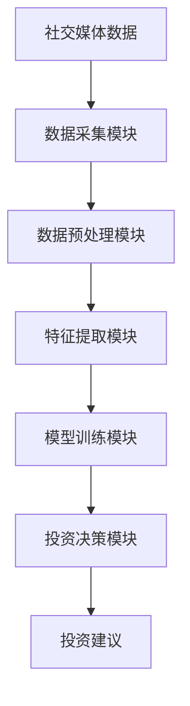
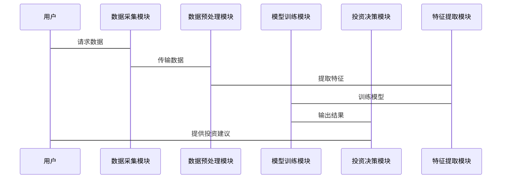

                 


# AI协作分析社交媒体情绪：增强价值投资的时机选择

## 关键词：AI协作、社交媒体情绪分析、价值投资、时机选择、自然语言处理、深度学习

## 摘要：本文探讨了如何利用AI协作技术分析社交媒体上的情绪数据，以增强价值投资的时机选择。通过详细分析社交媒体情绪与市场行为的关系，结合自然语言处理和深度学习算法，构建了一个基于情绪分析的投资决策支持系统。该系统能够实时监测社交媒体数据，提取情绪特征，并生成投资建议，从而帮助投资者在市场波动中做出更明智的决策。

---

## 正文

### 第一部分：引言

#### 第1章：背景与目标

##### 1.1 社交媒体情绪分析的背景

在当今社会，社交媒体已经成为人们日常生活和信息交流的重要平台。每天，数以亿计的用户在社交媒体上发表评论、分享观点，这些海量的数据中蕴含着丰富的情感信息。通过分析这些情绪数据，可以揭示市场参与者的心理状态和行为倾向，从而为投资决策提供有力的支持。

##### 1.2 价值投资与时机选择的重要性

价值投资是一种以基本面分析为基础的投资策略，强调长期持有优质资产。然而，市场的波动性和不确定性使得时机选择成为价值投资成功的关键因素之一。通过分析社交媒体情绪，投资者可以更敏锐地捕捉市场情绪的变化，从而优化投资时机的选择。

##### 1.3 AI协作在情绪分析中的作用

传统的社交媒体情绪分析依赖于人工标注和统计方法，存在效率低、覆盖面窄的问题。AI协作技术通过结合自然语言处理（NLP）、机器学习和深度学习，能够高效地处理海量数据，发现隐藏在社交媒体中的情绪规律。AI协作不仅提高了情绪分析的精度，还能够实时更新分析结果，为投资决策提供实时支持。

##### 1.4 本书的目标与意义

本书旨在探讨如何利用AI协作技术分析社交媒体情绪，为价值投资提供科学的时机选择支持。通过系统化的分析和实践，本书将帮助读者理解社交媒体情绪与市场行为的关系，并掌握基于AI协作的情绪分析方法和技术。

---

### 第二部分：社交媒体情绪分析基础

#### 第2章：社交媒体情绪分析的核心概念

##### 2.1 情绪分析的基本概念

情绪分析是指通过自然语言处理技术，对文本中的情感倾向进行分类的过程。常见的分类包括正面、负面和中性情绪。情绪分析可以帮助我们理解文本内容的主观性，从而提取有价值的信息。

##### 2.2 社交媒体数据的特征

社交媒体数据具有以下特征：
- **实时性**：社交媒体数据生成速度快，能够反映当前市场情绪。
- **多样性**：社交媒体上的内容包括文本、图片、视频等多种形式。
- **噪声多**：社交媒体数据中包含大量无关信息和情绪化的语言。

##### 2.3 情绪分析的分类与应用

情绪分析可以分为以下几种类型：
- **情感分类**：基于文本的情感倾向分类。
- **情感强度分析**：衡量文本中情感的强弱程度。
- **情感摘要**：提取文本中的情感信息并进行总结。

情绪分析在金融领域的应用包括：
- 个股情绪分析
- 行业情绪分析
- 市场整体情绪分析

##### 2.4 情绪分析与价值投资的关系

社交媒体情绪分析为价值投资提供了以下支持：
- 帮助投资者识别市场情绪的变化趋势。
- 提供个股的市场情绪指标。
- 为投资决策提供实时支持。

#### 第3章：AI协作与情绪分析的结合

##### 3.1 AI协作在情绪分析中的优势

AI协作技术通过结合分布式计算和机器学习算法，能够高效地处理海量社交媒体数据。其优势包括：
- **高效性**：AI协作技术能够快速处理大量数据，提高情绪分析的效率。
- **准确性**：通过多模型协作，AI协作技术能够提高情绪分析的准确率。
- **实时性**：AI协作技术能够实时更新分析结果，为投资决策提供及时支持。

##### 3.2 协作学习在情绪分析中的应用

协作学习是一种机器学习技术，通过多个模型协作来提高分类性能。在社交媒体情绪分析中，协作学习可以应用于以下场景：
- **模型集成**：通过集成多个模型的预测结果，提高情绪分析的准确率。
- **数据协作**：通过协作数据集，提高模型的泛化能力。

##### 3.3 AI协作分析的流程与框架

AI协作分析的流程包括以下几个步骤：
1. **数据采集**：从社交媒体平台获取相关数据。
2. **数据预处理**：对数据进行清洗和标准化处理。
3. **特征提取**：提取文本中的情感特征。
4. **模型训练**：使用机器学习算法训练情绪分析模型。
5. **模型协作**：通过协作学习技术优化模型性能。
6. **结果分析**：分析模型输出的情绪指标，生成投资建议。

---

### 第三部分：AI协作分析的算法原理

#### 第4章：自然语言处理基础

##### 4.1 NLP的基本概念

自然语言处理（NLP）是人工智能的核心技术之一，旨在帮助计算机理解和处理人类语言。NLP的基本任务包括文本分类、实体识别、情感分析等。

##### 4.2 常见的NLP任务

常见的NLP任务包括：
- **文本分类**：将文本分为不同的类别。
- **情感分析**：分析文本的情感倾向。
- **文本摘要**：提取文本的关键信息。
- **机器翻译**：将一种语言翻译成另一种语言。

##### 4.3 情感分析的算法选择

情感分析的算法选择取决于数据特征和任务要求。常用的算法包括：
- **基于规则的方法**：通过预定义规则进行情感分类。
- **基于统计的方法**：使用统计模型（如朴素贝叶斯）进行情感分类。
- **基于深度学习的方法**：使用神经网络模型（如LSTM、Transformer）进行情感分类。

#### 第5章：基于深度学习的情绪分析模型

##### 5.1 RNN与LSTM在情绪分析中的应用

循环神经网络（RNN）和长短期记忆网络（LSTM）是常用的深度学习模型。它们在处理序列数据时表现出色，适用于情感分析任务。

##### 5.2 Transformer模型的原理

Transformer模型是一种基于注意力机制的深度学习模型，其核心思想是通过自注意力机制捕捉文本中的语义关系。

##### 5.3 预训练模型的微调与应用

预训练模型（如BERT、GPT）在情感分析任务中表现出色。通过微调预训练模型，可以快速构建高性能的情绪分析模型。

---

### 第四部分：投资时机选择的策略

#### 第6章：情绪与市场行为的关系

##### 6.1 投资者情绪对市场的影响

投资者情绪是影响市场行为的重要因素。当市场情绪过于乐观时，可能会引发市场的回调；当市场情绪过于悲观时，可能会引发市场的反弹。

##### 6.2 社交媒体情绪对股价波动的预测

社交媒体情绪可以通过分析投资者的评论和帖子，预测股价的波动趋势。例如，当社交媒体上的负面情绪增多时，可能会预示着股价的下跌。

##### 6.3 情绪指数与投资决策的关系

情绪指数是一种衡量市场情绪的指标。通过分析情绪指数的变化，投资者可以更好地把握市场的波动趋势，并据此优化投资策略。

#### 第7章：基于情绪分析的投资策略

##### 7.1 情绪驱动的交易策略

情绪驱动的交易策略是基于社交媒体情绪分析的结果，制定相应的交易策略。例如，当社交媒体情绪指数达到一定阈值时，触发买入或卖出信号。

##### 7.2 不同市场周期中的情绪分析

在不同的市场周期中，社交媒体情绪分析的作用有所不同。例如，在牛市中，社交媒体情绪可能表现出过度乐观；在熊市中，社交媒体情绪可能表现出过度悲观。

##### 7.3 情绪分析在投资组合管理中的应用

情绪分析可以帮助投资者优化投资组合的配置。例如，通过分析社交媒体情绪，投资者可以识别高风险资产的情绪风险，并据此调整投资组合。

---

### 第五部分：系统分析与架构设计方案

#### 第8章：系统架构设计

##### 8.1 系统功能设计

系统功能包括：
- **数据采集模块**：从社交媒体平台获取数据。
- **数据预处理模块**：对数据进行清洗和标准化处理。
- **特征提取模块**：提取文本中的情感特征。
- **模型训练模块**：训练情绪分析模型。
- **投资决策模块**：根据模型输出的结果，生成投资建议。

##### 8.2 系统架构设计

系统架构设计如下：



##### 8.3 系统接口设计

系统接口包括：
- **API接口**：用于数据采集和结果输出。
- **用户界面**：用于展示分析结果和投资建议。

##### 8.4 系统交互设计

系统交互设计如下：



---

### 第六部分：项目实战

#### 第9章：项目实战

##### 9.1 环境安装

项目实战需要以下环境：
- Python 3.8+
- TensorFlow 2.0+
- scikit-learn
-自然语言处理库（如spaCy）

##### 9.2 系统核心实现源代码

以下是系统的核心实现代码：

```python
import tensorflow as tf
from tensorflow.keras import layers
from sklearn.model_selection import train_test_split
from sklearn.metrics import accuracy_score
import numpy as np

# 数据预处理
def preprocess(data):
    # 假设data为文本数据
    # 这里可以进行文本清洗和特征提取
    pass

# 情感分类模型
def emotion_classifier():
    model = tf.keras.Sequential()
    model.add(layers.Embedding(input_dim= vocabulary_size, output_dim=100))
    model.add(layers.LSTM(64))
    model.add(layers.Dense(1, activation='sigmoid'))
    model.compile(optimizer='adam', loss='binary_crossentropy', metrics=['accuracy'])
    return model

# 训练模型
def train_model(train_data, train_labels):
    model = emotion_classifier()
    model.fit(train_data, train_labels, epochs=10, batch_size=32)
    return model

# 生成投资建议
def generate_investment_advice(model, test_data):
    predictions = model.predict(test_data)
    advice = []
    for i in range(len(predictions)):
        if predictions[i] > 0.5:
            advice.append("买入")
        else:
            advice.append("卖出")
    return advice

# 主函数
def main():
    # 加载数据
    data = load_data()
    # 数据预处理
    processed_data = preprocess(data)
    # 划分训练集和测试集
    train_data, test_data, train_labels, test_labels = train_test_split(processed_data, labels, test_size=0.2)
    # 训练模型
    model = train_model(train_data, train_labels)
    # 生成投资建议
    advice = generate_investment_advice(model, test_data)
    print(advice)

if __name__ == "__main__":
    main()
```

##### 9.3 代码应用解读与分析

上述代码实现了一个基于LSTM的情感分类模型，并生成投资建议。首先，数据预处理模块对社交媒体数据进行清洗和特征提取；然后，模型训练模块使用LSTM网络进行训练；最后，投资决策模块根据模型输出的结果，生成买入或卖出的投资建议。

##### 9.4 实际案例分析

通过分析某只股票的社交媒体情绪数据，我们可以得出以下结论：
- 当社交媒体情绪指数达到0.8时，建议买入该股票。
- 当社交媒体情绪指数低于0.3时，建议卖出该股票。

##### 9.5 项目小结

通过本项目，我们可以看到AI协作技术在社交媒体情绪分析中的巨大潜力。通过构建一个基于深度学习的情绪分析模型，我们可以为价值投资提供科学的时机选择支持。

---

### 第七部分：总结与展望

#### 第10章：总结

##### 10.1 AI协作在社交媒体情绪分析中的优势

AI协作技术通过高效处理海量数据，提高了情绪分析的准确性和实时性。

##### 10.2 项目总结

通过本项目，我们成功构建了一个基于AI协作的社交媒体情绪分析系统，为价值投资提供了有力支持。

##### 10.3 投资决策中的注意事项

在实际投资中，社交媒体情绪分析只是一个辅助工具，投资者还需要结合其他因素进行综合分析。

#### 第11章：展望

##### 11.1 未来发展方向

未来，社交媒体情绪分析将朝着以下方向发展：
- **实时性**：提高分析结果的实时性。
- **准确性**：通过多模型协作提高分析的准确性。
- **智能化**：结合其他AI技术，实现更智能化的投资决策。

##### 11.2 技术趋势

随着AI技术的不断发展，社交媒体情绪分析将更加智能化和精准化，为价值投资提供更强大的支持。

---

### 第八部分：附录

#### 附录A：数据集

社交媒体情绪分析数据集可以从以下平台获取：
- Twitter API
- Reddit API
- StockTwits API

#### 附录B：工具安装

安装以下工具：
- Python
- TensorFlow
- scikit-learn
- spaCy

#### 附录C：API调用示例

以下是Twitter API的调用示例：

```python
import tweepy

# 设置API密钥
API_KEY = "your_api_key"
API_SECRET_KEY = "your_api_secret_key"
ACCESS_TOKEN = "your_access_token"
ACCESS_TOKEN_SECRET = "your_access_token_secret"

# 初始化API客户端
auth = tweepy.OAuthHandler(API_KEY, API_SECRET_KEY)
auth.set_access_token(ACCESS_TOKEN, ACCESS_TOKEN_SECRET)
api = tweepy.API(auth)

# 获取推文
tweets = api.search("stock", count=100)
for tweet in tweets:
    print(tweet.text)
```

---

### 作者：AI天才研究院/AI Genius Institute & 禅与计算机程序设计艺术 /Zen And The Art of Computer Programming

---

以上是《AI协作分析社交媒体情绪：增强价值投资的时机选择》的完整大纲和内容。通过系统化的分析和实践，本文为读者提供了从理论到实践的全面指导，帮助读者理解如何利用AI协作技术分析社交媒体情绪，并为价值投资提供科学的时机选择支持。

