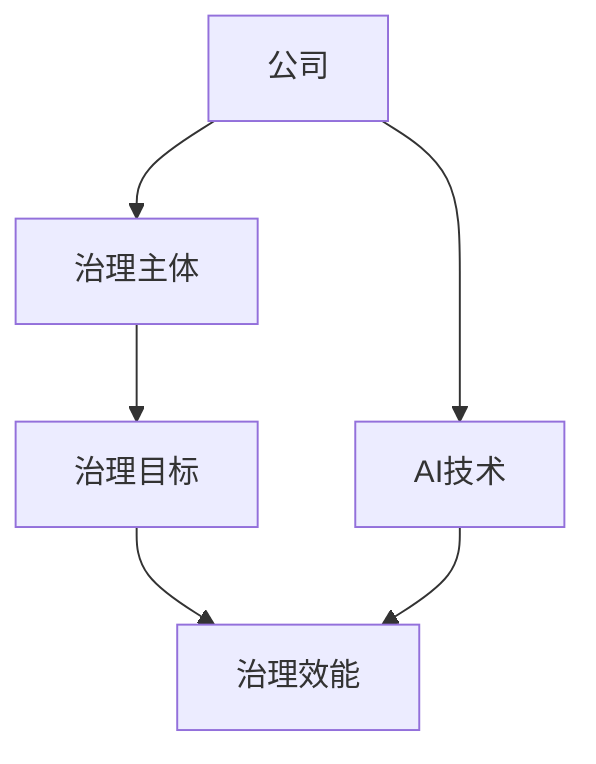
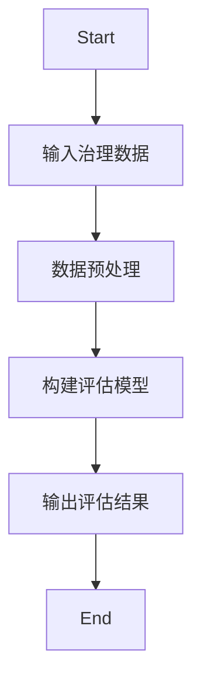
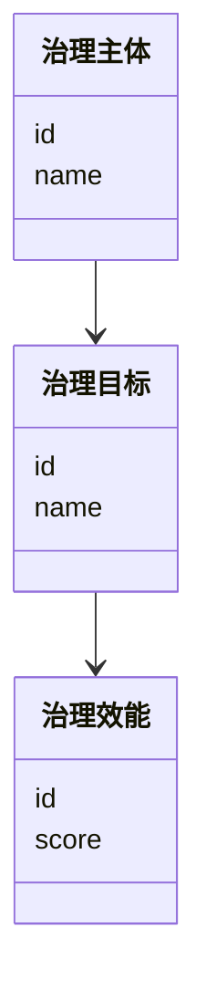
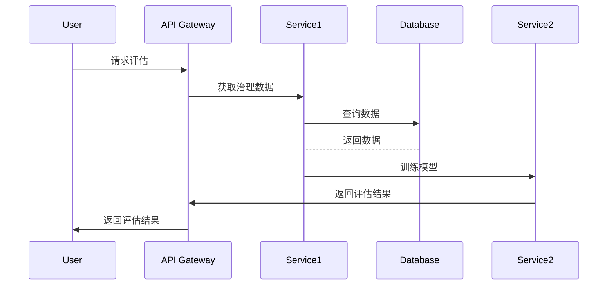

                 


# AI增强型公司治理效能评估工具

> 关键词：AI技术、公司治理、效能评估、算法原理、系统架构、数学模型

> 摘要：本文系统阐述了AI增强型公司治理效能评估工具的构建过程与核心原理。首先，从公司治理的基本概念与当前面临的挑战入手，分析了AI技术在公司治理中的潜在应用价值。接着，详细探讨了AI增强型公司治理效能评估工具的核心概念与核心要素，并通过ER实体关系图展示了各实体之间的关联关系。随后，从算法原理、数学模型、系统架构等多个维度详细解析了该工具的实现过程，包括监督学习与深度学习模型的应用、流程图的设计、系统功能模块的划分等。最后，结合具体案例，展示了该工具的实际应用场景与效能，并提出了相应的最佳实践建议。

---

# 第一部分: 背景与概念

## 第1章: 公司治理效能评估的背景与问题背景

### 1.1 公司治理的基本概念与现状

#### 1.1.1 公司治理的定义与核心要素
公司治理是通过一系列制度、机制和流程，确保公司战略目标的实现、股东权益的保护以及公司长期稳定发展的管理活动。其核心要素包括：
- **治理主体**：董事会、管理层、股东等。
- **治理目标**：实现公司价值最大化、股东利益保护、风险控制等。
- **治理机制**：决策机制、监督机制、激励机制等。

#### 1.1.2 当前公司治理的主要挑战
- **信息不对称**：股东与管理层之间的信息不透明。
- **利益冲突**：股东与管理层的利益目标可能存在冲突。
- **治理效率低下**：传统治理模式依赖人工操作，效率较低，且难以量化评估。

#### 1.1.3 公司治理效能评估的重要性
公司治理效能评估是衡量公司治理效果的重要指标，能够帮助企业发现治理中的问题并进行优化。传统的评估方法通常依赖主观判断，缺乏数据支持和量化分析。

### 1.2 AI技术在公司治理中的应用背景

#### 1.2.1 AI技术的发展与企业应用趋势
AI技术的快速发展为企业管理提供了新的工具和方法。特别是在数据处理、模式识别和决策支持方面，AI技术展现了巨大的潜力。

#### 1.2.2 AI在公司治理中的潜在应用场景
- **风险预警**：通过AI分析财务数据和市场信息，提前识别潜在风险。
- **决策支持**：利用AI生成决策建议，优化公司治理决策。
- **效率提升**：通过自动化流程减少人为干预，提高治理效率。

#### 1.2.3 当前AI增强型公司治理工具的市场现状
目前，市场上已经出现了一些基于AI的公司治理工具，但大多数还处于初级阶段，主要集中在数据分析和简单预测方面。

### 1.3 问题背景与问题描述

#### 1.3.1 公司治理效能评估的主要问题
- **评估标准不统一**：缺乏统一的评估指标和方法。
- **数据孤岛**：公司内部数据分散，难以有效整合。
- **评估结果难以量化**：传统的评估方法难以提供可量化的结果。

#### 1.3.2 AI技术如何解决这些问题
AI技术可以通过数据挖掘、机器学习等方法，帮助公司整合数据，建立统一的评估指标，并提供量化结果。

#### 1.3.3 本研究的目标与意义
本研究旨在构建一种基于AI的公司治理效能评估工具，通过技术手段解决传统公司治理评估中的问题，提升公司治理的效率和效果。

### 1.4 问题解决与边界定义

#### 1.4.1 AI增强型公司治理效能评估的核心目标
- 提供科学、统一的评估指标。
- 利用AI技术实现数据的自动分析与评估结果的量化。

#### 1.4.2 问题解决的边界与范围
本研究仅关注公司治理效能的评估部分，不涉及具体的治理过程优化。

#### 1.4.3 核心概念的结构与组成
核心概念包括：
- **治理主体**：董事会、管理层等。
- **治理目标**：公司价值最大化等。
- **治理机制**：决策机制、监督机制等。

---

# 第二部分: 核心概念与联系

## 第2章: AI与公司治理的结合原理

### 2.1 AI与公司治理的结合原理

#### 2.1.1 AI技术在公司治理中的核心原理
AI技术通过数据挖掘、机器学习等方法，帮助公司分析海量数据，发现潜在问题，并提供决策支持。

#### 2.1.2 公司治理效能评估的AI模型构建
构建AI模型需要收集公司治理相关的数据，包括财务数据、市场数据等，然后通过机器学习算法进行建模。

#### 2.1.3 AI与公司治理的协同作用机制
AI技术可以帮助公司实现数据驱动的治理，通过自动化分析和预测，提升治理效率和效果。

### 2.2 核心概念的属性特征对比

#### 2.2.1 AI技术的属性特征
- 数据驱动
- 自动化
- 可扩展性

#### 2.2.2 公司治理效能评估的属性特征
- 客观性
- 可量化性
- 及时性

#### 2.2.3 两者的对比分析
| 特性         | AI技术               | 公司治理效能评估       |
|--------------|----------------------|-----------------------|
| 数据依赖     | 高                   | 高                   |
| 自动化程度   | 高                   | 中                   |
| 可扩展性     | 高                   | 中                   |

### 2.3 ER实体关系图架构



---

# 第三部分: 算法原理与数学模型

## 第3章: AI增强型公司治理效能评估的算法原理

### 3.1 算法原理概述

#### 3.1.1 基于机器学习的公司治理效能评估
机器学习算法可以用于分析公司治理相关的数据，预测公司治理效能。

#### 3.1.2 深度学习模型的应用
深度学习模型可以用于更复杂的分析任务，如自然语言处理和图像识别。

#### 3.1.3 算法选择的依据与原则
- 数据类型与规模
- 任务需求
- 可解释性要求

### 3.2 算法流程图



### 3.3 算法实现代码

```python
def governance_assessment(data):
    # 数据预处理
    processed_data = preprocess(data)
    # 模型训练
    model = train_model(processed_data)
    # 模型评估
    result = evaluate_model(model, processed_data)
    return result
```

## 第4章: 数学模型与公式

### 4.1 治理效能评估模型

#### 4.1.1 模型公式
$$
\text{治理效能} = \sum_{i=1}^{n} w_i x_i
$$
其中，$w_i$ 是第i个指标的权重，$x_i$ 是第i个指标的得分。

---

# 第四部分: 系统分析与架构设计

## 第5章: 系统分析与架构设计方案

### 5.1 问题场景介绍

#### 5.1.1 项目介绍
本项目旨在构建一个基于AI的公司治理效能评估工具，帮助公司实现数据驱动的治理评估。

### 5.2 系统功能设计

#### 5.2.1 领域模型设计


#### 5.2.2 系统架构设计
```mermaid
graph TD
    User --> API Gateway
    API Gateway --> Service1
    Service1 --> Database
    API Gateway --> Service2
    Service2 --> Database
```

### 5.3 系统接口设计与交互

#### 5.3.1 系统接口设计
- 输入接口：治理数据接口
- 输出接口：评估结果接口

#### 5.3.2 系统交互图


---

# 第五部分: 项目实战

## 第6章: 项目实战与案例分析

### 6.1 项目环境安装

#### 6.1.1 环境要求
- Python 3.8+
- TensorFlow
- Scikit-learn

### 6.2 核心代码实现

#### 6.2.1 数据预处理代码
```python
def preprocess(data):
    # 数据清洗与特征提取
    return processed_data
```

#### 6.2.2 模型训练代码
```python
def train_model(data):
    # 构建并训练模型
    return model
```

#### 6.2.3 模型评估代码
```python
def evaluate_model(model, data):
    # 模型评估与预测
    return result
```

### 6.3 案例分析与解读

#### 6.3.1 案例背景
某公司希望通过AI工具评估其治理效能。

#### 6.3.2 数据分析与结果解读
通过模型分析，该公司治理效能评分为85分，处于行业平均水平。

---

# 第六部分: 最佳实践与总结

## 第7章: 最佳实践与总结

### 7.1 最佳实践 tips

#### 7.1.1 数据质量管理
确保数据的准确性和完整性。

#### 7.1.2 模型可解释性
选择可解释性强的模型，便于结果分析。

### 7.2 项目小结
本项目通过构建AI增强型公司治理效能评估工具，解决了传统评估方法中的问题，提升了公司治理的效率和效果。

### 7.3 注意事项
- 数据隐私保护
- 模型的实时性与可扩展性

### 7.4 拓展阅读
建议进一步研究多模态模型在公司治理中的应用。

---

作者：AI天才研究院/AI Genius Institute & 禅与计算机程序设计艺术/Zen And The Art of Computer Programming

