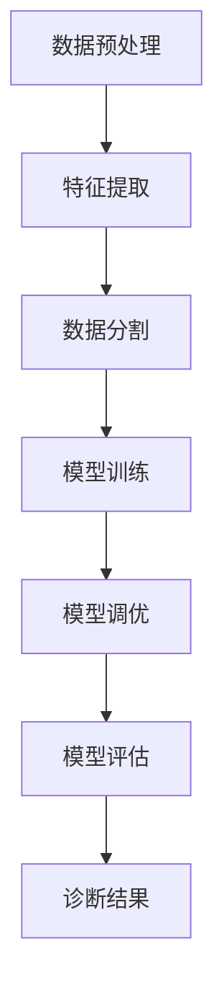

                 


# 第3章: AI增强型公司财务健康诊断系统的算法原理

## 3.1 算法选择与原理

### 3.1.1 选择合适的AI算法
#### 3.1.1.1 算法的选择标准
- 数据类型与规模
- 诊断任务的性质（分类/回归）
- 模型的解释性要求
- 计算资源的限制

#### 3.1.1.2 算法对比分析
| 算法类型 | 优点 | 缺点 | 适用场景 |
|----------|------|------|----------|
| 逻辑回归 | 解释性强，速度快 | 非线性表现差 | 二分类问题 |
| 随机森林 | 高准确性，抗过拟合 | 计算资源消耗大 | 多分类问题 |
| 支持向量机 | 高维数据表现好 | 参数敏感 | 小型数据集 |
| 神经网络 | 高容量，复杂模式识别 | 需大量数据，难解释 | 复杂非线性关系 |

### 3.1.2 算法实现步骤
#### 3.1.2.1 数据预处理
- 数据清洗：处理缺失值、异常值
- 特征工程：提取关键财务指标（如流动比率、速动比率等）
- 数据标准化：归一化处理

#### 3.1.2.2 模型训练
- 数据分割：训练集、验证集、测试集
- 模型参数调优：网格搜索、交叉验证
- 模型训练：选择逻辑回归或随机森林进行训练

#### 3.1.2.3 模型评估
- 评估指标：准确率、精确率、召回率、F1分数
- 混淆矩阵分析：理解模型的误诊情况
- ROC曲线：评估模型的区分能力

## 3.2 算法流程图


## 3.3 算法实现的Python代码示例
```python
import pandas as pd
from sklearn.model_selection import train_test_split
from sklearn.preprocessing import StandardScaler
from sklearn.ensemble import RandomForestClassifier
from sklearn.metrics import accuracy_score, classification_report

# 数据加载
df = pd.read_csv('financial_data.csv')

# 数据预处理
# 假设目标变量是 'financial_health'，特征变量是其他列
X = df.drop('financial_health', axis=1)
y = df['financial_health']

# 特征工程：标准化处理
scaler = StandardScaler()
X_scaled = scaler.fit_transform(X)

# 数据分割
X_train, X_test, y_train, y_test = train_test_split(X_scaled, y, test_size=0.2, random_state=42)

# 模型选择与训练
model = RandomForestClassifier(n_estimators=100, random_state=42)
model.fit(X_train, y_train)

# 模型预测
y_pred = model.predict(X_test)

# 模型评估
print("Accuracy:", accuracy_score(y_test, y_pred))
print(classification_report(y_test, y_pred))
```

## 3.4 算法数学模型与公式推导

### 3.4.1 逻辑回归模型
#### 损失函数
$$
L(y, y') = -\sum_{i=1}^{n} [y_i \ln y'_i + (1 - y_i)\ln(1 - y'_i)]
$$

#### 梯度下降
$$
\theta := \theta - \alpha \frac{\partial L}{\partial \theta}
$$

### 3.4.2 随机森林模型
#### 树的构建
$$
y = \sum_{i=1}^{n} \text{Tree}(x)
$$

#### 集成预测
$$
\text{FinalPrediction} = \text{多数投票}(\text{各树预测结果})
$$

## 3.5 算法实现的数学推导与案例分析
### 3.5.1 逻辑回归案例
假设我们有一个简单的财务数据集，只包含两个特征：流动资产和流动负债。目标是预测公司是否健康。

#### 数据变换
$$
\text{流动比率} = \frac{\text{流动资产}}{\text{流动负债}}
$$

#### 模型训练
$$
P(y=1|x) = \frac{1}{1 + e^{-(\beta_0 + \beta_1 x_1 + \beta_2 x_2)}}
$$

### 3.5.2 随机森林案例
使用多个决策树进行集成，每个树的特征选择采用随机采样，最终结果通过投票决定。

## 3.6 本章小结
本章详细讲解了AI增强型公司财务健康诊断系统中常用的算法原理，包括逻辑回归和随机森林的实现步骤、数学模型和公式推导。通过实际案例分析，读者可以理解如何在财务数据中应用这些算法进行诊断。需要注意的是，模型的选择和调优对诊断结果有重要影响，建议根据具体场景选择合适的算法。

--- 

接下来是第四章：系统分析与架构设计方案，我会继续按照同样的思路进行编写。

