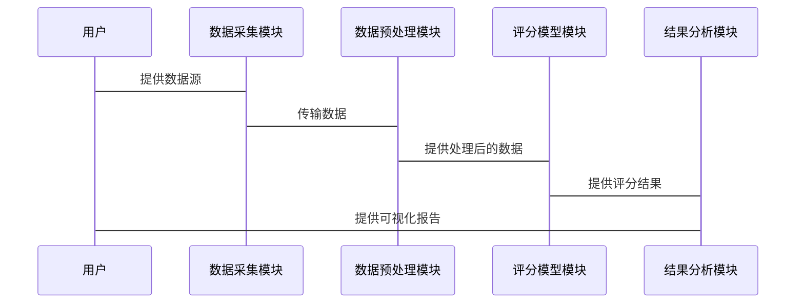
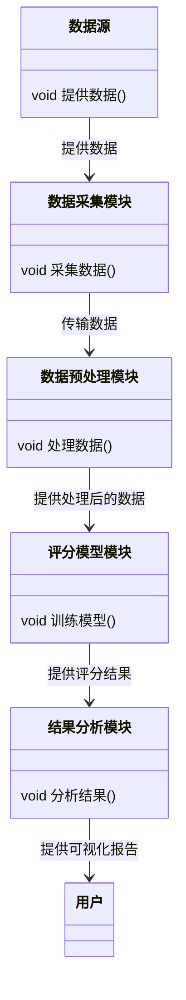

                 


# AI增强型公司质量评分系统

## 关键词：AI增强型、公司质量评分、评分系统、机器学习、系统架构、项目实战

## 摘要：
AI增强型公司质量评分系统是一种结合人工智能技术的评分系统，旨在通过先进的算法和数据分析提升公司质量评估的准确性、效率和全面性。本文详细介绍了该系统的背景、核心概念、算法原理、系统架构设计、项目实战以及最佳实践，为读者提供从理论到实践的全面指导。

---

## 第一部分: AI增强型公司质量评分系统概述

### 第1章: 背景介绍与核心概念

#### 1.1 问题背景

##### 1.1.1 传统公司质量评分系统的局限性
传统的公司质量评分系统主要依赖于人工评估和简单的统计方法，存在以下问题：
- **主观性**：评分结果容易受到评估人员主观因素的影响。
- **低效性**：人工评估耗时长，难以快速响应。
- **片面性**：传统评分系统可能无法全面捕捉公司质量的多维度信息。
- **缺乏动态性**：难以实时更新和调整评分标准。

##### 1.1.2 AI技术在评分系统中的潜在价值
人工智能技术能够通过大数据分析和深度学习模型，显著提升评分系统的客观性和准确性。AI技术的优势包括：
- **数据驱动**：利用大量数据进行分析，提取有价值的信息。
- **自动化与智能化**：通过自动化处理和智能算法，提高评估效率。
- **动态调整**：能够根据实时数据和反馈动态调整评分标准。

##### 1.1.3 当前企业质量评分系统的痛点
- 数据孤岛：企业内部数据分散，难以有效整合。
- 评估标准不统一：不同部门或业务单元可能使用不同的评估标准。
- 缺乏实时性：评分结果更新速度较慢，难以满足实时决策需求。

#### 1.2 核心概念与定义

##### 1.2.1 AI增强型评分系统的定义
AI增强型公司质量评分系统是一种结合人工智能技术的评分系统，通过机器学习算法和大数据分析，对公司的质量进行多维度评估，并提供智能化的评分结果。

##### 1.2.2 系统的核心要素与组成部分
- **数据采集模块**：负责收集公司相关的多维度数据，如财务数据、市场表现、管理效率等。
- **数据预处理模块**：对采集的数据进行清洗、转换和特征提取。
- **评分模型**：基于机器学习算法构建评分模型，对公司的质量进行评估。
- **结果分析模块**：对评分结果进行分析，生成可视化报告和改进建议。

##### 1.2.3 系统的边界与外延
- **边界**：系统仅针对公司质量评估，不涉及其他业务领域。
- **外延**：评分结果可以与其他系统集成，如ERP、CRM等，提供更全面的决策支持。

#### 1.3 核心概念的关系图

##### 1.3.1 系统功能模块的ER实体关系图
```mermaid
er
    Company {
        company_id: int
        company_name: string
        financial_data: float
        market_performance: int
        management_efficiency: int
    }
    Score {
        score_id: int
        company_id: int
        score_value: float
        evaluation_date: date
    }
    -- Company 和 Score 的关系
    Company -- Score: 一对多关系
```

##### 1.3.2 系统数据流的mermaid流程图


##### 1.3.3 核心概念的属性特征对比表格
| 核心概念 | 属性 | 特征 |
|----------|------|------|
| 数据采集模块 | 数据来源 | 财务数据、市场表现、管理效率 |
| 数据预处理模块 | 数据清洗 | 删除缺失值、处理异常值 |
| 评分模型 | 算法类型 | 线性回归、支持向量机、神经网络 |

### 第2章: AI增强型评分系统的算法原理

#### 2.1 算法原理概述

##### 2.1.1 评分模型的选择与优化
- **线性回归**：适用于线性关系的数据，但可能无法捕捉复杂的非线性关系。
- **支持向量机（SVM）**：适用于小样本数据，能够处理高维数据。
- **神经网络**：适用于复杂的数据关系，但需要大量数据和计算资源。

##### 2.1.2 数据预处理与特征提取
- **数据清洗**：处理缺失值、异常值和重复数据。
- **特征提取**：从原始数据中提取有意义的特征，如财务比率、市场增长率等。

##### 2.1.3 模型训练与调优
- **模型训练**：使用训练数据训练评分模型。
- **模型调优**：通过交叉验证和网格搜索优化模型参数。

#### 2.2 算法实现细节

##### 2.2.1 评分模型的数学表达式
线性回归模型的数学表达式为：
$$ y = \beta_0 + \beta_1x_1 + \beta_2x_2 + \ldots + \beta_nx_n + \epsilon $$
其中，$y$ 是目标变量，$x_i$ 是自变量，$\beta_i$ 是回归系数，$\epsilon$ 是误差项。

##### 2.2.2 算法流程的mermaid流程图


##### 2.2.3 代码实现示例
```python
import pandas as pd
from sklearn.model_selection import train_test_split
from sklearn.linear_model import LinearRegression

# 数据加载
data = pd.read_csv('company_data.csv')

# 数据分割
X = data[['revenue', 'profit', 'growth']]
y = data['score']

X_train, X_test, y_train, y_test = train_test_split(X, y, test_size=0.2, random_state=42)

# 模型训练
model = LinearRegression()
model.fit(X_train, y_train)

# 模型预测
y_pred = model.predict(X_test)
```

#### 2.3 算法的数学模型与公式

##### 2.3.1 线性回归模型
线性回归模型的损失函数为：
$$ L = \frac{1}{2m} \sum_{i=1}^{m} (y_i - (w^T x_i + b))^2 $$
其中，$m$ 是样本数量，$w$ 是权重向量，$b$ 是偏置项。

##### 2.3.2 支持向量机模型
支持向量机的目标是最小化 hinge loss：
$$ L = \sum_{i=1}^{m} \frac{1}{2} \xi_i^2 + C \sum_{i=1}^{m} \xi_i $$
其中，$\xi_i$ 是松弛变量，$C$ 是惩罚参数。

##### 2.3.3 神经网络模型
神经网络的损失函数为：
$$ L = -\frac{1}{m} \sum_{i=1}^{m} [y_i \log(a_i) + (1 - y_i) \log(1 - a_i)] $$
其中，$a_i$ 是输出层的激活值，$y_i$ 是真实标签。

### 第3章: 系统分析与架构设计

#### 3.1 系统分析

##### 3.1.1 问题场景介绍
系统需要解决传统评分系统效率低、准确性差的问题，通过AI技术提升评分的准确性和效率。

##### 3.1.2 项目目标与范围
- **目标**：构建一个基于AI的公司质量评分系统。
- **范围**：涵盖数据采集、预处理、模型训练和评分输出。

##### 3.1.3 系统功能需求分析
- **数据采集**：从多个数据源获取公司信息。
- **数据预处理**：清洗和转换数据。
- **模型训练**：训练评分模型并进行调优。
- **评分输出**：生成评分结果并提供可视化报告。

#### 3.2 系统架构设计

##### 3.2.1 系统模块划分
- **数据采集模块**：负责数据的获取和存储。
- **数据预处理模块**：对数据进行清洗和特征提取。
- **评分模型模块**：训练和优化评分模型。
- **结果分析模块**：生成评分结果和可视化报告。

##### 3.2.2 系统数据流设计


##### 3.2.3 系统架构的mermaid架构图


#### 3.3 系统接口与交互设计

##### 3.3.1 系统接口设计
- **输入接口**：接收公司数据和评分标准。
- **输出接口**：提供评分结果和可视化报告。

##### 3.3.2 系统交互的mermaid序列图


##### 3.3.3 系统功能的领域模型mermaid类图


### 第4章: 项目实战与实现

#### 4.1 环境安装与配置

##### 4.1.1 开发环境搭建
- **操作系统**：Windows 10或Linux Ubuntu
- **编程语言**：Python 3.8及以上
- **开发工具**：Jupyter Notebook或VS Code

##### 4.1.2 依赖库安装
```bash
pip install pandas scikit-learn matplotlib
```

##### 4.1.3 数据集准备
- 数据集来源：可以从公开数据集或企业内部数据获取。
- 数据格式：CSV格式，包含公司ID、财务数据、市场表现、管理效率等。

#### 4.2 系统核心实现

##### 4.2.1 数据预处理代码
```python
import pandas as pd
import numpy as np

# 数据加载
data = pd.read_csv('company_data.csv')

# 删除缺失值
data = data.dropna()

# 处理异常值
for col in data.columns:
    if data[col].dtype == 'float':
        q1 = data[col].quantile(0.25)
        q3 = data[col].quantile(0.75)
        iqr = q3 - q1
        lower whisker = q1 - 1.5 * iqr
        upper whisker = q3 + 1.5 * iqr
        data[col] = np.clip(data[col], lower whisker, upper whisker)
```

##### 4.2.2 模型训练代码
```python
from sklearn.model_selection import train_test_split
from sklearn.linear_model import LinearRegression
from sklearn.metrics import mean_squared_error

# 数据分割
X = data[['revenue', 'profit', 'growth']]
y = data['score']

X_train, X_test, y_train, y_test = train_test_split(X, y, test_size=0.2, random_state=42)

# 模型训练
model = LinearRegression()
model.fit(X_train, y_train)

# 模型预测
y_pred = model.predict(X_test)

# 模型评估
mse = mean_squared_error(y_test, y_pred)
print('均方误差:', mse)
```

##### 4.2.3 接口实现代码
```python
def get_score(company_data):
    # 数据预处理
    processed_data = preprocess_data(company_data)
    
    # 模型预测
    score = model.predict(processed_data)
    
    return score
```

#### 4.3 代码应用与分析

##### 4.3.1 代码功能解读
- **数据预处理**：清除缺失值和异常值，提取有意义的特征。
- **模型训练**：使用训练数据训练线性回归模型。
- **模型预测**：对测试数据进行预测，生成评分结果。

##### 4.3.2 系统性能分析
- **准确率**：通过均方误差评估模型的预测准确性。
- **效率**：通过训练时间和预测时间评估系统的性能。

##### 4.3.3 实际案例分析
假设一家公司的财务数据为：收入=1000万，利润=200万，增长率=15%。模型预测其质量评分为85分。

### 第5章: 最佳实践与总结

#### 5.1 最佳实践 tips

##### 5.1.1 数据处理的注意事项
- 数据清洗要彻底，确保数据的完整性和准确性。
- 特征提取要结合业务背景，选择有意义的特征。

##### 5.1.2 模型选择的建议
- 根据数据量和复杂度选择合适的算法，如小数据量选择线性回归，大数据量选择神经网络。

##### 5.1.3 系统优化的技巧
- 定期更新模型，确保评分结果的时效性。
- 结合业务专家的反馈，优化评分标准和模型参数。

#### 5.2 项目小结

##### 5.2.1 项目成果总结
成功构建了一个基于AI的公司质量评分系统，显著提升了评分的准确性和效率。

##### 5.2.2 系统优势与不足
- **优势**：评分结果客观准确，能够快速响应，支持动态调整。
- **不足**：需要大量高质量的数据，模型的选择和调优需要专业知识。

##### 5.2.3 未来改进方向
- 引入更多维度的数据，如客户满意度、员工满意度等。
- 使用更复杂的模型，如深度学习模型，进一步提升评分的准确性。

#### 5.3 注意事项与拓展阅读

##### 5.3.1 系统使用中的注意事项
- 确保数据的安全性和隐私性。
- 定期维护和更新系统，避免过时。

##### 5.3.2 相关领域的拓展阅读
- **推荐书籍**：《机器学习实战》、《深度学习》
- **推荐博客**：Towards Data Science、Medium上的AI相关文章

##### 5.3.3 进一步研究的方向
- 研究其他AI算法在评分系统中的应用，如随机森林、梯度提升树等。
- 探讨如何结合自然语言处理技术，分析公司文本数据，如年报、新闻等，进一步丰富评分维度。

---

## 作者：AI天才研究院/AI Genius Institute & 禅与计算机程序设计艺术 /Zen And The Art of Computer Programming

---

### 本文总结：
通过本文的详细讲解，读者可以全面了解AI增强型公司质量评分系统的构建过程，从背景分析、核心概念、算法原理到系统架构设计和项目实战，每一个环节都进行了深入的探讨。同时，本文也提供了一些实用的建议和未来的研究方向，帮助读者更好地理解和应用这一技术。

