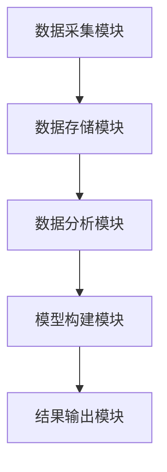

                 


# AI多智能体在价值投资中的商誉减值风险分析

**关键词**：AI多智能体、价值投资、商誉减值、风险管理、投资决策

**摘要**：  
随着人工智能技术的快速发展，AI多智能体技术在金融领域的应用逐渐成为研究热点。本文旨在探讨AI多智能体在价值投资中的商誉减值风险分析中的应用潜力。首先，本文介绍了商誉减值的基本概念及其在价值投资中的重要性；接着，详细分析了AI多智能体技术的核心原理及其在金融领域的应用潜力；然后，构建了一个基于AI多智能体的商誉减值风险分析框架，并通过具体案例展示了该框架的实际应用；最后，总结了本文的主要研究成果，并展望了未来的研究方向。

---

## 第1章: 商誉减值风险的背景与问题

### 1.1 商誉的定义与会计处理

商誉是企业在收购其他公司时，支付的价格超过被收购公司净资产公允价值的部分。商誉作为一种无形资产，其价值受到多种因素的影响，包括市场需求、行业竞争、公司管理等。商誉减值是指由于被收购公司业绩表现不佳或其他外部因素导致商誉价值下降，需要计提减值准备。

**1.1.1 商誉的定义与性质**

- 商誉是企业整体价值的一部分，无法单独存在。
- 商誉的价值受到企业未来盈利能力的影响。
- 商誉的评估需要结合财务数据和市场环境。

**1.1.2 商誉减值的会计处理方法**

- 商誉减值测试：每年至少进行一次商誉减值测试。
- 减值金额的计算：商誉的账面价值与可收回金额的差额。
- 减值准备的计提：将减值金额记入损益。

### 1.2 商誉减值风险的现状与问题

**1.2.1 商誉减值风险的来源**

- 行业波动：如经济周期、政策变化等。
- 企业自身经营状况：如管理水平、盈利能力等。
- 外部环境：如市场需求、竞争状况等。

**1.2.2 当前商誉减值评估的难点**

- 数据复杂性：商誉减值涉及大量的财务数据和市场数据。
- 方法局限性：传统的商誉减值评估方法依赖主观判断。
- 风险预测的不确定性：商誉减值风险的预测具有较高的不确定性。

### 1.3 价值投资中的商誉减值分析

**1.3.1 价值投资的基本概念**

价值投资是一种投资策略，强调以低于内在价值的价格购买优质资产。投资者需要对公司的财务状况、盈利能力、行业地位等进行深入分析。

**1.3.2 商誉在价值投资中的重要性**

- 商誉是企业价值的重要组成部分。
- 商誉减值风险可能影响企业的财务健康。
- 商誉减值风险是投资者决策的重要参考指标。

**1.3.3 商誉减值风险对投资决策的影响**

- 高商誉减值风险可能影响企业的偿债能力。
- 商誉减值风险可能影响企业的股价波动。
- 投资者需要综合考虑商誉减值风险和企业其他因素。

### 1.4 本章小结

本章从商誉减值的基本概念、会计处理方法、风险来源以及价值投资中的重要性等方面进行了详细分析。商誉减值风险的评估对投资者的决策具有重要意义，但传统的评估方法存在一定的局限性，因此需要引入新的技术手段来提高评估的准确性和效率。

---

## 第2章: AI多智能体技术的基本原理

### 2.1 多智能体系统概述

**2.1.1 多智能体系统的定义**

多智能体系统是由多个智能体组成的分布式系统，智能体之间通过通信和协作完成共同目标。

**2.1.2 多智能体系统的特征**

- 分布式：智能体独立运行，通过通信协作完成任务。
- 协作性：智能体之间需要协调一致，共同完成目标。
- 反应性：智能体能够感知环境并做出实时反应。

### 2.2 AI多智能体的核心技术

**2.2.1 人工智能的基本概念**

人工智能是指计算机系统模拟人类智能的能力，包括学习、推理、识别和语言处理等。

**2.2.2 多智能体的协作机制**

- 通信机制：智能体之间通过消息传递进行信息交流。
- 协调机制：智能体之间通过协商达成一致行动。
- 分布式决策机制：智能体根据环境信息自主做出决策。

### 2.3 多智能体在金融领域的应用潜力

**2.3.1 多智能体在金融分析中的优势**

- 高效性：多智能体可以同时处理大量的金融数据。
- 智能性：多智能体能够自主学习和适应市场变化。
- 分布式计算：多智能体可以并行处理复杂的金融问题。

**2.3.2 多智能体在风险评估中的应用**

- 风险分散：多智能体可以将风险分散到不同的智能体中。
- 风险预警：多智能体可以通过协同计算及时发现潜在风险。
- 风险应对：多智能体可以制定多种风险应对策略。

### 2.4 本章小结

本章介绍了多智能体系统的基本概念和技术特点，分析了多智能体在金融领域的应用潜力。多智能体技术的引入为金融领域的风险评估和投资决策提供了新的思路和方法。

---

## 第3章: 多智能体在价值投资中的应用框架

### 3.1 多智能体在价值投资中的角色

**3.1.1 多智能体作为投资决策辅助工具**

- 数据采集：多智能体可以实时采集市场数据和企业财务数据。
- 数据分析：多智能体可以对数据进行深度分析和挖掘。
- 投资建议：多智能体可以为投资者提供个性化的投资建议。

**3.1.2 多智能体在资产定价中的应用**

- 价值评估：多智能体可以对企业的内在价值进行评估。
- 资产配置：多智能体可以优化投资组合的资产配置。
- 风险定价：多智能体可以对风险进行量化和定价。

### 3.2 多智能体系统的构建与优化

**3.2.1 多智能体系统的构建流程**

- 确定目标：明确系统的应用目标和功能需求。
- 系统设计：设计多智能体的通信、协作和决策机制。
- 系统实现：开发和实现多智能体系统的核心功能。
- 系统测试：对系统进行全面测试和优化。

**3.2.2 多智能体系统的优化策略**

- 性能优化：提高系统的计算效率和响应速度。
- 可扩展性优化：增强系统的可扩展性和适应性。
- 可靠性优化：提高系统的稳定性和容错能力。

### 3.3 多智能体在商誉减值风险分析中的具体应用

**3.3.1 商誉减值风险的多维度分析**

- 财务指标分析：分析企业的盈利能力、资产负债率等财务指标。
- 市场环境分析：分析行业竞争、市场需求等市场环境因素。
- 管理因素分析：分析企业的管理能力、战略决策等管理因素。

**3.3.2 多智能体在商誉减值预测中的作用**

- 数据采集：多智能体可以实时采集企业的财务数据和市场数据。
- 数据分析：多智能体可以对数据进行深度挖掘和分析。
- 预测模型构建：多智能体可以基于数据分析结果构建商誉减值预测模型。

**3.3.3 多智能体在投资组合优化中的应用**

- 投资组合优化：多智能体可以根据商誉减值风险对投资组合进行优化。
- 风险分散：多智能体可以将投资分散到不同行业和地区的资产中。
- 风险预警：多智能体可以及时发现潜在的商誉减值风险并发出预警。

### 3.4 本章小结

本章构建了基于多智能体的商誉减值风险分析框架，详细分析了多智能体在价值投资中的具体应用。多智能体技术的引入为商誉减值风险的评估和管理提供了新的思路和方法。

---

## 第4章: 多智能体商誉减值风险分析的数学模型与算法

### 4.1 商誉减值风险分析的数学模型

**4.1.1 商誉减值风险分析的基本假设**

- 假设企业的盈利能力受到行业环境和内部管理的影响。
- 假设商誉减值风险与企业的财务指标和市场环境密切相关。
- 假设多智能体可以协同工作，共同完成商誉减值风险的评估。

**4.1.2 商誉减值风险的评估指标**

- 净利润增长率：衡量企业的盈利能力。
- 负债率：衡量企业的财务风险。
- 行业景气度：衡量行业的发展状况。

**4.1.3 商誉减值风险的评估模型**

$$
\text{商誉减值风险} = \alpha \times \text{净利润增长率} + \beta \times \text{负债率} + \gamma \times \text{行业景气度}
$$

其中，$\alpha$、$\beta$、$\gamma$为模型的系数，需要根据历史数据进行回归分析确定。

### 4.2 多智能体协同算法

**4.2.1 多智能体协同的基本原理**

- 分布式计算：多个智能体分别承担不同的任务，协同完成商誉减值风险的评估。
- 信息共享：智能体之间通过通信共享数据和分析结果。
- 协同决策：智能体基于共享的信息共同制定商誉减值风险的评估策略。

**4.2.2 多智能体协同的具体实现**

- 智能体1：负责采集企业的财务数据和市场数据。
- 智能体2：负责分析企业的财务指标和市场环境。
- 智能体3：负责构建商誉减值风险的评估模型。
- 智能体4：负责输出商誉减值风险的评估结果。

### 4.3 本章小结

本章从数学模型和算法两个方面详细分析了多智能体在商誉减值风险分析中的应用。数学模型的建立和算法的实现为商誉减值风险的评估提供了理论基础和技术支持。

---

## 第5章: 系统架构设计与实现

### 5.1 系统功能设计

**5.1.1 系统功能模块**

- 数据采集模块：采集企业的财务数据和市场数据。
- 数据分析模块：对数据进行深度分析和挖掘。
- 模型构建模块：构建商誉减值风险的评估模型。
- 结果输出模块：输出商誉减值风险的评估结果。

**5.1.2 系统功能流程**

1. 数据采集模块采集企业的财务数据和市场数据。
2. 数据分析模块对数据进行预处理和分析。
3. 模型构建模块基于分析结果构建商誉减值风险的评估模型。
4. 结果输出模块输出商誉减值风险的评估结果。

### 5.2 系统架构设计

**5.2.1 系统架构图**



**5.2.2 系统接口设计**

- 数据采集接口：用于采集企业的财务数据和市场数据。
- 数据分析接口：用于对数据进行预处理和分析。
- 模型构建接口：用于构建商誉减值风险的评估模型。
- 结果输出接口：用于输出商誉减值风险的评估结果。

### 5.3 本章小结

本章从系统功能设计和架构设计两个方面详细分析了多智能体商誉减值风险分析系统的实现方案。系统架构的设计和接口的定义为系统的开发和实现提供了明确的方向。

---

## 第6章: 项目实战与案例分析

### 6.1 环境安装与配置

- 安装Python编程语言。
- 安装必要的Python库，如Pandas、NumPy、Scikit-learn等。
- 安装多智能体框架，如Multi-Agent Framework。

### 6.2 核心代码实现

**6.2.1 数据采集模块**

```python
import requests
import json

def fetch_data(company):
    url = f"https://api.example.com/company/{company}/data"
    response = requests.get(url)
    if response.status_code == 200:
        return json.loads(response.text)
    else:
        return None
```

**6.2.2 数据分析模块**

```python
import pandas as pd
import numpy as np

def analyze_data(data):
    df = pd.DataFrame(data)
    df['净利润增长率'] = df['净利润'].pct_change()
    df['负债率'] = df['负债'] / df['资产']
    return df
```

**6.2.3 模型构建模块**

```python
from sklearn.linear_model import LinearRegression

def build_model(data):
    X = data[['净利润增长率', '负债率', '行业景气度']]
    y = data['商誉减值风险']
    model = LinearRegression()
    model.fit(X, y)
    return model
```

**6.2.4 结果输出模块**

```python
def output_result(model, new_data):
    prediction = model.predict(new_data)
    print(f"商誉减值风险预测值：{prediction[0]}")
```

### 6.3 案例分析与结果解读

**案例分析**

假设我们有一个企业A，其财务数据如下：

- 净利润增长率：10%
- 负债率：50%
- 行业景气度：中等

将这些数据输入模型，可以得到商誉减值风险的预测值。

**结果解读**

模型预测商誉减值风险为中等偏高，投资者需要谨慎考虑该企业的投资风险。

### 6.4 本章小结

本章通过项目实战的方式，详细展示了多智能体商誉减值风险分析系统的实现过程。从环境安装到核心代码实现，再到案例分析和结果解读，为读者提供了全面的指导。

---

## 第7章: 总结与展望

### 7.1 总结

本文详细探讨了AI多智能体在价值投资中的商誉减值风险分析中的应用。通过构建基于多智能体的商誉减值风险分析框架，提出了数学模型和算法，并通过项目实战展示了系统的实现过程。本文的研究为商誉减值风险的评估和管理提供了新的思路和技术支持。

### 7.2 展望

未来的研究可以进一步优化多智能体的协作机制，提高系统的计算效率和准确性。同时，可以拓展多智能体技术在其他金融领域的应用，如股票预测、风险管理等。

### 7.3 小结

本文的研究成果为价值投资者提供了重要的参考，同时也为AI技术在金融领域的应用提供了新的方向。

---

## 作者信息

作者：AI天才研究院/AI Genius Institute & 禅与计算机程序设计艺术/Zen And The Art of Computer Programming

