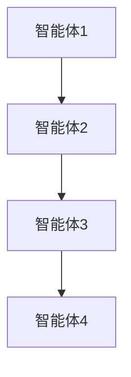
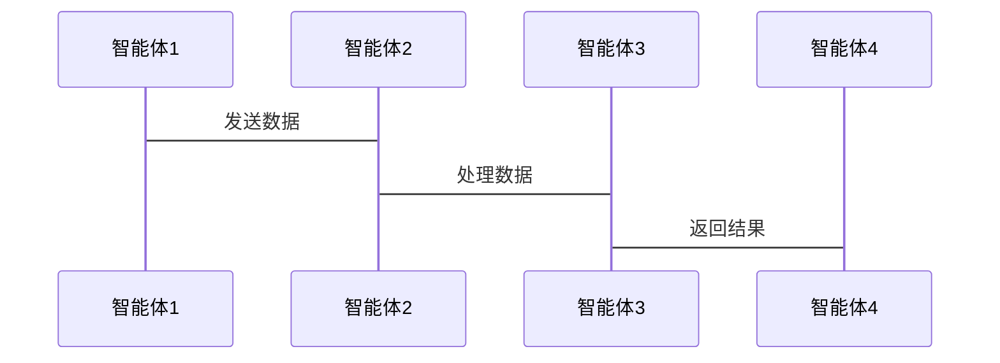

                 


# AI多智能体系统对投资风险的动态评估

> 关键词：AI多智能体系统，投资风险评估，动态评估，系统架构，算法实现

> 摘要：本文深入探讨了AI多智能体系统在投资风险动态评估中的应用，结合理论与实践，详细分析了多智能体系统的定义、核心原理、算法实现以及在投资领域的具体应用。通过构建一个多智能体系统模型，结合强化学习算法和分布式计算技术，本文提出了动态投资风险评估的新方法，并通过实际案例验证了该方法的有效性。

---

## 第一部分: AI多智能体系统与投资风险评估基础

### 第1章: AI多智能体系统概述

#### 1.1 多智能体系统的定义与特点

多智能体系统（Multi-Agent System, MAS）是由多个智能体（Agent）组成的分布式系统，这些智能体通过协作完成复杂的任务。智能体是指能够感知环境并采取行动的实体，可以是软件程序、机器人或其他智能设备。多智能体系统的核心特点包括：

1. **分布式性**：多个智能体协同工作，而非集中式控制。
2. **自主性**：每个智能体都具有自主决策能力。
3. **协作性**：智能体之间通过通信和协作完成共同目标。
4. **反应性**：智能体能够实时感知环境变化并调整行为。

#### 1.2 投资风险评估的背景与挑战

投资风险评估是金融领域的重要任务，旨在通过分析市场波动、资产价格变化等因素，预测投资组合的风险。传统方法通常依赖统计模型和历史数据，但存在以下挑战：

1. **数据复杂性**：金融市场数据具有高度的不确定性和非线性。
2. **实时性要求**：投资风险评估需要实时或高频处理。
3. **多因素影响**：市场风险受多种因素影响，如宏观经济指标、公司基本面等。

AI多智能体系统的优势在于其分布式计算能力和协作能力，能够有效应对这些挑战。

### 第2章: AI多智能体系统在投资领域的应用

#### 2.1 多智能体系统在金融领域的应用现状

多智能体系统在金融领域的应用广泛，包括股票交易、风险管理、投资组合优化等。以下是具体应用：

1. **股票交易**：通过多智能体系统的协作，实现高频交易和策略优化。
2. **风险管理**：智能体实时监控市场风险，动态调整风险敞口。
3. **投资组合优化**：通过多智能体协作，优化资产配置和风险分散。

#### 2.2 多智能体系统在投资风险评估中的优势

多智能体系统在投资风险评估中的优势体现在以下几个方面：

1. **分布式计算能力**：多智能体系统能够同时处理大量数据，提高计算效率。
2. **自适应性**：智能体能够根据市场变化动态调整策略。
3. **协作能力**：多个智能体协作，能够从多个角度分析风险。

---

## 第二部分: 多智能体系统的核心原理与算法

### 第3章: 多智能体系统的核心原理

#### 3.1 多智能体系统的通信机制

智能体之间的通信是多智能体系统的核心机制之一。通信机制包括以下内容：

1. **通信方式**：智能体可以通过共享数据库、消息传递等方式进行通信。
2. **通信协议**：定义智能体之间消息的格式和传输规则。
3. **信息压缩与加密**：为了提高通信效率和安全性，需要对信息进行压缩和加密。

#### 3.2 多智能体系统的协同机制

协同机制是多智能体系统中智能体协作完成任务的关键。协同机制包括：

1. **协同目标设定**：明确智能体协作的目标和任务。
2. **协同策略制定**：制定智能体协作的策略和规则。
3. **冲突解决**：在协作过程中，智能体之间可能会出现冲突，需要制定冲突解决机制。

### 第4章: 多智能体系统的动态适应性

#### 4.1 动态环境下的智能体行为调整

动态环境是指环境不断变化的环境，如金融市场中的价格波动。智能体需要根据环境变化调整行为。行为调整策略包括：

1. **实时感知**：智能体实时感知环境变化。
2. **动态决策**：根据感知结果动态调整决策。
3. **自适应算法**：使用自适应算法实现动态调整。

#### 4.2 多智能体系统的自学习能力

自学习能力是多智能体系统的重要特征。自学习能力包括：

1. **自学习定义**：智能体通过经验学习，改进自身行为。
2. **自学习算法**：使用强化学习、深度学习等算法实现自学习。
3. **自学习在投资中的应用**：通过自学习，智能体能够不断优化投资策略。

---

## 第三部分: 投资风险评估的数学模型与算法

### 第5章: 投资风险评估的数学模型

#### 5.1 风险评估的基本数学模型

投资风险评估的基本模型包括风险值（VaR）和风险概率等。风险值的计算公式如下：

$$ VaR = \sum_{i=1}^{n} p_i \cdot v_i $$

其中，$p_i$ 是第$i$种资产的风险概率，$v_i$ 是第$i$种资产的风险值。

#### 5.2 基于AI的多智能体系统的数学模型

基于AI的多智能体系统的数学模型包括：

1. **状态表示**：智能体的状态表示，包括市场数据、资产价格等。
2. **动作选择**：智能体根据状态选择动作，如买入、卖出等。
3. **奖励机制**：智能体根据动作的结果获得奖励或惩罚。

### 第6章: 投资风险评估的算法实现

#### 6.1 基于多智能体的强化学习算法

强化学习是一种重要的机器学习算法，广泛应用于多智能体系统。强化学习的基本原理是通过试错学习，智能体通过与环境交互，学习最优策略。

#### 6.2 多智能体系统的分布式计算算法

分布式计算是多智能体系统的重要特征。分布式计算算法包括：

1. **分布式优化算法**：如分布式梯度下降算法。
2. **分布式协调算法**：如分布式一致性算法。

---

## 第四部分: 系统分析与架构设计

### 第7章: 系统功能设计

#### 7.1 问题场景介绍

投资风险评估的场景包括股票交易、资产配置等。以股票交易为例，智能体需要实时监控市场数据，动态调整交易策略。

#### 7.2 系统功能设计

系统功能设计包括：

1. **数据采集**：采集市场数据，如股票价格、成交量等。
2. **风险评估**：通过多智能体系统，评估投资风险。
3. **决策制定**：根据风险评估结果，制定投资决策。

#### 7.3 系统架构设计

系统架构设计包括：

1. **系统架构图**：如图所示，系统由多个智能体组成，每个智能体负责不同的任务。



2. **系统交互序列图**：如图所示，智能体之间通过消息传递进行协作。



---

## 第五部分: 项目实战

### 第8章: 项目实战

#### 8.1 环境安装

项目实战需要安装以下环境：

1. **编程语言**：Python 3.8+
2. **深度学习框架**：TensorFlow或PyTorch
3. **其他依赖**：如Pandas、NumPy等。

#### 8.2 核心实现源代码

以下是核心实现源代码示例：

```python
import numpy as np
import pandas as pd

class Agent:
    def __init__(self, id):
        self.id = id
        self.state = None
        self.action = None

    def perceive(self, environment):
        self.state = environment.get_state()

    def decide(self):
        if np.random.random() < 0.5:
            self.action = 'buy'
        else:
            self.action = 'sell'

def main():
    agents = [Agent(i) for i in range(4)]
    environment = MarketEnvironment()

    for agent in agents:
        agent.perceive(environment)
        agent.decide()

if __name__ == "__main__":
    main()
```

#### 8.3 代码应用解读与分析

上述代码实现了一个简单的多智能体系统，包括智能体的感知和决策过程。每个智能体根据环境数据做出买卖决策。

#### 8.4 实际案例分析

以股票交易为例，智能体通过协作实现投资组合优化。例如，智能体1负责市场分析，智能体2负责风险评估，智能体3负责交易执行，智能体4负责监控和调整。

---

## 第六部分: 总结与展望

### 第9章: 总结与展望

#### 9.1 最佳实践 tips

1. 在实际应用中，需要根据具体需求调整多智能体系统的架构和算法。
2. 多智能体系统需要考虑智能体之间的通信效率和安全性。

#### 9.2 小结

本文详细介绍了AI多智能体系统在投资风险动态评估中的应用，从理论到实践，结合具体案例，展示了多智能体系统的强大能力。

#### 9.3 注意事项

在实际应用中，需要注意多智能体系统的扩展性和稳定性，避免因系统崩溃导致的重大损失。

#### 9.4 拓展阅读

建议读者进一步阅读相关领域的书籍和论文，深入了解多智能体系统和投资风险评估的最新研究。

---

## 作者信息

作者：AI天才研究院/AI Genius Institute & 禅与计算机程序设计艺术 /Zen And The Art of Computer Programming

