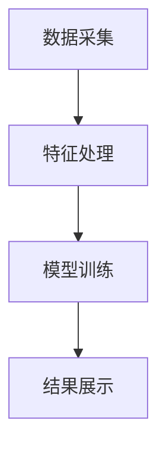

                 


# AI如何优化格林布拉特的魔法公式策略

> 关键词：格林布拉特魔法公式，人工智能，投资策略，股票评估，机器学习

> 摘要：本文详细探讨了如何利用人工智能技术优化格林布拉特的魔法公式策略。通过分析魔法公式的数学模型、AI优化算法原理、系统架构设计以及项目实战，展示了AI在提升投资策略中的巨大潜力。文章还提供了丰富的代码示例和数学公式，帮助读者全面理解AI优化魔法公式的实现过程。

---

# 第一部分: 格林布拉特魔法公式与AI优化策略概述

## 第1章: 格林布拉特魔法公式概述

### 1.1 魔法公式的起源与核心思想

#### 1.1.1 魔法公式的定义与目标
格林布拉特的魔法公式是一种用于评估股票投资价值的模型，旨在通过量化分析发现被低估的股票。其核心目标是通过财务指标的加权计算，找出具有高内在价值但市场价格较低的股票。

#### 1.1.2 魔法公式的数学模型与公式
魔法公式的核心公式如下：

$$
Magic Formula = \frac{Earnings Per Share (EPS)}{Price Per Share (PPS)}
$$

其中：
- $EPS$ 表示每股收益，用于衡量公司的盈利能力。
- $PPS$ 表示每股价格，用于衡量股票的市场价格。

魔法公式的计算步骤包括：
1. 收集目标公司的财务数据，包括EPS、ROE（净资产收益率）等。
2. 计算魔法公式得分，得分越高表示投资价值越高。
3. 根据得分排序，选择得分最高的股票进行投资。

#### 1.1.3 魔法公式在投资策略中的应用
魔法公式常用于价值投资策略，帮助投资者筛选出具有较高投资价值的股票。然而，其局限性在于无法适应市场变化和复杂的投资环境。

---

## 第2章: AI与魔法公式的结合

### 1.2.1 AI在金融分析中的优势
人工智能技术在金融分析中的优势主要体现在数据处理能力、模式识别能力和自动化能力。AI能够处理海量数据，发现人类难以察觉的模式，从而提高投资决策的准确性。

### 1.2.2 AI如何优化魔法公式策略
AI优化魔法公式的过程包括数据预处理、特征提取、模型训练和策略优化。通过机器学习算法，AI可以自动调整魔法公式的参数，提高其预测精度和投资收益。

### 1.2.3 魔法公式与AI结合的潜在价值
AI优化后的魔法公式能够更好地适应市场变化，捕捉更多投资机会。同时，AI的实时数据分析能力使得投资策略更加灵活和高效。

---

## 第3章: 魔法公式的数学模型与公式

### 3.1 魔法公式的数学表达
魔法公式的数学模型如下：

$$
Magic Formula Score = \frac{E}{P} \times \frac{R}{D}
$$

其中：
- $E$ 表示公司的净利润。
- $P$ 表示公司市值。
- $R$ 表示ROE（净资产收益率）。
- $D$ 表示公司的负债率。

### 3.2 魔法公式的优缺点分析
#### 优点
- 计算简单，易于理解和实施。
- 能够有效筛选出具有较高投资价值的股票。

#### 缺点
- 无法适应市场波动和公司基本面的变化。
- 仅依赖财务指标，忽略了市场情绪和宏观经济因素。

---

## 第4章: AI优化魔法公式的算法原理

### 4.1 AI优化魔法公式的算法框架
#### 4.1.1 数据预处理与特征提取
- 数据清洗：去除缺失值和异常值。
- 特征选择：筛选对投资收益影响较大的财务指标。

#### 4.1.2 模型训练与优化
- 选择合适的机器学习算法（如线性回归、随机森林等）。
- 训练模型并进行参数调优。

#### 4.1.3 模型评估与调优
- 使用交叉验证评估模型性能。
- 根据评估结果进一步优化模型。

### 4.2 基于机器学习的魔法公式优化
#### 4.2.1 机器学习算法的选择
- 线性回归：适用于线性关系的预测。
- 随机森林：适用于非线性关系的预测。
- 支持向量机：适用于分类问题。

#### 4.2.2 算法训练流程
1. 收集并预处理数据。
2. 选择合适的机器学习算法。
3. 训练模型并进行参数调优。
4. 评估模型性能并优化。

#### 4.2.3 算法优化策略
- 增加训练数据量。
- 使用网格搜索优化模型参数。
- 融合多个模型的结果。

---

## 第5章: 系统架构设计

### 5.1 系统整体架构设计
系统架构包括数据采集、特征处理、模型训练和结果展示四个模块。以下是系统架构图：



### 5.2 系统功能设计
#### 5.2.1 数据采集与处理模块
- 数据来源：股票数据库、财务报表等。
- 数据清洗：去除缺失值和异常值。

#### 5.2.2 模型训练与优化模块
- 特征选择：筛选对投资收益影响较大的财务指标。
- 模型训练：使用机器学习算法训练模型。

#### 5.2.3 结果展示与分析模块
- 结果展示：显示优化后的魔法公式得分。
- 结果分析：根据得分进行投资决策。

---

## 第6章: 项目实战——AI优化魔法公式的实现

### 6.1 环境搭建与数据准备
#### 6.1.1 开发环境安装
- 安装Python和必要的库（如Pandas、Scikit-learn）。
- 安装Jupyter Notebook用于数据分析和可视化。

#### 6.1.2 数据集获取与预处理
- 从股票数据库获取数据。
- 数据清洗和特征提取。

### 6.2 算法实现与代码解读
#### 6.2.1 特征选择与模型训练
```python
import pandas as pd
from sklearn.ensemble import RandomForestRegressor
from sklearn.model_selection import train_test_split
from sklearn.metrics import mean_squared_error

# 数据加载
data = pd.read_csv('stock_data.csv')

# 特征选择
features = ['EPS', 'ROE', 'DEbt_to_Equity']
target = 'Magic_Score'

# 数据分割
X = data[features]
y = data[target]
X_train, X_test, y_train, y_test = train_test_split(X, y, test_size=0.2, random_state=42)

# 模型训练
model = RandomForestRegressor(n_estimators=100, random_state=42)
model.fit(X_train, y_train)

# 模型预测
y_pred = model.predict(X_test)

# 模型评估
 mse = mean_squared_error(y_test, y_pred)
 print(f"均方误差: {mse}")
```

#### 6.2.2 模型优化与调参
```python
from sklearn.model_selection import GridSearchCV

# 网格搜索优化参数
param_grid = {'n_estimators': [100, 200], 'max_depth': [None, 5, 10]}
grid_search = GridSearchCV(RandomForestRegressor(), param_grid, cv=5)
grid_search.fit(X_train, y_train)

# 最佳参数
best_params = grid_search.best_params_
print(f"最佳参数: {best_params}")
```

---

## 第7章: 最佳实践与注意事项

### 7.1 最佳实践
- 数据质量：确保数据的准确性和完整性。
- 模型选择：根据具体问题选择合适的算法。
- 模型部署：将优化后的模型部署到实际投资系统中。

### 7.2 注意事项
- 数据偏差：避免数据偏差影响模型性能。
- 模型过拟合：防止模型过拟合，确保泛化能力。
- 系统性能：优化系统性能，确保实时性。

---

## 第8章: 未来展望与拓展阅读

### 8.1 未来展望
- 结合自然语言处理技术，分析新闻和社交媒体数据，进一步优化投资策略。
- 研究多模态数据，如市场情绪、宏观经济指标，提升模型的预测能力。

### 8.2 拓展阅读
- 推荐书籍：《机器学习实战》、《深度学习》。
- 推荐博客：Tech in Finance。

---

# 结语

通过本文的详细讲解，我们了解了如何利用人工智能技术优化格林布拉特的魔法公式策略。AI的强大能力使得投资策略更加智能化和高效化，为投资者提供了新的工具和方法。

作者：AI天才研究院/AI Genius Institute & 禅与计算机程序设计艺术 /Zen And The Art of Computer Programming

