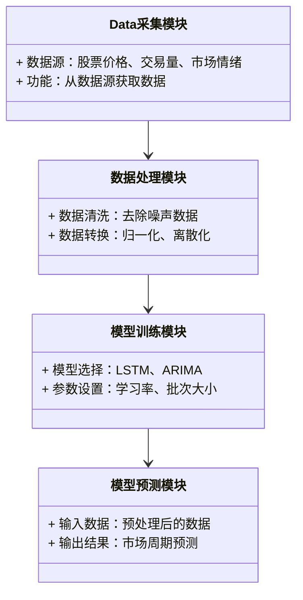
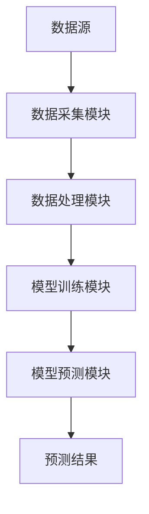
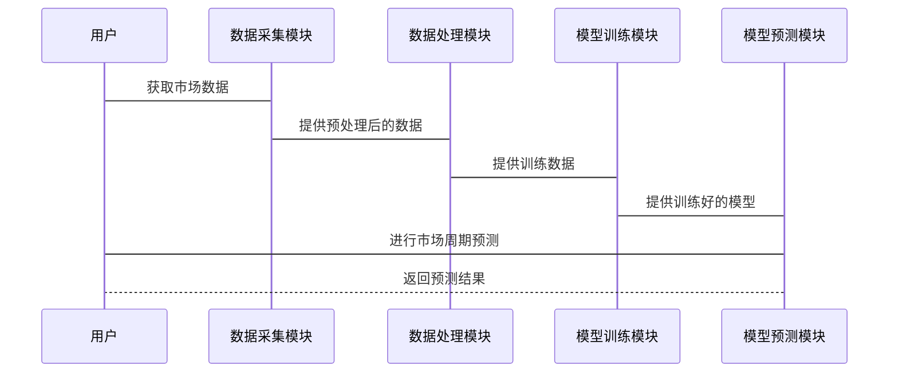

                 


# AI如何优化霍华德·马克斯的市场周期理论

> **关键词**：霍华德·马克斯，市场周期理论，人工智能，机器学习，LSTM，时间序列分析，市场预测

> **摘要**：本文探讨了如何利用人工智能技术优化霍华德·马克斯的市场周期理论。通过分析市场周期的核心概念，结合人工智能的算法原理，提出了一种基于深度学习的时间序列预测模型。该模型能够有效捕捉市场周期中的非理性波动，提升市场预测的准确性和效率。

---

## 第1章: 霍华德·马克斯市场周期理论概述

### 1.1 霍华德·马克斯市场周期理论的核心概念

#### 1.1.1 市场周期的基本定义
市场的周期性波动是经济学和金融学中的一个基本现象。霍华德·马克斯在其经典著作《投资的艺术》中，提出了市场周期理论，认为市场的波动并非随机，而是由投资者心理和市场参与者的非理性行为驱动。市场周期通常包括以下几个阶段：
1. **繁荣阶段**：市场参与者对未来充满乐观，资金大量流入，资产价格被高估。
2. **顶峰阶段**：资产价格达到顶峰，市场开始出现逆转的信号。
3. **衰退阶段**：市场参与者开始恐慌，资金大量流出，资产价格急剧下降。
4. **复苏阶段**：市场逐步恢复，为下一轮繁荣阶段做准备。

#### 1.1.2 市场周期的四个阶段
霍华德·马克斯将市场周期分为四个阶段，每个阶段都有其独特的特征：
- **繁荣阶段**：市场参与者情绪高涨，资金大量流入，资产价格被推高。
- **顶峰阶段**：市场参与者开始意识到市场的高估，资金流入放缓。
- **衰退阶段**：市场参与者情绪恐慌，资金大量流出，资产价格下跌。
- **复苏阶段**：市场逐步恢复，为下一轮繁荣阶段做准备。

#### 1.1.3 市场周期理论的局限性
尽管霍华德·马克斯的市场周期理论在实践中被广泛应用，但其也有一些局限性：
1. **预测的不准确性**：市场周期的预测依赖于投资者情绪，而情绪是难以量化的。
2. **市场环境的多样性**：不同市场、不同资产类别的周期特征可能有所不同。
3. **数据的局限性**：传统市场周期理论依赖于历史数据，但历史数据可能无法完全反映未来的市场变化。

### 1.2 AI技术的基本概念与特点

#### 1.2.1 人工智能的定义与分类
人工智能（Artificial Intelligence，AI）是指计算机系统执行人类智能任务的能力，如视觉识别、语音识别、决策推理等。人工智能可以分为以下几类：
- **弱人工智能**：专注于特定任务的智能系统，如语音助手。
- **强人工智能**：具备与人类相当或超越人类的通用智能系统。
- **机器学习**：通过数据训练模型，使其能够从数据中学习并做出预测或决策。

#### 1.2.2 机器学习的核心原理
机器学习是一种人工智能技术，通过数据训练模型，使其能够从数据中学习并做出预测或决策。机器学习的核心原理包括：
1. **数据预处理**：对数据进行清洗、转换和特征提取。
2. **模型训练**：通过优化算法调整模型参数，使其能够准确预测。
3. **模型评估**：通过测试数据评估模型的性能，并进行优化。

#### 1.2.3 大数据在AI中的作用
大数据是人工智能技术的重要基础。通过大数据分析，可以提取出市场的周期性特征，为市场周期预测提供支持。

### 1.3 霍华德·马克斯市场周期理论与AI的结合点

#### 1.3.1 数据的驱动性分析
AI技术可以通过大数据分析，提取市场的周期性特征，为市场周期理论提供更精确的支持。

#### 1.3.2 AI在市场预测中的应用
通过机器学习模型，可以对市场的未来走势进行预测，帮助投资者做出更明智的决策。

#### 1.3.3 AI如何优化市场周期理论
AI可以通过大数据分析和机器学习模型，优化市场周期理论的预测能力，提高市场的预测准确性。

---

## 第2章: AI优化市场周期理论的核心概念

### 2.1 数据驱动的市场周期分析

#### 2.1.1 数据的收集与预处理
在AI优化市场周期理论中，数据的收集与预处理是至关重要的一步。以下是具体的步骤：
1. **数据收集**：从多个数据源收集市场数据，包括股票价格、交易量、市场情绪等。
2. **数据清洗**：去除噪声数据，填补缺失值，标准化数据。
3. **数据转换**：将原始数据转换为适合模型输入的格式，如归一化、离散化等。

#### 2.1.2 数据特征的提取与选择
为了提高模型的预测能力，需要对数据进行特征提取和选择。常用的方法包括：
1. **主成分分析（PCA）**：通过降维提取数据的主要特征。
2. **特征重要性分析**：通过模型评估特征的重要性，选择对预测影响最大的特征。

#### 2.1.3 数据的可视化与分析
通过数据可视化，可以更直观地观察市场的周期性特征。常用的可视化方法包括：
1. **时间序列图**：展示市场的波动趋势。
2. **箱线图**：分析数据的分布特征。
3. **热力图**：展示不同特征之间的相关性。

### 2.2 机器学习模型在市场周期预测中的应用

#### 2.2.1 监督学习与非监督学习的区别
- **监督学习**：基于标记数据进行模型训练，适用于分类和回归问题。
- **非监督学习**：基于无标记数据进行模型训练，适用于聚类和降维问题。

#### 2.2.2 常见的市场周期预测模型
在市场周期预测中，常用的机器学习模型包括：
1. **线性回归**：适用于线性关系的预测。
2. **支持向量机（SVM）**：适用于分类和回归问题。
3. **随机森林**：适用于特征重要性分析和非线性关系的预测。
4. **LSTM**：适用于时间序列数据的预测。

#### 2.2.3 深度学习在市场周期分析中的优势
深度学习是一种基于人工神经网络的机器学习技术，具有以下优势：
1. **非线性表达能力**：能够捕捉复杂的市场周期特征。
2. **自适应性**：能够自动提取数据的特征，减少特征工程的工作量。
3. **长时记忆能力**：通过LSTM等模型，能够捕捉长期依赖关系。

### 2.3 市场周期与AI结合的数学模型

#### 2.3.1 时间序列分析的基本原理
时间序列分析是一种统计技术，用于分析随时间变化的数据。常用的方法包括：
1. **ARIMA模型**：基于自回归和移动平均的线性模型。
2. **GARCH模型**：用于分析金融时间序列的波动性。

#### 2.3.2 长短期记忆网络（LSTM）的介绍
LSTM是一种特殊的RNN结构，能够有效地捕捉时间序列数据中的长距离依赖关系。LSTM的基本结构包括：
- **输入门**：控制信息的输入。
- **遗忘门**：控制信息的遗忘。
- **输出门**：控制信息的输出。

#### 2.3.3 基于LSTM的市场周期预测模型
基于LSTM的市场周期预测模型是一种深度学习模型，适用于时间序列数据的预测。模型的基本结构如下：

```python
class LSTMModel(nn.Module):
    def __init__(self, input_size, hidden_size, output_size):
        super(LSTMModel, self).__init__()
        self.lstm = nn.LSTM(input_size, hidden_size, batch_first=True)
        self.fc = nn.Linear(hidden_size, output_size)
    
    def forward(self, x):
        out, _ = self.lstm(x)
        out = self.fc(out[:, -1, :])
        return out
```

---

## 第3章: AI优化市场周期理论的算法原理

### 3.1 时间序列分析的算法流程

#### 3.1.1 数据预处理
时间序列分析的算法流程如下：
1. **数据清洗**：去除噪声数据，填补缺失值。
2. **数据转换**：将数据转换为适合模型输入的格式。
3. **数据分割**：将数据分为训练集和测试集。

#### 3.1.2 模型训练
模型训练的步骤包括：
1. **选择模型**：选择适合时间序列分析的模型，如LSTM、ARIMA等。
2. **参数设置**：设置模型的超参数，如学习率、批次大小等。
3. **训练模型**：通过反向传播算法优化模型参数。

#### 3.1.3 模型预测与评估
模型预测与评估的步骤包括：
1. **模型预测**：使用训练好的模型对测试数据进行预测。
2. **模型评估**：通过均方误差（MSE）、平均绝对误差（MAE）等指标评估模型的性能。

### 3.2 基于LSTM的市场周期预测算法

#### 3.2.1 LSTM模型的结构
LSTM模型的结构包括输入门、遗忘门和输出门。模型的门控机制如下：
- **输入门**：$i = \sigma(W_i x + U_i h_{prev})$
- **遗忘门**：$f = \sigma(W_f x + U_f h_{prev})$
- **细胞状态**：$c = f \odot c_{prev} + i \odot tanh(W_c x + U_c h_{prev})$
- **输出门**：$o = \sigma(W_o x + U_o h_{prev})$
- **隐藏状态**：$h = o \odot tanh(c)$

#### 3.2.2 LSTM在时间序列预测中的应用
LSTM模型适用于时间序列数据的预测，其优势在于能够捕捉长距离依赖关系。以下是一个LSTM模型的Python实现示例：

```python
import torch
import torch.nn as nn
import torch.optim as optim

# 定义LSTM模型
class LSTMModel(nn.Module):
    def __init__(self, input_size, hidden_size, output_size):
        super(LSTMModel, self).__init__()
        self.lstm = nn.LSTM(input_size, hidden_size, batch_first=True)
        self.fc = nn.Linear(hidden_size, output_size)
    
    def forward(self, x):
        out, _ = self.lstm(x)
        out = self.fc(out[:, -1, :])
        return out

# 初始化模型
model = LSTMModel(input_size=1, hidden_size=64, output_size=1)

# 定义损失函数和优化器
criterion = nn.MSELoss()
optimizer = optim.Adam(model.parameters(), lr=0.001)

# 训练模型
for epoch in range(num_epochs):
    for batch in dataloader:
        inputs, labels = batch
        outputs = model(inputs)
        loss = criterion(outputs, labels)
        optimizer.zero_grad()
        loss.backward()
        optimizer.step()
```

#### 3.2.3 LSTM模型的训练与优化
LSTM模型的训练与优化需要考虑以下几点：
1. **超参数设置**：如学习率、批次大小等。
2. **模型评估**：通过测试数据评估模型的性能。
3. **模型调优**：通过调整模型结构和超参数优化模型性能。

### 3.3 机器学习模型的数学公式

#### 3.3.1 LSTM的门控机制公式
LSTM的门控机制公式如下：
- **输入门**：$i = \sigma(W_i x + U_i h_{prev})$
- **遗忘门**：$f = \sigma(W_f x + U_f h_{prev})$
- **细胞状态**：$c = f \odot c_{prev} + i \odot tanh(W_c x + U_c h_{prev})$
- **输出门**：$o = \sigma(W_o x + U_o h_{prev})$
- **隐藏状态**：$h = o \odot tanh(c)$

#### 3.3.2 损失函数与优化算法
常用的损失函数和优化算法包括：
1. **均方误差（MSE）**：$L = \frac{1}{N}\sum_{i=1}^{N}(y_i - \hat{y}_i)^2$
2. **Adam优化器**：结合动量和自适应学习率的优化算法。

#### 3.3.3 模型评估指标的计算公式
常用的模型评估指标包括：
1. **均方误差（MSE）**：$$MSE = \frac{1}{N}\sum_{i=1}^{N}(y_i - \hat{y}_i)^2$$
2. **平均绝对误差（MAE）**：$$MAE = \frac{1}{N}\sum_{i=1}^{N}|y_i - \hat{y}_i|$$
3. **决定系数（R²）**：$$R² = 1 - \frac{\sum_{i=1}^{N}(y_i - \hat{y}_i)^2}{\sum_{i=1}^{N}(y_i - \bar{y})^2}$$

---

## 第4章: 系统分析与架构设计方案

### 4.1 系统功能设计

#### 4.1.1 数据采集模块
数据采集模块负责从多个数据源收集市场数据，包括股票价格、交易量、市场情绪等。

#### 4.1.2 数据处理模块
数据处理模块负责对数据进行清洗、转换和特征提取，为模型训练提供高质量的数据。

#### 4.1.3 模型训练模块
模型训练模块负责对数据进行建模和训练，选择适合的模型并优化其性能。

#### 4.1.4 模型预测模块
模型预测模块负责对未来的市场周期进行预测，并输出预测结果。

### 4.2 系统架构设计

#### 4.2.1 系统功能模块之间的关系
系统功能模块之间的关系可以用以下类图表示：



#### 4.2.2 系统架构图
系统架构图可以用以下架构图表示：



### 4.3 系统接口设计

#### 4.3.1 数据接口
数据接口负责与数据源进行交互，获取市场数据。常用的数据接口包括：
1. **API接口**：通过API获取实时数据。
2. **数据库接口**：通过数据库获取历史数据。

#### 4.3.2 模型接口
模型接口负责与模型进行交互，进行数据处理和预测。常用的模型接口包括：
1. **Python API**：通过Python接口调用模型。
2. **REST API**：通过REST接口调用模型。

### 4.4 系统交互设计

#### 4.4.1 系统交互流程
系统交互流程可以用以下序列图表示：



---

## 第5章: 项目实战

### 5.1 环境安装

#### 5.1.1 安装Python
安装Python 3.8或更高版本。

#### 5.1.2 安装相关库
安装以下Python库：
```bash
pip install numpy pandas scikit-learn torch
```

### 5.2 系统核心实现源代码

#### 5.2.1 数据采集模块
```python
import pandas as pd
import numpy as np

def collect_data():
    # 从数据源获取数据
    data = pd.read_csv('market_data.csv')
    return data

# 示例数据
data = collect_data()
print(data.head())
```

#### 5.2.2 数据处理模块
```python
def preprocess_data(data):
    # 数据清洗
    data = data.dropna()
    # 数据归一化
    data = (data - data.mean()) / data.std()
    return data

# 示例数据处理
processed_data = preprocess_data(data)
print(processed_data.head())
```

#### 5.2.3 模型训练模块
```python
import torch
import torch.nn as nn
import torch.optim as optim

class LSTMModel(nn.Module):
    def __init__(self, input_size, hidden_size, output_size):
        super(LSTMModel, self).__init__()
        self.lstm = nn.LSTM(input_size, hidden_size, batch_first=True)
        self.fc = nn.Linear(hidden_size, output_size)
    
    def forward(self, x):
        out, _ = self.lstm(x)
        out = self.fc(out[:, -1, :])
        return out

# 初始化模型
model = LSTMModel(input_size=1, hidden_size=64, output_size=1)

# 定义损失函数和优化器
criterion = nn.MSELoss()
optimizer = optim.Adam(model.parameters(), lr=0.001)

# 训练模型
for epoch in range(100):
    for batch in dataloader:
        inputs, labels = batch
        outputs = model(inputs)
        loss = criterion(outputs, labels)
        optimizer.zero_grad()
        loss.backward()
        optimizer.step()
```

#### 5.2.4 模型预测模块
```python
def predict Market(data):
    model.eval()
    with torch.no_grad():
        outputs = model(data)
    return outputs

# 示例预测
predicted_data = predict Market(test_data)
print(predicted_data)
```

### 5.3 代码应用解读与分析

#### 5.3.1 数据采集模块
数据采集模块负责从数据源获取市场数据，并将其存储在数据框中。

#### 5.3.2 数据处理模块
数据处理模块对数据进行清洗和归一化处理，确保数据适合模型输入。

#### 5.3.3 模型训练模块
模型训练模块使用LSTM模型对数据进行训练，优化模型参数，提高预测能力。

#### 5.3.4 模型预测模块
模型预测模块使用训练好的模型对未来的市场周期进行预测，并输出预测结果。

### 5.4 案例分析与详细讲解剖析

#### 5.4.1 数据采集与处理
通过数据采集模块获取市场数据，并进行预处理，确保数据适合模型输入。

#### 5.4.2 模型训练与优化
使用LSTM模型对数据进行训练，优化模型参数，提高预测能力。

#### 5.4.3 模型预测与分析
使用训练好的模型对未来的市场周期进行预测，并分析预测结果，指导投资决策。

### 5.5 项目小结

#### 5.5.1 项目实现的关键点
1. 数据的收集与预处理
2. LSTM模型的训练与优化
3. 模型的预测与分析

#### 5.5.2 项目的创新点
通过AI技术优化霍华德·马克斯的市场周期理论，提高市场的预测准确性。

#### 5.5.3 项目的价值
为投资者提供更精确的市场预测，帮助投资者做出更明智的投资决策。

---

## 第6章: 总结与展望

### 6.1 本章总结
本文探讨了如何利用人工智能技术优化霍华德·马克斯的市场周期理论。通过分析市场周期的核心概念，结合人工智能的算法原理，提出了一种基于深度学习的时间序列预测模型。该模型能够有效捕捉市场周期中的非理性波动，提升市场预测的准确性和效率。

### 6.2 未来展望
未来的研究方向包括：
1. **多模态数据的融合**：结合文本、图像等多种数据源，提高模型的预测能力。
2. **模型的可解释性**：通过模型的可解释性，帮助投资者更好地理解市场的周期性特征。
3. **实时预测**：通过实时数据流处理，实现市场的实时预测。

---

**作者：AI天才研究院/AI Genius Institute & 禅与计算机程序设计艺术 /Zen And The Art of Computer Programming**

