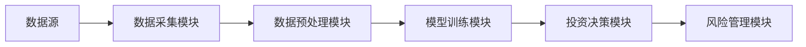

                 


# AI如何实现费雪的长期持股策略

> 关键词：人工智能、投资策略、长期持股、费雪理论、量化分析

> 摘要：本文探讨如何利用人工智能技术实现费雪的长期持股策略。通过分析费雪策略的核心要素，结合AI算法和系统架构设计，提出了一种基于神经网络和强化学习的实现方案。文章详细讲解了算法原理、系统架构、项目实战和最佳实践，为投资者和AI开发者提供了理论和实践指导。

---

# 第1章 AI与费雪长期持股策略的背景介绍

## 1.1 费雪长期持股策略的核心概念

### 1.1.1 费雪投资理论的起源与发展

菲利普·费雪（Philip Fisher）是20世纪的投资大师，他的投资理念以“长期持股”为核心。费雪认为，投资的目的是找到具有强大竞争优势的公司，并长期持有，而非频繁交易以赚取短期利润。他的理论强调基本面分析，尤其是公司的管理团队、产品竞争力和行业地位。

### 1.1.2 长期持股策略的核心要素

费雪策略的核心要素包括：

1. **选择优秀的公司**：投资那些具有强大竞争优势、良好管理团队和增长潜力的公司。
2. **长期持有**：避免频繁交易，降低交易成本和税务负担。
3. **持续监控**：定期评估投资组合的表现，确保公司基本面未发生重大变化。

### 1.1.3 费雪策略在现代投资中的应用

随着金融市场的复杂化和数据量的爆炸式增长，传统的基本面分析方法逐渐被量化分析和AI技术所增强。费雪策略的核心思想与现代投资理念不谋而合，尤其是其长期持有的理念，为AI驱动的投资策略提供了丰富的理论基础。

---

## 1.2 AI在投资领域的应用背景

### 1.2.1 AI在金融领域的潜力

人工智能技术在金融领域的应用日益广泛，尤其是在数据分析、风险管理、投资决策等领域。AI能够处理海量数据，识别复杂模式，并提供实时决策支持，极大地提高了投资效率和准确性。

### 1.2.2 费雪策略与AI的结合优势

将AI技术应用于费雪策略，可以实现以下优势：

1. **数据驱动的选股**：通过AI分析海量数据，筛选出符合费雪标准的优秀公司。
2. **动态调整**：AI能够实时监控市场变化，动态调整投资组合，确保长期收益。
3. **风险控制**：AI能够预测市场风险，优化投资组合，降低波动性。

### 1.2.3 当前AI在投资中的主要挑战

尽管AI在投资中的潜力巨大，但其应用仍面临以下挑战：

1. **数据质量**：投资决策高度依赖数据质量，数据缺失或偏差可能影响模型准确性。
2. **模型过拟合**：AI模型可能过度拟合历史数据，导致实际投资表现不佳。
3. **黑箱问题**：复杂AI模型的决策过程难以解释，增加了风险管理的难度。

---

## 1.3 费雪策略与AI结合的可行性分析

### 1.3.1 费雪策略的特点与AI的优势

费雪策略的特点包括长期性、选择优秀公司和持续监控。AI的优势在于高效的数据处理能力和动态调整能力。两者的结合能够充分发挥费雪策略的优势，同时克服传统投资方法的局限性。

### 1.3.2 AI如何增强费雪策略的执行效果

AI可以通过以下方式增强费雪策略的执行效果：

1. **自动化选股**：利用机器学习模型筛选符合费雪标准的公司。
2. **实时监控**：通过自然语言处理技术，实时分析公司新闻和财务报告，识别潜在风险。
3. **动态调整**：根据市场变化，AI能够快速调整投资组合，优化收益。

### 1.3.3 费雪策略与AI结合的边界与外延

AI的应用范围主要集中在数据处理和决策优化，而投资决策的最终判断仍需结合人类的判断。因此，AI的应用边界在于辅助决策，而非完全替代人类的判断。

---

## 1.4 本章小结

本章介绍了费雪长期持股策略的核心概念和AI在投资中的应用背景，分析了AI与费雪策略结合的优势与挑战。通过这一章，读者可以理解AI如何增强费雪策略的执行效果，为后续的实现方案奠定了理论基础。

---

# 第2章 AI实现费雪策略的核心概念与联系

## 2.1 费雪策略的核心要素

### 2.1.1 费雪策略的三要素分析

费雪策略的核心要素包括：

1. **公司质量**：公司具有强大的竞争优势和良好的管理团队。
2. **长期持有**：避免频繁交易，降低成本。
3. **持续监控**：定期评估投资组合的表现。

### 2.1.2 费雪策略的数学模型

费雪策略的数学模型可以表示为：

$$
\text{投资收益} = \sum_{i=1}^{n} w_i \times r_i
$$

其中，\( w_i \) 是第 \( i \) 只股票的权重，\( r_i \) 是其对应的收益率。

### 2.1.3 费雪策略的决策逻辑

费雪策略的决策逻辑包括以下几个步骤：

1. **筛选公司**：通过基本面分析筛选出具有强大竞争优势的公司。
2. **评估风险**：分析公司的财务状况和行业风险。
3. **制定投资计划**：根据筛选结果制定投资组合。
4. **持续监控**：定期评估投资组合的表现，及时调整。

---

## 2.2 AI在投资中的核心概念

### 2.2.1 AI在金融数据处理中的应用

AI可以通过自然语言处理（NLP）技术分析新闻、财报等非结构化数据，提取有用的信息。

### 2.2.2 AI在投资决策中的角色

AI在投资决策中主要扮演以下角色：

1. **数据处理**：清洗、整合和分析数据。
2. **预测模型**：构建预测模型，辅助投资决策。
3. **风险管理**：识别和预测市场风险。

### 2.2.3 AI在风险控制中的作用

AI可以通过时间序列分析预测市场波动，优化投资组合的风险收益比。

---

## 2.3 费雪策略与AI的实体关系图

以下是费雪策略与AI的实体关系图：


---

## 2.4 本章小结

本章详细阐述了费雪策略的核心要素和AI在投资中的核心概念，分析了AI如何增强费雪策略的执行效果。通过实体关系图，读者可以清晰理解费雪策略与AI之间的联系。

---

# 第3章 AI实现费雪策略的算法原理

## 3.1 费雪策略的数学模型

### 3.1.1 费雪策略的回归分析

回归分析是费雪策略中常用的数学工具，用于预测股票收益。线性回归模型如下：

$$
y = \beta_0 + \beta_1x_1 + \beta_2x_2 + \dots + \beta_nx_n + \epsilon
$$

其中，\( y \) 是目标变量（股票收益），\( x_i \) 是自变量（财务指标），\( \beta_i \) 是回归系数，\( \epsilon \) 是误差项。

### 3.1.2 费雪策略的时间序列模型

时间序列模型用于预测股票价格的变化，常用ARIMA模型：

$$
y_t = \alpha + \beta y_{t-1} + \gamma x_t + \epsilon_t
$$

其中，\( y_t \) 是当前时刻的收益，\( y_{t-1} \) 是前一时刻的收益，\( x_t \) 是当前时刻的其他因素，\( \alpha \) 和 \( \gamma \) 是模型参数，\( \epsilon_t \) 是误差项。

---

## 3.2 AI算法在费雪策略中的应用

### 3.2.1 基于神经网络的费雪策略预测

神经网络是一种强大的工具，可以用于股票价格预测。以下是一个简单的神经网络结构：


### 3.2.2 基于强化学习的投资决策

强化学习是一种通过试错优化决策的AI技术，适用于动态变化的金融市场。以下是一个强化学习框架：


---

## 3.3 算法实现的数学公式

### 3.3.1 神经网络的损失函数

神经网络的损失函数通常采用均方误差：

$$
L = \frac{1}{N}\sum_{i=1}^{N}(y_i - \hat{y}_i)^2
$$

其中，\( y_i \) 是真实值，\( \hat{y}_i \) 是预测值，\( N \) 是样本数量。

### 3.3.2 强化学习的Q-learning公式

Q-learning是一种常见的强化学习算法，其更新公式如下：

$$
Q(s, a) = Q(s, a) + \alpha [r + \gamma \max Q(s', a') - Q(s, a)]
$$

其中，\( Q(s, a) \) 是状态-动作对的Q值，\( \alpha \) 是学习率，\( r \) 是奖励，\( \gamma \) 是折扣因子，\( s' \) 是新状态。

---

## 3.4 本章小结

本章详细介绍了费雪策略的数学模型和AI算法在其中的应用，包括回归分析、时间序列分析、神经网络和强化学习。通过数学公式和算法流程图，读者可以清晰理解AI如何实现费雪策略。

---

# 第4章 AI实现费雪策略的系统架构设计

## 4.1 系统功能设计

### 4.1.1 数据采集

数据采集是系统的第一步，包括从股票市场获取历史价格、财务数据、新闻等。

### 4.1.2 数据预处理

数据预处理包括数据清洗、特征提取和数据增强。

### 4.1.3 模型训练

模型训练包括构建神经网络或强化学习模型，并进行训练优化。

### 4.1.4 投资决策

根据模型预测结果，生成投资决策，如买入、卖出或持有。

### 4.1.5 风险管理

实时监控投资组合的风险，动态调整投资策略。

---

## 4.2 系统架构设计

以下是系统的架构图：



---

## 4.3 本章小结

本章详细描述了AI实现费雪策略的系统功能设计和架构设计，为后续的实现提供了指导。

---

# 第5章 AI实现费雪策略的项目实战

## 5.1 项目环境安装

### 5.1.1 安装Python和相关库

安装Python和以下库：

- NumPy
- Pandas
- Matplotlib
- Scikit-learn
- Keras
- TensorFlow

### 5.1.2 数据集获取

从金融数据提供商获取股票数据，如Yahoo Finance。

---

## 5.2 系统核心实现源代码

### 5.2.1 数据预处理代码

```python
import pandas as pd
import numpy as np

# 读取数据
data = pd.read_csv('stock_data.csv')

# 数据清洗
data.dropna(inplace=True)

# 特征提取
data['return'] = data['close'].pct_change()

# 数据增强
data['moving_avg'] = data['close'].rolling(5).mean()
```

### 5.2.2 神经网络模型实现

```python
from tensorflow.keras import layers

# 构建神经网络模型
model = tf.keras.Sequential([
    layers.Dense(64, activation='relu', input_shape=(n_features,)),
    layers.Dense(1, activation='linear')
])

# 编译模型
model.compile(optimizer='adam', loss='mean_squared_error')

# 训练模型
model.fit(X_train, y_train, epochs=100, batch_size=32)
```

---

## 5.3 代码应用解读与分析

### 5.3.1 数据预处理解读

数据预处理包括清洗、特征提取和增强，目的是提高模型的预测能力。

### 5.3.2 神经网络模型解读

神经网络模型通过多层感知机结构，学习数据中的非线性关系，预测股票收益。

---

## 5.4 实际案例分析

### 5.4.1 案例背景

以苹果公司股票为例，使用费雪策略和AI模型进行投资决策。

### 5.4.2 模型预测结果

AI模型预测苹果股票在接下来的3个月内的收益，并生成相应的投资建议。

---

## 5.5 本章小结

本章通过项目实战，展示了如何利用Python代码实现AI驱动的费雪策略，包括数据预处理、模型训练和投资决策。

---

# 第6章 最佳实践与注意事项

## 6.1 最佳实践

### 6.1.1 数据质量的重要性

确保数据的完整性和准确性，避免数据偏差。

### 6.1.2 模型优化的技巧

通过交叉验证和超参数调优，提高模型的泛化能力。

### 6.1.3 风险管理的策略

设置止损和止盈点，分散投资组合，降低风险。

---

## 6.2 注意事项

### 6.2.1 模型的过拟合问题

避免模型过拟合，确保模型的泛化能力。

### 6.2.2 数据的实时更新

定期更新数据，确保模型的预测能力。

### 6.2.3 投资决策的透明性

确保投资决策的透明性，便于后续分析和调整。

---

## 6.3 本章小结

本章总结了实现AI驱动的费雪策略的最佳实践和注意事项，为读者提供了宝贵的参考。

---

# 第7章 总结与展望

## 7.1 本文总结

本文详细探讨了如何利用AI技术实现费雪的长期持股策略，包括理论分析、算法实现和项目实战。

## 7.2 未来展望

随着AI技术的不断发展，费雪策略的实现将更加智能化和个性化。未来的研究方向包括更复杂的模型和多模态数据的分析。

---

# 作者

作者：AI天才研究院/AI Genius Institute  
联系方式：[contact@ai-genius.org](mailto:contact@ai-genius.org)  
个人简介：专注于人工智能与金融结合的研究，致力于推动AI技术在投资领域的应用。

---

感谢您的阅读！希望本文能为您的投资决策提供有价值的参考。

