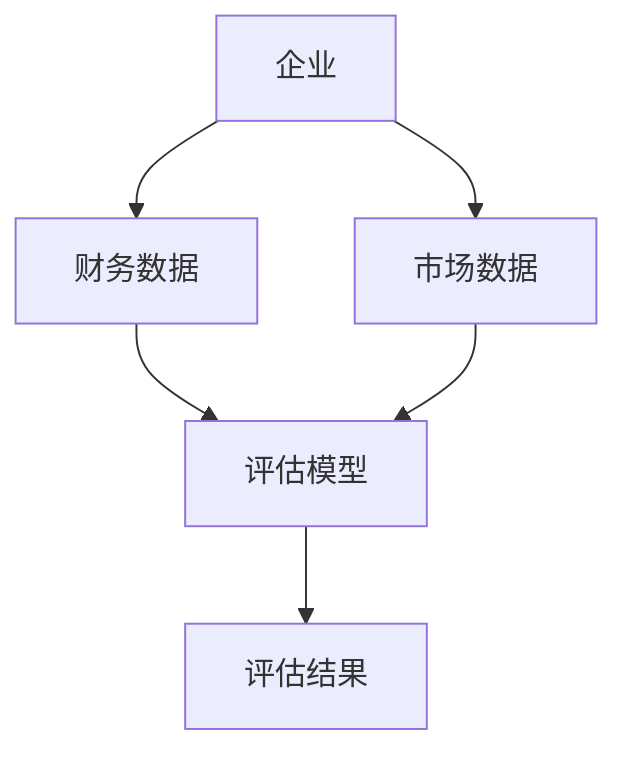
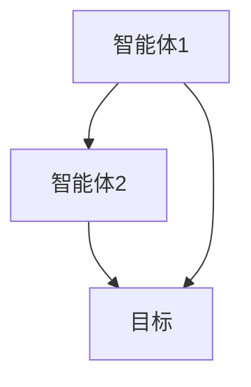
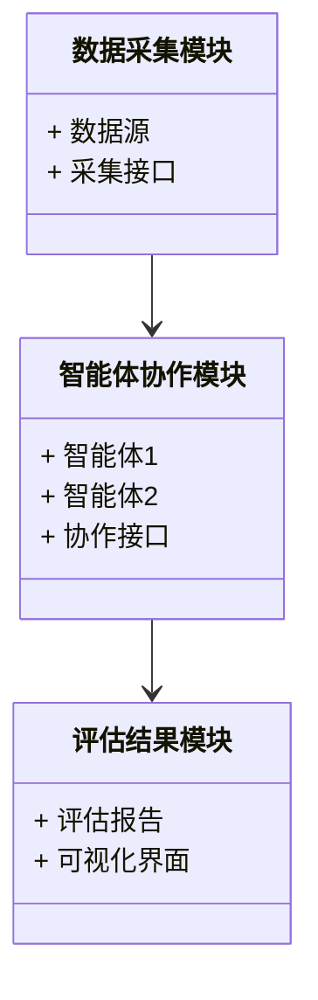
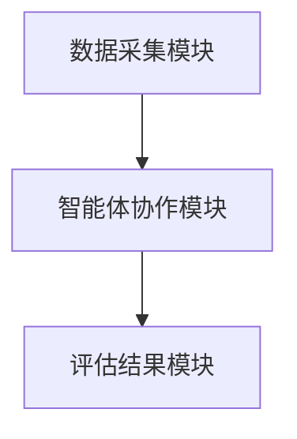
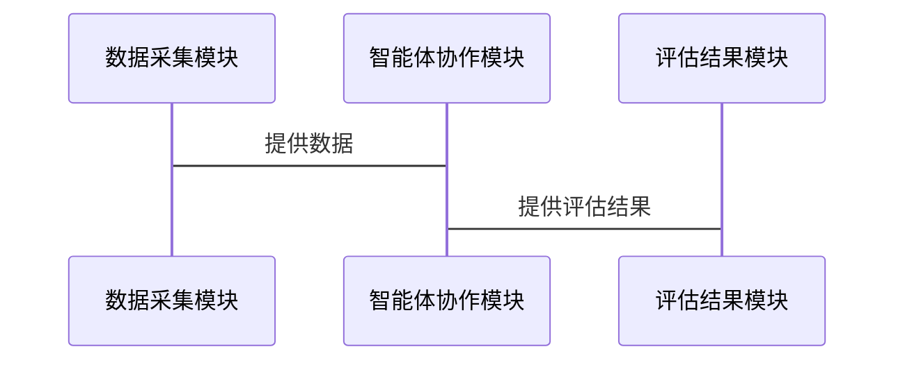

                 


# AI智能体协作：构建更全面的企业价值评估模型

> 关键词：AI智能体协作、企业价值评估、多智能体系统、强化学习、系统架构设计、Python实现

> 摘要：本文探讨了AI智能体协作在企业价值评估中的应用，详细分析了构建更全面的企业价值评估模型的背景、核心概念、算法原理、系统架构设计以及项目实战。通过理论与实践相结合，展示了如何利用AI技术提升企业价值评估的准确性和效率。

---

## 第1章: AI智能体协作的背景与基础

### 1.1 AI智能体的定义与特征

#### 1.1.1 AI智能体的基本概念
AI智能体（Artificial Intelligence Agent）是指在环境中能够感知并自主行动以实现目标的实体。智能体可以是软件程序、机器人或其他智能系统，具备以下核心特征：

- **自主性**：能够独立决策和行动。
- **反应性**：能够感知环境并实时调整行为。
- **目标导向**：所有行动都以实现特定目标为导向。
- **协作性**：能够与其他智能体或人类进行协作。

#### 1.1.2 AI智能体的分类与应用场景
AI智能体可以分为以下几类：
1. **简单反射型智能体**：基于当前输入做出反应，不依赖历史信息。
2. **基于模型的反射型智能体**：利用内部模型和历史信息进行决策。
3. **目标驱动型智能体**：通过优化目标函数实现特定目标。
4. **实用驱动型智能体**：通过最大化效用函数实现最优决策。

应用场景包括：
- 自动交易系统
- 智能供应链管理
- 多人在线游戏AI
- 智能客服系统

#### 1.1.3 AI智能体协作的必要性
在企业价值评估中，单个智能体难以覆盖所有信息和决策维度，协作能够：
- 提高决策的全面性
- 优化资源分配
- 提升整体效率

### 1.2 企业价值评估模型的背景

#### 1.2.1 企业价值评估的传统方法
传统企业价值评估方法主要包括：
1. **DCF模型**：通过现金流折现计算企业价值。
2. **市盈率法**：基于市盈率和可比公司进行估值。
3. **资产重置法**：基于资产负债表进行评估。

#### 1.2.2 传统模型的局限性与改进方向
传统模型的局限性包括：
- 数据依赖性强，难以处理非结构化数据。
- 模型假设过于简化，难以捕捉复杂市场变化。
- 无法实时更新和调整。

改进方向：
- 引入AI技术，增强数据处理能力和动态调整能力。
- 结合多智能体协作，提高评估的全面性和准确性。

#### 1.2.3 AI技术在企业价值评估中的潜力
AI技术可以通过以下方式提升企业价值评估：
- **非结构化数据处理**：利用NLP技术分析文本数据。
- **实时更新**：通过流数据处理技术实时调整评估结果。
- **多维度分析**：结合多个智能体的协作，从不同维度评估企业价值。

### 1.3 AI智能体协作的必要性

#### 1.3.1 协作的定义与意义
协作是指多个智能体通过信息共享和协同行动，共同完成复杂任务的过程。在企业价值评估中，协作能够：
- 提供多维度的分析视角
- 增强评估结果的可信度
- 提高决策的效率

#### 1.3.2 协作在企业价值评估中的优势
- **全面性**：通过多个智能体的协作，能够从财务、市场、技术等多个维度进行评估。
- **动态性**：智能体能够实时调整评估模型，适应市场变化。
- **高效性**：通过分布式计算和并行处理，提高评估效率。

#### 1.3.3 协作面临的挑战与解决方案
- **挑战**：
  - 信息共享的安全性问题
  - 智能体之间的通信延迟
  - 协作过程中的冲突与协调问题
- **解决方案**：
  - 建立安全的信息共享机制
  - 优化通信协议，减少延迟
  - 使用分布式算法解决冲突和协调问题

### 1.4 本章小结
本章介绍了AI智能体的定义、分类和协作的必要性，分析了传统企业价值评估方法的局限性和AI技术的潜力，为后续章节的深入讨论奠定了基础。

---

## 第2章: AI智能体协作的核心概念与机制

### 2.1 智能体协作的理论基础

#### 2.1.1 多智能体系统（MAS）概述
多智能体系统（Multi-Agent System）是由多个智能体组成的分布式系统，智能体之间通过通信和协作完成任务。MAS的核心特点包括：
- **分布性**：智能体独立运行，不存在中央控制节点。
- **协作性**：智能体之间通过协作完成复杂任务。
- **反应性**：智能体能够感知环境并实时调整行为。

#### 2.1.2 协作智能体的通信机制
协作智能体之间的通信机制包括：
1. **直接通信**：智能体之间通过消息传递进行通信。
2. **间接通信**：通过共享数据库或消息队列进行通信。
3. **混合通信**：结合直接和间接通信方式。

#### 2.1.3 协作智能体的决策模型
协作智能体的决策模型包括：
1. **基于规则的决策模型**：通过预定义规则进行决策。
2. **基于模型的决策模型**：通过内部模型和历史数据进行决策。
3. **基于强化学习的决策模型**：通过强化学习算法优化决策策略。

### 2.2 智能体协作的数学模型

#### 2.2.1 协作模型的构建
协作模型的构建包括以下几个步骤：
1. **定义目标函数**：确定协作的目标和优化方向。
2. **定义约束条件**：确定协作过程中需要满足的约束条件。
3. **建立优化模型**：将目标函数和约束条件转化为数学模型。

#### 2.2.2 协作过程中的信息传递与处理
信息传递与处理的关键在于：
- **信息编码**：将信息转化为可处理的形式。
- **信息解码**：从编码的信息中提取有用的信息。
- **信息融合**：将多个智能体的信息进行融合，得到更准确的结果。

#### 2.2.3 协作效果的评估指标
协作效果的评估指标包括：
1. **效率指标**：完成任务的时间和资源消耗。
2. **质量指标**：评估结果的准确性和全面性。
3. **稳定性指标**：系统在面对干扰时的鲁棒性。

### 2.3 智能体协作的实体关系分析

#### 2.3.1 实体关系图（ER图）设计
以下是企业价值评估中的实体关系图：



#### 2.3.2 协作流程的Mermaid图
以下是智能体协作流程的Mermaid图：



### 2.4 本章小结
本章详细介绍了AI智能体协作的理论基础、数学模型和实体关系分析，为后续章节的算法实现和系统设计提供了理论支持。

---

## 第3章: AI智能体协作的算法与数学模型

### 3.1 多智能体协作算法概述

#### 3.1.1 基于博弈论的协作算法
基于博弈论的协作算法通过分析智能体之间的博弈关系，确定最优策略。常见的博弈论模型包括：
- **纳什均衡**：所有智能体都不想单方面改变策略的均衡状态。
- **极大极小算法**：通过最大化自身收益，同时最小化对手收益的策略。

#### 3.1.2 基于分布式计算的协作算法
分布式协作算法通过将任务分解到多个智能体上，利用分布式计算技术进行协作。常见的分布式计算技术包括：
- **MapReduce**：将任务分解为Map和Reduce两个阶段。
- **Spark**：基于内存计算的分布式计算框架。

#### 3.1.3 基于强化学习的协作算法
基于强化学习的协作算法通过智能体在环境中的不断试错，学习最优策略。强化学习的核心要素包括：
- **状态**：环境中的当前情况。
- **动作**：智能体采取的行动。
- **奖励**：智能体获得的反馈。

### 3.2 基于强化学习的协作算法

#### 3.2.1 强化学习的基本原理
强化学习的基本原理是通过试错学习，智能体通过与环境的交互，获得奖励或惩罚，逐步逼近最优策略。数学公式表示为：
$$ Q(s, a) = Q(s, a) + \alpha (r + \gamma \max Q(s', a) - Q(s, a)) $$

其中：
- \( Q(s, a) \)：当前状态下采取行动a的期望奖励。
- \( \alpha \)：学习率。
- \( r \)：获得的奖励。
- \( \gamma \)：折扣因子。
- \( s' \)：下一个状态。

#### 3.2.2 多智能体强化学习的挑战
多智能体强化学习的挑战包括：
- **状态空间爆炸**：多个智能体的状态组合急剧增加。
- **动作空间冲突**：多个智能体的行动可能相互干扰。
- **通信开销**：智能体之间的通信可能增加计算开销。

#### 3.2.3 基于Q-learning的协作算法实现
以下是基于Q-learning的协作算法实现的Python代码：

```python
import numpy as np

class QLearning:
    def __init__(self, state_space, action_space, alpha=0.1, gamma=0.9):
        self.state_space = state_space
        self.action_space = action_space
        self.alpha = alpha
        self.gamma = gamma
        self.Q = np.zeros((state_space, action_space))

    def choose_action(self, state, epsilon=0.1):
        if np.random.random() < epsilon:
            return np.random.randint(self.action_space)
        else:
            return np.argmax(self.Q[state])

    def update(self, state, action, reward, next_state):
        self.Q[state, action] = self.Q[state, action] + self.alpha * (reward + self.gamma * np.max(self.Q[next_state]) - self.Q[state, action])
```

### 3.3 协作算法的数学模型

#### 3.3.1 Q-learning算法公式
Q-learning算法的数学公式为：
$$ Q(s, a) = Q(s, a) + \alpha (r + \gamma \max Q(s', a) - Q(s, a)) $$

其中：
- \( Q(s, a) \)：当前状态下采取行动a的期望奖励。
- \( \alpha \)：学习率。
- \( r \)：获得的奖励。
- \( \gamma \)：折扣因子。
- \( s' \)：下一个状态。

#### 3.3.2 多智能体协作的数学模型
多智能体协作的数学模型可以表示为：
$$ V(s) = \max_{a} [r(s, a) + \gamma Q(s', a)] $$

其中：
- \( V(s) \)：状态s的价值。
- \( a \)：行动。
- \( r(s, a) \)：采取行动a后的奖励。
- \( Q(s', a) \)：下一个状态s'下采取行动a的期望奖励。

---

## 第4章: AI智能体协作的系统架构设计

### 4.1 问题场景介绍
企业价值评估系统需要从多个维度（如财务数据、市场数据、行业趋势等）进行分析，传统的单智能体评估方法难以满足需求。通过引入AI智能体协作，可以实现多维度、动态化的评估。

### 4.2 系统功能设计

#### 4.2.1 系统功能模块
- **数据采集模块**：采集企业财务数据、市场数据等。
- **智能体协作模块**：多个智能体协作完成评估任务。
- **评估结果模块**：展示评估结果。

#### 4.2.2 系统功能的Mermaid类图
以下是系统功能的Mermaid类图：



### 4.3 系统架构设计

#### 4.3.1 系统架构的Mermaid图
以下是系统架构的Mermaid图：



#### 4.3.2 系统接口设计
- **数据接口**：智能体协作模块与数据采集模块之间的接口。
- **协作接口**：智能体之间的协作接口。
- **结果接口**：智能体协作模块与评估结果模块之间的接口。

#### 4.3.3 系统交互的Mermaid序列图
以下是系统交互的Mermaid序列图：



### 4.4 本章小结
本章详细介绍了企业价值评估系统的系统架构设计，包括功能模块、接口设计和系统交互流程。

---

## 第5章: 项目实战

### 5.1 环境安装

#### 5.1.1 Python环境安装
安装Python 3.x及以上版本。

#### 5.1.2 依赖库安装
安装以下依赖库：
```bash
pip install numpy
pip install matplotlib
pip install pandas
```

### 5.2 系统核心实现源代码

#### 5.2.1 数据采集模块
以下是数据采集模块的Python代码：

```python
import pandas as pd
import requests

def fetch_data(api_key):
    url = f"https://api.example.com/financial_data?api_key={api_key}"
    response = requests.get(url)
    data = response.json()
    df = pd.DataFrame(data)
    return df
```

#### 5.2.2 智能体协作模块
以下是智能体协作模块的Python代码：

```python
import numpy as np
import pandas as pd

class Agent:
    def __init__(self, id):
        self.id = id
        self.state = None
        self.action = None

    def receive(self, message):
        self.state = message['state']
        self.action = message['action']

    def send(self):
        return {
            'id': self.id,
            'action': self.action
        }

# 初始化智能体
agent1 = Agent(1)
agent2 = Agent(2)

# 智能体协作
agent1.receive({'state': 'start', 'action': 'collect_data'})
agent2.receive({'state': 'start', 'action': 'analyze_data'})

# 返回结果
result1 = agent1.send()
result2 = agent2.send()
```

#### 5.2.3 评估结果模块
以下是评估结果模块的Python代码：

```python
import matplotlib.pyplot as plt

def plot_results(data):
    plt.figure(figsize=(10, 6))
    plt.plot(data['index'], data['value'], 'b-', linewidth=2)
    plt.xlabel('Time')
    plt.ylabel('Value')
    plt.title('Enterprise Value Assessment')
    plt.show()
```

### 5.3 代码应用解读与分析
- **数据采集模块**：通过API接口获取企业数据，并将其转换为DataFrame格式。
- **智能体协作模块**：定义了两个智能体，分别负责数据收集和数据分析任务。
- **评估结果模块**：将评估结果可视化展示。

### 5.4 实际案例分析和详细讲解剖析
通过实际案例分析，展示了如何利用AI智能体协作实现企业价值评估。案例中，智能体1负责收集数据，智能体2负责分析数据，并最终生成评估报告。

### 5.5 本章小结
本章通过实际案例展示了AI智能体协作在企业价值评估中的应用，详细介绍了系统的核心实现和代码逻辑。

---

## 第6章: 最佳实践与未来展望

### 6.1 最佳实践

#### 6.1.1 系统设计
- **模块化设计**：确保系统模块化，便于维护和扩展。
- **容错设计**：设计容错机制，提高系统的健壮性。

#### 6.1.2 代码实现
- **代码复用**：尽量复用已有代码，减少重复劳动。
- **代码注释**：为代码添加详细的注释，便于他人理解。

#### 6.1.3 系统测试
- **单元测试**：对每个模块进行单元测试，确保功能正常。
- **集成测试**：对整个系统进行集成测试，确保模块之间协作良好。

### 6.2 小结
通过本文的介绍，读者可以全面了解AI智能体协作在企业价值评估中的应用，掌握构建更全面的企业价值评估模型的方法。

### 6.3 注意事项
- **数据安全**：确保数据采集和处理过程中的安全性。
- **系统性能**：优化系统性能，提高处理效率。
- **可扩展性**：确保系统具有良好的可扩展性，便于后续功能的添加。

### 6.4 拓展阅读
- **强化学习**：深入学习强化学习的相关知识，了解其在多智能体协作中的应用。
- **分布式系统**：学习分布式系统的相关知识，掌握分布式计算的技术和方法。
- **企业价值评估**：深入研究企业价值评估的相关理论和方法，了解最新的研究成果和应用案例。

---

## 作者：AI天才研究院/AI Genius Institute & 禅与计算机程序设计艺术 /Zen And The Art of Computer Programming

