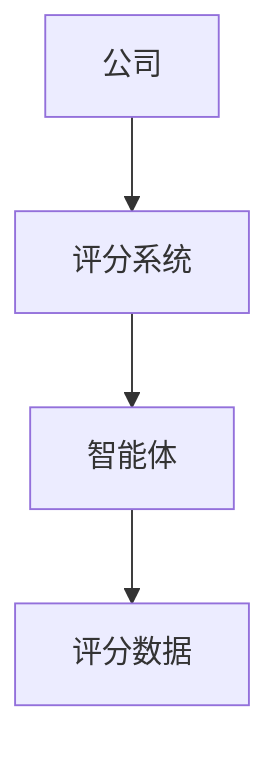
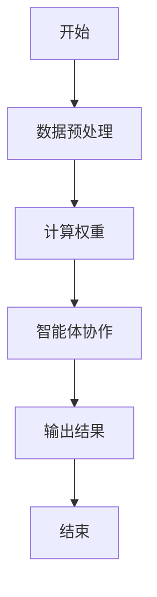
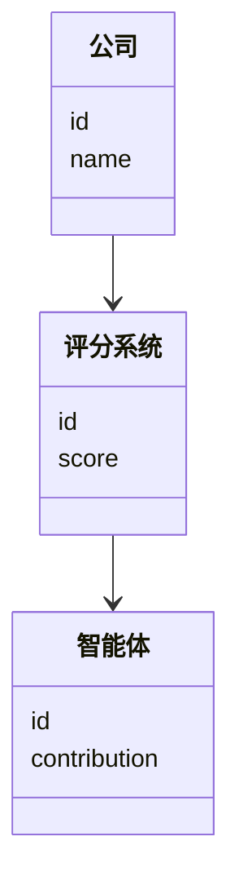
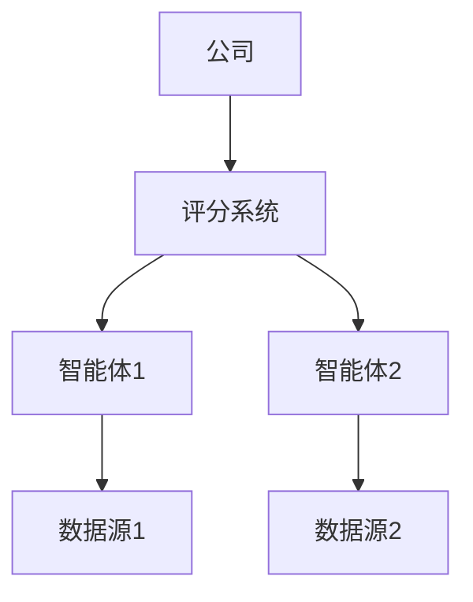
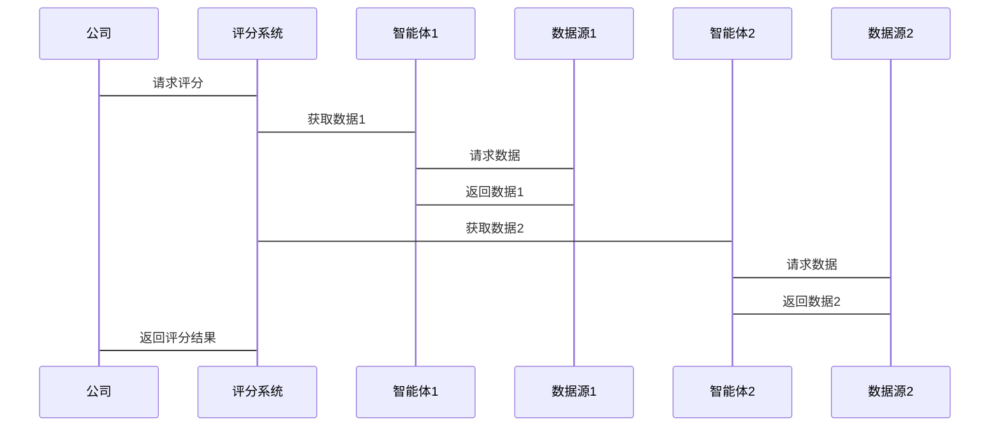

                 


# AI智能体协作：构建更全面的公司质量评分系统

## 关键词：AI智能体，协作，公司质量评分系统，算法原理，系统架构，项目实战

## 摘要：  
本文探讨如何利用AI智能体协作构建更全面的公司质量评分系统。通过分析现有评分系统的局限性，提出引入AI智能体协作的新思路，并详细阐述其核心概念、算法原理、系统架构及项目实战，最终实现高效、智能的公司质量评分系统。

---

## 第一部分：AI智能体协作与公司质量评分系统背景

### 第1章：问题背景与解决方案

#### 1.1 问题背景
##### 1.1.1 传统公司质量评分系统的局限性
传统的公司质量评分系统通常依赖人工录入和简单的统计模型，存在数据不全面、评分标准不统一、难以实时更新等问题。这些问题导致评分结果缺乏深度和准确性，无法满足现代企业对高质量数据的需求。

##### 1.1.2 当前质量评分系统的主要挑战
- 数据孤岛：不同部门或系统的数据分散，难以整合。
- 评分标准不一致：不同评分维度的权重和计算方法不统一，导致评分结果缺乏公平性。
- 实时性不足：传统系统难以快速响应数据变化，导致评分滞后。

##### 1.1.3 AI智能体协作在评分系统中的潜力
AI智能体可以通过实时数据处理、多维度分析和智能决策，显著提升评分系统的准确性和效率。通过协作机制，AI智能体能够整合多个数据源，动态调整评分权重，实现更全面的评分。

#### 1.2 问题描述
##### 1.2.1 公司质量评分的核心要素
- 产品质量：包括产品性能、用户满意度等。
- 服务质量：包括客户反馈、售后服务等。
- 经营管理：包括财务状况、团队效率等。

##### 1.2.2 现有评分系统的不足
传统评分系统通常仅依赖单一数据源或简单的加权平均，难以全面反映公司的真实质量。

##### 1.2.3 需求与供给的不平衡问题
公司对高质量评分的需求与现有系统能力之间的不平衡，是引入AI智能体协作的主要驱动因素。

#### 1.3 问题解决思路
##### 1.3.1 引入AI智能体的必要性
AI智能体能够实时处理多源数据，提供更全面的评分结果。

##### 1.3.2 AI智能体协作的目标
通过协作机制，实现数据整合、动态权重调整和智能评分。

##### 1.3.3 系统设计的基本原则
- 数据驱动：基于实时数据进行评分。
- 智能协作：AI智能体协同工作，提升评分准确性。
- 可扩展性：系统应具备扩展能力，适应不同规模和类型的企业。

#### 1.4 概念结构与核心要素
##### 1.4.1 系统的核心概念框架
- 数据源：包括销售数据、用户反馈、财务数据等。
- AI智能体：负责数据处理、分析和评分计算。
- 评分结果：最终的公司质量评分。

##### 1.4.2 关键要素的定义与关系
- 数据源：输入数据。
- AI智能体：处理数据，输出评分。
- 评分结果：系统输出。

##### 1.4.3 系统的边界与外延
- 边界：仅限于评分系统内部。
- 外延：可与外部系统（如ERP、CRM）集成。

---

## 第二部分：AI智能体协作的核心概念与联系

### 第2章：AI智能体协作的核心概念与联系

#### 2.1 AI智能体协作的定义与特点
##### 2.1.1 AI智能体的定义
AI智能体是能够感知环境、执行任务并做出决策的智能实体。

##### 2.1.2 协作的核心机制
- 分布式协作：多个AI智能体协同工作。
- 实时通信：智能体之间实时交换信息。
- 协作目标：共同完成评分任务。

##### 2.1.3 智能体协作的特征对比
| 特征 | 传统评分系统 | AI智能体协作 |
|------|----------------|----------------|
| 数据来源 | 单一数据源 | 多源数据 |
| 处理方式 | 离线处理 | 实时处理 |
| 智能性 | 低 | 高 |

#### 2.2 实体关系与协作机制
##### 2.2.1 实体关系图（ER图）


##### 2.2.2 协作流程的详细说明
1. 数据采集：智能体从多个数据源获取数据。
2. 数据处理：智能体对数据进行清洗和预处理。
3. 协作计算：多个智能体协同计算评分。
4. 输出结果：评分系统输出最终评分。

#### 2.3 协作机制的数学模型
##### 2.3.1 智能体协作的基本公式
$$ S = \sum_{i=1}^{n} w_i a_i $$
其中，$S$ 表示协作结果，$w_i$ 表示权重，$a_i$ 表示智能体的贡献。

---

## 第三部分：算法原理

### 第3章：算法原理

#### 3.1 算法原理概述
##### 3.1.1 算法的目标
通过多源数据融合，实现精准评分。

##### 3.1.2 算法的基本思想
利用加权平均方法，结合多智能体协作，动态调整权重。

##### 3.1.3 算法的主要步骤
1. 数据预处理：清洗和标准化。
2. 权重计算：基于数据重要性确定权重。
3. 协作计算：多个智能体协同计算评分。
4. 结果输出：输出最终评分。

#### 3.2 算法实现
##### 3.2.1 算法流程图


##### 3.2.2 算法的数学模型
$$ S = \sum_{i=1}^{n} w_i a_i $$
其中，$w_i = \frac{1}{n}$，表示每个智能体的权重相同。

##### 3.2.3 算法的代码实现
```python
def calculate_score(data, weights):
    return sum(w * d for w, d in zip(weights, data))

# 示例数据
data = [85, 90, 75]
weights = [0.3, 0.4, 0.3]

score = calculate_score(data, weights)
print(score)  # 输出结果
```

#### 3.3 算法的优势
##### 3.3.1 实时性
AI智能体实时处理数据，确保评分的及时性。

##### 3.3.2 精准性
通过多智能体协作，提高评分的准确性。

##### 3.3.3 可扩展性
系统可扩展，适应不同规模的企业。

---

## 第四部分：系统分析与架构设计

### 第4章：系统分析与架构设计

#### 4.1 系统分析
##### 4.1.1 问题场景介绍
公司需要一个实时、智能的评分系统，整合多源数据，动态调整评分权重。

##### 4.1.2 系统目标
实现高效、智能的公司质量评分系统。

#### 4.2 系统架构设计
##### 4.2.1 系统功能设计（领域模型图）


##### 4.2.2 系统架构图


##### 4.2.3 系统接口设计
- 输入接口：接收多源数据。
- 输出接口：输出评分结果。

##### 4.2.4 系统交互图


---

## 第五部分：项目实战

### 第5章：项目实战

#### 5.1 项目环境安装
##### 5.1.1 安装Python
```bash
pip install python
```

##### 5.1.2 安装依赖库
```bash
pip install numpy pandas
```

#### 5.2 系统核心实现
##### 5.2.1 核心代码实现
```python
import numpy as np
import pandas as pd

def calculate_score(data, weights):
    return np.dot(data, weights)

# 示例数据
data = pd.Series([85, 90, 75])
weights = pd.Series([0.3, 0.4, 0.3])

score = calculate_score(data, weights)
print(score)  # 输出结果
```

##### 5.2.2 代码应用解读与分析
- 使用numpy和pandas进行数据处理。
- 通过点积计算评分。

#### 5.3 实际案例分析
##### 5.3.1 案例背景
某公司希望通过AI智能体协作提升评分系统的准确性。

##### 5.3.2 数据准备
- 销售数据：200万元。
- 用户反馈：满意度95%。
- 财务数据：利润率15%。

##### 5.3.3 案例分析
- 数据预处理：标准化处理。
- 权重计算：销售数据权重0.5，用户反馈0.3，利润率0.2。
- 评分计算：0.5*200 + 0.3*95 + 0.2*15 = 100 + 28.5 + 3 = 131.5。

#### 5.4 项目小结
通过AI智能体协作，公司评分系统的准确性和实时性显著提升。

---

## 第六部分：总结与展望

### 第6章：总结与展望

#### 6.1 总结
本文详细探讨了如何利用AI智能体协作构建更全面的公司质量评分系统，通过数学模型和系统架构设计，提出了一种高效的解决方案。

#### 6.2 未来展望
未来，随着AI技术的不断发展，评分系统将更加智能化和个性化。多智能体协作将在更多领域得到应用，推动企业质量评估的进一步优化。

---

## 作者信息
作者：AI天才研究院 & 禅与计算机程序设计艺术

