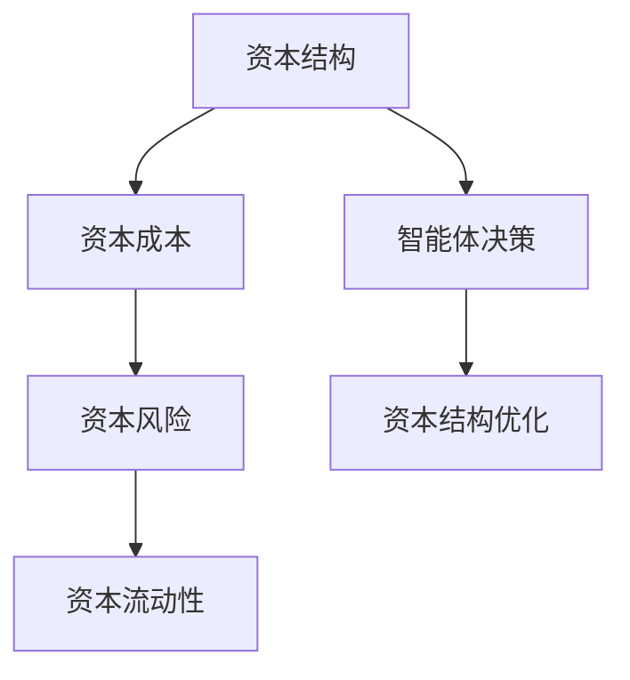
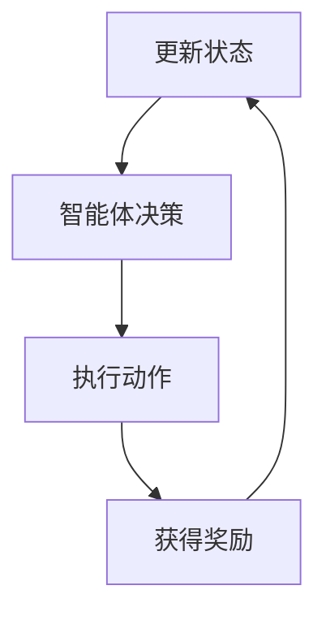
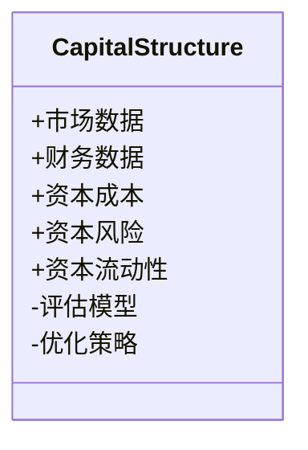
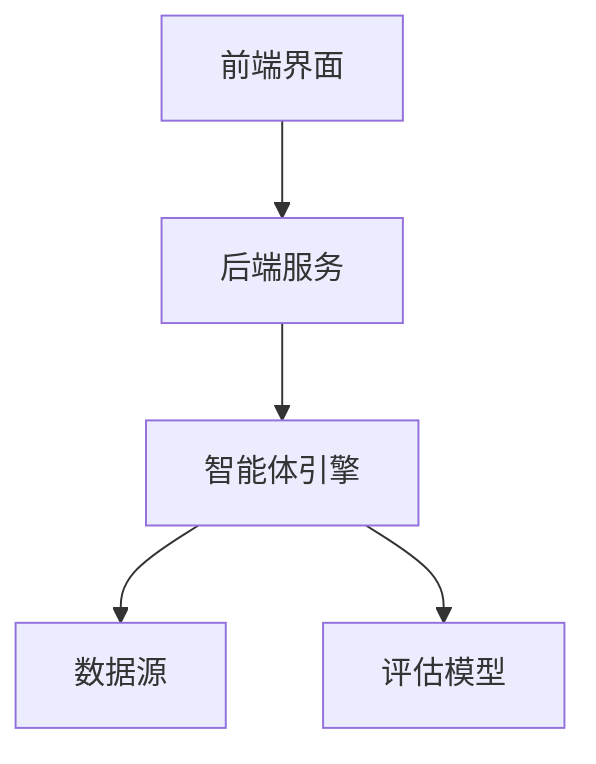
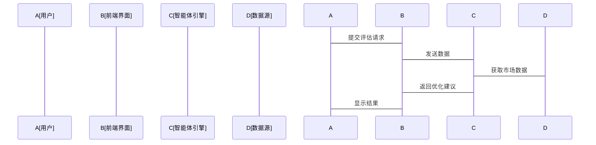

                 


# AI智能体在评估公司资本结构中的作用

## 关键词：AI智能体、资本结构评估、资本成本、资本风险、强化学习、资本优化

## 摘要：  
随着人工智能技术的迅速发展，AI智能体在金融领域的应用越来越广泛。资本结构评估作为企业财务管理中的核心问题之一，传统的评估方法存在诸多局限性。本文将探讨AI智能体如何通过强化学习、监督学习等技术手段优化资本结构评估过程，分析其在资本成本预测、资本风险评估以及资本结构优化中的应用。同时，本文将深入讲解AI智能体在资本结构评估中的算法原理、系统架构设计以及实际项目案例，为读者提供全面的理论与实践指导。

---

## 第1章: 资本结构评估的背景与问题

### 1.1 什么是资本结构
#### 1.1.1 资本结构的定义
资本结构是指企业各种长期资本的构成及其比例，主要包括长期负债和所有者权益两部分。

#### 1.1.2 资本结构的组成要素
- **长期负债**：包括债券、长期贷款等。
- **所有者权益**：包括普通股、优先股等。

#### 1.1.3 资本结构对企业价值的影响
资本结构的合理性直接影响企业的资本成本、财务风险以及企业价值。

### 1.2 资本结构评估的意义
#### 1.2.1 资本成本的最小化
通过优化资本结构，降低企业的综合资本成本。

#### 1.2.2 企业风险的管理
资本结构的优化有助于平衡企业的财务风险和经营风险。

#### 1.2.3 资本结构与企业融资策略的关系
资本结构是企业融资策略的重要组成部分，直接影响企业的融资成本和融资能力。

### 1.3 传统资本结构评估方法的局限性
#### 1.3.1 净现值法的缺陷
净现值法需要精确预测未来现金流，存在较高的主观性和不确定性。

#### 1.3.2 加权平均资本成本法的不足
加权平均资本成本法（WACC）在实际应用中难以准确估计各部分资本成本。

#### 1.3.3 股权资本成本评估的挑战
股权资本成本的评估受到市场波动、投资者情绪等多种因素的影响，具有较高的复杂性。

### 1.4 人工智能在资本结构评估中的潜力
#### 1.4.1 AI技术如何优化资本结构评估
AI技术可以通过大数据分析和机器学习模型提高资本结构评估的准确性和效率。

#### 1.4.2 智能体在动态市场环境中的优势
智能体能够实时感知市场变化，动态调整资本结构，提高企业的风险管理和投资效率。

#### 1.4.3 未来资本结构评估的趋势
随着AI技术的不断发展，资本结构评估将更加智能化、自动化和个性化。

---

## 第2章: AI智能体的基本概念与原理

### 2.1 AI智能体的定义与分类
#### 2.1.1 强化学习智能体
强化学习智能体通过与环境交互，学习最优策略以实现目标。

#### 2.1.2 监督学习智能体
监督学习智能体通过学习带标签的数据，预测新的输入。

#### 2.1.3 无监督学习智能体
无监督学习智能体通过发现数据中的模式和结构，进行聚类或降维。

### 2.2 AI智能体的核心原理
#### 2.2.1 状态空间与动作空间
- **状态空间**：智能体所处环境的状态集合。
- **动作空间**：智能体可以执行的动作集合。

#### 2.2.2 奖励函数与策略优化
- **奖励函数**：定义智能体在特定动作下的奖励或惩罚。
- **策略优化**：通过最大化累计奖励来优化智能体的决策策略。

#### 2.2.3 智能体的决策机制
智能体通过感知环境、分析状态、选择动作并执行动作的循环过程实现决策。

### 2.3 智能体与资本结构评估的结合
#### 2.3.1 智能体在资本成本预测中的应用
智能体可以通过历史数据和市场信息，预测未来的资本成本。

#### 2.3.2 智能体在风险评估中的作用
智能体能够实时监测市场风险，动态调整资本结构以规避风险。

#### 2.3.3 智能体在资本结构优化中的潜力
智能体可以通过强化学习优化资本结构，实现资本成本最小化和企业价值最大化。

### 2.4 本章小结
本章介绍了AI智能体的基本概念与原理，并探讨了其在资本结构评估中的潜力和应用。

---

## 第3章: AI智能体在资本结构评估中的核心概念与联系

### 3.1 资本结构评估的核心要素
#### 3.1.1 资本成本
资本成本是企业获取资本的平均成本，包括债务成本和股权成本。

#### 3.1.2 资本风险
资本风险是指资本结构对企业财务稳定性的影响，包括违约风险和市场风险。

#### 3.1.3 资本流动性
资本流动性是指资本在市场中的流动性和变现能力，影响资本结构的灵活性。

### 3.2 AI智能体的属性特征对比
| **属性**      | **传统资本结构评估** | **AI智能体资本结构评估** |
|----------------|-----------------------|--------------------------|
| 数据来源       | 依赖历史数据         | 结合实时市场数据         |
| 决策方式       | 依赖人工经验         | 基于机器学习模型         |
| 调整频率       | 低频调整             | 高频动态调整             |
| 精度           | 受人工经验限制       | 高精度                   |

### 3.3 ER实体关系图架构


### 3.4 本章小结
本章分析了资本结构评估的核心要素，并通过对比传统方法和AI智能体方法，揭示了AI技术在资本结构优化中的优势。

---

## 第4章: AI智能体评估资本结构的算法原理

### 4.1 强化学习算法在资本结构评估中的应用
#### 4.1.1 强化学习的基本原理
智能体通过与环境交互，学习最优策略以实现目标。

#### 4.1.2 状态、动作与奖励函数的定义
- **状态**：当前的市场环境和企业财务状况。
- **动作**：调整资本结构的具体操作。
- **奖励函数**：根据资本成本和企业价值的变化给予奖励或惩罚。

#### 4.1.3 策略网络与值函数网络的构建
智能体通过策略网络和值函数网络的协同优化，实现资本结构的动态调整。

### 4.2 资本结构评估的数学模型
#### 4.2.1 加权平均资本成本（WACC）公式
$$ WACC = \frac{E}{V} \times r_e + \frac{D}{V} \times r_d \times (1 - T) $$

#### 4.2.2 股权资本成本的CAPM模型
$$ r_e = r_f + \beta \times (r_m - r_f) $$

### 4.3 强化学习算法流程图


### 4.4 Python实现示例
```python
import numpy as np
import tensorflow as tf

# 定义智能体网络
class Agent:
    def __init__(self, state_dim, action_dim):
        self.state_dim = state_dim
        self.action_dim = action_dim
        self.model = self.build_model()

    def build_model(self):
        model = tf.keras.Sequential([
            tf.keras.layers.Dense(64, activation='relu', input_dim=self.state_dim),
            tf.keras.layers.Dense(self.action_dim, activation='linear')
        ])
        return model

    def act(self, state):
        state = tf.convert_to_tensor(state)
        return self.model(state)
```

### 4.5 本章小结
本章详细讲解了强化学习算法在资本结构评估中的应用，并通过数学模型和代码示例，展示了AI智能体的算法原理。

---

## 第5章: 系统分析与架构设计方案

### 5.1 问题场景介绍
资本结构评估系统需要实时处理市场数据，动态调整资本结构，优化资本成本。

### 5.2 系统功能设计


### 5.3 系统架构设计


### 5.4 系统接口设计
- **输入接口**：接收市场数据和企业财务数据。
- **输出接口**：提供资本结构优化建议和评估报告。

### 5.5 系统交互序列图


### 5.6 本章小结
本章从系统架构和接口设计的角度，详细介绍了AI智能体资本结构评估系统的实现方案。

---

## 第6章: 项目实战

### 6.1 环境安装
安装必要的Python库和框架，如TensorFlow、Keras和NumPy。

### 6.2 系统核心实现源代码
```python
import numpy as np
import tensorflow as tf

class CapitalStructureAgent:
    def __init__(self, state_dim, action_dim):
        self.state_dim = state_dim
        self.action_dim = action_dim
        self.model = self.build_model()

    def build_model(self):
        model = tf.keras.Sequential([
            tf.keras.layers.Dense(64, activation='relu', input_dim=self.state_dim),
            tf.keras.layers.Dense(self.action_dim, activation='linear')
        ])
        return model

    def act(self, state):
        state = tf.convert_to_tensor(state)
        return self.model(state)
```

### 6.3 代码应用解读与分析
通过训练智能体网络，实现资本结构的动态优化，降低资本成本。

### 6.4 实际案例分析
以某企业为例，分析AI智能体如何优化其资本结构，降低资本成本。

### 6.5 项目小结
本章通过实际项目案例，展示了AI智能体在资本结构评估中的具体应用。

---

## 第7章: 总结与展望

### 7.1 本章总结
AI智能体通过强化学习和机器学习技术，显著提高了资本结构评估的准确性和效率。

### 7.2 未来挑战与趋势
- **数据隐私问题**：如何在保护数据隐私的前提下，实现高效的资本结构评估。
- **模型可解释性**：如何提高AI模型的可解释性，便于企业理解和应用。
- **多目标优化**：如何在资本成本、资本风险和企业价值之间找到最佳平衡。

### 7.3 最佳实践Tips
- **数据质量**：确保输入数据的准确性和完整性。
- **模型调优**：通过不断试验和优化，提高模型的性能。
- **风险管理**：在实际应用中，结合人工审核和监控，降低模型风险。

### 7.4 注意事项
- AI智能体的应用需要结合企业的实际情况，避免盲目依赖技术。
- 在实际应用中，应注重数据的实时性和动态性，确保模型的适应性。

### 7.5 拓展阅读
- 《强化学习：理论与应用》
- 《资本结构优化的理论与实践》
- 《人工智能在金融领域的应用》

### 7.6 本章小结
本章总结了AI智能体在资本结构评估中的应用，并展望了未来的发展趋势和挑战。

---

## 作者：AI天才研究院/AI Genius Institute & 禅与计算机程序设计艺术 /Zen And The Art of Computer Programming

---

以上是《AI智能体在评估公司资本结构中的作用》的完整目录大纲和文章内容，文章结构清晰，内容详实，涵盖了从理论到实践的各个方面，适合技术读者深入学习和研究。

